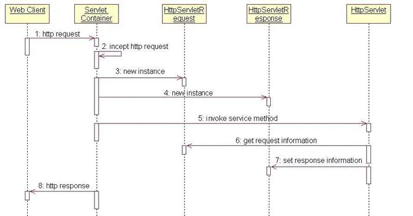
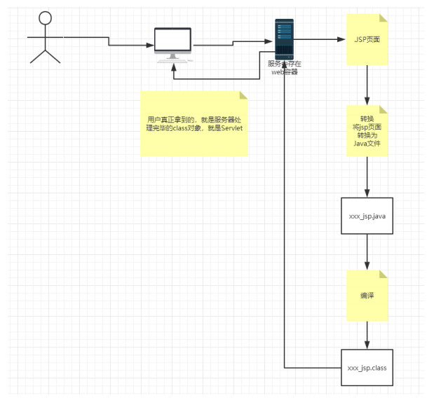

# JAVA Web

## 1. 基本概念 静态WEB  动态WEB

### 区别：

根本区别在于 网页能否动态更新

动态网站的概念现在还没有统一标准，但都具备以下几个基本特征：
*　 *1.* 交互性：网页会根据用户的要求和选择而动态地改变和响应，浏览器作为客户端，成为一个动态交流的桥梁，动态网页的交互性也是今后 *Web* 发展的潮流。
*　 *2.* 自动更新：即无须手动更新 *HTML* 文档，便会自动生成新页面，可以大大节省工作量。
*　 *3.* **因时因人而变：即当不同时间、不同用户访问同一网址时会出现不同页面。**

### 操作过程

静态WEB 操作过程

动态WEB 操作过程

### 实现手段

 静态WEB 实现手段： JavaScript 

动态WEB 实现手段:     ASP,PHP,JSP/Servlet

### JSP 和Servlet 

jsp就是在html里面写java代码，servlet就是在java里面写html代码…其实jsp经过容器解释之后就是servlet.

只是我们自己写代码的时候尽量能让它们各司其职，jsp更注重前端显示，servlet更注重模型和业务逻辑。不要写出万能的jsp或servlet来即可。

出处：https://www.zhihu.com/question/37962386

## 2. web 服务器

### 2.1技术

ASP

微软，C#

PHP

适合小公司

JSP/Servlet:

- sun 公司主推B/S 架构
- 基于Java 语音
- 承载三高问题 （高并发，高可用，高性能）
- 语法像ASP

### 2.2web 服务器

Web服务器是指驻留于因特网上某种类型计算机的程序，是可以向发出请求的浏览器提供文档的**程序**。当Web浏览器（客户端）连到服务器上并请求文件时，服务器将处理该请求并将文件反馈到该浏览器上，附带的信息会告诉浏览器如何查看该文件（即文件类型）。

服务器是一种**被动程序**：只有当Internet上运行在其他计算机中的浏览器发出请求时，服务器才会响应。

**IIS**

微软自带服务器

**<u>Tomcat</u>**

**Tomcat**是由Apache软件基金会属下[Jakarta项目](https://zh.wikipedia.org/wiki/Jakarta项目)开发的[Servlet](https://zh.wikipedia.org/wiki/Servlet)容器，按照[Sun Microsystems](https://zh.wikipedia.org/wiki/Sun_Microsystems)提供的技术规范，实现了对[Servlet](https://zh.wikipedia.org/wiki/Servlet)和[JavaServer Page](https://zh.wikipedia.org/wiki/JavaServer_Page)（[JSP](https://zh.wikipedia.org/wiki/JSP)）的支持，并提供了作为Web服务器的一些特有功能，如Tomcat管理和控制平台、安全局管理和Tomcat阀等。由于Tomcat本身也内含了[HTTP](https://zh.wikipedia.org/wiki/HTTP)[服务器](https://zh.wikipedia.org/wiki/服务器)，因此也可以视作单独的[Web服务器](https://zh.wikipedia.org/wiki/Web服务器)。

Tomcat提供了一个Jasper[编译器](https://zh.wikipedia.org/wiki/编译器)用以将JSP编译成对应的Servlet。

## 3.Tomcat

### 3.1安装

文件夹作用

bin: 存放 启动、关闭的脚本文件。

conf:配置

lib：依赖的jar包

logs:日志

temp：临时文件

webapps：放网站的文件

work : 工作空间

### 3.2Tomcat启动和配置

- 改系统变量

- 启动使用bin/startup.bat 关闭使用bin/shutdown.bat

- 中文乱码改配置文件：https://blog.csdn.net/B2345012/article/details/88365722

### 3.3配置

server.xml可以配置：

修改配置启动的端口号

- Tomcat 默认端口 :8080
-  mysql 默认端口：3306
-  http 默认端口：80 
-  https默认端口： 443

修改配置的主机的名称和网站应用存放位置

- 默认为 localhost (127.0.0.1)

- 网站默认位置 webapps 文件夹

  

  ## 面试题

  ### 修改名称需要注意，要把C:\Windows\System32\drivers\etc\hosts 文件中域名映射也修改了
  
  ## 访问网站的过程(DNS?):
  
  

### 3.4发布web网站

## 4.Http

### 4.1 Http 是什么

Http **超文本传输协议**（英语：**H**yper**T**ext **T**ransfer **P**rotocol，缩写：**HTTP**），运行在TCP之上。

文本：html

超文本:图片、视频、音乐

默认端口号：80

Https :安全的

默认端口:443

### 4.2 Http 发展历史

http1.0:

​	客户端与web服务器连接后，只能获得一个web资源，之后断开链接.(一次连接只能保持短暂的时间，每次请求都需要建立连接)

http1.1:

​	客户端与web服务器连接后，可以获得多个web资源（一次长连接，持续一段时间，可以传送多个HTTP响应和请求）

### 4.3 Http 请求

### 4.4 Http 响应

### 4.5Http 协议常见状态码

~~~java
200 OK                        //客户端请求成功
400 Bad Request               //客户端请求有语法错误，不能被服务器所理解
403 Forbidden                 //服务器收到请求，但是拒绝提供服务
404 Not Found                 //请求资源不存在
500 Internal Server Error     //服务器发生不可预期的错误
503 Server Unavailable        //服务器当前不能处理客户端的请求，一段时间后可能恢复正常
~~~

# Servlet

## servlet 简介

servlet 是用于开发动态Web 的技术

是一种接口 interface

## Tomcat

Tomcat 的功能简单说就是让 一堆 class 文件+web.xml 可以对外支持 http

## Servlet 原理

当Web服务器接收到一个HTTP请求时，它会先判断请求内容——如果是静态网页数据，Web服务器将会自行处理，然后产生响应信息；如果牵涉到动态数据，Web服务器会将请求转交给Servlet容器。此时Servlet容器会找到对应的处理该请求的Servlet实例来处理，结果会送回Web服务器，再由Web服务器传回用户端。

针对同一个Servlet，Servlet容器会在第一次收到http请求时建立一个Servlet实例，然后启动一个线程。第二次收到http请求时，Servlet容器无须建立相同的Servlet实例，而是启动第二个线程来服务客户端请求。所以多线程方式不但可以提高Web应用程序的执行效率，也可以降低Web服务器的系统负担。

实例化，初始化，销毁只会执行一次，service方法执行多次，默认情况下servlet是在第一次接受到用户请求的情况下才会实例化，可以在web.xml中的<servlet><servlet>标签内添加一个<load-on-startup>1<load-on-startup>配置，此时在启动tomcat时会创建servlet实例。

链接：https://www.jianshu.com/p/7dcd2c689729

1. Web Client 向Servlet容器（Tomcat）发出Http请求；

2. Servlet容器接收Web Client的请求；

3. Servlet容器创建一个HttpRequest对象，将Web Client请求的信息封装到这个对象中；

4. Servlet容器创建一个HttpResponse对象；

5. Servlet容器调用HttpServlet对象的service方法，把HttpRequest对象与HttpResponse对象作为参数传给 HttpServlet对象；

6. HttpServlet调用HttpRequest对象的有关方法，获取Http请求信息；

7. HttpServlet调用HttpResponse对象的有关方法，生成响应数据；

8. Servlet容器把HttpServlet的响应结果传给Web Client；

   

## Servlet实例

~~~java
public class HelloServlet extends HttpServlet {

    @Override
    protected void doGet(HttpServletRequest req, HttpServletResponse resp) throws ServletException, IOException {

        System.out.println("testGet");

        PrintWriter writer=  resp.getWriter();

        writer.print("getgetgetget");
        writer.close();
    }

    @Override
    protected void doPost(HttpServletRequest req, HttpServletResponse resp) throws ServletException, IOException {
        doGet(req,resp);

    }
}

~~~

~~~xml
<!DOCTYPE web-app PUBLIC
 "-//Sun Microsystems, Inc.//DTD Web Application 2.3//EN"
 "http://java.sun.com/dtd/web-app_2_3.dtd" >
// web.xml
<web-app>
  <display-name>Archetype Created Web Application</display-name>
  <servlet>
    <servlet-name>testServlet</servlet-name>

    <servlet-class >HelloServlet</servlet-class>
  </servlet>
  <servlet-mapping>
    <servlet-name>testServlet</servlet-name>
    <url-pattern>/test</url-pattern>
  </servlet-mapping>
</web-app>
~~~

405出现原因:

1，继承自HttpServlet的Servlet没有重写对于请求和响应的处理方法：doGet或doPost等方法；默认调用父类的doGet或doPost等方法；

2，父类HttpServlet的doGet或doPost等方法覆盖了你重写的doGet或doPost等方法；

- 不管是1或2，父类HttpServlet的doGet或doPost等方法的默认实现是返回状态代码为405的HTTP错误表示
- 对于指定资源的请求方法不被允许。
- 解决方法:重写doGet,doPost并且不要重写super.doGet和doPost方法
- 因为override默认会添加一个super方法！要删除掉才行。

## Mapping

~~~xml
前缀匹配 和后缀匹配，两者不能同时用
~~~

## Servlet Context作用

### 共享数据

在同一个Web应用中的所有Servlet 之间共享数据

~~~xml

~~~

### 获取初始化参数

### 请求转发

### 读取资源文件

## 总结

Servlet 是一个用于处理Http 请求和响应的接口

每个Web 应用中只有一个Servlet context ，Context类似于一个全局变量（全局数据结构）

Context 具有全局性，可以转发请求。Context 功能：

1. 共享数据
2. 获取初始化参数
3. 转发请求
4. 读取资源文件

Response  功能：

1. 分类
2. 下载文件（流操作）
3. 重定向

Request功能:

1. 获取参数（前端form 表单中获得参数）
2. 请求转发

# Session 和Cookie 

https://juejin.cn/post/6844904034181070861

https://segmentfault.com/a/1190000017831088

## 会话 :session

会话是指客户端和服务器通讯的过程，客户关闭浏览器后，一次会话结束（服务器检测超时，结束会话）。也可以通过session.invalidate()注销。

http是无状态协议：<u>没有保存服务器和客户端临时会话中产生的数据</u>。

## Session

服务器端技术

## session 何时改变?

1. 当在同一个浏览器中同时打开多个标签，发送同一个请求或不同的请求，仍是同一个session;

2. 当不在同一个窗口中打开相同的浏览器时，发送请求，仍是同一个session;

3. 当使用不同的浏览器时，发送请求，即使发送相同的请求，是不同的session;

4. 当把当前某个浏览器的窗口全关闭，再打开，发起相同的请求时，就是本文所阐述的，是不同的session,但是它和session的生命周期是没有关系的.

   总结：不同浏览器各自有自己的Session ，同一的浏览器关闭再打开也会建立新Session (多开窗口Session一样)。Seesion是由服务器产生的，不同网站，由于服务器不同，SessionID肯定不同。

   以下两个图SeesionID一致

   

   

**session 是基于 cookie 实现的，session 存储在服务器端，sessionId 会被存储到客户端的cookie 中**,tomcat的ManagerBase类提供创建sessionid的方法：**随机数+时间+jvmid**；

- cookie只是实现session的其中一种方案。虽然是最常用的，但并不是唯一的方法。禁用cookie后还有其他方法存储，比如放在url中

**SessionID 是连接 Cookie 和 Session 的一道桥梁**

## Cookie

客户端技术。cookie 是一个非常具体的东西，指的就是浏览器里面能永久存储的一种数据(Key-Value 形式)。是浏览器实现的一种数据存储功能。

有两种：一种存在于内存中（内存式）。一种存在于硬盘中（硬盘式）

## Session 和Cookie 的区别

**安全性：** Session 比 Cookie 安全，Session 是存储在服务器端的，Cookie 是存储在客户端的。

**存取值的类型不同**：Cookie 只支持存字符串数据，想要设置其他类型的数据，需要将其转换成字符串，Session 可以存任意数据类型。

**有效期不同：** Cookie 可设置为长时间保持，比如我们经常使用的默认登录功能，Session 一般失效时间较短，客户端关闭（默认情况下）或者 Session 超时都会失效。

**存储大小不同：** 单个 Cookie 保存的数据不能超过 4K，Session 可存储数据远高于 Cookie，但是当访问量过多，会占用过多的服务器资源。

## Session 与Redis

我们需要将Session持久化存储，Redis存储是一个非常不错的Session持久化解决方案

## Token

https://juejin.cn/post/6844904034181070861

token在客户端一般存放于localStorage，cookie，或sessionStorage中。在服务器一般存于数据库中

# JSP

## 简介

JSP 是在HTML中写Java 代码，JSP 实质上就是Servlet。

## 语法

# JSP与Servlet 工作流程

## JSP工作流程

注意Jsp转换成的 Java 文件在服务器端编译成字节码文件再传给客户。

客户是如何获得服务器端的返回信息的？是直接拿到Class?

# MVC架构

结合JSP与Servlet 讲解MVC： https://www.tianmaying.com/tutorial/jsp-servlet-mvc-architecture

## MVC 包含 Model View Controller

1. 浏览器发送Http 请求给Controller (servlet)
2. controller 调用 核心业务逻辑----Model获取结果
3. 结果交给View(JSP),动态输出HTML

## Model

分为 Dao 层 、Service 层 和 entity

Dao 和 Service 层 在项目中 包括接口和对应的多种实现类。

## 为什么既要接口也要实现类？

（https://www.jianshu.com/p/64abdd29bdf6）

1. 使得调用和实现解耦。
2. 满足多实现
3. 使得即使没有实现，也可以编写上层代码。（Controller  ---> Service ---> Dao ）
4. Spring 要用到动态代理，动态代理需要接口才能使用