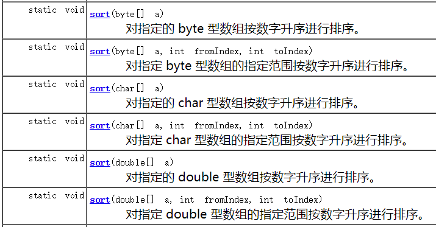
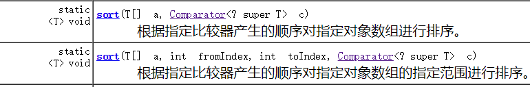
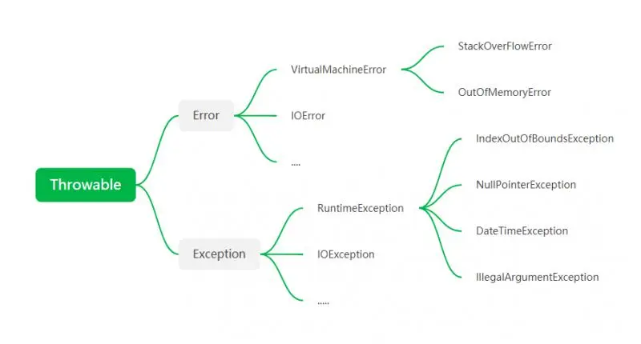

# Java

# IO

正则表达式匹配数字

~~~JAVA
int[] H = {1,2,3,1};
String test = "[1, 2 , 3]";
//正则表达式提取输入数字
Scanner sc = new Scanner(System.in);
test = sc.nextLine();
test = test.replaceAll("[^\\d]"," ");//[^\\d] 匹配非数字 方式一
test = test.replaceAll("[^0-9]"," ");//[^0-9] 匹配非数字 方式二
test = test.replaceAll("\\D"," ");//\\D 匹配非数字 方式三
test = test.replaceAll("\\s+"," ");//去除多余空格
String[] testA = test.split(" ");

int[] res = new int[testA.length];
System.out.println(test);
//转string 为 int
for (int i = 0; i < testA.length; i++) {
    res[i] = Integer.parseInt(testA[i]);
    System.out.println(res[i]);
}
~~~


# 基本操作

## 数组类型转换

~~~java
Arrays.stream(arr1).boxed().toArray(Integer[]::new);
~~~


## 数组排序





- ### Comparator return -负数 证明两个数不用交换（类似ASCII码）

- ### 只有对象数组可以使用Comparatore

- ~~~java
     public static void main(String[] args){
  
          int[] H = {1,2,3,1};
          
          //普通数组排序
          //排序0 到 2 不包括3
          Arrays.sort(H, 0, 3);
          //数组封装为 对象 排序
          Integer[] boxedH = Arrays.stream(H).boxed().toArray(Integer[]::new);
          Arrays.sort(boxedH, 0, 3, (a, b) ->  a > b ? -1 : 1);
          for (Integer integer : boxedH) {
              System.out.println(integer);
          }
          
          //list 排序
          ArrayList<Integer> list = new ArrayList<>();
          list.add(1);
          list.add(2);
          list.add(3);
          list.add(4);
          list.sort((a,b) -> a > b ? - 1: 1);
          for (Integer integer : list) {
              System.out.println(integer);
          }
          ///map 排序
          HashMap<Integer,String> map = new HashMap<>();
          map.put(1,"1");
          map.put(2,"2");
          ArrayList<Integer> mapkey = new ArrayList<>(map.keySet());
          mapkey.sort((a,b) -> a > b ? -1 : 1);
  
          for (Integer integer : mapkey) {
              System.out.println( map.get(integer));
          }
  
      }
  ~~~

  

# 基本类操作

## String 

### 分割字符串

~~~java
 String str = "www-runoob-com";
 String[] temp;
 String delimeter = "-";  // 指定分割字符
temp = str.split(delimeter); // 分割字符串

for(int i =0; i < temp.length ; i++){
    System.out.println(temp[i]);
    System.out.println("");
}

System.out.println("------java for each循环输出的方法-----");
String str1 = "www.runoob.com";
String[] temp1;
String delimeter1 = "\\.";  // 指定分割字符， . 号需要转义
temp1 = str1.split(delimeter1); // 分割字符串
for(String x :  temp1){
    System.out.println(x);
    System.out.println("");
}


~~~

### 字符串  StringBuilder 

字符串 操作经常使用 StringBuilder 进行，StringBuilder 速度更快

## String 与 List

string 的操作 繁琐，且花费较多时间，尽量转化为 LinkedList(或其他结构)

# 类之间的关系

依赖、关联、聚合、组合与泛化代表类与类之间的耦合度依次递增(https://blog.csdn.net/Jxianxu/article/details/83505901)

## 依赖 use-a

~~~java
//依赖在代码中主要体现为类A的某个成员函数的返回值、形参、局部变量或静态方法的调用，则表示类A引用了类B
//1. 依赖关系不会增加属性，Student 并没有增加Computer 属性
//2. 依赖关系在对应方法调用时开始，在方法调用完成后结束（以为被依赖的类只存在与方法中）
class Computer
{
public:
	static void start(){
		cout<<"电脑正在启动"<<endl;
	} 
};
class Student
{
public:
	//返回值构成依赖
	Computer& program();
	//形参构成依赖
	void program(Computer&);
	void playGame()
	{
		//局部变量构成依赖
		Computer* computer=new Computer;
		...
		//静态方法调用构成依赖
		Computer::star();
	}
};
~~~

## 关联 has-a

表现为 成员变量  <u>聚合和组合是细化的关联关系</u>

~~~java
class Teacher;
class Student{
public:
	Teacher teacher;  //成员变量
	void study();
}
~~~

## 聚合  个体可以离开总体 存活

<u>聚合和组合是细化的关联关系</u>

~~~java

public  class GooseGroup
{
    public Goose goose;

    public GooseGroup(Goose goose)
    {
        this.goose = goose;
    }
}
~~~

## 组合 个体和总体 同生共死

~~~java

public class Goose
{
    public Wings wings;

    public Goose()
    {
        wings=new Wings();
    }
}
~~~

聚合和组合的区别在于：

1. 构造函数，构造聚合关系需要传入类参数（goose），则个体（goose ）在总体销毁之后仍然可以存在，组合则不用传入类参数，个体和总体同生共死
2. 创建聚合时，客户端可以同时看见个体和总体，而组合则屏蔽了个体（Wings）的存在。

## 继承 is-a


~~~java
public class　Animal {
}

public class Tiger extends Animal {
}
~~~

# Lambda 表达式

lambda: （参数  ） -> { 表达式}；

Lambda 表达式 用于传递代码块,一般用于函数式接口（只有一个抽象方法）

~~~java
//方式 1
( String first, String second) -> {
    return first;
} 
//方式 2 参数类型可以省略
(first,second) ->{
    return first;
}
//没有参数也要 括号
()-{
return 0;
}
//方式 3
() -> 0;


// 1. 不需要参数,返回值为 5  
() -> 5  
  
// 2. 接收一个参数(数字类型),返回其2倍的值  
x -> 2 * x  
  
// 3. 接受2个参数(数字),并返回他们的差值  
(x, y) -> x – y  
  
// 4. 接收2个int型整数,返回他们的和  
(int x, int y) -> x + y  
  
// 5. 接受一个 string 对象,并在控制台打印,不返回任何值(看起来像是返回void)  
(String s) -> System.out.print(s)

~~~


# Exception 与 Error

继承关系



## Throwable

Throwable是Java语言中所有错误或异常的超类。下一层分为Error和Exception

## Error

Error是unchecked 不检查异常

Error类是指Java运行时系统的内部错误和资源耗尽错误。应用程序不会抛出该类对象。如果出现了这样的错误，除了告知用户，剩下的就是尽力使程序安全的终止。

## Exception

“如果出现RuntimeException，一定是程序员的问题” 由于程序有错误导致的异常属于RuntimeException

## RuntimeException -- 不检查异常

主要包含：错误的类型转换，数组访问约界，访问null指针

NullPointerException - 空指针引用异常
ClassCastException - 类型强制转换异常。
IllegalArgumentException - 传递非法参数异常。
ArithmeticException - 算术运算异常
ArrayStoreException - 向数组中存放与声明类型不兼容对象异常
IndexOutOfBoundsException - 下标越界异常
NegativeArraySizeException - 创建一个大小为负数的数组错误异常
NumberFormatException - 数字格式异常
SecurityException - 安全异常
UnsupportedOperationException - 不支持的操作异常


## 其他检查异常

检查异常一定要处理 要么继续Throws 要么try catch

如IOException，SQLException等等，具体看文档

## 抛出异常

~~~java
String methodname () throws EOFException{
	//....
    throw new EOFException();
	return ...;

}

~~~


## 捕获异常

~~~java
try{
    code1;//;
    code2;
    code throw new Exception();//这句抛出异常，那么这句之后剩余的代码不执行 
    //...
}catch(ChildException1 e){
    //捕获这个异常 以及这个异常的子类
}catch(FatherException e2){
    
}
finally{
    +
}
~~~

如果没有子句能捕获对应类型的异常，则在执行完finally 语句后直接退出当前这个方法。

finally语句正常情况下一定会执行（即使在try 或者catch 里有return 语句），但是如果try语句中调用System.exit(0)；直接退出虚拟机，那么finally 语句不会执行。线程为守护线程时，如果主线程死亡了，finally也不会执行的（https://blog.csdn.net/qq_39135287/article/details/78455525）

## 断言

指用于开发和测试阶段

~~~java
assert x>0;
assert x>0:x;
~~~

# 修饰符访问域

| 修饰符      | 当前类 | 同一包内、子孙类(同一包) | 子孙类(不同包)                                               | 其他包 |
| :---------- | :----- | :----------------------- | :----------------------------------------------------------- | :----- |
| `public`    | Y      | Y                        | Y                                                            | Y      |
| `protected` | Y      | Y                        | Y/N（[说明](https://www.runoob.com/java/java-modifier-types.html#protected-desc)） | N      |
| `default`   | Y      | Y                        | N                                                            | N      |
| `private`   | Y      | N                        | N                                                            | N      |

”远亲不如近邻“：访问优先级：同类>同包>子类>其他包

- **子类与基类在同一包中**：被声明为 protected 的变量、方法和构造器能被同一个包中的任何其他类访问；
- **子类与基类不在同一包中**：那么在子类中，子类实例可以访问其从基类继承而来的 protected 变量、方法和构造器，而不能访问基类实例的protected变量、方法和构造器。

# 并发

## 创建线程

- ## 继承Thread 

  ~~~java
  public class Main extends Thread  {
      @Override
      public void run() {
          for (int i = 0; i < 200; i++) {
              System.out.println("Main running");
          }
      }
      public static void main(String[] args) {
  
          Main Main1= new Main();
          Main1.start();
          for (int i = 0; i < 2000; i++) {
              
              System.out.println("main------ running");
          }
  
      }
  }
  ~~~

  

- ## 实现Runnable 

  ~~~java
  public class Main implements Runnable  {
      @Override
      public void run() {
          for (int i = 0; i < 2000; i++) {
              System.out.println("Main running");
          }
      }
      public static void main(String[] args) {
          new Thread(new Main()).start();
          for (int i = 0; i < 2000; i++) {
  
              System.out.println("main------ running");
          }
  
      }
  }
  ~~~

  

- ## 实现Callable

  ~~~java
  
  ~~~

## ReentrantLock

- ## 可重入锁

  ### 同一个线程可以递归调用同一个锁的Lock, Lock有个计数器计算这个线程 调用了多少次Lock

- ### ReentrantLock 和Synchronized 的锁都是可重入的

  

## Synchronized

- ## 	使用

- ## **1.修饰实例方法:** 


作用于当前对象实例加锁，进入同步代码前要获得 **当前对象实例的锁**

```java
synchronized void method() {
  //业务代码
}
```

- ## **2.修饰静态方法:** 


也就是给当前类加锁，会作用于类的所有对象实例 ，进入同步代码前要获得 **当前 class 的锁**。因为静态成员不属于任何一个实例对象，是类成员（ *static 表明这是该类的一个静态资源，不管 new 了多少个对象，只有一份*）。所以，如果一个线程 A 调用一个实例对象的非静态 `synchronized` 方法，而线程 B 需要调用这个实例对象所属类的静态 `synchronized` 方法，是允许的，不会发生互斥现象，**因为访问静态 `synchronized` 方法占用的锁是当前类的锁，而访问非静态 `synchronized` 方法占用的锁是当前实例对象锁**。

```java
synchronized static void method() {
	//业务代码
}
```

- ## **3.修饰代码块** ：


指定加锁对象，对给定对象/类加锁。`synchronized(this|object)` 表示进入同步代码库前要获得**给定对象的锁**。`synchronized(类.class)` 表示进入同步代码前要获得 **当前 class 的锁**

```java
synchronized(this) {
  //业务代码
}
```

前面的两种方法都可以用第三种表示

~~~java
//修饰对象
synchronized void method() {
  //业务代码
}
///等价于
void method() {
      synchronized(this) {
      //业务代码
    }
}

///修饰一个类
synchronized static void method() {//静态方法是类共享的
  //业务代码
}
///等价于
void method() {
      synchronized(ClassName.class) {//ClassName 对应类名
      //业务代码
    }
}
~~~

**总结：**

- `synchronized` 关键字加到 `static` 静态方法和 `synchronized(class)` 代码块上都是是给 Class 类上锁。

- `synchronized` 关键字加到实例方法上是给对象实例上锁。

- 尽量不要使用 `synchronized(String a)` 因为 JVM 中，字符串常量池具有缓存功能！

- ## 例子

https://juejin.cn/post/6844903705523798029

~~~java
class MyThread implements Runnable {
    private int count;

    public MyThread() {
        count = 0;
    }

    public  void run() {
        //同步代码块中锁定的是当前实例对象
        synchronized(this) {//对象锁
            for (int i = 0; i < 5; i++) {
                try {
                    System.out.println(Thread.currentThread().getName() + ":" + (count++));
                    Thread.sleep(100);
                } catch (InterruptedException e) {
                    e.printStackTrace();
                }
            }
        }
    }
}
public class test {

	public static void main(String[] args) {
		SyncThread syncThread = new SyncThread();
		//注意此刻是一个同一个实例对象
		Thread thread1 = new Thread(syncThread, "SyncThread1");
		Thread thread2 = new Thread(syncThread, "SyncThread2");
		thread1.start();
		thread2.start();
	}

}
~~~

Volatile


## 线程池

- ## 线程池好处


1. 降低资源消耗；
2. 提高响应速度；
3. 方便管理线程；

- ## 线程池使用


~~~java
// 创建固定大小的线程池:
ExecutorService executor = Executors.newFixedThreadPool(3);//
//ExecutorService extends Executor  两者都是接口
/*
1. FixedThreadPool：线程数固定的线程池；Executors.newFixedThreadPool(3);
2. CachedThreadPool：线程数根据任务动态调整的线程池；Executors.newCachedThreadPool();
3. SingleThreadExecutor：仅单线程执行的线程池。Executors.SingleThreadExecutor();
*/
// 提交任务:
executor.submit(task1);
executor.submit(task2);
executor.submit(task3);
executor.submit(task4);
executor.submit(task5);
~~~

## 线程的状态

https://blog.csdn.net/pange1991/article/details/53860651

- ## java 规范规定的状态只有 new runnable,wait,time_wait,blocked,terminated。

- ## 但是为了更好理解还是按照类似操作系统里面的线程状态的标准来理解 多线程的编程:

  - NEW

  - 就绪状态

  - 运行状态

  - 阻塞状态

  - 等待

    - wait()不带参数，需要notify()，notifyAll()唤醒

  - 超时等待

    - wait(timeout) 带超时参数
    - sleep(timeput) （不释放锁）

  - DEAD

    ~~~java
    //使用标志位flag 标记进程是否停止
    public class testStop implements Runnable{
    	//标志位
        private boolean flag = true;
        
        public void run(){
            while(flag){
                //to  do
            }
        }
        
        //设置停止的方法
        public void stop(){
            this.flag = false;
        }
    }
    ~~~

    

  

