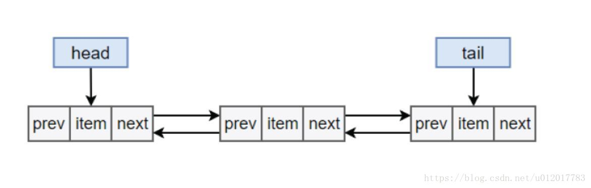
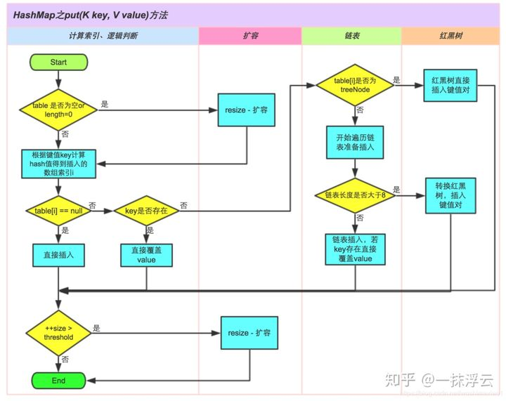

# Java 集合框架

Java 集合容器主要包含Collection 和Map 两大类。（Map 接口里的Values（）方法 返回了Collection ，因此两者有Produces 的关系）

上述类图中，实线边框的是实现类，比如ArrayList，LinkedList，HashMap等，折线边框的是抽象类，比如AbstractCollection，AbstractList，AbstractMap等，而点线边框的是接口，比如Collection，Iterator，List等。

## Map collection 方法

- # Map

~~~java
////Map/
Map.put(key,value);//添加
map.remove(key);//删除
map.replace(key,val);//替换
map.size();
Map.keySet();//获取键
Map.values();//获取值
Map.keySet().iterator();//获取keySet迭代器

//遍历 Map
Map<String, String> map = new HashMap<String, String>();
map.put("1", "value1");
map.put("2", "value2");
map.put("3", "value3");

//第一种：普遍使用，二次取值
System.out.println("通过Map.keySet遍历key和value：");
for (String key : map.keySet()) {
    System.out.println("key= "+ key + " and value= " + map.get(key));
}

//第二种
System.out.println("通过Map.entrySet使用iterator遍历key和value：");
Iterator<Map.Entry<String, String>> it = map.entrySet().iterator();
while (it.hasNext()) {
    Map.Entry<String, String> entry = it.next();
    System.out.println("key= " + entry.getKey() + " and value= " + entry.getValue());
}

//第三种：推荐，尤其是容量大时
System.out.println("通过Map.entrySet遍历key和value");
for (Map.Entry<String, String> entry : map.entrySet()) {
    System.out.println("key= " + entry.getKey() + " and value= " + entry.getValue());
}

//第四种
System.out.println("通过Map.values()遍历所有的value，但不能遍历key");
for (String v : map.values()) {
    System.out.println("value= " + v);
}
~~~

- # Collection

~~~java
collection.add(E e);//添加
collection.remove(E e);//删除
collection.size();
collection.iterator();//获取迭代器
~~~

# Hash 原理 

# List

## ArrayList

### 操作

~~~java
ArrayList<String> sites = new ArrayList<String>();
        sites.add("Google");
        sites.add("Runoob");
        sites.add("Taobao");
        sites.add("Weibo");
		System.out.println(sites.get(1));  // 访问第二个元素
		sites.set(2, "Wiki"); // 第一个参数为索引位置，第二个为要修改的值
		sites.remove(3); // 删除第四个元素	
		sites.size()//大小 这个例子为：4
            //两种迭代方法
        for (int i = 0; i < sites.size(); i++) {
            System.out.println(sites.get(i));
        }
        for (String i : sites) {
            System.out.println(i);
        }

~~~

### ArrayList 扩容

~~~java
grow()方法

    private void grow(int minCapacity) {
        // overflow-conscious code
        int oldCapacity = elementData.length;
        int newCapacity = oldCapacity + (oldCapacity >> 1); //设置新的存储能力为原来的1.5倍
        if (newCapacity - minCapacity < 0) //扩容之后仍小于最低存储要求minCapacity
            newCapacity = minCapacity;
        if (newCapacity - MAX_ARRAY_SIZE > 0) //private static final int MAX_ARRAY_SIZE = Integer.MAX_VALUE - 8;
            newCapacity = hugeCapacity(minCapacity);
        // minCapacity is usually close to size, so this is a win:
        elementData = Arrays.copyOf(elementData, newCapacity);
    }

当ArrayList扩容的时候，首先会设置新的存储能力为原来的1.5倍，如果扩容之后仍小于必要存储要求minCapacity，则取值为minCapacity。
若新的存储能力大于MAX_ARRAY_SIZE，则取值为Integer.MAX_VALUE
在grow方法中，确定ArrayList扩容后的新存储能力后，调用的Arrays.copyof()方法进行对原数组的复制，再通过调用System.arraycopy()方法（native修饰）进行复制，达到扩容的目的
~~~

## LinkedList

### 扩容

linkedList 是一个双向链表，没有初始化大小，也没有扩容的机制，就是一直在前面或者后面新增就好。
对于双向链表的理解

# Queue

~~~java
Queue<Integer> queue = new Queue<>();

int i;
queue.offer(1);
queue.offer(2);
i = queue.poll();
i = queue.peek();//取队首元素，但是不删除
queue.size();//队列长度
~~~

# Map

## HashMap

源码解析：https://blog.csdn.net/u012712901/article/details/78313130  JDK 1.8https://blog.csdn.net/yangyun901222/article/details/96154078

### HashTable 和HashMap 的区别 

（如果要线程安全可以用ConcurrentHashMap，HashTable 已经被淘汰）

https://zhuanlan.zhihu.com/p/94677908

1、继承的父类不同

> \> Hashtable继承自Dictionary类，而HashMap继承自AbstractMap类。二者都实现了Map接口。

2、线程安全性不同（如果要线程安全可以用ConcurrentHashMap，HashTable 已经被淘汰）

> \> hashMap不安全，hashtable 线程安全。

3、是否提供contains方法

> \> HashMap把Hashtable的contains方法改成containsValue和containsKey；Hashtable则保留了contains，containsValue和containsKey三个方法，其中contains和containsValue功能相同。

4、key和value是否允许null值

> \> 其中key和value都是对象，并且不能包含重复key，但可以包含重复的value。
> \>Hashtable中，key和value都不允许出现null值。但是如果在Hashtable中有类似put(null,null)的操作，编译同样可以通过，因为key和value都是Object类型，但运行时会抛出NullPointerException异常
> \> HashMap中，null可以作为键，这样的键只有一个；可以有一个或多个键所对应的值为null。当get()方法返回null值时，可能是 HashMap中没有该键，也可能使该键所对应的值为null。因此，在HashMap中不能由get()方法来判断HashMap中是否存在某个键，而应该用containsKey()方法来判断。

5、两个遍历方式的内部实现上不同

> \> Hashtable、HashMap都使用了 Iterator。而由于历史原因，Hashtable还使用了Enumeration的方式 。

6、hash值不同

> \> 哈希值的使用不同，HashTable直接使用对象的hashCode。而HashMap重新计算hash值。
> \> hashCode是jdk根据对象的地址或者字符串或者数字算出来的int类型的数值。
> \> Hashtable计算hash值，直接用key的hashCode()，而HashMap重新计算了key的hash值，Hashtable在求hash值对应的位置索引时，用取模运算，而HashMap在求位置索引时，则用与运算，且这里一般先用hash&0x7FFFFFFF后，再对length取模，&0x7FFFFFFF的目的是为了将负的hash值转化为正值，因为hash值有可能为负数，而&0x7FFFFFFF后，只有符号外改变，而后面的位都不变。

7、内部实现使用的数组初始化和扩容方式不同

> \> HashTable在不指定容量的情况下的默认容量为11，而HashMap为16，Hashtable不要求底层数组的容量一定要为2的整数次幂，而HashMap则要求一定为2的整数次幂。
> \> Hashtable扩容时，将容量变为原来的2倍加1，而HashMap扩容时，将容量变为原来的2倍。
> \> Hashtable和HashMap它们两个内部实现方式的数组的初始大小和扩容的方式。HashTable中hash数组默认大小是11，增加的方式是old*2+1。

### 扩容

HashMap 初始化大小是 **16** ，扩容因子默认**0.75（**可以指定初始化大小，和扩容因子）

扩容机制:类似ArrayList，Node<K,V>[] oldTab 实际上是个数组

 (当前大小 和 当前容量 的比例超过了 扩容因子，就会扩容，扩容后大小为 一倍。例如：初始大小为 16 ，扩容因子 0.75 ，当容量为12的时候，比例已经是0.75 。触发扩容，扩容后的大小为 32.)

## ConcurrentHashMap

https://www.cnblogs.com/chengxiao/p/6842045.html