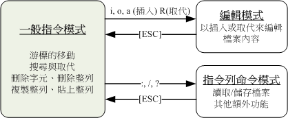

# Linux

## docker安装

https://docs.docker.com/engine/install/centos/

~~~shell
 sudo yum install -y yum-utils
 sudo yum-config-manager \
    --add-repo \
    https://download.docker.com/linux/centos/docker-ce.repo
 ##安装docker
 sudo yum install docker-ce docker-ce-cli containerd.io
 ##启动docker
 sudo systemctl start docker
###开机自启动
sudo systemctl enable docker
 ##检查是否正确安装
 sudo docker run hello-world
 ###检查镜像
 sudo docker images
~~~

## docker 安装Mysql

~~~shell
###下载mysql5.7
docker pull mysql:5.7
##安装镜像
docker run -p 3306:3306 --name mysql  -v /mydata/mysql/log:/var/log/mysql  -v /mydata/mysql/data:/var/lib/mysql  -v /mydata/mysql/conf:/etc/mysql  -e MYSQL_ROOT_PASSWORD=root  -d mysql:5.7
##运行mysql 客户端
docker exec -it mysql /bin/bash
~~~

## docker启动容器

## docker 安装redis

### 云服务器使用：

1. 修改root密码 

   ~~~shell
   su
   passwd
   ~~~

   

2. 添加用户和密码

   ~~~shell
   useradd -m sushi
   passwd sushi
   ~~~

   

3. 允许远程连接

## FTP搭建

在腾讯云服务器上搭建FTP服务器，安装vsftpd。具体步骤见腾讯云文档，主要命令有

 

\1.    Yum install -y vsftpd

\2.    Systemctl enable vsftpd

\3.    System start vsftpd

\4.    Netstat -antup | grep ftp 查看ftp开启状态

\5.    配置vsftpd，具体命令查询相关文档

## Telnet 安装

yum install telnet telnet-server xinetd -y

# Vim

有三种模式

# 常用网络指令

## 汇总

- 网络配置： ifconfig、 ip
- 连通性探测： ping、 traceroute、 telnet、 mtr
- 网络连接： netstat、 ss、 nc、 lsof
- 流量统计： ifstat、 sar、 iftop
- 交换与路由： arp、 arping、 vconfig、 route
- 防火墙： iptables、 ipset
- 域名： host、 nslookup、 dig、 whois
- 抓包： tcpdump
- 虚拟设备： tunctl、 brctl、 ovs

- reset 网络配置指令： /etc/init.d/network restart

### 网络参数设置：ifconfig ifup ifdown route ip

ifconfig ：查看修改网卡参数 。ipup ifdown 是衍生，用于开启或者关闭网卡

route：参考修改路由

ip: 整合ifconfig 与route 并且还有更多的功能

## ifconfig

- ### 查看修改网络配置的参数

  ### ifconfig : interface config

  ~~~shell
  ifconfig {interface} {up|down}#查看某个网卡接口  加上up|down 可以关闭或开启设备
  ifconfig interface {optiong}# 设置 某个网卡接口的参数
  options  ：可以接的參數，包括如下：
      up, down ：啟動 (up) 或關閉 (down) 該網路介面(不涉及任何參數)
      mtu      ：可以設定不同的 MTU 數值，例如 mtu 1500 (單位為 byte)
      netmask  ：就是子遮罩網路；
      broadcast：就是廣播位址
  ~~~

## route

### route 路由修改

路由表结构 详细介绍在后面

~~~shell
#查看路由表指令
route [-nee] # -n 不显示主机名，使用ip  -ee 详细信息
#添加 或者 删除 路由表项目指令
route add [-net|-host] [網域或主機] netmask [mask] [gw|dev]
route del [-net|-host] [網域或主機] netmask [mask] [gw|dev]
#add
route add -net 192.168.100.0 netmask 255.255.255.0 dev eth0
#del
route del -net 169.254.0.0 netmask 255.255.0.0 dev eth0
#add default
route add default gw 192.168.1.250
~~~

- ### 路由表结构 可参考https://blog.csdn.net/u011857683/article/details/83795279

- ### Destination 对应目的IP ；如果在同网段：填入目的MAC

  目的IP地址

- ### Gateway  对应目的Mac；如果在不同网段：填入目的MAC

  网关，指明下一跳路由器的IP地址。这个IP地址通过ARP协议获取对应路由器的MAC地址用于填进IP数据报的**目的MAC地址**。

  如果Destination 在本网段内则为0.0.0.0。

- ### Genmask 目的IP地址和掩码与运算 之后进行匹配，匹配Destination字段

  Destination 字段的网络掩码，Destination 是主机时需要设为 255.255.255.255，是默认路由时会设置为 0.0.0.0

- ### Flags

  标记

  ● U 该路由可以使用。

  ● H 该路由是到一个主机，也就是说，目的地址是一个完整的主机地址。如果没有设置该标志，说明该路由是到一个网络，而目的地址是一个网络地址：一个网络号，或者网络号与子网号的组合。

  ● G 该路由是到一个网关（路由器）。如果没有设置该标志，说明目的地 是直接相连的

- ### Metric  跳数

  路由距离，到达指定网络所需的中转数，是大型局域网和广域网设置所必需的。

- ### Ref 和 use 不重要

- ### Iface 真正转发出去的网线口

  网卡名字，例如 eth0。

## ip

综合指令

~~~shell
ip [option] [動作] [指令]
選項與參數：
option ：設定的參數，主要有：
    -s ：顯示出該裝置的統計數據(statistics)，例如總接受封包數等；
動作：亦即是可以針對哪些網路參數進行動作，包括有：
    link  ：關於裝置 (device) 的相關設定，包括 MTU, MAC 位址等等
    addr/address ：關於額外的 IP 協定，例如多 IP 的達成等等；
    route ：與路由有關的相關設定
~~~

### ip link 

~~~shell
#查看网卡 信息
ip [-s] link show [设备名]
#设置网卡参数
ip link set [device] [动作和参数]
device 是接口代号、名字(eth0)
动作和参数有：
	up | down 开关接口
	address 更改MAC address + MAC地址
	name 改名字
	mtu 最大传输单元
    
~~~

### ip  address

 ~~~shell
 #查看ip参数
 ip address show
 # 添加和删除 ip  （网卡接口）
 ip address [add|del] [IP參數] [dev 裝置名] [相關參數]
 選項與參數：
 show    ：單純的顯示出介面的 IP 資訊啊；
 add|del ：進行相關參數的增加 (add) 或刪除 (del) 設定，主要有：
     IP 參數：主要就是網域的設定，例如 192.168.100.100/24 之類的設定喔；
     dev    ：這個 IP 參數所要設定的介面，例如 eth0, eth1 等等；
     相關參數：主要有底下這些：
         broadcast：設定廣播位址，如果設定值是 + 表示『讓系統自動計算』
         label    ：亦即是這個裝置的別名，例如 eth0:0 就是了！
         scope    ：這個介面的領域，通常是這幾個大類：
                    global ：允許來自所有來源的連線；
                    site   ：僅支援 IPv6 ，僅允許本主機的連線；
                    link   ：僅允許本裝置自我連線；
                    host   ：僅允許本主機內部的連線；
                    所以當然是使用 global 囉！預設也是 global 啦！
                   
 # 添加  broadcast +  "+" 符合表示让系统自动计算广播地址
 ip address add 192.168.50.50/24 broadcast + \
 > dev eth0 label eth0:vbird
 ~~~

### ip route

~~~shell
#查看 路由表
ip route show
#添加删除路由表项目
ip route [add|del] [IP或網域] [via gateway] [dev 裝置]

選項與參數：
show ：單純的顯示出路由表，也可以使用 list ；
add|del ：增加 (add) 或刪除 (del) 路由的意思。
    IP或網域：可使用 192.168.50.0/24 之類的網域或者是單純的 IP ；
    via     ：從那個 gateway 出去，不一定需要；
    dev     ：由那個裝置連出去，這就需要了！
    mtu     ：可以額外的設定 MTU 的數值喔！
~~~

## ping

检测联通性

## traceroute

~~~shell
traceroute [選項與參數] IP
選項與參數：
-n ：可以不必進行主機的名稱解析，單純用 IP ，速度較快！
-U ：使用 UDP 的 port 33434 來進行偵測，這是預設的偵測協定；
-I ：使用 ICMP 的方式來進行偵測；
-T ：使用 TCP 來進行偵測，一般使用 port 80 測試
-w ：若對方主機在幾秒鐘內沒有回聲就宣告不治...預設是 5 秒
-p 埠號：若不想使用 UDP 與 TCP 的預設埠號來偵測，可在此改變埠號。
-i 裝置：用在比較複雜的環境，如果你的網路介面很多很複雜時，才會用到這個參數；
         舉例來說，你有兩條 ADSL 可以連接到外部，那你的主機會有兩個 ppp，
         你可以使用 -i 來選擇是 ppp0 還是 ppp1 啦！
-g 路由：與 -i 的參數相仿，只是 -g 後面接的是 gateway 的 IP 就是了。
~~~

## netstat

查看端口

~~~shell
#查看路由表 类似route route -n 
netstat -[rn]
#查看网卡接口 端口有关参数
netstat -[antulpc]
-a  ：列出所有的連線狀態，包括 tcp/udp/unix socket 等；
-n  : 不使用主机名 类似 route -n 
-t  ：僅列出 TCP 封包的連線；
-u  ：僅列出 UDP 封包的連線；
-l  ：僅列出有在 Listen (監聽) 的服務之網路狀態；
-p  ：列出 PID 與 Program 的檔名；
-c  ：可以設定幾秒鐘後自動更新一次，例如 -c 5 每五秒更新一次網路狀態的顯示；

~~~

