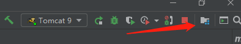
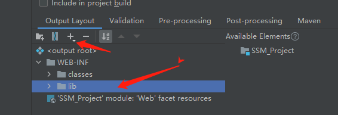
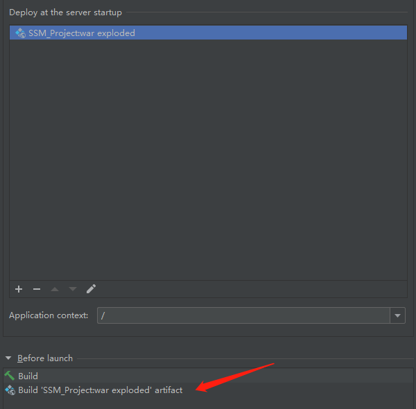

# 常用依赖

~~~xml
<?xml version="1.0" encoding="UTF-8"?>
<project xmlns="http://maven.apache.org/POM/4.0.0"
         xmlns:xsi="http://www.w3.org/2001/XMLSchema-instance"
         xsi:schemaLocation="http://maven.apache.org/POM/4.0.0 http://maven.apache.org/xsd/maven-4.0.0.xsd">
    <modelVersion>4.0.0</modelVersion>

    <groupId>org.example</groupId>
    <artifactId>SSM_Project</artifactId>
    <version>1.0-SNAPSHOT</version>

    <properties>
        <maven.compiler.source>8</maven.compiler.source>
        <maven.compiler.target>8</maven.compiler.target>
    </properties>
<!--依赖：junit,mysql,c3p0连接池,servlet,jsp,mybatis,mybatis-spring,spring-->
    <dependencies>

        <dependency>
            <groupId>junit</groupId>
            <artifactId>junit</artifactId>
            <version>4.12</version>
            <scope>test</scope>
        </dependency>
<!--        Mysql-->
        <dependency>
            <groupId>mysql</groupId>
            <artifactId>mysql-connector-java</artifactId>
            <version>8.0.23</version>
        </dependency>
<!--        数据库连接池-->
        <!-- https://mvnrepository.com/artifact/com.mchange/c3p0 -->
        <dependency>
            <groupId>com.mchange</groupId>
            <artifactId>c3p0</artifactId>
            <version>0.9.5.5</version>
        </dependency>

        <dependency>
            <groupId>javax.servlet</groupId>
            <artifactId>servlet-api</artifactId>
            <version>2.5</version>
        </dependency>
        <dependency>
            <groupId>javax.servlet.jsp</groupId>
            <artifactId>jsp-api</artifactId>
            <version>2.2</version>
        </dependency>
        <dependency>
            <groupId>javax.servlet</groupId>
            <artifactId>jstl</artifactId>
            <version>1.2</version>
        </dependency>

        <dependency>
            <groupId>org.mybatis</groupId>
            <artifactId>mybatis</artifactId>
            <version>3.5.6</version>
        </dependency>
        <dependency>
            <groupId>org.mybatis</groupId>
            <artifactId>mybatis-spring</artifactId>
            <version>2.0.2</version>
        </dependency>
        <dependency>
            <groupId>org.springframework</groupId>
            <artifactId>spring-webmvc</artifactId>
            <version>5.3.2</version>
        </dependency>
        <dependency>
            <groupId>org.springframework</groupId>
            <artifactId>spring-jdbc</artifactId>
            <version> 4.1.7.RELEASE</version>
        </dependency>
    </dependencies>
<!--静态资源导出-->
    <build>
        <resources>
            <resource>
                <directory>src/main/resources</directory>
                <includes>
                    <include>**/*.properties</include>
                    <include>**/*.xml</include>
                </includes>
                <filtering>false</filtering>
            </resource>
            <resource>
                <directory>src/main/java</directory>
                <includes>
                    <include>**/*.properties</include>
                    <include>**/*.xml</include>
                </includes>
                <filtering>false</filtering>
            </resource>
        </resources>
    </build>
</project>
~~~

# 环境搭建流程

1. ## 创建项目

2. ## 导入依赖

3. ## 连接数据库

4. ## 建立目录结构（pojo，dao，service,controller）以及mybatis和spring的配置文件（mybatis-config.xml database.properties和 applicationContext.xml）

   - ### 配置文件

   - ### mybatis-config.xml

     ~~~xml
     <?xml version="1.0" encoding="UTF-8" ?>
     <!DOCTYPE configuration
     PUBLIC "-//mybatis.org//DTD Config 3.0//EN"
     "http://mybatis.org/dtd/mybatis-3-config.dtd">
     <configuration>
         
     </configuration>
     ~~~

   - ### applicationContext.xml

     ~~~xml
     <?xml version="1.0" encoding="UTF-8"?>
     <beans xmlns="http://www.springframework.org/schema/beans"
            xmlns:xsi="http://www.w3.org/2001/XMLSchema-instance"
            xsi:schemaLocation="http://www.springframework.org/schema/beans http://www.springframework.org/schema/beans/spring-beans.xsd">
     
     </beans>
     ~~~

   - ### database.properties

     ~~~properties
     jdbc.driver=com.mysql.jdbc.Driver
     jdbc.url=jdbc:mysql://localhost:3306/ssmproject?useSSL=true&useUnicode=true&characterEncoding=utf8&serverTimezone=Asia/shanghai
     jdbc.username=root
     jdbc.password=123456
     ~~~

# Mybatis层

- ### mybatis 层主要做的是Model层：Dao， Service 和entity

- ### 要做的工作有：pojo实体类对象的建立，dao的接口和对应mapper.xml，service的接口和实现类的建立

## pojo

~~~java
@Data
@AllArgsConstructor
@NoArgsConstructor
public class Books {
    private int id;
    private String name;
    private int count;
    private String detail;

}
~~~

## dao

- ## 接口

~~~java
public interface BooksMapper {
    //增加
    public int addBook(Books table);

    //删除
    int deleteBookById(int id);

    //更新
    int updateBook(Books table);
    //查询
    Books selectBookById(@Param("id") int id);
	//Books selectBookById(@Param("bookId") int id);如果使用这种形式 在mapper对应sql中要使用 #{bookId}
    List<Books> selectAllBooks();
}
~~~

## mapper.xml  输入输出映射总结

- ### 输入映射总结（对象 或者属性 --->数据库字段 ）

  - 对于一个属性，例如id ，可以使用@Param() 注解进行映射为别的名称
  - 对于一个对象，例如User,使用map对各个属性分别进行映射（当然也可以分别用@Param（）映射比较麻烦）
    - 注意：使用@Alias给对象 起别名不会影响到输入的映射，#{  }里的变量名仍然和实体类的属性相同

- ### 输出结果映射总结（数据库字段 ---> 对象或者属性）

  - 如果ResultType是一个属性，使用ResultType 映射为对于的类型即可
  - 如果ResultType是一个对象，要使用ResultMap 将字段名分别映射为属性名
    - 特别的，当数据库字段名和pojo实体类的属性名相同时，mybatis自动创造ResultMap

~~~xml
<!--要注意，#{} 中 的变量要与pojo 实体类 中的属性同名 -->
<?xml version="1.0" encoding="UTF-8" ?>
<!DOCTYPE mapper
        PUBLIC "-//mybatis.org//DTD Config 3.0//EN"
        "http://mybatis.org/dtd/mybatis-3-mapper.dtd">
<mapper namespace="com.ssm.dao.BooksMapper">
    <insert id="addBook" parameterType="Books">
        insert int ssmproject.books
        values (#{id},#{name},#{count},#{detail});
    </insert>
    <delete id="deleteBookById" >
        delete form book where id = #{bookId};
    </delete>
    <update id="updateBook" parameterType="Books">
        update books set name = #{name},count = #{count},detail = #{detail}
        where id = #{id};
    </update>
    <select id="selectBookById" resultType="Books">
        select * from books
        where id = #{id};
    </select>
    <select id="selectAllBooks" resultType="Books">
        select * from books;
    </select>
</mapper>
~~~


## service层

~~~java
public interface BookService {
    //增加
    public int addBook(Books table);

    //删除
    int deleteBookById(int id);

    //更新
    int updateBook(Books table);

    //查询
    Books selectBookById(int id);

    List<Books> selectAllBooks();

}
~~~

~~~java
public class BookServiceImpl implements BookService{

    //service调用Dao层
    private BooksMapper booksMapper;


    @Override
    public int addBook(Books table) {

        return booksMapper.addBook(table);
    }

    @Override
    public int deleteBookById(int id) {
        return booksMapper.deleteBookById(id);
    }

    @Override
    public int updateBook(Books table) {
        return booksMapper.updateBook(table);
    }

    @Override
    public Books selectBookById(int id) {
        return booksMapper.selectBookById(id);
    }

    @Override
    public List<Books> selectAllBooks() {
        return booksMapper.selectAllBooks();
    }
}
~~~

# Spring 层

## Spring 层主要工作

- ### 主要工作是配置Spring-dao.xml  和Spring-service.xml，其中

  - ### Spring-dao.xml	

    - 主要做的工作有 关联数据库配置文件（db.properties)
    - 创建数据库连接池对象datasource
    - 创建mybatis的对象工厂sqlsessionFactory
      - 扫描DaoComponent

  - ### Spring-service.xml

    - 扫描Service层的Component
    - 注入Dao的Mapper
    - 创建事务管理器

## spring - dao.xml

~~~xml
<?xml version="1.0" encoding="UTF-8"?>
<beans xmlns="http://www.springframework.org/schema/beans"
       xmlns:xsi="http://www.w3.org/2001/XMLSchema-instance"
       xmlns:context="http://www.springframework.org/schema/context"
       xsi:schemaLocation="http://www.springframework.org/schema/beans
       http://www.springframework.org/schema/beans/spring-beans.xsd
       http://www.springframework.org/schema/context
        http://www.springframework.org/schema/context/spring-context.xsd">

    <!--1. 关联数据库配置文件    -->
    <context:property-placeholder location="classpath:database.properties"/>
    <!--2. 连接池    -->
    <bean id="dataSource"
          class="com.mchange.v2.c3p0.ComboPooledDataSource">
        <!-- 配置连接池属性 -->
        <property name="driverClass" value="${jdbc.driver}"/>
        <property name="jdbcUrl" value="${jdbc.url}"/>
        <property name="user" value="${jdbc.username}"/>
        <property name="password" value="${jdbc.password}"/>
        <!-- c3p0连接池的私有属性 -->
        <property name="maxPoolSize" value="30"/>
        <property name="minPoolSize" value="10"/>
        <!-- 关闭连接后不自动commit -->
        <property name="autoCommitOnClose" value="false"/>
        <!-- 获取连接超时时间 -->
        <property name="checkoutTimeout" value="10000"/>
        <!-- 当获取连接失败重试次数 -->
        <property name="acquireRetryAttempts" value="2"/>
    </bean>

    <!-- 3.配置SqlSessionFactory对象 -->
    <bean id="sqlSessionFactory"
          class="org.mybatis.spring.SqlSessionFactoryBean">
        <!-- 注入数据库连接池 -->
        <property name="dataSource" ref="dataSource"/>
        <!-- 配置MyBaties全局配置文件:mybatis-config.xml -->
        <property name="configLocation" value="classpath:mybatis-config.xml"/>
    </bean>

    <!-- 4.配置扫描Dao接口包，动态实现Dao接口注入到spring容器中
        -->
    <!--解释 ： https://www.cnblogs.com/jpfss/p/7799806.html-->
    <bean class="org.mybatis.spring.mapper.MapperScannerConfigurer">
        <!-- 注入sqlSessionFactory -->
        <property name="sqlSessionFactoryBeanName"
                  value="sqlSessionFactory"/>
        <!-- 给出需要扫描Dao接口包 -->
        <property name="basePackage" value="com.ssm.dao"/>
    </bean>
</beans>
~~~

## Spring-Service.xml

~~~xml
<?xml version="1.0" encoding="UTF-8"?>
<beans xmlns="http://www.springframework.org/schema/beans"
       xmlns:xsi="http://www.w3.org/2001/XMLSchema-instance"
       xmlns:context="http://www.springframework.org/schema/context"
       xsi:schemaLocation="http://www.springframework.org/schema/beans
       http://www.springframework.org/schema/beans/spring-beans.xsd
       http://www.springframework.org/schema/context
        http://www.springframework.org/schema/context/spring-context.xsd">

    <!--  1.扫描包下注解@component  -->
    <context:component-scan base-package="com.ssm.service"/>


    <bean id="BookServiceImpl" class="com.ssm.service.BookServiceImpl">
        <!--SetBooksMapper方法的名字 name 是booksMapper  要注入的ref是dao层的BooksMapper   -->
        <property name="booksMapper" ref="booksMapper"/><!--这行用于注入-->
    </bean>
    <!--配置事务管理器，注入数据源-->
    <bean id="tranctionManager" class="org.springframework.jdbc.datasource.DataSourceTransactionManager">
        <!--注入数据源        -->
        <property name="dataSource" ref="dataSource"/>
    </bean>
</beans>
~~~


# SpringMVC层

## 配置Spring-mvc.xml和web.xml

- ### Spring mvc 主要配置注解驱动（用于配置处理器映射器和处理器适配器，@RequestMapping），静态资源过滤，扫描controller的component以及配置视图解析器

- ### web.xml主要配置dispatchservlet

~~~xml
<?xml version="1.0" encoding="UTF-8"?>
<beans xmlns="http://www.springframework.org/schema/beans"
       xmlns:xsi="http://www.w3.org/2001/XMLSchema-instance"
       xmlns:context="http://www.springframework.org/schema/context"
       xmlns:mvc="http://www.springframework.org/schema/mvc"
       xsi:schemaLocation="http://www.springframework.org/schema/beans
       http://www.springframework.org/schema/beans/spring-beans.xsd
       http://www.springframework.org/schema/context
        http://www.springframework.org/schema/context/spring-context.xsd
        http://www.springframework.org/schema/mvc
        http://www.springframework.org/schema/mvc/spring-context.xsd">
    <!--1.注解驱动    -->
    <mvc:annotation-driven/>
    <!--2.静态资源过滤    -->
    <mvc:default-servlet-handler/>
    <!--3.扫描component    -->
    <context:component-scan base-package="com.ssm.controller"/>

    <!--4.视图解析器    -->
    <bean class="org.springframework.web.servlet.view.InternalResourceViewResolver">
        <property name="prefix" value="WEB-INF/jsp/"/>
        <property name="suffix" value=".jsp"/>
    </bean>
</beans>
~~~

~~~xml
<!--web.xml 配置dispatchServlet以及过滤器-->
<?xml version="1.0" encoding="UTF-8"?>
<web-app xmlns="https://jakarta.ee/xml/ns/jakartaee"
         xmlns:xsi="http://www.w3.org/2001/XMLSchema-instance"
         xsi:schemaLocation="https://jakarta.ee/xml/ns/jakartaee https://jakarta.ee/xml/ns/jakartaee/web-app_5_0.xsd"
         version="5.0">
    <servlet>
        <servlet-name>DispatchSer</servlet-name>
        <servlet-class>org.springframework.web.servlet.DispatcherServlet</servlet-class>
        <init-param>
            <param-name>contextConfigLocation</param-name>
            <param-value>classpath:spring-mvc.xml</param-value>
        </init-param>
        <load-on-startup>1</load-on-startup>
    </servlet>
    <servlet-mapping>
        <servlet-name>DispatchSer</servlet-name>
        <url-pattern>/</url-pattern>
    </servlet-mapping>
    <!--encodingFilter-->
    <filter>
        <filter-name>encodingFilter</filter-name>
        <filter-class>
            org.springframework.web.filter.CharacterEncodingFilter
        </filter-class>
        <init-param>
            <param-name>encoding</param-name>
            <param-value>utf-8</param-value>
        </init-param>
    </filter>
    <filter-mapping>
        <filter-name>encodingFilter</filter-name>
        <url-pattern>/*</url-pattern>
    </filter-mapping>
    <!--Session过期时间-->
    <session-config>
        <session-timeout>15</session-timeout>
    </session-config>
</web-app>
~~~

# 综合Spring三层

## applicationContext.xml

```xml
<?xml version="1.0" encoding="UTF-8"?>
<beans xmlns="http://www.springframework.org/schema/beans"
       xmlns:xsi="http://www.w3.org/2001/XMLSchema-instance"
       xsi:schemaLocation="http://www.springframework.org/schema/beans http://www.springframework.org/schema/beans/spring-beans.xsd">
    <import resource="spring-dao.xml"/>
    <import resource="spring-mvc.xml"/>
    <import resource="spring-service.xml"/>
</beans>
```

# Controller层和视图层

- ### 前端使用Bootstap做框架,controller添加对应方法即可

- ### jsp页面代码看项目

## 查询所有书籍

~~~java
@RequestMapping("/allBook")
    public String selectAllBook(Model model){
        List<Books> list = bookService.selectAllBooks();
        model.addAttribute("list",list);
        return "allBook";
    }
~~~

## 增加书籍

~~~java
@RequestMapping("/addNewBook")
public String addBook(Books books){
    System.out.println("add:"+books);
    bookService.addBook(books);
    return "redirect:/book/allBook";
}
~~~


## 修改书籍

~~~java
@RequestMapping("/updateBook")
public String updateBook(Books books){


    bookService.updateBook(books);

    return "redirect:/book/allBook";
}
~~~

- ### 页面 表单form

- ~~~html
      <form action="${pageContext.request.contextPath}/book/updateBook" method="post">
  <%--        修改书籍失败的原因是： 没有设置id，修改的书籍对于id = 0  使用隐藏域解决这一问题--%>
          <input type="hidden" name="id" value="${books.id}">
          <div class="form-group">
              <label >书籍名称:</label>
              <input type="text" class="form-control" name="name" value="${books.name}" required>
          </div>
          <div class="form-group">
              <label >书籍数量:</label>
              <input type="text" class="form-control" name="count" value="${books.count}" required>
          </div>
          <div class="form-group">
              <label >书籍描述:</label>
              <input type="text" class="form-control" name="detail" value="${books.detail}" required>
          </div>
  
          <input type="submit" class="form-control" value="修改">
  
      </form>
  ~~~

- ### form 表单输入的字段可以转化为对象传递给后端，规则如下：

  - ## 不使用Ajax或者vue，前端也可以将对象数据送到后端

    1：**前端提交字段数据**（可以是from，也可以是get请求，只要能将字段数据发送到后端即可）。

    2：**后端**用**对象接收数据**，在此过程中，框架会自动将请求里的字段名与对象里的字段名进行匹配并赋值。

    3：需要注意的是，前端提交的数据字段名与后端对象里的**字段名**一定**得相同**。

## 删除书籍 RESTful风格

- ### 后端controller

~~~java
//restful风格
@RequestMapping("/deleteBook/{bid}")
public String deleteBookREST(@PathVariable("bid") int id){
    bookService.deleteBookById(id);
    return "redirect:/book/allBook";
}
~~~

- ### 前端代码

~~~html
 <a href="${pageContext.request.contextPath}/book/deleteBook/${books.id}">删除</a>
~~~

## 根据书籍名字搜索书籍 

- ### 由于需要用到新的sql语句,所以要在mapper里增加新的接口，并且在xml中配置对应sql语句

  ~~~java
  Books searchBook(@Param("bookName") String bookName);
  ~~~

  ~~~xml
  <select id="searchBook" resultType="Books">
      select * from books where name = #{bookName}
  </select>
  ~~~

- ### 增加新的service 接口以及其实现 ：service 以及serviceImpl

  ~~~java
  //实现
  @Override
      public Books searchBookByName(String name) {
          return booksMapper.searchBook(name);
      }
  ~~~

- ### 后端Controller

  ~~~java
  @RequestMapping("/searchBook")
  public String searchBook(String bookName, Model model){
  
      List<Books> list = new ArrayList<>();
      list.add(bookService.searchBookByName(bookName));
      if(list.get(0) == null){//没有此书，进行报错
          list = bookService.selectAllBooks();
          model.addAttribute("error","没有这本书");
  
      }
      System.out.println(list.size());
      model.addAttribute("list",list);
      return "allBook";
  }
  ~~~

- ### 前端代码

  ~~~html
  <%--错误提示信息--%>
  <div class="col-md-4 column">
      <%--跳到增加书籍的页面--%>
          <a class="btn btn-primary" href="${pageContext.request.contextPath}/book/toAddPage">添加书籍</a>
          <a class="btn btn-primary" href="${pageContext.request.contextPath}/book/allBook">全部书籍</a>
          <span style="color: red;font-weight: bold;">${error}</span>
  </div>
      
  <form action="${pageContext.request.contextPath}/book/searchBook" method="post">
        <input name="bookName" type="text" class="form-control" placeholder="输入查询书籍名称" >
        <input type="submit" value="搜索" class="btn btn-primary">
   </form>
  ~~~

  

# BUG汇总

## 500错误

- sql语法错误
- sql语句里的 #{ } 使用的变量不正确

## 404错误

- artifact 里面 lib文件夹缺少依赖
  - 
  - 
- 没有build 项目，在tomcat --edit configuration里面设置
  - 

## 删除功能中 直接return 和重定向的区别

- ## 正确写法

~~~java
@RequestMapping("/searchBook")
public String searchBook(String bookName, Model model){

    List<Books> list = new ArrayList<>();
    list.add(bookService.searchBookByName(bookName));
    if(list.get(0) == null){//没有此书，进行报错
        list = bookService.selectAllBooks();
        model.addAttribute("error","没有这本书");
		
    }
    System.out.println(list.size());
    model.addAttribute("list",list);
    return "allBook";
}
~~~

- ### 错误写法

~~~java
@RequestMapping("/searchBook")
public String searchBook(String bookName, Model model){

    List<Books> list = new ArrayList<>();
    list.add(bookService.searchBookByName(bookName));
    if(list.get(0) == null){//没有此书，进行报错
        model.addAttribute("error","没有这本书");
       	return "redirect:/book/allBook";
    }
    System.out.println(list.size());
    model.addAttribute("list",list);
    return "allBook";
}
~~~

### 区别直接返回和redirect 

- 直接返回页面，则不会走后端controller中的：

  ~~~java
  @RequestMapping("/allBook")
  public String selectAllBook(Model model){
      List<Books> list = bookService.selecchuanrutAllBooks();
      model.addAttribute("list",list);
      return "allBook";
  }
  ~~~

- 而redirect 会走一遍这个selectAllBook方法，此时model传递的error体现在了url中（使用get, ?error=没有这本书），参数没有被selectAllBook使用，使用只会显示所有书籍，但是没有报错