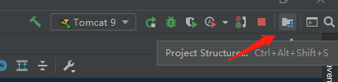
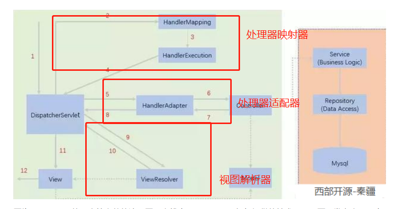
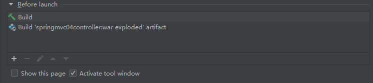
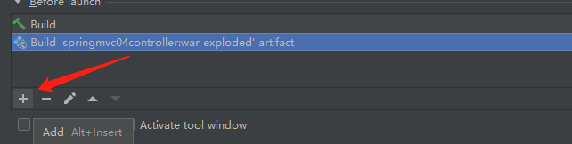

# Spring MVC

# Servlet 回顾

- ## Servlet

~~~java
package com.mvc.servlet;

import javax.servlet.ServletException;
import javax.servlet.http.HttpServlet;
import javax.servlet.http.HttpServletRequest;
import javax.servlet.http.HttpServletResponse;
import java.io.IOException;

public class testServlet extends HttpServlet {
    @Override
    protected void doGet(HttpServletRequest req, HttpServletResponse resp) throws ServletException, IOException {
        //取得参数
        String method = req.getParameter("method");
        if (method.equals("add")){
            req.getSession().setAttribute("msg","执行了add方法");
        }
        if (method.equals("delete")){
            req.getSession().setAttribute("msg","执行了delete方法");
        }
        //业务逻辑
        //视图跳转
        req.getRequestDispatcher("/WEB-INF/jsp/test.jsp").forward(req,resp);

    }

    @Override
    protected void doPost(HttpServletRequest req, HttpServletResponse resp) throws ServletException, IOException {
        doGet(req, resp);
    }
}

~~~

- ## 目录结构

-  **WEB-INF**是Java的web应用安全目录，只对服务端开放，对客户端是不可见的。所以我们可以把除首页（index.jsp）以外的页面都放在WEB-INF目录下，这样就无法通过URL直接访问页面了。

- 

~~~jsp
<!--test.jsp-->
<%@ page contentType="text/html;charset=UTF-8" language="java" %>
<html>
<head>
    <title>Title</title>
</head>
<body>
<h1>
    TEST!SUCCESS!
    ${msg}
</h1>
</body>
</html>
~~~

~~~jsp
<!--form.jsp-->
<%@ page contentType="text/html;charset=UTF-8" language="java" %>
<html>
<head>
    <title>Title</title>
</head>
<body>
<form action="/test" method="post">
    <input type="text" name="method">
    <input type="submit">
</form>
</body>
</html>
~~~

# SpringMVC

## helloController

~~~java
public class HelloController implements Controller {
    @Override
    public ModelAndView handleRequest(HttpServletRequest httpServletRequest, HttpServletResponse httpServletResponse) throws Exception {
        ModelAndView mv = new ModelAndView();
        mv.addObject("msg","SpringMvc");
        mv.setViewName("helloJSP");//用于获取视图的名称（在WEB-INF下）
        return mv;
    }
}
~~~

## springmvc-servlet.xml

~~~xml
<?xml version="1.0" encoding="UTF-8"?>
<beans xmlns="http://www.springframework.org/schema/beans"
       xmlns:xsi="http://www.w3.org/2001/XMLSchema-instance"
       xsi:schemaLocation="http://www.springframework.org/schema/beans
    http://www.springframework.org/schema/beans/spring-beans.xsd">
    <!--  处理器映射器-->
    <bean class="org.springframework.web.servlet.handler.BeanNameUrlHandlerMapping"/>
    <!--处理器适配器-->
    <bean class="org.springframework.web.servlet.mvc.SimpleControllerHandlerAdapter"/>


    
    <!--视图解析器:DispatcherServlet给他的ModelAndView
    1. 获取ModelAndView数据
    2. 获取 ModelAndView的视图 名字
    3. 拼接视图名字和路径，找到对应视图 /WEB-INF.jsp/helloJSP.jsp
    4. 将数据渲染到视图上-->
    <bean class="org.springframework.web.servlet.view.InternalResourceViewResolver" id="InternalResourceViewResolver">
        <!--映射的网页视图 前缀-->
        <property name="prefix" value="/WEB-INF/jsp/"/>
        <!--后缀-->
        <property name="suffix" value=".jsp"/>
    </bean>
    <!--handler-->
    <bean id="/helloURL" class="com.springMVC.controller.HelloController"/><!--id 用于映射 用户输入的URL 到对应的controller-->
</beans>

~~~

## 网页目录


## Web.xml

~~~xml
<?xml version="1.0" encoding="UTF-8"?>
<web-app xmlns="http://xmlns.jcp.org/xml/ns/javaee"
         xmlns:xsi="http://www.w3.org/2001/XMLSchema-instance"
         xsi:schemaLocation="http://xmlns.jcp.org/xml/ns/javaee
http://xmlns.jcp.org/xml/ns/javaee/web-app_4_0.xsd"
         version="4.0">
    <!--1.注册DispatcherServlet-->
    <servlet>
        <servlet-name>springmvc</servlet-name>
        <servlet-class>org.springframework.web.servlet.DispatcherServlet</servlet-class>
        <!--关联一个springmvc的配置文件:【servlet-name】-servlet.xml-->
        <init-param>
            <param-name>contextConfigLocation</param-name>
            <param-value>classpath:springmvc-servlet.xml</param-value>
        </init-param>
        <!--启动级别-1-->
        <load-on-startup>1</load-on-startup>
    </servlet>
            <!--/ 匹配所有的请求；（不包括.jsp）-->
            <!--/* 匹配所有的请求；（包括.jsp）-->
    <servlet-mapping>
        <servlet-name>springmvc</servlet-name>
        <url-pattern>/</url-pattern>
    </servlet-mapping>
</web-app>
~~~


- ## 404报错解决

- ## 添加lib文件夹，并且添加依赖

- 

- 

 


# SpringMVC原理



## 结合springmvc-servlet.xml理解

~~~xml
<?xml version="1.0" encoding="UTF-8"?>
<beans xmlns="http://www.springframework.org/schema/beans"
       xmlns:xsi="http://www.w3.org/2001/XMLSchema-instance"
       xsi:schemaLocation="http://www.springframework.org/schema/beans
    http://www.springframework.org/schema/beans/spring-beans.xsd">
    <!--  处理器映射器-->
    <bean class="org.springframework.web.servlet.handler.BeanNameUrlHandlerMapping"/>
    <!--处理器适配器-->
    <bean class="org.springframework.web.servlet.mvc.SimpleControllerHandlerAdapter"/>
    <!--视图解析器-->
    <bean class="org.springframework.web.servlet.view.InternalResourceViewResolver" id="InternalResourceViewResolver">
        <!--映射的网页视图 前缀-->
        <property name="prefix" value="/WEB-INF/jsp/"/>
        <!--后缀-->
        <property name="suffix" value=".jsp"/>
    </bean>
    
    
    <!--对应BeanNameUrlHandlerMapping 要进行的配置：URL映射为Bean的Id 来寻找controller-->
    <bean id="/helloURL" class="com.springMVC.controller.HelloController"/>
    <!--id 用于映射 用户输入的URL 到对应的controller-->
</beans>
~~~

## 工作流程

1. ## 所有请求都会交给DispatchSevlet(DS)

2. ## DS调用 <u>处理器映射器</u>  handlerMapping 将URL映射为对应Handler(controller)，映射后信息由HandlerExecution 交回给DS

3. ## DS调用 <u>处理器适配器</u> handlerAdapter 执行Handler,获得结果（ModelAndView）后返回给DS

4. ## DS根据 <u>调用视图解析器</u> 解析MV，获取视图，将视图呈现给用户


# 注解开发SpringMVC

## 配置springmvc-servlet.xml

- 指定扫描注解的包
- 让springmvc不处理静态资源    < mvc:default-servlet-handler/>
- 配置处理器映射器，处理器适配器      < mvc:annotation-driven/>
- 配置视图解析器

~~~xml
<?xml version="1.0" encoding="UTF-8"?>
<beans xmlns="http://www.springframework.org/schema/beans"
       xmlns:xsi="http://www.w3.org/2001/XMLSchema-instance"
       xmlns:context="http://www.springframework.org/schema/context"
       xmlns:mvc="http://www.springframework.org/schema/mvc"
       xsi:schemaLocation="http://www.springframework.org/schema/beans
       http://www.springframework.org/schema/beans/spring-beans.xsd
       http://www.springframework.org/schema/context
        http://www.springframework.org/schema/context/spring-context.xsd
        http://www.springframework.org/schema/mvc
        http://www.springframework.org/schema/mvc/spring-context.xsd">

    <!--  自动扫描注解  -->
    <context:component-scan base-package="com.springmvc.controller"/>

    
    <!-- 让Spring MVC不处理静态资源 -->
    <mvc:default-servlet-handler/>

    
        <!--
    支持mvc注解驱动
    在spring中一般采用@RequestMapping注解来完成映射关系
    要想使@RequestMapping注解生效
    必须向上下文中注册DefaultAnnotationHandlerMapping
    和一个AnnotationMethodHandlerAdapter实例
    这两个实例分别在类级别和方法级别处理。
    而annotation-driven配置帮助我们自动完成上述两个实例的注入。
    -->
    <mvc:annotation-driven/>
    <bean class="org.springframework.web.servlet.view.InternalResourceViewResolver"
            id="internalResourceViewResolver">
        <property name="prefix" value="/WEB-INF/JSP/"/>
        <property name="suffix" value=".jsp"/>
    </bean>
</beans>
~~~

## 注解构建项目流程

1. ## 建立项目，添加WEB framework，添加对应依赖

2. ## 加入要显示的页面在 WEB-INF/... 

3. ## 配置web.xml  

   - ### servlet: dispatchServlet 

   - ### servletMapping

     ~~~xml
     <?xml version="1.0" encoding="UTF-8"?>
     <web-app xmlns="https://jakarta.ee/xml/ns/jakartaee"
              xmlns:xsi="http://www.w3.org/2001/XMLSchema-instance"
              xsi:schemaLocation="https://jakarta.ee/xml/ns/jakartaee https://jakarta.ee/xml/ns/jakartaee/web-app_5_0.xsd"
              version="5.0">
         <servlet>
             <servlet-name>springmvc</servlet-name>
             <servlet-class>org.springframework.web.servlet.DispatcherServlet</servlet-class>
             <init-param>
                 <param-name>contextConfigLocation</param-name>
                 <param-value>classpath:springmvc-servlet.xml</param-value>
             </init-param>
             <load-on-startup>1</load-on-startup>
         </servlet>
         <servlet-mapping>
             <servlet-name>springmvc</servlet-name>
             <url-pattern>/</url-pattern>
         </servlet-mapping>
     </web-app>
     ~~~

     

4. ## 配置Springmvc-servlet

   - 注解扫描<context:component-scan base-package="com.springmvc.controller"/>	

   - 设置不处理静态资源    < mvc:default-servlet-handler/>

   - 配置处理器映射器和处理器适配器< mvc:annotation-driven/>

   - 配置视图解析器

     ```xml
     <bean class="org.springframework.web.servlet.view.InternalResourceViewResolver"
             id="internalResourceViewResolver">
         <property name="prefix" value="/WEB-INF/JSP/"/>
         <property name="suffix" value=".jsp"/>
     </bean>
     ```
     ~~~xml
     <!--Springmvc-servlet.xml-->
     <?xml version="1.0" encoding="UTF-8"?>
     <beans xmlns="http://www.springframework.org/schema/beans"
            xmlns:xsi="http://www.w3.org/2001/XMLSchema-instance"
            xmlns:context="http://www.springframework.org/schema/context"
            xmlns:mvc="http://www.springframework.org/schema/mvc"
            xsi:schemaLocation="http://www.springframework.org/schema/beans
            http://www.springframework.org/schema/beans/spring-beans.xsd
            http://www.springframework.org/schema/context
             http://www.springframework.org/schema/context/spring-context.xsd
             http://www.springframework.org/schema/mvc
             http://www.springframework.org/schema/mvc/spring-context.xsd">
         <!--  自动扫描注解  -->
         <context:component-scan base-package="com.springmvc.controller"/>
     
         <!-- 让Spring MVC不处理静态资源 -->
         <mvc:default-servlet-handler/>
           <!--
         支持mvc注解驱动
         在spring中一般采用@RequestMapping注解来完成映射关系
         要想使@RequestMapping注解生效
         必须向上下文中注册DefaultAnnotationHandlerMapping
         和一个AnnotationMethodHandlerAdapter实例
         这两个实例分别在类级别和方法级别处理。
         而annotation-driven配置帮助我们自动完成上述两个实例的注入。
         -->
         <mvc:annotation-driven/>
         <bean class="org.springframework.web.servlet.view.InternalResourceViewResolver"
                 id="internalResourceViewResolver">
             <property name="prefix" value="/WEB-INF/JSP/"/>
             <property name="suffix" value=".jsp"/>
         </bean>
     </beans>
     ~~~

     

5. ## 编写Controller

   ~~~java
   @Controller//注解 注册controller 的bean 
   //@RequestMapping("/h1") 如果加在类前，后面的mapping 放在h1后 ：  /h1/helloURL
   
   public class helloController {
   
       @RequestMapping("/helloURL")//配置URL 映射
       public String hello(Model model){
           model.addAttribute("msg","HelloAnnotation");
           return "helloJSP";//要显示的页面的 名字
       }
   }
   ~~~

# 实现类和注解Controller 对比

~~~java
//实现类 
public class controllerTest1 implements Controller {
    @Override
    public ModelAndView handleRequest(HttpServletRequest httpServletRequest, HttpServletResponse httpServletResponse) throws Exception {
        ModelAndView mv = new ModelAndView();
        mv.addObject("msg","Controller1");
        mv.setViewName("test1");
        return mv;
    }
}
//注解实现

@Controller//注解类 中所有方法如果返回值是String  且有对应字符串的页面，那么就会被视图解析器解析
public class controller2anno {
    @RequestMapping("test2anno")
    public String test2(Model model){
        model.addAttribute("msg","Anno controller");
        return "test2";
    }
}

~~~

# RestFul风格

是一种资源定位和资源操作的风格。

- ## 体现在URL传参的形式上

~~~java
@Controller
public class RestFulController {
    //旧风格 http://localhost:8080/addOld?a=1&b=2
    //RestFul http://localhost:8080/addREST/a/b


    //旧风格
    @RequestMapping("/addOld")
    public String test1(int a, int b, Model model){
        int res = a + b;
        model.addAttribute("msg","OLD结果："+res);
        return "OLDTest";
    }

    //RestFul 风格
    @RequestMapping("/addREST/{a}/{b}")
    public String RestFultest(@PathVariable int a,@PathVariable int b, Model model){
        int res = a + b;
        model.addAttribute("msg","RestFul结果："+res);
        return "RestFulTest";
    }
}

@RequestMapping 的方法变体：都是指明了方法 (method = GET method = POST)
@GetMapping
@PostMapping
@PutMapping
@DeleteMapping
@PatchMapping
~~~

# 重定向和转发

略，不重要

# 接受请求参数和回显

## BUG



- ## 要部署的项目记得build before launch

- 
- 
- 
- 选择要部署的项目的war包
- 

## 请求参数处理

1. ### 前端传入参数名于controller 对应方法中的参数名字一致时，不用处理

   ~~~java
   @Controller
   @RequestMapping("/user")
   public class UserController {
       //url 为 http://localhost:8080/user/t1?name=...
       @GetMapping("/t1")
       public String test1(String name, Model model){
           //1.接收前端参数
           System.out.println("naem:"+name);
           //2. 设置model 之后返回给前端
           model.addAttribute("msg",name);
           //3. 跳转
           return "test1";
       }
   }
   ~~~

   

2. ### 若想要指定某个参数从前端传入时的名字使用 @RequestParam

   ~~~java
   //使用@RequestParam("paraname")后 url 为 http://localhost:8080/user/t1?paraname=
   @GetMapping("/t1")
   public String test1(@RequestParam("paraname") String name, Model model){
       //1.接收前端参数
       System.out.println("naem:"+name);
       //2. 设置model 之后返回给前端
       model.addAttribute("msg",name);
       //3. 跳转
       return "test1";
   }
   ~~~

   

3. ### 如果方法传入的参数是个对象

   ~~~java
   /**对象传参
        * 1.先将传进来的参数和方法的局部参数匹配，若匹配失败，进入下一步
        * 2.若有对象，则匹配对象的字段名**/
   @GetMapping("/t2")
   public String test2(User user,Model model){
       System.out.println(user);
       return "test1";
   }
   ~~~

## 数据回显（讲得过于简单，待补充）

1. ### 使用ModelAndView

2. ### 使用ModelMap(继承LinkedHaspMap)

3. ### 使用Model 最常用、最简单

# 乱码问题

- ### encode.jsp

~~~jsp
<%@ page contentType="text/html;charset=UTF-8" language="java" %>
<html>
<head>
    <title>Title</title>
</head>
<body>
<form action="/encode/t1" method="get">
    <input type="text" name="name">
    <input type="submit">
</form>
</body>
</html>
~~~

- ### encodeController.class (代码略)

## 解决乱码

1. 建立filter(继承Servlet 包下得 Filter) 使用过滤器，并且在web.xml里面注册filter

   ~~~xml
   <?xml version="1.0" encoding="UTF-8"?>
   <web-app xmlns="https://jakarta.ee/xml/ns/jakartaee"
            xmlns:xsi="http://www.w3.org/2001/XMLSchema-instance"
            xsi:schemaLocation="https://jakarta.ee/xml/ns/jakartaee https://jakarta.ee/xml/ns/jakartaee/web-app_5_0.xsd"
            version="5.0">
   //.....
       <filter>
           <filter-name>decoding</filter-name>
           <filter-class>com.springmvc.filter.decodeFilter</filter-class>
   
       </filter>
       <filter-mapping>
           <filter-name>decoding</filter-name>
           <url-pattern>/</url-pattern>
       </filter-mapping>  
   </web-app>
   ~~~

   

2. 注意表单提交方法要使用get，如果使用 post提交表单还是会出错

## 使用SpringMVC的过滤器

~~~xml
<filter>
<filter-name>encoding</filter-name>
<filter-class>org.springframework.web.filter.CharacterEncodingFilter</filter-class>
<init-param>
<param-name>encoding</param-name>
<param-value>utf-8</param-value>
</init-param>
</filter>
<filter-mapping>
<filter-name>encoding</filter-name>
<url-pattern>/</url-pattern>
</filter-mapping>

~~~

# Json

Json是一种前后端交互数据的数据格式、

## BUG

使用Idea的Refactor 导致Web.xml中DispatchServlet配置出错

~~~xml
<servlet>
    <servlet-name>springmvc</servlet-name>
    <servlet-class>org.springframework.web.servlet.DispatcherServlet</servlet-class>
    <init-param>
        <param-name>contextConfigLocation</param-name>
 <!--注意此处应该为 springmvc-servlet.xml,使用idea复制别的项目的web.xml文件时，idea自动refactor导致出错！！！-->
        <param-value>classpath:com.springmvc-servlet.xml</param-value>
    </init-param>
    <load-on-startup>1</load-on-startup>
</servlet>
~~~


## 使用Json

- ## UserController

~~~java
@Controller
public class UserController {
    @RequestMapping(value = "/j1", produces = "application/json;charset=utf-8")
    @ResponseBody//使用这个注解，返回的字符串不会走视图解析器，而是直接将返回的字符串传递给前端
    public String Json1() throws JsonProcessingException {
        User user = new User("哈哈",12);
        ObjectMapper mapper = new ObjectMapper();

        String strJson =mapper.writeValueAsString(user);
        return strJson;
    }
}


//另一种写法
@RestController//使用这个注解修饰，相当于这个类所有方法都带了ResponseBody
public class UserController {
    @RequestMapping(value = "/j1", produces = "application/json;charset=utf-8")
    public String Json1() throws JsonProcessingException {
        User user = new User("笑嘻了",12);
        ObjectMapper mapper = new ObjectMapper();

        String strJson =mapper.writeValueAsString(user);
        return strJson;
    }
    @RequestMapping("j2")
    public String Json2() throws JsonProcessingException {
        User user1= new User("1",12);
        User user2= new User("2",12);
        User user3= new User("3",12);
        List<User> list = new ArrayList<>();
        list.add(user1);
        list.add(user2);
        list.add(user3);
        return new ObjectMapper().writeValueAsString(list);

    }
    @RequestMapping("j3")
    public String Json3() throws JsonProcessingException {
        return new ObjectMapper().writeValueAsString(new Date());
    }

//    //fastjson 的使用 有bug...
//    @RequestMapping("j4")
//    public String Json4(){
//
//        User user1= new User("1",12);
//        User user2= new User("2",12);
//        User user3= new User("3",12);
//        List<User> list = new ArrayList<>();
//        list.add(user1);
//        list.add(user2);
//        list.add(user3);
//        String str = JSON.toJSONString(list);
//        return str;
//    }

}
~~~

