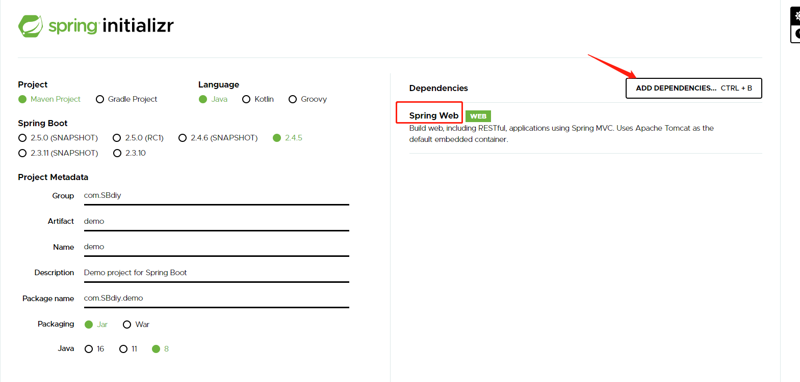
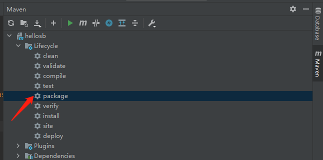

# 环境配置

## maven安装和配置

1. 官网下载安装即可
2. 配置按照教程 https://blog.csdn.net/pan_junbiao/article/details/104264644
   - 配置系统变量
   - 创建本地仓库

# SpringBoot-- HelloWorld

## 创建项目

1. ### 使用官网initializer

   

2. ### 使用idea插件 new--project

   

3. ### 目录结构（要求controller等目录要和入口Application在同一包下）

   

   - 将项目打包成jar包运行

     

     

   - 运行

     ​	

# 自动装配原理

