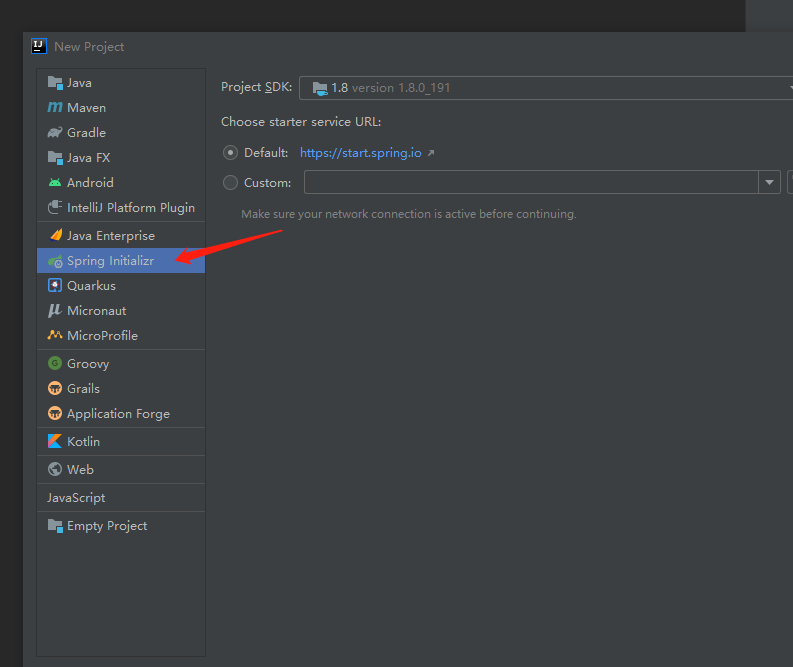
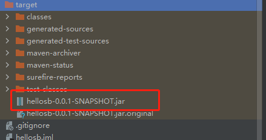
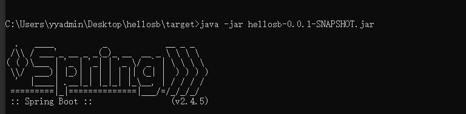
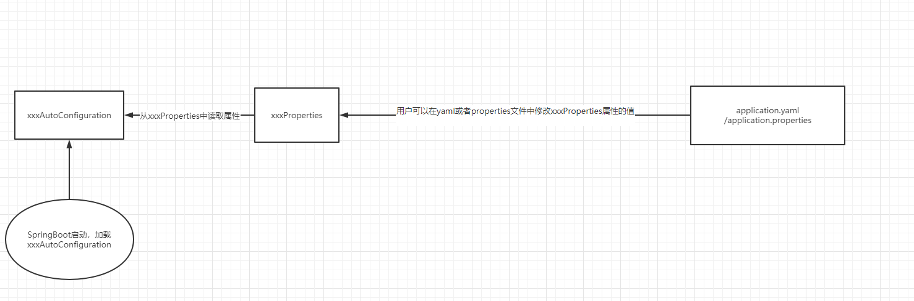
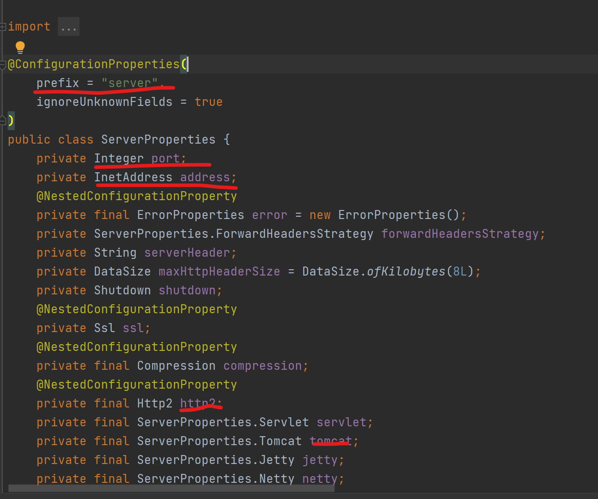
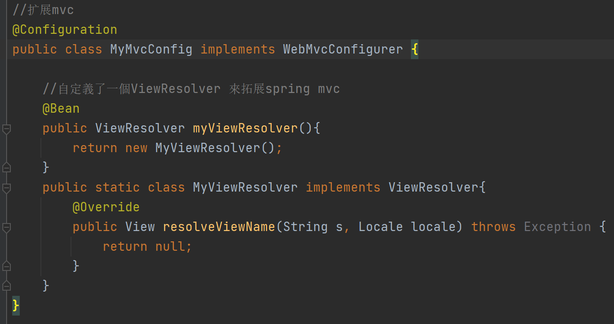
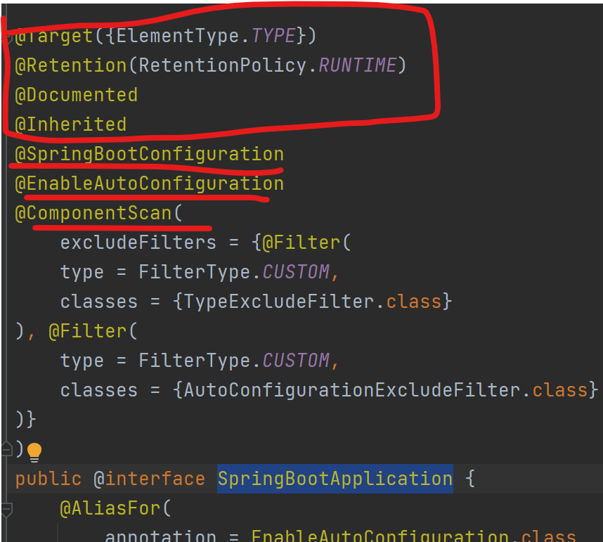
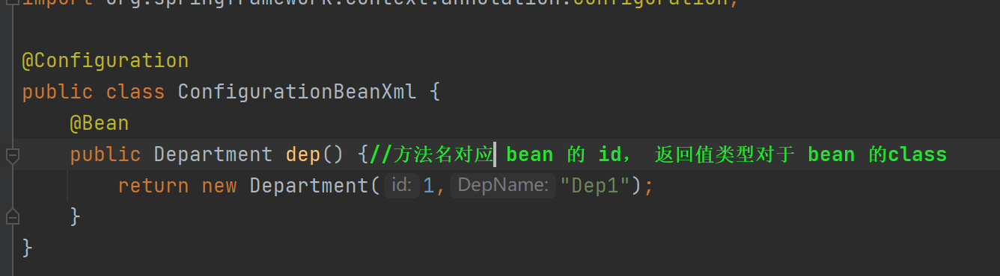
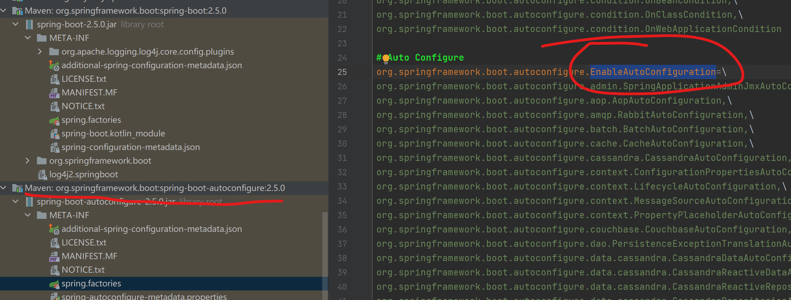

# SpringBoot 作用

## @Conditonal 注解

@conditional(? implement condition ) 括号中是实现condition接口的实现类

假设一个 @Conditiona( ConditionImpl )

~~~java
public class ConditionImpl implements Condition {

    @Override
    public boolean matches(ConditionContext context, AnnotatedTypeMetadata metadata) {  // (1) condition 接口有一个matched方法，用于判断是否要加载这个bean
        return oracleJdbcDriverOnClassPath() && databaseUrlSet(context); // (2)
    }

    private boolean databaseUrlSet(ConditionContext context) { // (3)
        return context.getEnvironment().containsProperty("spring.datasource.url");
    }

    private boolean oracleJdbcDriverOnClassPath() { // (4)
        try {
            Class.forName("oracle.jdbc.driver.OracleDriver");
            return true;
        } catch (ClassNotFoundException e) {
            return false;
        }
    }
}
~~~

## Condition 类

~~~java
@FunctionalInterface
public interface Condition {
	//matches 返回值为：
    //True: (继续 解析/注册)构建相应的@Bean/@Component/@Configuration
	//False: (停止 解析/注册)不要构建相应的@Bean/@Component/@Configuration
    boolean matches(ConditionContext var1, AnnotatedTypeMetadata var2);
}

~~~


# 环境配置

## maven安装和配置

1. 官网下载安装即可
2. 配置按照教程 https://blog.csdn.net/pan_junbiao/article/details/104264644
   - 配置系统变量
   - 创建本地仓库

# SpringBoot-- HelloWorld

## 创建项目

1. ### 使用官网initializer

   

2. ### 使用idea插件 new--project

   

3. ### 目录结构（要求controller等目录要和入口Application在同一包下）

   

   - 将项目打包成jar包运行

     

     

   - 运行

     ​	

# 自动装配原理

## 初步理解自动配置



- ### AutoConfuguration: @EnableConfigurationProperties({ServerProperties.class})  注解引入对于的属性类Properties


- ### 	Properties中是可以在yaml或者properties文件中赋值的属性

- ### @ConfigurationProperties 注解中的prefix指明了配置的前缀为server

- 

- properties文件：

- 

  

# SpringBoot web 开发

## web项目结构复习


- java和resources文件夹下的文件都会放在编译后的classes文件夹下，pom引入的依赖都在lib下，编译器WEB-INF下的文件编译后还是在WEB-INF下

## 静态资源路径

静态资源自动配置路径：

- webjars
- resources文件夹下：public <static <resource (加载优先级)

## 首页 

### 静态资源配置首页


### 使用template 模板引擎 thymeleaf

- ### 导入依赖

  ~~~xml
  <dependency>
      <groupId>org.springframework.boot</groupId>
      <artifactId>spring-boot-starter-thymeleaf</artifactId>
  </dependency>
  ~~~

  

- ### thymeleaf语法

  ~~~html
  <div th:text="${msg}">
      <!-- th:  thymeleaf-->
  </div>
  ~~~

## MVC配置

### spring mvc 拓展



- ### debug 查看dispatchServlet 斷點，發現自定義的視圖解析器被加載到了resolvers中


## xxxCofiguration類的作用

# 入门部分

## 底层注解

### @SpringBootApplication 

这个注解相当于 三个注解： @SpringBootConfigura...下面三个画横线的注解（前面四个是元注解，不重要）



### @Configuration 

- ### @configuration 配合 @bean 使用，一个Configuration 类相当于一个bean.xml （bean配置文件）

- ### @configuration 类和 bean.xml  结构 对比

  

  

### @configuration作用

1. ### @configration 用于配置bean，单例模式

2. ### @configuration 底层是 @Component

3. #### @configuration 的proxyBeanMode 属性 (代理  @bean 方法)

   - true:Full 全量模式
     - springboot会检查@bean 方法 注册的 bean的依赖关系。调用这个bean方法返回的就是容器中的bean（感觉有点像单例模式）
   - fasle :Lite 轻量模式
     - springboot不检查bean的依赖关系。调用这个bean方法返回的bean不一定是容器中的bean

### @Import

### 作用

- ### 用于导入类，容器会创建导入的组件，@import 导入组件的名字是类的全限定类名

### @Conditional

### 作用

- ### 是@Conditionalonxxx的底层实现，根据某种条件决定是否被构建 @conditional 修饰的组件

### @ImportResource

### 作用

- ### 用于导入beans.xml文件，解析并且构建beans.xml 中的bean

## 配置绑定注解

### 作用： 

- ### 读取yaml 或者 properties文件中的属性，并且在容器中

2种用法：

1. @ConfigurationProperties + @EnableConfigurationProperties 两个类

   ~~~java
   @ConfigurationProperties(prefix = "mycar")
   public class car{
       //...
   }
   
   @Configuration
   @EnableConfigurationProperties(car.class)
   //1.开启car配置绑定功能
   //2.把car组件注册到容器中
   public class Myconfig{
       //...
   }
   ~~~

   

2. @ConfigurationProperties + @Component 同一个类

   ~~~java
   @Componet
   //配置文件：application.yaml application.properties
   //在配置文件中，使用mycar前缀配置这个类
   @ConfigurationProperties(prefix = "mycar")
   public class car{
       //...
   }
   ~~~

   

## 自动配置

### @SpringBootApplication

组成：

- 元注解 不重要 

  - @Target
  - @Retention
  - @Documented
  - @Inherited

- 重要注解

  ```java
  @SpringBootConfiguration//相当于@Configuration
  @EnableAutoConfiguration//自动配置的关键
  @ComponentScan//扫描包 
  ```


### @EnableAutoConfiguration	

~~~java
@AutoConfigurationPackage
@Import({AutoConfigurationImportSelector.class})
public @interface EnableAutoConfiguration {
    ///...
}
~~~

- #### 	@AutoConfigurationPackage	

  ```java
  @Import({Registrar.class})
  //导入了Registrar
  //Registrar用于将MainApplication 包下的 组件导入容器
  public @interface AutoConfigurationPackage {
  	//..
  }
  
  ```

- #### @Import({AutoConfigurationImportSelector.class})

~~~java
getAutoConfigurationEntry-->getCandidateConfigurations-->loadFactoryNames-->loadSpringFactories
~~~

- ### org\springframework\boot\spring-boot-autoconfigure\2.5.0\spring-boot-autoconfigure-2.5.0.jar 下是要导入的组件（很多AutoConfiguration 类）

- ### 图中画圈部分和注解同名



