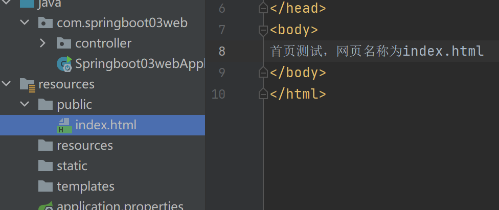
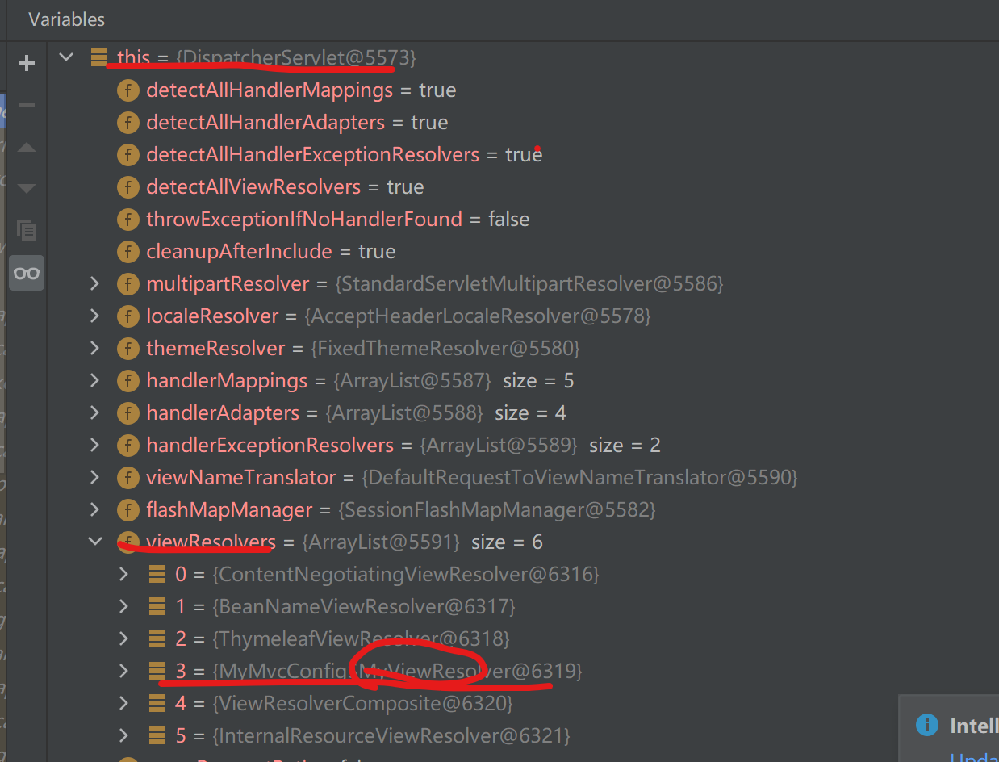

# SpringBoot 作用

## @Conditonal 注解

@conditional(? implement condition ) 括号中是实现condition接口的实现类

假设一个 @Conditiona( ConditionImpl )

~~~java
public class ConditionImpl implements Condition {

    @Override
    public boolean matches(ConditionContext context, AnnotatedTypeMetadata metadata) {  // (1) condition 接口有一个matched方法，用于判断是否要加载这个bean
        return oracleJdbcDriverOnClassPath() && databaseUrlSet(context); // (2)
    }

    private boolean databaseUrlSet(ConditionContext context) { // (3)
        return context.getEnvironment().containsProperty("spring.datasource.url");
    }

    private boolean oracleJdbcDriverOnClassPath() { // (4)
        try {
            Class.forName("oracle.jdbc.driver.OracleDriver");
            return true;
        } catch (ClassNotFoundException e) {
            return false;
        }
    }
}
~~~

## Condition 类

~~~java
@FunctionalInterface
public interface Condition {
	//matches 返回值为：
    //True: (继续 解析/注册)构建相应的@Bean/@Component/@Configuration
	//False: (停止 解析/注册)不要构建相应的@Bean/@Component/@Configuration
    boolean matches(ConditionContext var1, AnnotatedTypeMetadata var2);
}

~~~

# 环境配置

## maven安装和配置

1. 官网下载安装即可
2. 配置按照教程 https://blog.csdn.net/pan_junbiao/article/details/104264644
   - 配置系统变量
   - 创建本地仓库

# SpringBoot-- HelloWorld

## 创建项目

1. ### 使用官网initializer

   

2. ### 使用idea插件 new--project

   

3. ### 目录结构（要求controller等目录要和入口Application在同一包下）

   

   - 将项目打包成jar包运行

     

     

   - 运行

     ​	

# 自动装配原理

## 初步理解自动配置

- ### AutoConfuguration: @EnableConfigurationProperties({ServerProperties.class})  注解引入对于的属性类Properties

- ### 	Properties中是可以在yaml或者properties文件中赋值的属性

- ### @ConfigurationProperties 注解中的prefix指明了配置的前缀为server

- 

- properties文件：

- 

  

# SpringBoot web 开发

## web项目结构复习

- java和resources文件夹下的文件都会放在编译后的classes文件夹下，pom引入的依赖都在lib下，编译器WEB-INF下的文件编译后还是在WEB-INF下

## 静态资源路径

静态资源自动配置路径：

- webjars
- resources文件夹下：public <static <resource (加载优先级)

## 首页 

### 静态资源配置首页

### 使用template 模板引擎 thymeleaf

- ### 导入依赖

  ~~~xml
  <dependency>
      <groupId>org.springframework.boot</groupId>
      <artifactId>spring-boot-starter-thymeleaf</artifactId>
  </dependency>
  ~~~

  

- ### thymeleaf语法

  ~~~html
  

      <!-- th:  thymeleaf-->
  

  ~~~

## MVC配置

### spring mvc 拓展

- ### debug 查看dispatchServlet 斷點，發現自定義的視圖解析器被加載到了resolvers中

## xxxCofiguration類的作用
