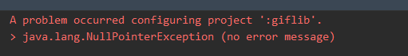
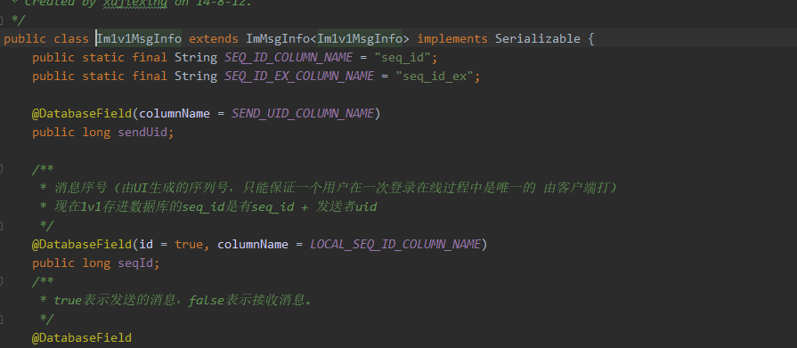

## 被remote reject

https://blog.csdn.net/QPC908694753/article/details/79237748

- 账号错误，重新设置账号即可
- 账号名：huangdewei
- 账号邮箱 huangdewei@yy.com
- git config  user.name


# 测试包构建

- ## auto-build

  - ### 记得勾选后两个方框

  - ### Auto-build就是用于 运行jenkins构建的脚本，实际上就是jenkins。auto-build 构建之后得到的包apk，下载之后 安装在本地上测试，测试通过就可以交邮件。

  

#  工作安排

​	初步工作计划 （3周内完成）    

1.  熟悉追玩项目结构&基本开发流程    
2. 参与一个版本需求bug修复，熟悉项目后再参与开发一个需求子模块的开发    
3. 补充知识短板（kotlin、复杂UI实现、自定义view）


# 云游戏

## 先了解云游戏业务

了解网络通信还有...

- 目前的云游戏代码放在channel插件


## TencentCloudGameActivity 

com.yy.mobile.plugin.dreamerchannel.ui.cloudgame.TencentCloudGameActivity 

- ## 主要工作流程

~~~java
    override fun onCreate(savedInstanceState: Bundle?) {
        //...//
        initVar()//初始化参数，包括：屏幕适配需要的density 以及记录create 的时间
        initView()//初始化 上层的几个Act
        initListener()//设置debug模式 TenGameController
        initData()//CompositeDisposable 订阅者发布者模式？待学习
        closeChannelNotice()//
        //.....//
    }
~~~

~~~java
    private fun initView() {
        addTopOfGameView() //添加 最靠近底部的 三层 Control, 聊天室, scale 缩放
        addOperation()//添加Operation 层
        //添加loading 层 进入游戏的加载
        ViewUtils.loadFragment(this, R.id.loading_layout, supportFragmentManager, Bundle(),
            CloudGameLoadingComponent::class.java, CloudGameLoadingComponent.TAG)
    }
~~~

~~~java
package com.yy.mobile.plugin.dreamerchannel.ui.cloudgame.utils
//TenGameController 是腾讯云游SDK(ITcgSdk) 的一个封装工具类 
     
~~~

~~~java
// 3.通过客户端clientSession获取serverSession启动游戏
    fun startSdk(clientSession: String) {
        val gameId = CoreFactory.getCore(ICloudGameCore::class.java).getGameId()
        val data = "gameId=$gameId&resolution=720p&clientSession=$clientSession"
        val ticket = CoreFactory.getCore(IAuthCore::class.java).webToken
        val url = ChannelApiProvider.URL_CREATE_SESSION + "?ticket=$ticket"
        val body = RequestBody.create(
            MediaType.parse("application/x-www-form-urlencoded; charset=utf-8"), data)
        MLog.info(TAG, "startSdk url=$url   data=$data ")
        addDisposable(HttpManager.instance().getApi(IYunGameApi::class.java)
            .createSession(url, body).observeOn(AndroidSchedulers.mainThread())
            .subscribeOn(Schedulers.io())
            .subscribe({
                MLog.info(TAG, "createSession:=$it")
                when (it.result) {
                    0 -> {
                        mReconnectCounts = 0
                        it?.serverSession?.apply {
                            //ITcgSdk
                            mSdk?.start(
                                String(Base64.decode(this.toByteArray(Charsets
                                    .UTF_8),
                                    Base64.DEFAULT)))
                                
                        }
                    }
                    -1 -> {
                        // -1 则服务器已经释放游戏资源 不再重连了
                        quitGameInCreateSession("服务器已经释放，请重新进入")
                    }
                    else -> {
                        reStartServerSession(clientSession)
                        GameUtils.gameFailReport("130",
                            "onInitSuccess createSession result:${it.result}")
                    }
                }
            }, {
                MLog.error(TAG, "start error=${it.message}")
                GameUtils.gameFailReport("131",
                    "onInitSuccess createSession createSessionFail $it")
                reStartServerSession(clientSession)
            }))
    }
~~~


## CloudGameOperationComponent

com.yy.mobile.plugin.dreamerchannel.ui.cloudgame

- 

# 活动中心需求分析

## 入口链接

~~~kotlin
//活动中心和赛事活动的h5跳转链接 使用type参数区分 活动中心type = 1 赛事活动 type = 2
const val PRODUCT_ACT_CENTER_H5_URL = "https://web.yy.com/ge_zw_actcenter_2104_feat/index.html?type=2"
const val DEV_ACT_CENTER_H5_URL = "https://webtest.yy.com/ge_zw_actcenter_2104_feat/index.html?type=2"

//下面的链接用于跳转 赛事活动 在项目home 中使用
//const val DEV_MATCH_ACT_H5_URL = "https://webtest.yy.com/ge_zw_actcenter_2104_feat/index.html?type=1"
//const val PRODUCT_MATCH_ACT_H5_URL = "https://web.yy.com/ge_zw_actcenter_2104_feat/index.html?type=1"


//第二版链接
//赛事活动的链接要在后台配置
赛事活动
测试地址：https://webtest.yy.com/ge_zw_actcenter_2104_feat/index.html
正式地址：https://web.yy.com/ge_zw_actcenter_2104_feat/index.html


//
活动中心
测试地址：https://webtest.yy.com/ge_zw_actcenter_2104_feat/center.html
正式地址：https://web.yy.com/ge_zw_actcenter_2104_feat/center.html

//活动中心和赛事活动的h5跳转链接 使用type参数区分 活动中心type = 1 赛事活动 type = 2
    const val PRODUCT_ACT_CENTER_H5_URL = "https://web.yy.com/ge_zw_actcenter_2104_feat/center.html"
    const val DEV_ACT_CENTER_H5_URL = "https://webtest.yy.com/ge_zw_actcenter_2104_feat/center.html"
[bug id ZHUIYAAN-5730] 修改活动中心入口链接 review by [pengsihai]
~~~


## 设置入口

- ### 设置两个入口

  如何跳转  仿照 首页--一起玩 使用flutter （仿照 我的 --我的贵族 使用webview）需求要 使用WebView实现

  ```java
  //首页 一起玩*
  com.yy.mobile.plugin.dreamerhome.home.GangUpActivity
      
  //贵族
  package com.yy.mobile.plugin.dreamerhome.me.MeTabFragment
  
  ```

  使用Flutter

  ~~~java
  findView<NavigatorBar>(R.id.navigatorBar).apply {
      setOnTitleClickListener {
          if (it == this.rightView) {
              if (!ViewUtils.isFastClick(it.id.toLong())) {
                  PluginInitImpl.getInstance().postClickTask {
                      MLog.info(TAG, "more button click index 1")
                          //关键代码
                          FlutterNavigator.openActivity(this@GangUpActivity,
                                                        FlutterPageUrlConstant.FLUTTER_PAGE_URL_MY_ROOM)
                  }
              }
          } else if (it == this.leftView) {
              finish()
          }
      }
  }
  ~~~

  - ### 使用URL跳转到WebView 

  - 我--我的贵族

    package com.yy.mobile.plugin.dreamerhome.me.MeTabFragment

  - 跳转代码：

  

  - 跳转URL：

   
  
  ~~~kotlin
  addNewItem(mItemContainer2, getString(R.string.str_my_noble),
              R.drawable.icon_guizu, showArrow = true, showDivider = false,
              listener = View.OnClickListener {
                  if (!ViewUtils.isFastClick(1002)) {
                      PluginInitImpl.getInstance().postClickTask {
                          if (!CoreFactory.getCore(ITeenagerModeCore::class.java)
                                  .teenagerModeOpenState) {
                              CoreManager.getCore(IPluginTabsCore::class.java)
                                  .toJSSupportedWebView(activity, ApiProvider.URL_MY_NOBLE)
                          } else {
                              CoreManager.getCore(ITeenagerModeCore::class.java)
                                  .showTeenagerModeLimitDialog(activity)
                          }
                      }
  
                      
                      //数据上报，应该与业务无关
                      CoreManager.getHiidoCore().sendEventStatistic(HiidoConstant.EVENT_ID_TAB_ME,
                          HiidoConstant.LABEL_ME_TAB_NOBLE_CLICK)
                  }
              }, priority = 0)
  ~~~
  
  

## 入口设置代码


- ### 首页要重构，先试着做跳转页面的逻辑。

- ### 看看 我--我的贵族的Item添加和点击的代码，可能有用

- ### 提供入口  （设计好入口的界面，参考新版首页和发现的界面）

- ### 跳转应该直接搬砖即可

需求


# Bug 汇总


- 如果无法看见新分支，使用fetch--- 选中第一个选项---确认（记得sync project）


- 

以上bug 要终止java.exe进程


上图后面两个


- 

  ResourceNotFoundException   配置系统变量的java jdk 的路径

- 

删除最外层（根目录）的public.txt里面的内容。注意不是删除文件，是删除里面的文本

- 编译nullpointer

  

在local.properties设置ndk即可       

- kotlin not configured 配置ndk
- fileNotFound 报错cleanBudle


## 我的房间

- flutter 页面的打开：Delegate -- openActivity 

```
/** package com.yy.mobile.plugin.dreamerlove.flutter.route
 * FlutterBoost 实现的NavigatorDelegate，用于提供flutter页面路由
 *
 */
class BoostFlutterNavigator : NavigatorDelegate 
```

## 活动中心

bug 


进入错误链接时，会出现一个错误图标，并且报错。

### 如何排错：在terminal 搜索ERR_UNKNOWN_URL_SCHEME ，找到对应方法，之后发现有个没用的函数showerror（）会显示图中的信号塔图标，导致bug出现，删掉showerror即可。

# 我的房间


# 云游戏2.0

## GameDetailAct游戏启动界面 流程


- ### GameDetailAct

  ~~~kotlin
  override fun onCreate(savedInstanceState: Bundle?) {
      initializeView()//绑定container
      initializeData()//跳到loadBasicInfoFromCache()之后跳到addOrUpdateChildFragment
  }
  ~~~

  ~~~kotlin
  private fun addOrUpdateChildFragment(info: GameDetailInfo?) {
  	if(界面有缓存且能复用){
          currentRootFragment!!.onBasicInfoRefresh(info)//刷新界面
      }
      else{
          currentRootFragment = setUpChildFragment(info, newType) as IZoneFragment//添加新fragment
          //setUoChildFragment 调用ViewUtil.replaceFragment创建新的fragment
          //底层使用Fragment.instantiate ---> 
          //（反射）Fragment.newinstance(); 跳转到对应的ZoneFragment，在调用setArguments()设置构造时传入的参数。因为反射使用的相当于无参构造，所以创建时传入参数要在之后更改
  		
  	}
  }
  ~~~

  ~~~kotlin
  ViewUtil.replaceFragment
  public static Fragment replaceFragment(Activity act,//调用的活动 用this
                                         int containerId,//装fragment 的容器id  一般是fragmenLayout R.id....
                                         FragmentManager manager,//fragment 使用supportFragmentManager 进行管理
                                         Bundle bundle,//传入budle即可
                                         Class<? extends Fragment> cls,//对应fragment类名 使用反射GameZoneFragment::class.java
                                         String tag)//对应fragment的tag
  ~~~

- ### GameZoneFragment

  ~~~kotlin
  override fun onViewCreated(view: View, savedInstanceState: Bundle?) {
      initBundle()
      initializeView(view)//根据id获取控件 对试图进行设置
      initPendentViewModel()
      //initializeData()
      RxBus.getDefault().post(ZoneChildFragmentReadyEventArgs())
  }
  ~~~

  

  ~~~kotlin
  private fun initializeView(view: View) {
  	setUpHeaderView()//对顶部header进行设置
      setUpSubContent()//对header下的recycleView进行设置，Layoutmanager,scrolllistener...
      setUpRefreshView()//下拉刷新界面
  }
  ~~~


## 游戏专区页面


### 游戏信息部分HeaderView

分为两层

- ```kotlin
  //布局layout\tabs_fragment_game_zone_root.xml
  	//背景图片部分
  	mGameCoverViewLayout = view.findViewById(R.id.header_game_cover_layout)
  	//appbar部分包含顶部导航栏
  	mAppBarLayout = view.findViewById(R.id.app_bar_layout)
  	//导航栏 使用package com.yy.common.ui.widget.NavigatorBar;
  
  //注意：根布局tabs_fragment_game_zone_root include了一个 tabs_include_game_zone_header
  //布局文件 layout\tabs_include_game_zone_header.xml
  	//游戏图标，标题，开始游戏按钮等游戏信息部分
  	mHeaderViewLayout = view.findViewById(R.id.rl_game_detail_header)
  	//开始游戏按钮
  	joinGameBtn = view.findViewById(R.id.btn_join_game)
  	//joinGameButton 实现类：package com.yy.mobile.plugin.dreamertabs.ui.gamedetail.widgets.JoinGameButton
  	//等待状态 见下图
  	mZoneStatusBar = view.findViewById(R.id.mGameStatusBar)
  
  ```


- 红框部分为status等待状态mGameStatusBar

- 加入游戏按钮

  ~~~kotlin
  private var joinGameBtn: JoinGameButton? = null
  JoinGameButton{
  	//加入游戏关键代码
      RxBus.getDefault().post(OpenGameEvent(getCurrentGameStatusBean()?.mGameingMessageBean))
      //等待加入游戏 排队核心类在home插件 package core.cloudgamequeue.CloudGameQueueCoreImpl
      
  }
  
  ~~~


### RecycleView层

~~~kotlin
//RecycleView在setUpSubContent()里面设置
~~~

剩余	部分都放在recycleView中。

看业务底层实现不重要，会用就行...

recycleView使用NestedParentRecyclerView这一实现类

```kotlin
//适配器为GameZoneAdapter()
mGameZoneAdapter = GameZoneAdapter()
mNestedRecyclerView?.adapter = mGameZoneAdapter
```

~~~kotlin
//GameZoneAdapter的providrer
addItemProvider(GameZoneShopProvider())//礼物部分。有文本和礼物图标，按钮等。
addItemProvider(GameZoneBannerProvider())//banner 滚动旗帜
addItemProvider(GameZoneSubTabProvider())//”一起玩“部分

~~~

NestedParentRecycleView

~~~kotlin
//RecycleView在setUpSubContent()里面设置
setUpSubContent(){
var mNestedRecyclerView: NestedParentRecyclerView? = null
mNestedRecyclerView?.addOnScrollListener(PendentBehavior(mPendantRoot))
mNestedRecyclerView?.adapter = mGameZoneAdapter//Adapter : GameZoneAdapter
mNestedRecyclerView?.setUpLayoutManager(context)//设置LayoutManager,作用就是负责元素的布局和复用。方法中重写了LinearLayOUTmANNAGER
mNestedRecyclerView?.setNestedRecycleViewScrollListener
}

~~~

### FlexibleLayout层 

实际上这层属于游戏信息的背景部分（cover），实现刷新效果

实现效果：下拉时，背景图片会弹性的放大，并且出现刷新图标

~~~kotlin
mFlexibleLayout?.setHeader(mGameCoverViewLayout)//设置cover图片
mFlexibleLayout?.setRefreshable(true)//设置可下拉刷新
mFlexibleLayout?.setOnPullListener()//
mFlexibleLayout?.setRefreshView(refreshView) //

~~~


## 游戏聚合页(待看)

```
com.yy.mobile.plugin.dreamertabs.ui.allcategory.AllCategoryActivity
```


# 语音房6.0


## 房间优化--底部工具栏--混响

~~~淦鑫哥
混响文档：https://docs.jocloud.com/cloud/cn/product_category/rtc_service/rt_video_interaction/advanced_functions/audio_function/voice_changer/voice_changer_android.html#%E5%8A%9F%E8%83%BD%E4%BB%8B%E7%BB%8D

混响的开关使用本地存储 AccountPref，针对频道topsid/subsid记录，暂定使用KTV 音效，让产品试听看看效果后，再调整。关键类：AudioFilterManager 可以获取对应api 、

设计稿https://lanhuapp.com/web/#/item/project/detailDetach?pid=e24b8a85-4485-4cd4-905c-b64a9de4ae53&project_id=e24b8a85-4485-4cd4-905c-b64a9de4ae53&image_id=c2d97b36-c6d5-4842-990a-1cce78598c86&fromEditor=true
~~~


channel 插件 底部工具栏的 第一行 静音、举报、收藏等.. 控制操作的为 DefaultMenuAction，**MenuActionFactory里设置了图标和操作绑定**	


- <u>MenuActionFactory 设置创建Action 并且绑定icon 和string</u>

- <u>导入图标 more_soundeffect_open more_soundeffect_close</u> 

- <u>写字符串常量 混响 和 toast 字符串</u> 

  ```
  toast
  <string name="str_sound_filter_open_tips">已开启混响</string>
  <string name="str_sound_filter_close_tips">已关闭混响</string>
  标题
  <string name="more_sound_filter">混响</string>
  ```

- 排序在 音乐后面 自建房 VoiceRoomMenuActionFetcher : RoomMenuActionFetcher() 

  

  自建房包括语言房，陪玩和游戏房，所以只要改VoiceRoomFetcher 即可（陪玩房的继承了语言房）

  

- <u>写Action</u>

  - <u>混响模式 常量在(AthThunderRtcConstant.SoundEffectMode.</u>

  - <u>AudioFilterManager</u> 

    ~~~kotlin
    AudioFilterManager.setSoundEffect(AthThunderRtcConstant.SoundEffectMode.THUNDER_SOUND_EFFECT_MODE_KTV)
    ~~~

    
  
  - <u>AccountPref 存开关状态  学习AccountPref 的用法</u> 
  
    - <u>getTop id getsid</u>	
  
      ~~~kotlin
      val topSid = CoreFactory.getCore(IRoomV2Core::class.java).currentTopSid
      val subSid = CoreFactory.getCore(IRoomV2Core::class.java).currentSubSid
      ~~~

    - <u>创建本地存储</u>
  
    
  
    
  
    ~~~kotlin
    isFirstTimeJoinChannel =
    AccountPref.instance(LoginUtil.getUid()).getBoolean(IS_FIRST_TIME_JOIN_CHANNEL,
                                                        true);//true 是默认值
    MLog.info(TAG, "isFirstTimeJoinChannel:" + isFirstTimeJoinChannel);
    if (isFirstTimeJoinChannel) {
        AccountPref.instance(LoginUtil.getUid()).putBoolean(IS_FIRST_TIME_JOIN_CHANNEL, false);
    }
    ~~~
  
    
  
    


## 装扮push 装扮发放

发放push:https://efox-test.yy.com/push/laboratory/5d48e9e11f5a89d2a8b09d14/list

### 我的装扮 跳转链接：https://webtest.yy.com/ge_zw_dress/index.html  {"action":"zhuiwan://me/mydecoration"}

模仿,写一个ApiListMessageTabApiList,实现接口，调整链接格式:https://doc.yy.com/pages/viewpage.action?pageId=56655898


- ### 模仿MyWalletApiList / MyPacket即可


- ### 记得在在NavResrHandler里面addMatchList

mapping.txt会自动生成

- ### 具体跳转代码： 原装扮跳转代码 

  ~~~kotlin
  if (!ViewUtils.isFastClick(1000)) {
      PluginInitImpl.getInstance().postClickTask {
          if (!CoreFactory.getCore(ITeenagerModeCore::class.java).teenagerModeOpenState) {
              CoreFactory.getCore(IPluginTabsCore::class.java)
              .toJSSupportedWebView(activity,
                                    ApiProvider.URL_MY_DECORATION,
                                    getString(R.string.my_decoration),
                                    true,
                                    true)
          } else {
              CoreManager.getCore(ITeenagerModeCore::class.java)
              .showTeenagerModeLimitDialog(activity)
          }
          CoreManager.getHiidoCore().sendEventStatistic(HiidoConstant.EVENT_ID_TAB_ME,
                                                        HiidoConstant.LABEL_ME_TAB_ROLE_CLICK)
      }
  }
  ~~~

  - ### 实际上，WebApilist支持webVi跳转，不知道为什么要求用 {"action":"zhuiwan://me/mydecoration"}

  

### 代码位置

消息tab-追玩小助手 --- 具体消息页面

im插件：MessageTabFragmentNew 


- 点击具体消息 clickListemner 用Navigator.toSysAct启动活动

  


- builder才是真正启动的,搜索AROUTE_SYS_ACTIVITY_PATH 可以找到真正的活动


- 搜索：


- 追玩小助手的具体活动SysNotificationNewActivity

  

### 在SysNotificationNewActivity中获取到了后台数据  ImDataTypeConverter 获得的流程暂时不清楚...复杂


### 获取消息list:  Im1v1CoreImpl   中  queryMsg 方法

### 消息列表

以系统消息为例：SysNotificationNewAdapter 使用NormalMsgHolder 来创建消息列表


- 跳转链接：lookMoreTv 是一个TextView。clickListener 里的v就是lookMoreTv自己

### 消息列表里面具体的消息 item

系统消息为例，具体类为：



在这其中,link等信息保存在了pkYijianExtend(一个json)


### 点击跳转装扮中心实现：


## 不用做：

### 悬浮窗

悬浮窗代码：home，FloatingButton

- ### 旋转头像

  貌似是使用：com.yy.peiwan.baseui.widget.view.RotateImageView

### 音乐相关


# Flutter 启动流程

``` 
FlutterNavigator  ---> BoostFlutterNavigator --->   BoostPageRouter  --> LoveBoostFlutterActivity  容器
BoostFlutterNavigator、BoostPageRouter、LoveBoostFlutterActivity : package com.yy.mobile.plugin.dreamerlove.flutter.route	

```

