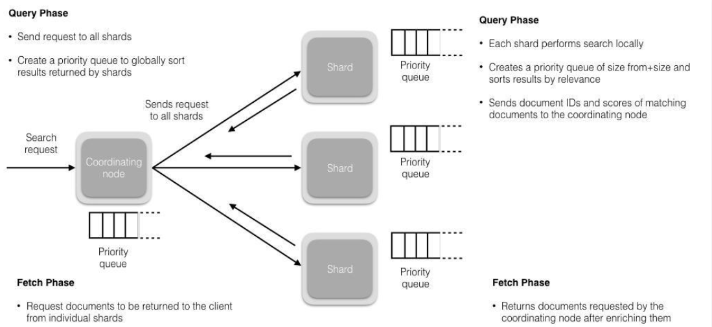

## ES全文检索原理

https://www.cxyxiaowu.com/17356.html

https://www.elastic.co/cn/blog/found-elasticsearch-from-the-bottom-up

- 内容爬取，停顿词过滤，比如一些无用的像"的"，“了”之类的语气词/连接词
- 内容分词，提取关键词
- 根据关键词建立**倒排索引**
- 用户输入关键词进行搜索

## 倒排索引

- 在ES中每个字段都是被索引的，所以不会像MySQL中那样需要对字段进行手动的建立索引。

  ES在建立索引的时候采用了一种叫做**倒排索引**的机制，保证每次在搜索关键词的时候能够快速定位到这个关键词所属的文档。

## ES数据迁移

https://www.infoq.cn/article/1afyz3b6hnhprrg12833

## 能不能取代Mysql？

- - ES没有事务。采用乐观锁，做不到acid事务
  - Join 连表复杂

- 

## 为什么ES快

- 倒排索引  关键词索引(使用FST优化) -->关键词字典--> Posting list(增量编码，压缩数据优化)
  - 增量编码：比如现在有id列表`[73, 300, 302, 332, 343, 372]`，转化成每一个id相对于前一个id的增量值（第一个id的前一个id默认是0，增量就是它自己）列表是`[73, 227, 2, 30, 11, 29]`。在这个新的列表里面，所有的id都是小于255的，所以每个id只需要**一个字节**存储。
- 水平扩展能力强
- 

## Posting List 压缩

https://zhuanlan.zhihu.com/p/137574234

## 脑裂

设置最少投票通过数量（discovery.zen.minimum_master_nodes）超过所有候选节点一半以上来解决脑裂问题

### 详细描述一下ES更新和删除文档的过程？

删除和更新也都是写操作，但是 Elasticsearch 中的文档是不可变的，因此不能被删除或者改动以展示其变更。

磁盘上的每个段都有一个相应的 .del 文件。当删除请求发送后，文档并没有真的被删除，而是在 .del 文件中被标记为删除。该文档依然能匹配查询，但是会在结果中被过滤掉。当段合并时，在 .del 文件中被标记为删除的文档将不会被写入新段。

在新的文档被创建时，Elasticsearch 会为该文档指定一个版本号，当执行更新时，旧版本的文档在 .del 文件中被标记为删除，新版本的文档被索引到一个新段。旧版本的文档依然能匹配查询，但是会在结果中被过滤掉。

### 7. 详细描述一下ES搜索的过程？

搜索被执行成一个两阶段过程，即 Query Then Fetch； Query阶段： 查询会广播到索引中每一个分片拷贝（主分片或者副本分片）。每个分片在本地执行搜索并构建一个匹配文档的大小为 from + size 的优先队列。PS：在搜索的时候是会查询Filesystem Cache的，但是有部分数据还在Memory Buffer，所以搜索是近实时的。 每个分片返回各自优先队列中 **所有文档的 ID 和排序值** 给协调节点，它合并这些值到自己的优先队列中来产生一个全局排序后的结果列表。 Fetch阶段： 协调节点辨别出哪些文档需要被取回并向相关的分片提交多个 GET 请求。每个分片加载并 丰富 文档，如果有需要的话，接着返回文档给协调节点。一旦所有的文档都被取回了，协调节点返回结果给客户端。

