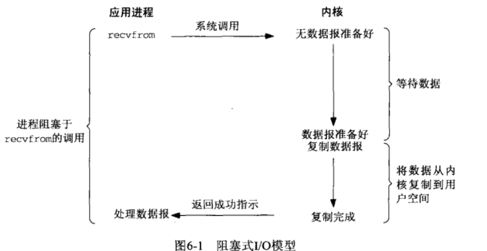
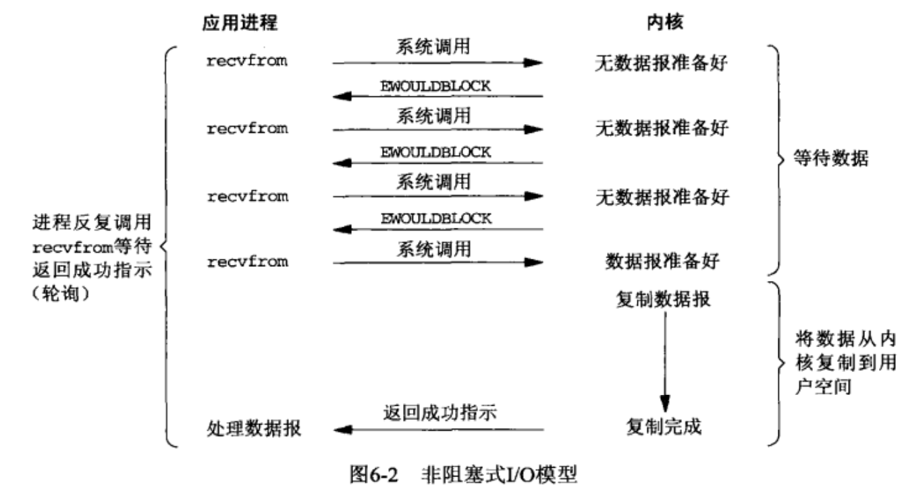
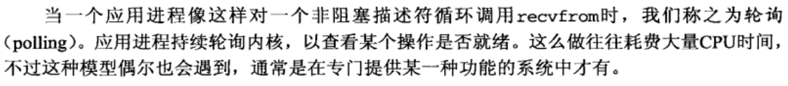
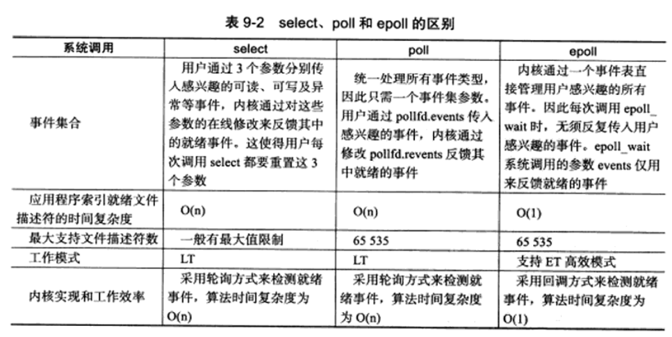
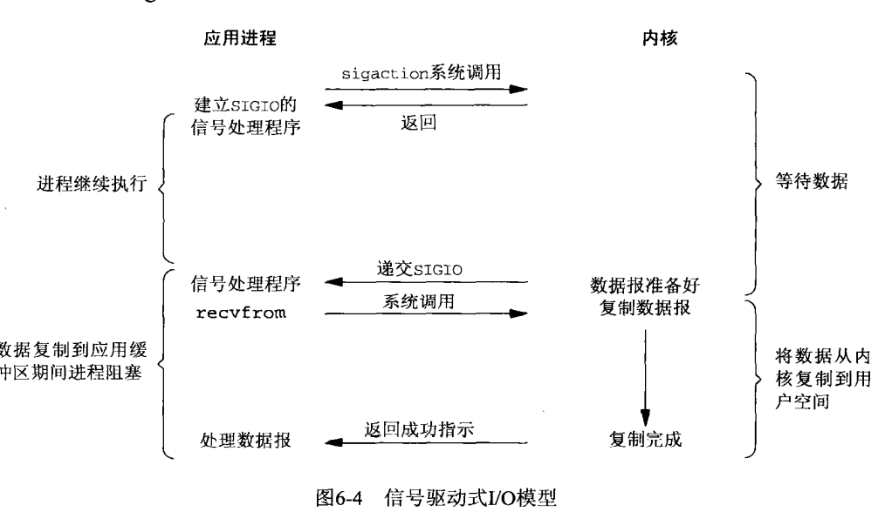
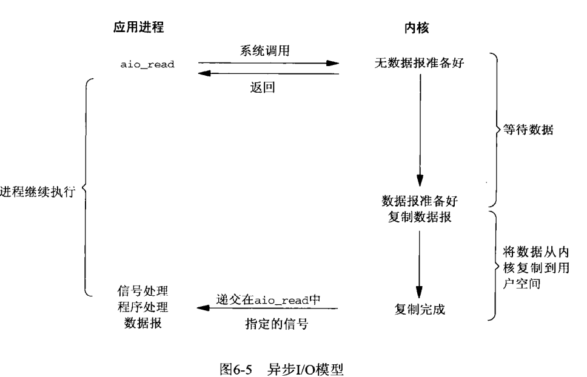

## 阻塞IO模型

应用进程在调用 系统调用之后直到调用返回都处于阻塞状态。

## 非阻塞IO模型

如果请求的IO操作非得应用进程投入睡眠才能完成时，应用进程不进入睡眠，而是返回一个错误。 注意： 轮询

## 多路复用IO

### select

调用select 时阻塞在select 上，而不是阻塞在IO系统调用上。select 同时监听多个文件描述符，使得一个进程可以处理多个网络连接（每个连接对应一个文件描述符FD）的IO。

slect调用时对FD进行线性遍历，而且有最大连接数为32个整数大小（32位机器:32*32）可以修改宏定义重新编译内核提升这一限制，但是性能不能保证

~~~c
int select (int n, fd_set *readfds, fd_set *writefds, fd_set *exceptfds, struct timeval *timeout);
~~~

### poll

本质与select没区别，基于链表存储fd，没有最大连接数限制。它将用户传入的数组拷贝到内核空间，然后查询每个fd对应的设备状态 。拷贝可能影响性能

### epoll

epoll在内核中维护事件表,使用epoll_ctl来添加删除修改事件。epollwait仅返回就绪事件，应用程序索引 就绪fd的时间复杂度是o(1)。具有ET和LT模式，ET边沿触发同一事件只触发一次，减少epoll事件重复触发的次数，提高了效率

### slect poll epoll 区别

## 信号驱动IO模型

1. 应用进程调用信号处理程序，这个调用将马上返回，进程不阻塞
2. 数据准备好时，内核产生SIGIO信号，发送信号给应用进程，应用进程调用recvfrom，进入阻塞状态，复制数据到缓冲区

## 异步IO模型

应用进程告知内核进行IO操作，并且在操作完成之后：也就是数据已经复制到用户空间后，发送信号告知应用进程操作完成。

## 各个IO模型优缺点以及应用场景

https://colearo.wordpress.com/2017/05/06/linux%E4%B8%8B%E4%B8%8D%E5%90%8C%E7%BD%91%E7%BB%9C%E6%A8%A1%E5%9E%8B%E4%BC%98%E5%8A%A3%E5%8F%8A%E5%BA%94%E7%94%A8%E5%9C%BA%E6%99%AF%E7%BB%BC%E8%BF%B0/

### 阻塞IO

优点：简单易用，程序容易编写。易于调试和到位错误。等待过程中占用很少系统资源。

缺点：处理大量套接字时，需要创建很多线程。而且因为阻塞IO在两个阶段（等待数据以及数据拷贝到用户空间）都等待，多线程开销很大。

场景：简单的C/S模型程序，易于调试，容易定位错误的程序

### 非阻塞IO

优点：不会阻塞在等待数据的阶段。适合数据量收发不均，等待时间随机性强的情况。

缺点：轮询消耗cpu资源，导致cpu占用率过高。

应用场景：只会在专门提供某一功能的特定系统中使用

### 多路复用IO

优点：能够等待多个描述符就绪。一个线程（进程）中就能监视多个文件描述符，系统的资源占用大大减少。

缺点：连接比较活跃的情况下，可能比阻塞IO效率低

应用场景：

- 当一个客户端需要同时处理多个文件描述符的输入输出时（即一般包含交互式输入和网络套接字），必须要用I/O才能获得正确效果。
- 当程序需要同时进行多个套接字的操作时
- 当一个TCP服务器要同时处理预监听的网络连接套接字和已经连接好的套接字时
- 当一个服务器同时使用TCP和UDP协议时
- 当一个服务器同时需要使用多种服务并且每种服务可能使用不同的协议时（比如端口监视守护进程inetd）

### 信号驱动IO

优点：在等待数据报到达期间进程不被阻塞，主循环可以继续执行

缺点：第二阶段依然会延迟在等待数据从内核空间复制到用户空间上

应用场景：典型的应用是NTP服务器，即Network Time Protocol网络时间服务器。因为对NTP来说记录收到数据包的具体时间很重要

- NTP 用于分布式服务器和客户端同步时钟
- 如下图，SIGIO程序（信号驱动IO模型里发送信号的程序）会记录数据包到达的时刻，给服务器使用

### 异步IO

优点：用户进程发起异步read后不会阻塞

缺点：代码复杂，调试难度大

应用场景：适合高并发服务器，处理大量的用户请求。

