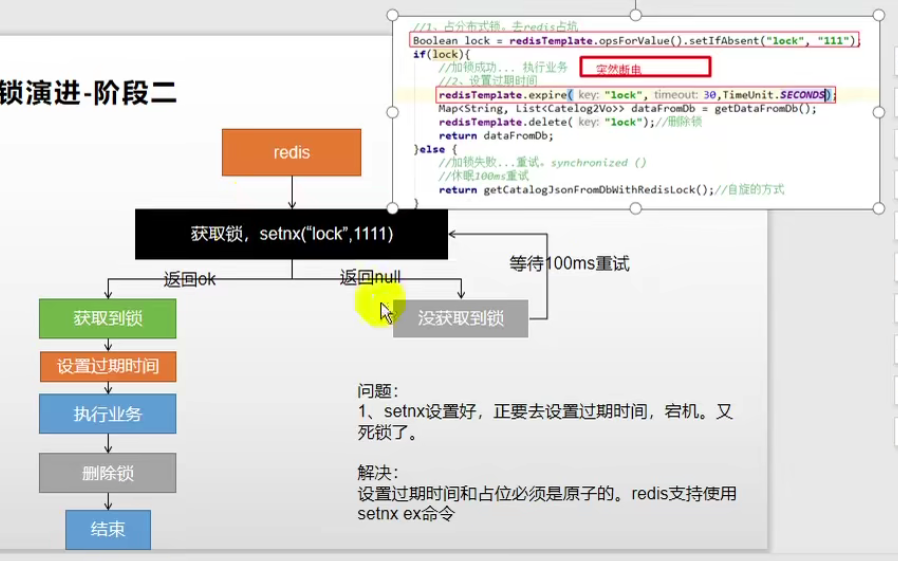
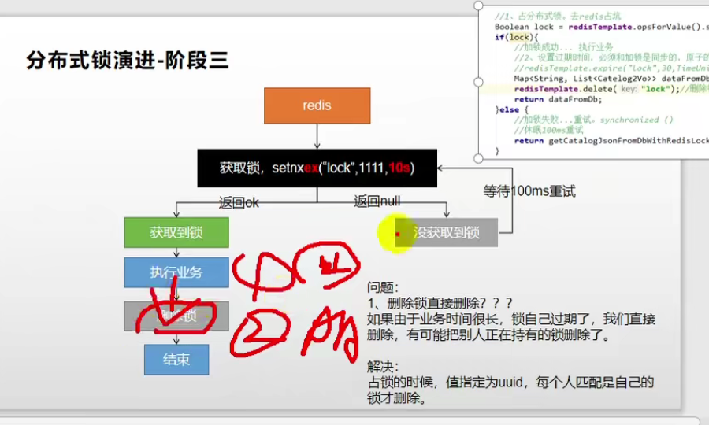
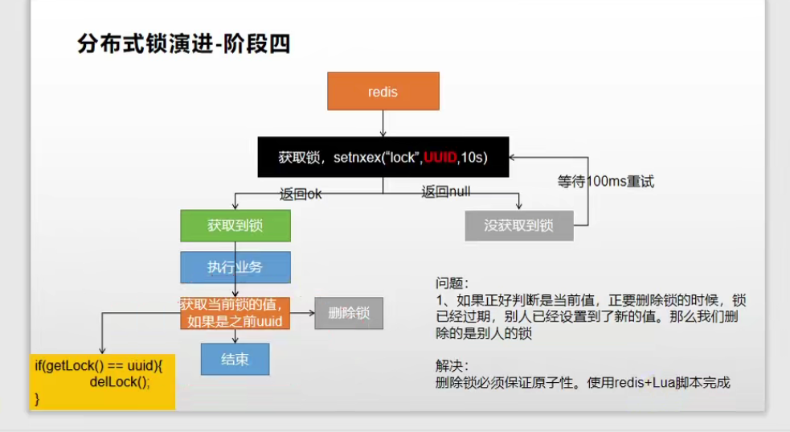
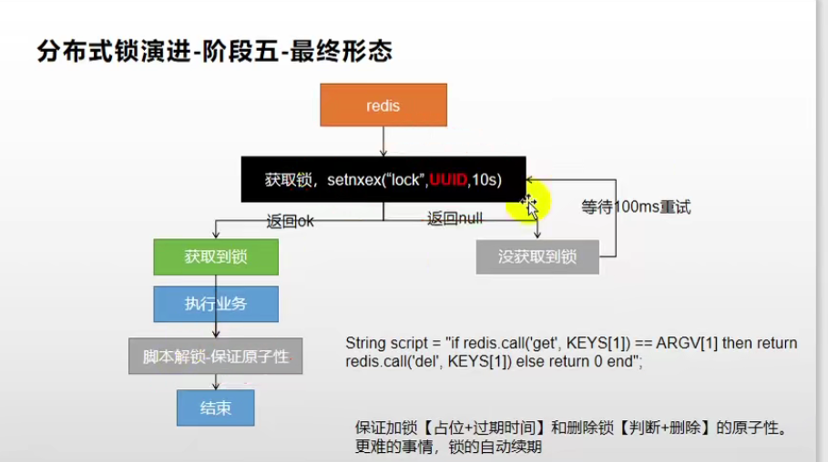

作者：interviewtop
链接：https://www.nowcoder.com/discuss/694741?type=all&order=recall&pos=&page=1&ncTraceId=&channel=-1&source_id=search_all_nctrack
来源：牛客网


## Redis单线程原理 

https://draveness.me/whys-the-design-redis-single-thread/

 首先必须明确，Redis单线程指的是服务端处理客户端网络请求 使用了一个线程（，其他模块仍用了多个线程。并不是一个线程完成了所有功能。原理上，其采用了利用epoll的多路复用特性，因此可以采用单线程处理其网络请求。 

## 为什么redis单线程

- 单线程不需要各种锁的性能消耗
- 节省线程切换的cpu消耗
- 

##  Redis数据类型 

 String：字符串类型，最简单的类型 Hash：类似于Map的一种结构。List：有序列表。Set:无序集合。ZSet：带权值的无序集合，即每个ZSet元素还另有一个数字代表权值，集合通过权值进行[排序]()。 

##  什么情况下使用[redis]() 

1.  针对热点数据进行缓存 
2.  对于特定限时数据的存放 
3.  针对带热点权值数据的[排序]()list 
4.  分布式锁 

##  [redis]()与memcache的区别 

1.  [redis]()处理网络请求采用单线程模型，而memcache采用多线程异步IO的方式 
2.  [redis]()支持数据持久化，memcache不支持 
3.  [redis]()支持的数据格式比memcache更多 

##  简述缓存穿透 

 缓存穿透指缓存和数据库均没有需要查询的数据，攻击者不断发送这种请求，使数据库压力过大。 

##  简述缓存穿透的解决方法 

1.  在数据库操作访问前进行校验，对不合法请求直接返回。 
2.  对于经常被访问的，并且数据库没有的键，缓存层记录键=null。 

##  简述缓存击穿 

 缓存击穿指缓存中没有数据，但数据库中有该数据。一般这种情况指特定数据的缓存时间到期，但由于并发用户访问该数据特别多，因此去数据库去取数据，引起数据库访问压力过大 

##  简述缓存穿透的解决方法 

1.  设置热点数据永远不过期。 
2.  对并发读数据设置并发锁，降低并发性 

##  简述缓存雪崩 

 缓存雪崩指缓存中一大批数据到过期时间，而从缓存中删除。但该批数据查询数据量巨大，查询全部走数据库，造成数据库压力过大。 

##  简述缓存雪崩的解决方法 

1.  缓存数据设置随机过期时间，防止同一时间大量数据过期。 
2.  设置热点数据永远不过期。 
3.  对于集群部署的情况，将热点数据均与分布在不同缓存中。 

##  Redis有哪些集群部署方式 

1.  主从复制 
2.  哨兵模式 
3.  Cluster集群模式 

##  简述主从复制模式 

 在主从复制中，有主库（Master）节点和从库（Slave）节点两个角色。从节点服务启动会连接主库，并向主库发送SYNC命令。 

 主节点收到同步命令，启动持久化工作，工作执行完成后，主节点将传送整个数据库文件到从库，从节点接收到数据库文件数据之后将数据进行加载。此后，主节点继续将所有已经收集到的修改命令，和新的修改命令依次传送给从节点，从节点依次执行，从而达到最终的数据同步。 

 通过这种方式，可以使写操作作用于主库，而读操作作用于从库，从而达到读写分离。 

##  简述哨兵模式 

 哨兵模式监控[redis]()集群中Master的工作的状态。在Master主服务器宕机时，从slave中选择新机器当作master，保证系统高可用。 

 每个哨兵每10秒向主服务器，slave和其他哨兵发送ping。 

 客户端通过哨兵，由哨兵提供可供服务的[redis]() master节点。 

 哨兵只需要配master节点，会自动寻找其对应的slave节点。 

 监控同一master节点的哨兵会自动互联，组成哨兵网络，当任一哨兵发现master连接不上，即开会投票，投票半数以上决定Master下线，并从slave节点中选取master节点。 

##  cluster集群 

 cluster提出了虚拟槽的概念。 

1.  [redis]() cluster默认有16384个槽，在集群搭建的时候，需要给节点分配哈希槽尽可能相同数量虚拟槽。 
2.  如果目前[redis]()执行set操作，[redis]()先对这个key经过CRC16 hash运算，并把结果对16384取余，得到槽编号。 
3.  根据槽编号，寻找到其对应的[redis]()节点，在节点上执行hash命令。 
4.  如果此时执行get操作，节点先验证该key对应的槽编号是不是归本节点管，如果是则保存数据。如果不是，则发送正确节点编号给客户端。 

## Cluster 内部通信协议 Gossip


## 集群脑裂问题

- https://cloud.tencent.com/developer/article/1344086
- https://www.jianshu.com/p/16db5e666e65

**解决方案**
redis的配置文件中，存在两个参数

```
min-slaves-to-write 3
min-slaves-max-lag 10
```

**第一个参数表示连接到master的最少slave数量**
**第二个参数表示slave连接到master的最大延迟时间**
按照上面的配置，要求至少3个slave节点，且数据复制和同步的延迟不能超过10秒，否则的话master就会拒绝写请求，配置了这两个参数之后，如果发生集群脑裂，原先的master节点接收到客户端的写入请求会拒绝，就可以减少数据同步之后的数据丢失。

注意：较新版本的redis.conf文件中的参数变成了

```
min-replicas-to-write 3
min-replicas-max-lag 10
```

redis中的异步复制情况下的数据丢失问题也能使用这两个参数

## Redis RDB与AOF

https://database.51cto.com/art/202110/686098.htm

##  简述Redis的RDB Redis Data Backup

RDB持久化会生成RDB文件，该文件是一个**压缩**过的**二进制文件**（相当于数据库快照），可以通过该文件还原快照时的数据库状态，即生成该RDB文件时的服务器数据。可以通过手动命令，也可以设置自动触发。 

##  简述Redis的save命令 

 save命令是[redis]()手动触发RDB过程的命令。使用该命令后，服务器阻塞，直到RDB过程完成后终止。该过程占用内存较多。 

##  简述Redis的bgsave命令 

 bgsave命令不阻塞主进程（严格意义上也不是完全不阻塞，详看下面过程），该命令fork一个子进程用于执行RDB过程。其具体过程为： 

1.  判断此时有没有子进程用于RDB，有的话直接返回。 
2.  [redis]()进行fork子进程过程，此时父进程处于阻塞状态。 
3.  子进程创建RDB文件，完成后返回给父进程 

##  简述Redis自动触发RDB机制 

1.  通过配置文件，设置一定时间后自动执行RDB 
2.  如采用主从复制过程，会自动执行RDB 
3.  Redis执行shutdown时，在未开启AOF后会执行RDB 

##  简述Redis的AOF  Append Only File

AOF 是 Redis 的一种持久化机制，它会在每次收到来自客户端的写请求时，将其记录到日志中，每次 Redis 服务器启动时都会重放 AOF 日志构建原始的数据集，保证数据的持久性。

##  简述AOF的持久化策略 （fsync 刷盘策略）

1.  always。每执行一次数据修改命令就将其命令写入到磁盘日志文件上。 
2.  everysec。每秒将命令写入到磁盘日志文件上。 
3.  no。不主动设置，由操作系统决定什么时候写入到磁盘日志文件上。 

##  简述AOF的重写 

 随着客户端不断进行操作，AOF对应的文件也越来越大。[redis]()提供了bgrewriteaof函数，针对目前数据库中数据，在不读取原有AOF文件的基础上，重写了一个新的AOF文件，减少文件大小。 

##  RDB与AOF优缺点比较 


## 分布式锁         

使用redis 中的键值对实现。

~~~shell
SET LOCK 1111 NX ## NX 代表数据库中没有 LOCK 这个key 才设置，这个操作是原子的
##上面的代码可能导致死锁
##应该设置过期时间
SET LOCK 1111 EX 30 NX  ##EX ：设置 30s 的过期时间
~~~









- 加锁阶段注意问题		
  - 获取锁，执行完查询之后要释放锁(删除锁)
  - 上锁时，key-value 的value 要用于区分锁拥有者
  - 获得锁之后要设置锁过期时间、防止因为服务器出错导致无法释放锁从而导致死锁
- 解锁（删除锁）注意问题
  - 检查当前拥有锁的人是不是自己
  - 解锁时，获取当前锁的值（这个值用于指明拥有锁的人）以及向redis服务器传输删除lock指令都涉及网络通信，会有延迟，破坏了原子性
  - 使用eval 命令 执行lua脚本 脚本解锁，保证删除锁和对比锁拥有人是原子的。类似CAS。
    - 脚本原子性如何实现：Redis只使用一个lua翻译器，因此每段脚本都是原子运行的。
- 锁的续期问题
  - 执行业务的时间过长，还没执行完业务，锁已经过期了。
  - 超时时间设置长一点。 

## 跳表和红黑树

两者类似，但是还是有区别

### 区别

- 范围查询： **按照区间来查找数据这个操作，红黑树的效率没有跳表高。对于按照区间查找数据这个操作，跳表可以做到 ○(㏒n) 的时间复杂度定位区间的起点，然后在原始链表中顺序往后遍历就可以了**。
- 平衡树的插入和删除操作可能引发子树的调整，逻辑复杂，而skiplist的插入和删除只需要修改相邻节点的指针，操作简单又快速。
- 从算法实现难度上来比较，skiplist比平衡树要简单得多。

## 为什么Redis用跳表不用红黑树

- **按照区间查找数据**：红黑树的效率低于跳表。跳表可以做到`O(logn)`定位区间的起点，然后在原始链表顺序往后遍历即可。
- 代码实现比红黑树好懂、好写多了，因为简单就代表可读性好，不易出错
- 跳表更灵活，可通过改变索引构建策略，有效平衡执行效率和内存消耗

