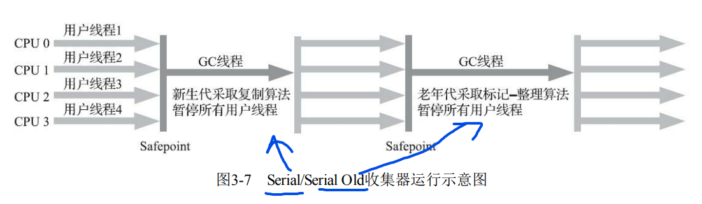

## **简述JVM内存模型**

线程私有的运行时数据区: 程序计数器、Java 虚拟机栈、本地方法栈。

线程共享的运行时数据区:Java 堆、方法区。

## **简述程序计数器**

程序计数器表示当前线程所执行的字节码的行号指示器。

程序计数器不会产生StackOverflowError和OutOfMemoryError。

## **简述虚拟机栈**

Java 虚拟机栈用来描述 Java 方法执行的内存模型。线程创建时就会分配一个栈空间，线程结束后栈空间被回收。

栈中元素用于支持虚拟机进行方法调用，每个方法在执行时都会创建一个栈帧存储方法的局部变量表、操作栈、动态链接和返回地址等信息。

虚拟机栈会产生两类异常：

StackOverflowError：线程请求的栈深度大于虚拟机允许的深度抛出。

OutOfMemoryError：如果 JVM 栈容量可以动态扩展，虚拟机栈占用内存超出抛出。

## **简述本地方法栈**

本地方法栈与虚拟机栈作用相似，不同的是虚拟机栈为虚拟机执行 Java 方法服务，本地方法栈为本地方法服务。可以将虚拟机栈看作普通的java函数对应的内存模型，本地方法栈看作由native关键词修饰的函数对应的内存模型。

本地方法栈会产生两类异常：

StackOverflowError：线程请求的栈深度大于虚拟机允许的深度抛出。

OutOfMemoryError：如果 JVM 栈容量可以动态扩展，虚拟机栈占用内存超出抛出。

## **简述JVM中的堆**

堆主要作用是存放对象实例，Java 里几乎所有对象实例都在堆分配内存，堆也是内存管理中最大的一块。Java的垃圾回收主要就是针对堆这一区域进行。 可通过 -Xms 和 -Xmx 设置堆的最小和最大容量。

堆会抛出 OutOfMemoryError异常。

## **简述方法区**

方法区用于存储被虚拟机加载的类信息、常量、静态变量等数据。

JDK6之前使用永久代实现方法区，容易内存溢出。JDK7 把放在永久代的字符串常量池、静态变量等移出，JDK8 中抛弃永久代，改用在本地内存中实现的元空间来实现方法区，把 JDK 7 中永久代内容移到元空间。

方法区会抛出 OutOfMemoryError异常。

## **简述运行时常量池**

运行时常量池存放常量池表，用于存放编译器生成的各种字面量与符号引用。一般除了保存 Class 文件中描述的符号引用外，还会把符号引用翻译的直接引用也存储在运行时常量池。除此之外，也会存放字符串基本类型。

## **简述直接内存**

直接内存也称为堆外内存，就是把内存对象分配在JVM堆外的内存区域。这部分内存不是虚拟机管理，而是由操作系统来管理。 Java通过通过DriectByteBuffer对其进行操作，避免了在 Java 堆和 Native堆来回复制数据。

## **简述java创建对象的过程**

1. 检查该指令的参数能否在常量池中定位到一个类的符号引用，并检查引用代表的类是否已被加载、解析和初始化，如果没有就先执行类加载。
2. 通过检查通过后虚拟机将为新生对象分配内存。
3. 完成内存分配后虚拟机将成员变量设为零值
4. 设置对象头，包括哈希码、GC 信息、锁信息、对象所属类的类元信息等。
5. 执行 init 方法，初始化成员变量，执行实例化代码块，调用类的构造方法，并把堆内对象的首地址赋值给引用变量。

## **简述JVM给对象分配内存的策略**

1. 指针碰撞： 这种方式在内存中放一个指针作为分界指示器将使用过的内存放在一边，空闲的放在另一边，通过指针挪动完成分配。
2. 空闲列表： 对于 Java 堆内存不规整的情况，虚拟机必须维护一个列表记录哪些内存可用，在分配时从列表中找到一块足够大的空间划分给对象并更新列表记录。

## **java对象内存分配是如何保证线程安全的**

1. 对分配内存空间采用CAS机制，配合失败重试的方式保证更新操作的原子性。该方式效率低。
2. 每个线程在Java堆中预先分配一小块内存，然后再给对象分配内存的时候，直接在自己这块"私有"内存中分配。一般采用这种策略。

## **简述对象的内存布局**

对象在堆内存的存储布局可分为对象头、实例数据和对齐填充。

对象头主要包含两部分数据： MarkWord、类型指针。MarkWord 用于存储哈希码（HashCode）、GC分代年龄、锁状态标志位、线程持有的锁、偏向线程ID等信息。 类型指针即对象指向他的类元数据指针，如果对象是一个 Java 数组，会有一块用于记录数组长度的数据，

实例数据存储代码中所定义的各种类型的字段信息。

对齐填充起占位作用。HotSpot 虚拟机要求对象的起始地址必须是8的整数倍，因此需要对齐填充。

## **如何判断对象是否是垃圾**

引用计数法：设置引用计数器，对象被引用计数器加 1，引用失效时计数器减 1，如果计数器为 0 则被标记为垃圾。会存在对象间循环引用的问题，一般不使用这种方法。

可达性分析：通过 GC Roots 的根对象作为起始节点，从这些节点开始，根据引用关系向下搜索，如果某个对象没有被搜到，则会被标记为垃圾。可作为 GC Roots 的对象包括虚拟机栈和本地方法栈中引用的对象、类静态属性引用的对象、常量引用的对象。

## **GC理论**

### **可达性分析算法 判断垃圾对象**

从GC Roots 的根对象出发，根据引用关系向下搜索，不可达的对象会被标记为可回收的对象

### **GC Roots 对象包括：**

- a.虚拟机栈、本地方法栈中引用的对象。
- b. 类静态属性引用对象
- c. 常量引用的对象
- d.Sychronized持有的对象
- e. 虚拟机内部引用.

### **强引用、软引用、弱引用、虚引用**

强引用：无论什么情况都不会回收强引用的对象
软引用：内存溢出时，会回收软引用对象
弱引用：下一层GC会被回收
虚引用：不会对对象的生存时间构成影响。结合引用队列使用，可以判断某个对象是否被回收（虚引用 关联一个引用队列

### **分代收集**，**为什么分代？**

弱分代假说：绝大多数对象朝生夕灭
强分代假说：熬过越多次垃圾收集过程的对象就越难以消亡。

### **分代收集原则**

收集器应该将Java堆划分出不同的区域，然后将回收对象依据其年龄（年龄即对象熬过垃圾收集过程的次数）分配到不同的区
域之中存储。

### **简述分代收集算法**

根据对象存活周期将内存划分为几块，不同块采用适当的收集算法。 一般将堆分为新生代和老年代，对这两块采用不同的算法。 新生代使用：标记复制算法

老年代使用：标记清除或者标记整理算法

### **跨代引用问题解决**

使用记忆集，记录非收集区指向收集区的指针集合。实现：卡表

### **简述java的引用类型**

强引用： 被强引用关联的对象不会被回收。一般采用 new 方法创建强引用。

软引用：被软引用关联的对象只有在内存不够的情况下才会被回收。一般采用 SoftReference 类来创建软引用。

弱引用：垃圾收集器碰到即回收，也就是说它只能存活到下一次垃圾回收发生之前。一般采用 WeakReference 类来创建弱引用。

虚引用： 无法通过该引用获取对象。唯一目的就是为了能在对象被回收时收到一个系统通知。虚引用必须与引用队列联合使用。

### **GC类型**

### **简述标记清除算法、标记整理算法和标记复制算法**

标记清除：标记存活的对象，之后统一回收未被标记的对象。这种方法效率不高，会产生大量不连续的碎片。

标记复制：将内存分为两块，每次只使用其中一块。标记存活的对象复制到另外一块内存，原先的内存块空间直接释放。实现简单高效，但是浪费空间。一般是结合 eden + 两块survivor （8 : 1 : 1）实现。只使用一块survivor。每次回收将eden 和survivor 中存活的对象复制到未使用的survivor中.(空间不够：老年代分配担保)

标记整理:将存活对象移向内存空间的一端，然后清除边界以外的内存空间。对象移动操作必须全程暂停用户应用程序，造成停顿。

## **垃圾收集器**

### **垃圾收集器布局图**

### **简述Serial/SerialOld垃圾收集器**

单线程串行收集器。垃圾回收的时候，必须暂停其他所有线程。Serial 复制新生代：使用标记复制算法，SerialOld负责老年代使用标记整理算法。

简单高效，额外内存消耗小。适合单核环境和运行在客户端模式的虚拟机（分配的内存小，GC停顿短）

### **简述ParNew垃圾收集器**

可以看作Serial垃圾收集器的多线程版本，同时使用多条线程进行垃圾收集。

### **简述Parallel Scavenge垃圾收集器**

与ParNew 相似。标记复制算法。使用多条线程进行垃圾收集。特点是能够通过参数精准控制吞吐量

### **ParallelOld垃圾收集器** 

Parallel Scavenge 的老年代版本，基于标记整理算法实现

### **如何解决并发标记问题  三色标记**

并发标记过程中，有的对象经过用户的操作标记状态改变了。解决： 增量更新（CMS）和原始快照（G1）

### **简述CMS垃圾收集器**

老年代收集器。CMS收集器是基于标记-清除算法实现的。以获取最短回收停顿时间为目标。运行过程包括：

1. 初始标记：标记GC Roots直接关联对象
2. 并发标记：继续遍历引用
3. 重新标记：修正并发标记期间，标记变动的对象
4. 并发清除：清除死亡对象

优缺点：并发收集、低停顿。但是 对处理器资源敏感，需要占用处理器资源。老年代要预留空间，因为用户和GC线程并行。产生空间碎片。

碎片解决：设置若干次FullGC后（可以为1次），进行碎片整理。碎片整理时不能并发，停顿变长

### **简述G1垃圾收集器**

G1 采用面向局部收集的设计思路和基于Region的内存布局形式。

把堆划分成多个大小相等的独立区域（Region），新生代和老年代不再物理隔离。通过引入 Region 的概念，从而将原来的一整块内存空间 划分成多个的小空间，使得每个小空间可以单独进行垃圾回收。G1整体来看是标记整理，从两个religion来看是标记复制

- 初始标记：标记与GC roots直接关联的对象。

- 并发标记：可达性分析。

- 最终标记，处理并发标记过程中标记变动的对象

- 筛选回收：对各个Region的回收价值和成本进行排序，然后根据用户所期望的GC停顿时间制定回收计划并回收。

优缺点：可以指定最大停顿时间，GC不产生碎片。内存占用高、额外执行负荷高。

## **常见内存分配策略**

-  对象优先在新生代 Eden 区分配，当 Eden 没有足够空间时将发起一次 Minor GC。

- 大对象直接进入老年代区分配。

- 长期存活的对象进入老年代。（15次gc、15岁进入老年）

- 动态对象年龄判定。年龄大于survivor中大多数的对象可以进入老年代。

- 空间分配担保。检查老年代空间是否大于新时代所有对象。标记复制时如果空间不够会借用老年代空间。

## **简述JVM类加载过程**

- 加载：

- 1. 通过全类名获取类的二进制字节流.
  2. 将类的静态存储结构转化为方法区的运行时数据结构。
  3. 在内存中生成类的Class对象，作为方法区数据的入口。

- 验证：对文件格式，元数据，字节码，符号引用等验证正确性。

- 准备：在方法区内为类变量分配内存并设置为0值。

- 解析：将符号引用转化为直接引用。

- 初始化：执行类构造器clinit方法，真正初始化。

## 类和类加载器

类 + 类加载器 决定了 两个类是否相同

比较两个类是否“相 等”，只有在这两个类是由同一个类加载器加载的前提下才有意义，否则，即使这两个类来源于同一个 Class文件，被同一个Java虚拟机加载，只要加载它们的类加载器不同，那这两个类就必定不相等。

## **简述JVM中的类加载器**

- BootstrapClassLoader启动类加载器：加载/lib下的jar包和类。C++编写。

- ExtensionClassLoader扩展类加载器： /lib/ext目录下的jar包和类。java编写。

- AppClassLoader应用类加载器，加载当前classPath下的jar包和类。java编写。

## **简述双亲委派机制**

一个类加载器收到类加载请求之后，首先判断当前类是否被加载过。已经被加载的类会直接返回，如果没有被加载，首先将类加载请求转发给父类加载器，一直转发到启动类加载器，只有当父类加载器无法完成时才尝试自己加载。

- 加载类顺序：BootstrapClassLoader->ExtensionClassLoader->AppClassLoader->CustomClassLoader 
- 检查类是否加载顺序： CustomClassLoader->AppClassLoader->ExtensionClassLoader->BootstrapClassLoader
- 

## **双亲委派机制的优点**

1. 避免类的重复加载。相同的类被不同的类加载器加载会产生不同的类，双亲委派保证了java程序的稳定运行。
2. 保证核心API不被修改。

## **如何破坏双亲委派机制**

重载loadClass()方法，即自定义类加载器。

## **如何构建自定义类加载器**

1. 新建自定义类继承自java.lang.ClassLoader
2. 重写findClass、loadClass、defineClass方法

## **JVM常见调优参数**

- -Xms 初始堆大小
- -Xmx 最大堆大小
- -XX:NewSize 年轻代大小
- -XX:MaxNewSize 年轻代最大值
- -XX:PermSize 永生代初始值
- -XX:MaxPermSize 永生代最大值
- -XX:NewRatio 新生代与老年代的比例