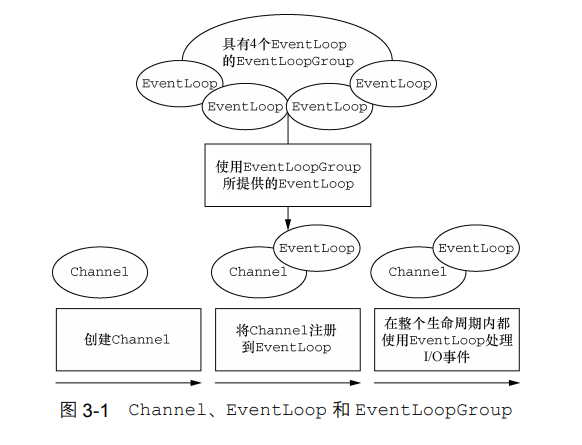
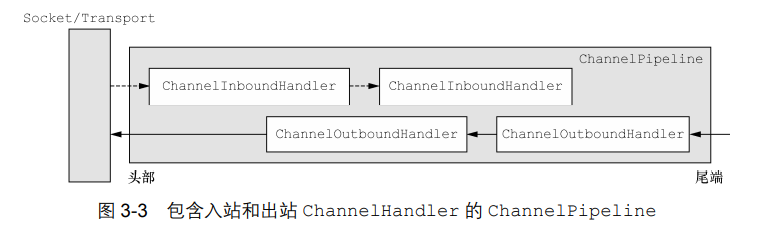
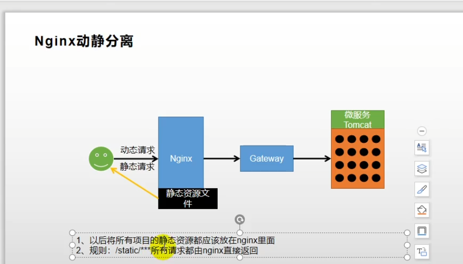
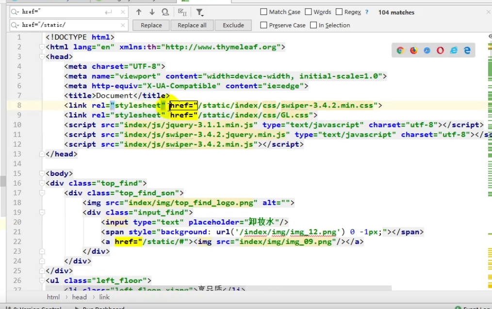
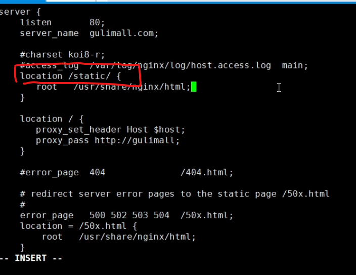
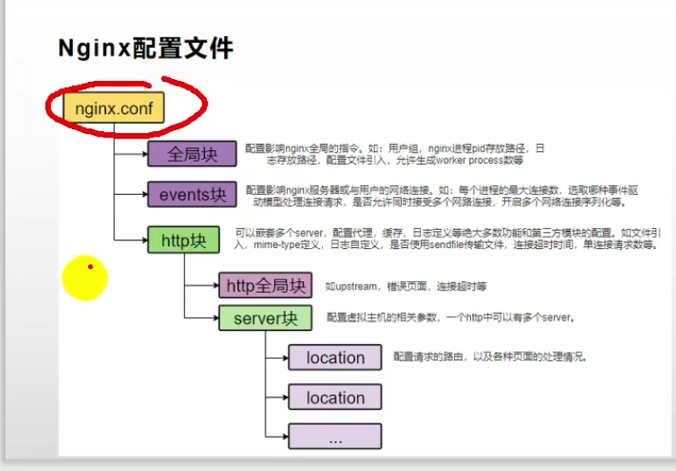
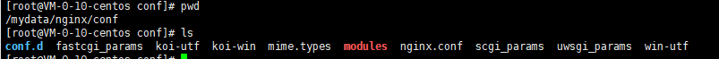
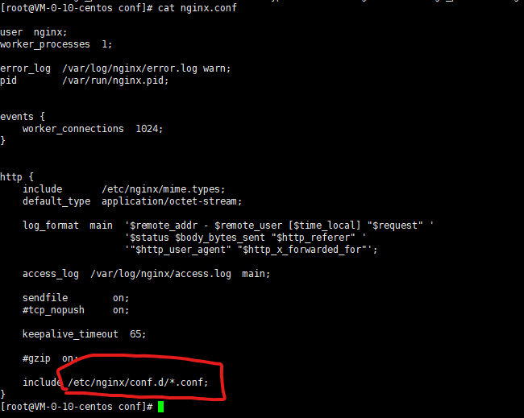
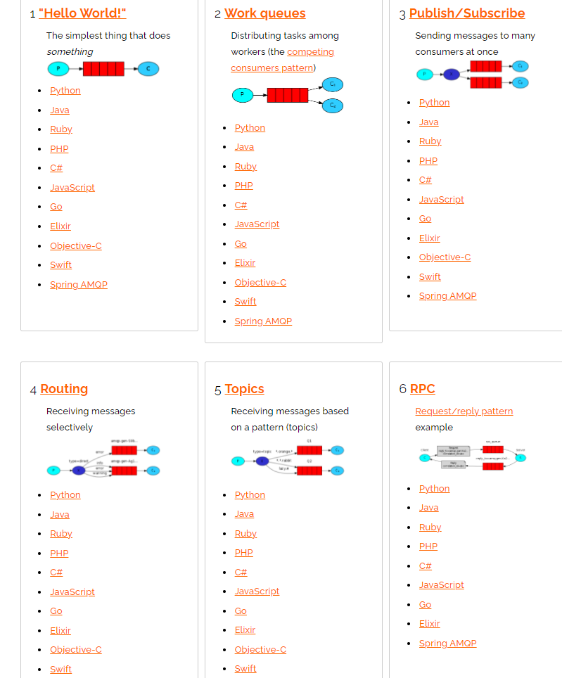
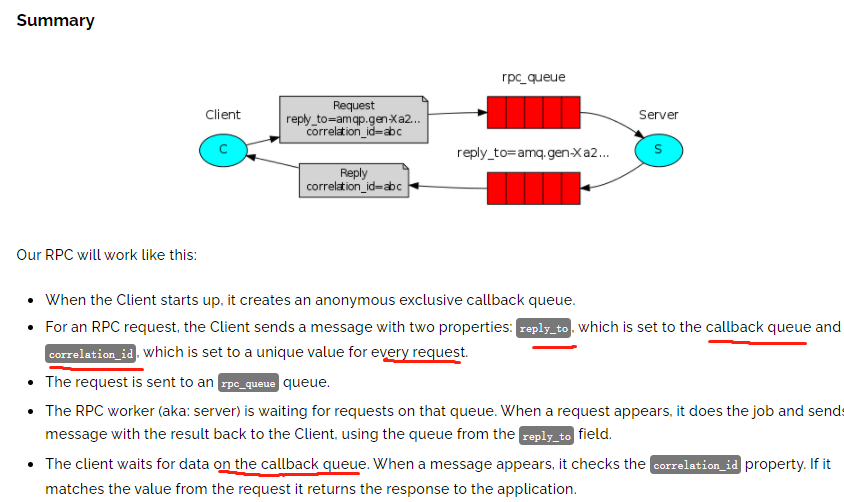

# OpenFeign

## 特点

- Feign 采用的是基于接口的注解

- Feign 整合了ribbon，具有负载均衡的能力（客户端负载均衡）

- 整合了Hystrix，具有熔断的能力

- feign  工作流程图

  

  1. Feign会通过Ribbon从服务注册中心获取目标微服务的服务器地址列表，之后在网络请求的过程中Ribbon就会将请求以负载均衡的方式打到微服务的不同实例上，从而实现服务发现及负载均衡。
  2. 调用方会针对被调用微服务设置调用超时时间，一旦超时就会进入熔断逻辑，而这个故障指标信息也会返回给Hystrix组件，Hystrix组件会根据熔断情况判断被调微服务的故障情况从而打开熔断器，

# Dubbo

## 负载均衡 

采用客户端负载均衡，Dubbo的负载均衡策略：Dubbo支持4种算法，随机、权重轮询、最少活跃调用数、一致性Hash策略。而且算法里面引入权重的概念。

Dubbo内置了4种负载均衡策略: https://dubbo.apache.org/zh/blog/2018/08/10/dubbo%E7%9A%84%E8%B4%9F%E8%BD%BD%E5%9D%87%E8%A1%A1/

1. RandomLoadBalance:随机负载均衡。随机的选择一个。是Dubbo的**默认**负载均衡策略。
2. RoundRobinLoadBalance:轮询负载均衡。轮询选择一个。
3. LeastActiveLoadBalance:最少活跃调用数，相同活跃数的随机。活跃数指调用前后计数差。使慢的 Provider 收到更少请求，因为越慢的 Provider 的调用前后计数差会越大。
4. ConsistentHashLoadBalance:一致性哈希负载均衡。相同参数的请求总是落在同一台机器上。

# Feign 和Dubbo对比

https://www.cnblogs.com/ying-z/p/14781757.html

- Dubbo除了注册中心需要进行整合，负载均衡、服务治理、容错机制等都自己实现了，而Feign大部分功能都是依赖全家桶的组件来实现的。
- SpringCloud全家桶里面（Feign、Ribbon、Hystrix），特点是非常方便。Ribbon、Hystrix、Feign在服务治理中，配合Spring Cloud做微服务，使用上有很多优势。
- 如果项目对性能要求不是很严格，可以选择使用Feign，它使用起来更方便。如果需要提高性能，避开基于Http方式的性能瓶颈，可以使用Dubbo。

# Netty

https://zhuanlan.zhihu.com/p/148726453

## 核心组件和架构

### 核心组件关系

-  Channel—对应连接
- EventLoop—控制流、多线程处理、并发。用于处理连接的生命周期中所发生的事件
- ChannelFuture—异步通知。

### Channel细分：ChannelHandler 和 ChannelPipeline

**ChannelHandler** 是消息的具体处理器。他负责处理读写操作、客户端连接等事情。

**ChannelPipeline** 为 **ChannelHandler** 的链，提供了一个容器并定义了用于沿着链传播入站和出站事件流的 API 。当 **Channel** 被创建时，它会被自动地分配到它专属的**ChannelPipeline**。

## EventloopGroup 了解么?和 EventLoop 啥关系?

EventLoopGroup 包含多个 EventLoop（每一个 EventLoop 通常内部包含一个线程）

上图是一个服务端对 EventLoopGroup 使用的大致模块图，其中 Boss EventloopGroup 用于接收连接，Worker EventloopGroup 用于具体的处理

## 心跳机制

由于TCP自带心跳不够灵活，因此netty在应用层实现心跳。

在Netty中提供了IdleStateHandler类来进行心跳的处理，它可以对一个 Channel 的 读/写设置定时器, 当 Channel 在一定事件间隔内没有数据交互时(即处于 idle 状态), 就会触发指定的事件。

**心跳实现策略：**

1. Client启动一个定时器，不断发送心跳；
2. Server收到心跳后，做出回应；
3. Server启动一个定时器，判断Client是否存在，这里做判断有两种方法：时间差和简单标识。

**时间差：**

1. 收到一个心跳包之后记录当前时间；
2. 判断定时器到达时间，计算多久没收到心跳时间=当前时间-上次收到心跳时间。如果改时间大于设定值则认为超时。

**简单标识：**

1. 收到心跳后设置连接标识为true;
2. 判断定时器到达时间，如果未收到心跳则设置连接标识为false;

# Nginx

## 动静分离

将静态资源放在nginx，静态请求nginx直接返回，动态请求才交给路由

#### 实现

html中对静态资源的请求加上static 前缀

修改nginx 配置文件 在sever块里加上location 为 static 的配置

## 域名和负载均衡

### Nginx反向代理 （类似网关）

目录结构

其中server块的配置单独拆出来做为配置文件.Server 块配置文件位置在http块的include 指定

# RabbtMQ

## 基本架构和组件

**先看下rabbitqmq的基本架构**

**可以看到rabbitmq包含这几个组件**

1. 生产者 producer
2. 消费者 consumer
3. broker 该消息队列进程 就代表这个消息队列 broker里面包含了重要的2个组件
4. 一个是交换机：Exchange
5. 一个是队列：Queue

## 工作模式

1. simple  就是普通队列

   

2. woker 抢夺资源

   

   消息产生者将消息放入队列消费者可以有多个,消费者1,消费者2,同时监听同一个队列,消息被消费?C1 C2共同争抢当前的消息队列内容

3. publish/subscribe 通过exchange共享

   

   ,交换机发布订阅把消息发送到所有消息队列中,对应消息队列的消费者拿到消息进行消费

4. Routing 

   

   exchange 根据路由将消息发送到匹配的队列

5. Topic

   

   exchange路由的规则可以有 * 通配符，匹配多条规则

6. RPC

   

   - 当客户端启动后，它会创建一个异步的独特的回调队列。对于一个RPC请求，客户端将会发送一个配置了两个属性的消息：一个是`replyTo`属性，设置为这个回调队列；另一个是`correlation id`属性，每一个请求都会设置为一个具有唯一性的值。这个请求将会发送到`rpc_queue`队列。

     RPC工作者（即图中的`server`）将会等待`rpc_queue`队列的请求。当有请求到来时，它就会开始干活（计算斐波那契数）并将结果通过发送消息来返回，该返回消息发送到`replyTo`指定的队列。

     

     客户端将等待回调队列返回数据。当返回的消息到达时，它将检查`correlation id`属性。如果该属性值和请求匹配，就将响应返回给程序

# Kafka

## kafka高吞吐原因

1. 顺序读写 

2.  零拷贝（类似netty 使用零拷贝）

3.  Page Cache 利用page cache 操作系统自身的内存而不是jvm的内存。

   避免GC问题

4.  分区分段 + 索引 

- 一句话，Kafka的Message存储采用了分区(partition)，分段(LogSegment)和稀疏索引这几个手段来达到了高效性。

5. 批量读写
   1.  等消息条数到固定条数
   2. 一段时间发送一次

6. 批量压缩 

   ​	gzip snappy

# MQ对比

# 一致性Hash

https://segmentfault.com/a/1190000021199728

哈希环和虚拟节点

# Spring

## AOP实现原理：动态代理

两种动态代理：

1. JDK动态代理，只能代理实现了某个接口G的类，使用组件：
   1. InvocationHandler 接口，invoke方法就是代理方法。
   2. Proxy类，这个类的newProxyInstance()方法用于生成代理对象。代理对象实现原来那个类的接口G。代理对象调用这些方法时，底层将通过反射，调用我们实现的`invoke`方法。

1. CGLib 动态代理 操作字节码生成类的子类，重写方法完成代理。

## JDK代理与CGLib代理对比

| 类别  | 优点                                                         | 缺点                                                         |
| ----- | ------------------------------------------------------------ | ------------------------------------------------------------ |
| JDK   | 1.不需要依赖 2 . 代理类生成速度快                       | 1.被代理的类必须实现接口 2.无法代理接口没有定义的方法。 3.执行代理方法时使用反射，效率低。 |
| CGLib | 1.被代理类不需要实现接口 2.可以代理所有方法 3. 代理方法执行快 | 1.final类无法代理，因为无法生成子类 2.无法代理final private方法，因为子类无法重写这些方法 3.代理类生成慢 |

## Spring AOP问题

Spring AOP内部调用失效问题 https://www.cnblogs.com/jvStarBlog/p/11130233.html

# 设计模式

## 常见的设计模式及应用场景

## 设计模式五大原则

