# Mysql

## MySql架构

- 客户端
- server层
- 存储引擎层
- 物理层，文件系统

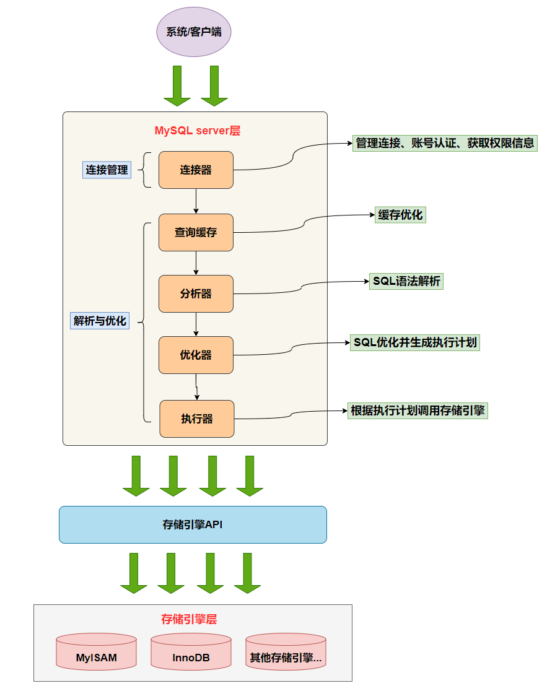

## Sql优化

### 慢查询 慢sql优化

https://www.cnblogs.com/zjfjava/p/12257772.html

1. 开启慢查询日志，设置超过几秒为慢SQL，抓取慢SQL
2. 通过explain对慢SQL分析（重点）

   https://www.cnblogs.com/zjxiang/p/9160564.html
3. show profile查询SQL在Mysql服务器里的执行细节和生命周期情况（重点）
4. 对数据库服务器的参数调优

### limit分页优化

Mysql分页原理：limit 10000,20的意思扫描满足条件的10020行，扔掉前面的10000行，返回最后的20行

## explain


- id：标识select 查询的id
- select_type 查询类型：
  - SUBQUERY:子查询
  - DERIVED：派生表查询
  - UNION :UNION 查询
  - UNION RESULT：select  查询类型是union的临时表结果
- type
  - All:全表扫描
  - index: 索引扫描，即按索引次序全表扫描，类似全表扫描
  - range: 有范围限制的索引扫描
  - ref： 索引查找。使用非唯一索引或者唯一索引的非唯一前缀（可能返回多个匹配值）
  - eq_ref：使用主键或者唯一索引 （只返回一条符合条件的记录
  - const,system: 查询可以优化成常量
  - NULL:
- EXTRA:
  - Using Index: 覆盖索引
  - Using where: 使用索引 回表查询
  - Using Temporary:使用临时表
  - Using Filesort: 使用外部索引排序
  - Range check..不重要

## 重构查询方法

## 引擎

#### 种类

- InnoDB
- MyISAM
- Memory
- Archive
- BDB
  - 支持事务的有：InnoDB 和BDB

## 三大范式

- ### 第一范式：每一列都不可再分
- ### 第二范式：每一个表都只描述一个事情（非码属性完全依赖于任何一个候选码）

  - 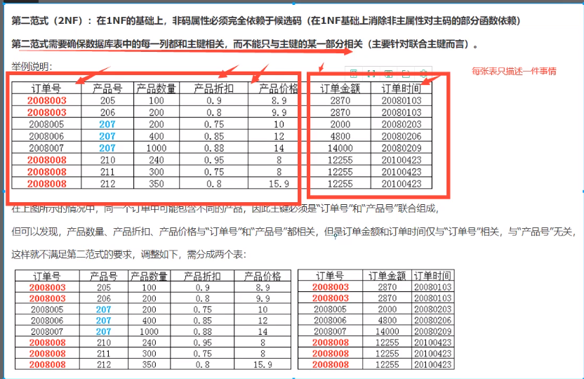
- ### 第三范式：每一列与数据与主键直接相关，不能存在间接相关。

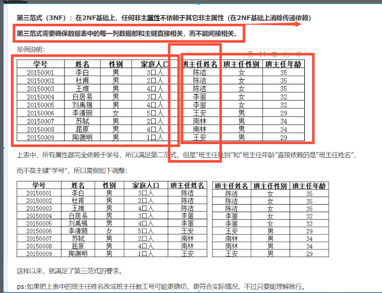

#### 三大范式规范性和性能问题

关联查询的表不得超过三张表

- 考虑商业化的需求（成本和用户体验），数据库的性能更加重要。
- 在规范性和性能之间找平衡点
- 故意增加冗余字段，使得多表查询变为单表查询，提高性能
- 增加计算列（count(..)计算某一列总和）

## 索引

https://blog.csdn.net/zgrgfr/article/details/74455547

- ## 索引是一种用于快速查询、检索数据的数据结构（一般用B树，B+树，Hash实现。）
- 优点：加快查询
- 缺点：冗余空间，创建和维护索引需要耗费时间

### 索引类型：B-Tree 索引、Hash索引、R-Tree索引（地理数据）、全文索引

### 索引结构：B 树、B+树  、 Hash索引、全文索引full - text

### B树 和 B + 树 比较

- ### B 树的所有节点既存放 键(key) 也存放 数据(data);而 B+树只有叶子节点存放 key 和 data，其他内节点只存放 key。
- ### B 树的叶子节点都是独立的;B+树的叶子节点有一条引用链指向与它相邻的叶子节点。
- ### B 树的检索的过程相当于对范围内的每个节点的关键字做二分查找，可能还没有到达叶子节点，检索就结束了。而 B+树的检索效率就很稳定了，任何查找都是从根节点到叶子节点的过程，叶子节点的顺序检索很明显。

### 建立索引原则

1. 最左前缀匹配原则。mysql会一直向右匹配直到遇到范围查询(>、<、between、like)就停止匹配，比如a = 1 and b = 2 and c > 3 and d = 4 如果建立(a,b,c,d)顺序的索引，d是用不到索引的，如果建立(a,b,d,c)的索引则都可以用到，a,b,d的顺序可以任意调整。
2. 选择区分度高的做为索引
3. 索引列不能参与运算

### B-Tree索引

#### 结构特点

索引结构是一棵查找树。每一个叶节点到根的距离相同。对索引列顺序组织存储，方便范围查询。（某个结点左儿子都是比他小的）

- 如果叶节点储存数据：B+tree
- 如果储存数据地址：B-Tree
- 结合内存段页式存储理解下图：
- 

#### 索引顺序 与 最左前缀匹配

最左前缀匹配：从索引最左边的列开始匹配。

```SQL
CREATE TABLE PEOPLE{
	LAST_NAME VARCHAR(50) NOT NULL,
	FIRST_NAME VARCHAR(50) NOT NULL,
	DOB DATE NOT NULL,
	KEY(LAST_NAME, FIRST_NAME,DOB)
	##索引顺序：LAST_NAME,FIRSTNAME,DOB
	##排序顺序和索引顺序相同。先排LAST_NAME 再排FIRST_NAME,  DOB
	##图中两个满足相同 按照出生日期排序
	##上述规则 叫做最左前缀匹配原则
}
```


#### 适用查询类型

B-Tree索引适合全键值、键值范围或键前缀查找。键前缀匹配只适用于最左前缀匹配。

1. 全值匹配
2. 匹配最左前缀
   - 只使用索引第一列
3. 匹配列前缀
   - 匹配某一列开头部分
4. 匹配范围值
5. 在精准匹配 基础上 范围匹配
   - 如： 精准匹配第一列并范围匹配第二列
6. 只访问索引

#### B-Tree限制

1. 不按照索引最左列开始查找则无法使用索引
2. 不能跳过索引中间列
3. 查询中使用某个列进行范围匹配，则右边所有列都无法使用索引优化查询。

### Hash索引

#### 结构特点

由hash值和行指针组成。hash值按照从小带大排列好。但是hash值对应原来的索引列的值是无序的。所以hash索引不按照索引顺序存储，范围查询困难。


#### 使用查询类型

精准匹配

### 索引优点

1. 减少扫描数据量
2. 避免排序和临时表
3. 随机I/O变为顺序I/O

### 高效索引策略

#### 索引列独立使用

索引列不能是表达式的一部分，不能是函数的参数

#### 前缀索引和索引选择性

- 索引选择性：基数 /  记录总数 。 代表每个索引能决定的数据范围精确程度，基数是不重复的索引值。
- 前缀的长度要足够长以保证较高的选择性。但是不能太长，否则索引空间会很大。
- 计算不同长度前缀的选择性和完整列选择性

  
- 注意：前缀分布可能不均匀，前面几位即使选择性高也可能效果不好。

#### 索引列顺序

将选择性最高的列放在前面通常是很好的（不考虑排序和分组时）。

#### 聚簇索引

在同一结构中保持B-Tree索引和数据行

##### 优点：

1. 相关数据存放在一起，减少I/O次数。
2. 加快数据访问

##### 缺点：

1. 更新聚簇索引代价高
2. 二级索引需要两次索引查找，二级索引空间可能很大。
3. 插入速度依赖于插入顺序。如果插入顺序不按主键顺序，需要OPTIMIZE TABLE整理表
4. 插入行到已满页中时，可能导致“页分裂”问题

#### 覆盖索引

覆盖索引:包含所有需要查询的字段值。

##### 优点：

1. 索引条目少
2. 减少I/O
3. 避免二级索引二次查询

##### 使用索引扫描 排序

##### 索引和锁

InnoDB只有在访问行时才对其加锁，索引能减少访问的行数，从而减少锁的数量。

### 索引使用

1. 匹配全值
2. 匹配值的范围查询
3. 匹配最左前缀
4. 覆盖索引
5. 匹配列前缀，仅仅使用索引第一列
6. 索引部分精确其他部分范围匹配

## 锁和事务

事务：多条SQL语句组成整体，要么做要么不做。

事务的隔离性由锁实现，原子性，一致性和持久性由redo_log 和undo_log 实现

### Mysql 锁的类型

- 事务的角度：行级锁、表级锁、意向锁

  - 行级锁类型：共享锁S、排他锁X
  - 意向锁：InnoDB只有表级意向锁 IS、IX
  - 表级意向锁和行级锁兼容情况

    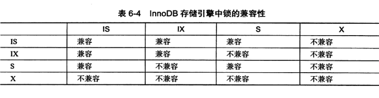
- 线程的角度：读写锁、互斥量mutex

### 行级锁三种算法：Record Lock、Gap lock 、Next Lock

- Record Lock: 单个行记录上的锁
- Gap Lock: 间隙锁,锁定一个范围但不包含记录本身 前开后开区间: （1，2）
- Next Lock: Gap Lock + Record Lock  锁定记录本身以及一个范围   用于解决幻读 前开右闭区间:（1，2]

  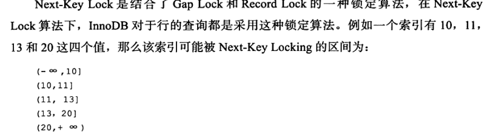

### Next key Lock 范围

假设表table

|         |           |
| ------- | --------- |
| pri_key | index_key |
| 1       | 2         |
| 2       | 3         |
| 3       | 4         |
| 6       | 7         |
| 9       | 8         |
| 11      | 12        |
| 17      | 23        |

1. 对于主键索引来说next-lock锁定范围

   如Sql 语句 ： select * from table where pri_key = 6 for update; 这句话是使用nextkey Lock 锁定 主键pri_key = 6的范围 ： (3, 6]
2. 对于辅助索引（非主键索引），next key Lock 同时包含主键

   select * from table where index_key = 7 for update; 锁定范围 格式 (pri_key > 3, index_key = 4) : (>3, 4) ~(< 9, 8)；

   - 为什么index_key = 7 前后的间隙都锁？  因为index_key 可能有重复（而主键并不会有重复值）所以要都锁住，否则解决不了幻读问题。

     例如：上述例子插入 （7，7），如果不锁下面那一行就会出现幻读

     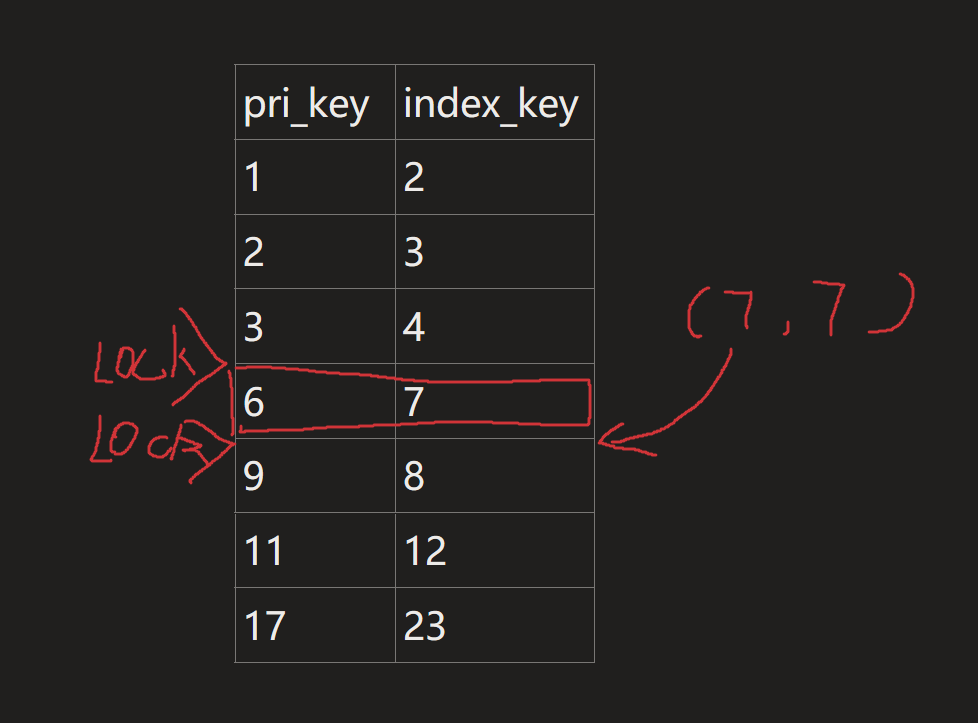

   另外一个例子：

   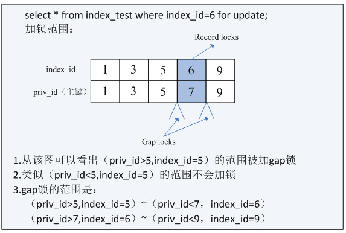

### MVCC ： 实现高并发

快照数据是指改行之前版本的数据，通过undo段实现。一个行记录可能有多个快照，即多版本技术。由此带来的并发控制叫做多版本并发控制MVCC。

- MVCC隔离等级：READ COMMITED 和 REPEATABLE READ

#### 一致性非锁定读

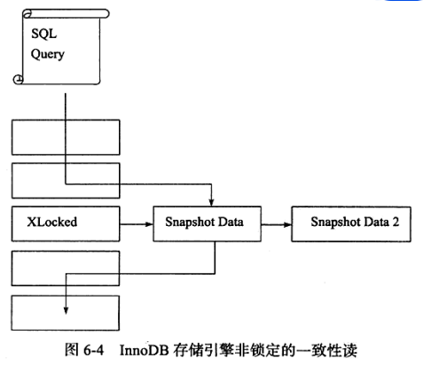

对于一致性非锁定读，在不同隔离等级下:

- READ COMMITED 时：读取最新版本的快照
- REPEATABLE READ 时: 读取事务开始时的快照

### 事务性质ACID

- Atomic 原子性
- Consistence 一致性
- Isolation 隔离性
- Durability 持久性

**隔离性由锁实现。原子性、一致性、持久性通过redo_log 和undo_log实现**

### 多事务执行可能出现问题

- 丢失修改 (结合封锁协议可以解决：一级、二级、三级封锁协议)
- 脏读：读到其他事务未提交的数据
- 不可重复读：同一事务，连续两次执行同样的SQL，第二次返回结果不一样
- 幻读：同一事务，连续两次执行同样的SQL，第二次返回结果出现之前没有的行 或者 之前有的行消失
  - 不用将幻读和不可重复读区分的那么清楚，MySql官方文档将不可重复读定义为幻读问题
  - 不可重复读：对同一数据修改，导致结果不同
  - 幻读：新增或者删除数据，导致查询得到数据变多/少

### 事务隔离等级

- READ-UNCOMMITED 读未提交
- READ-COMMITED 读已提交
- REPEATABLE-READ 可重复读
- SERIALIZABLE 可串行化

| 隔离级别 | 脏读   | 不可重复读 | 幻读   |
| -------- | ------ | ---------- | ------ |
| 未提交读 | 允许   | 允许       | 允许   |
| 提交读   | 不允许 | 允许       | 允许   |
| 可重复读 | 不允许 | 不允许     | 允许   |
| 串行化   | 不允许 | 不允许     | 不允许 |

### Mysql默认可重复读的原因

- 原因：
  - https://dominicpoi.com/2019/06/16/MySQL-1/
  - https://blog.csdn.net/zhangyingjie09/article/details/103484181
- binglog格式:https://www.cnblogs.com/youzhibing/p/13131485.html

历史原因，之前Mysql没有ROW格式的binlog，可能出现主从复制数据不一致的情况，RR可以（间隙锁）保障主从一致。

### 设置隔离级别的命令

SET SESSION/GLOBAL TRANSACTION ISOLATION LEVEL [READ COMMITED / REPEATABLE READ ]

### 隔离级别实现方式

https://segmentfault.com/a/1190000025156465

| 事务隔离级别   | 实现方式                                                                                                                                                                                                                                                                                                  |
| -------------- | --------------------------------------------------------------------------------------------------------------------------------------------------------------------------------------------------------------------------------------------------------------------------------------------------------- |
| 未提交读（RU） | 事务对当前被读取的数据不加锁，都是**当前读**；  事务在更新某数据的瞬间（就是发生更新的瞬间），必须先对其加**行级共享锁**，直到事务结束才释放。                                                                                                                                                |
| 提交读（RC）   | 事务对当前被读取的数据不加锁，且是**快照读**；  事务在更新某数据的瞬间（就是发生更新的瞬间），必须先对其加**行级排他锁（Record）**，直到事务结束才释放。                                                                                                                                      |
| 可重复读（RR） | 事务对当前被读取的数据不加锁，且是**快照读**；  事务在更新某数据的瞬间（就是发生更新的瞬间），必须先对其加**行级排他锁（Record，GAP，Next-Key）**，直到事务结束才释放。  **通过间隙锁，在这个级别MySQL就解决了幻读的问题**  **通过快照，在这个级别MySQL就解决了不可重复读的问题** |
| 序列化读（S）  | 事务在读取数据时，必须先对其加**表级共享锁** ，直到事务结束才释放，都是**当前读**；  事务在更新数据时，必须先对其加**表级排他锁** ，直到事务结束才释放。                                                                                                                                |

## 日志

### 日志的作用：实现事务

事务的隔离性由锁实现，原子性，一致性和持久性由redo_log 和undo_log 实现

### 日志类型

1. 错误日志 err_log
2. 查询日志 general_log
3. 慢查询日志 slow_query_log
4. 事务日志    包含重做日志和回滚日志 redo_log  undo_log 引擎：InnoDB。
   - redo_log 实现原子性和持久性
   - undo_log实现一致性
5. 二进制日志 bin_log

### redo_log 和redo_log_buffer

https://javaguide.cn/database/mysql/mysql-logs.html#redo-log

##### redo_log工作流程

redo_log用于记录更新信息。

更新的时候会直接更新缓冲池中的数据（Buffer Pool ）。redo_log_buffer 是redo_log的缓冲池。redo_log_buffer 存储在内存中。redo_log存储在硬盘中

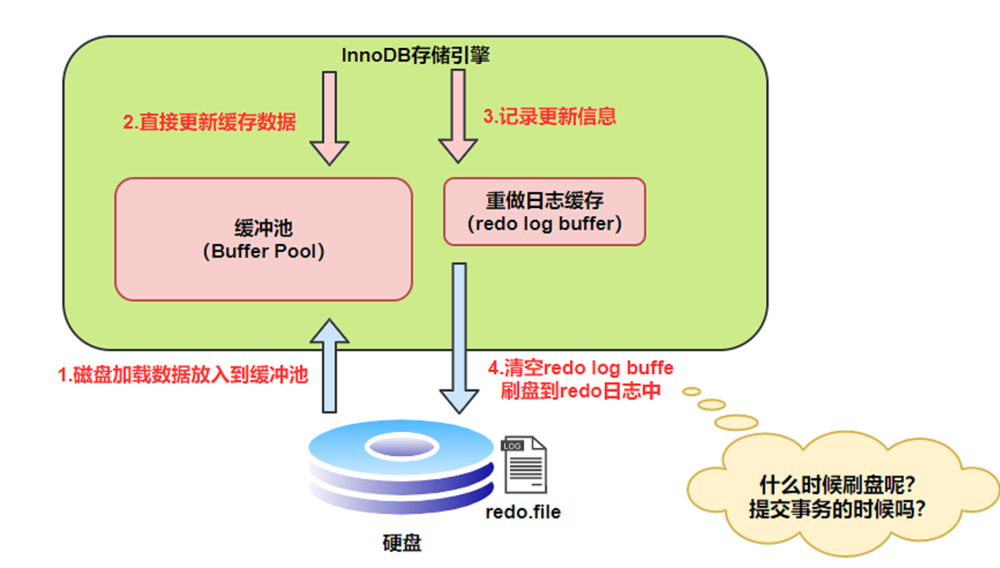

##### 刷盘策略

`InnoDB` 存储引擎为 `redo log` 的刷盘策略提供了 `innodb_flush_log_at_trx_commit` 参数，它支持三种策略：

- **0** ：设置为 0 的时候，表示每次事务提交时不进行刷盘操作，刷盘由master Thread 每1s执行一次
- **1** ：设置为 1 的时候，表示每次事务提交时都将进行刷盘操作（默认值）
- **2** ：设置为 2 的时候，表示每次事务提交时都只把 redo log buffer 内容写入 page cache

##### Redo_log_buffer 和page cache 关系

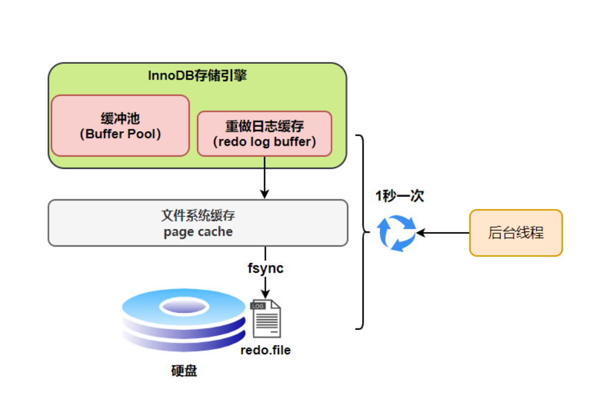

##### 日志文件组

redo_log 由一组文件组成。组里面的文件轮流写入。这些文件组成了一个类似循环队列的结构

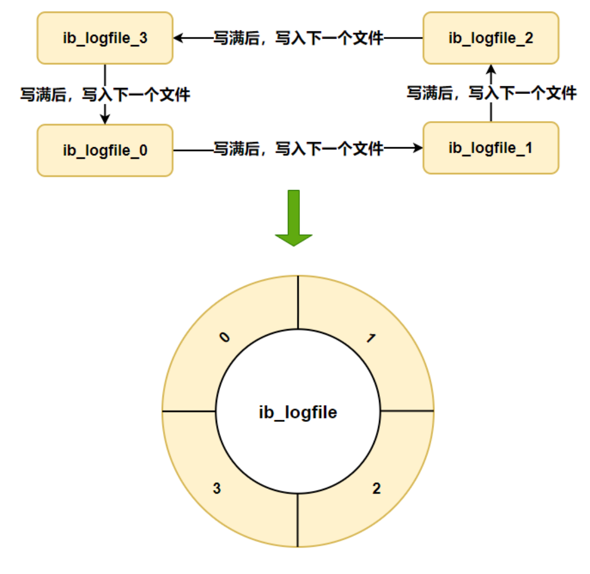

##### CheckPoint机制

checkPoint 类似与循环队列的队头，指示 日志读取的开始位置


### bin_log

#### 作用：PIT 恢复和主从复制

#### bin_log和redo_log 对比:

- bin_log是逻辑日志属于Mysql Server 层。记录了对MySql数据的所有更改操作。实现MySql集群架构的数据一致性
- redo_log 是物理日志  redo_log记录对某个数据页的修改。实现innodb引擎的崩溃恢复

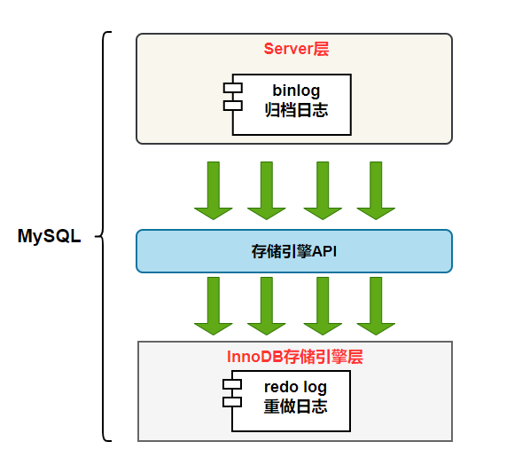

#### binlog格式

https://www.cnblogs.com/youzhibing/p/13131485.html

- **statement** 记录sql原文
- **row** 记录对具体数据行的修改操作
- **mixed** row 和statement 混合 `MySQL`会判断这条 `SQL`语句是否可能引起数据不一致，如果是，就用 `row`格式，否则就用 `statement`格式。

#### 两阶段提交

- #### ----解决bin——log 和redo_log 不一致 https://mp.weixin.qq.com/s/KUv-Mx-FRrfQpx09Xv5Itg
- 设置redo_log状态位，有两个状态prepare 和 commit
- 提交bin_log之后，设置对应redo_log状态为commit
- 流程图

  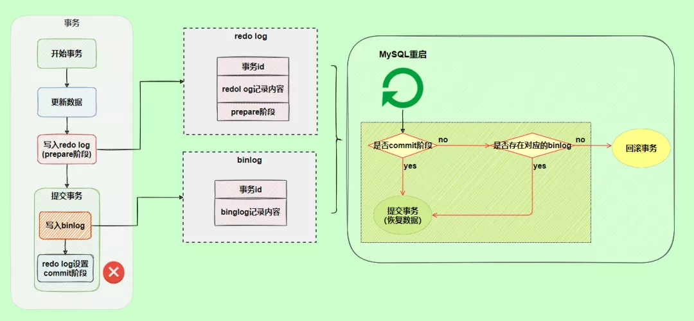

### undo log

https://jimmy2angel.github.io/2019/05/07/InnoDB-undo-log/

undo log的底层结构是链表。 存放undo log的页page,组成undo page链表

* 在一个事务执行过程中可能产生很多 undo 日志，这些日志可能一个页面放不下，需要放到多个页面中，这些页面就通过我们上边介绍的 TRX_UNDO_PAGE_NODE 属性连成了链表

`Rollback Segment` ： **存储每个 undo 页面链表的第一个页面的页号** 。

* 同一个事务向一个 undo 页面链表中写入的 undo日志算是一个组
* 一般，一个undo page只有一组undo log 。page重用的情况是例外
* Undo log的页可以重用

# Redis

## Redis五种数据结构

**string(字符串)**、**list(列表)**、**hash(字典)**、**set(集合)** 和 **zset(有序集合)**

#### String

类似ArrayList

```shell
> SET key value ##默认字符串类型
OK
> GET key
"value"
```

#### list

类似LinkedList

- `LPUSH` 和 `RPUSH` 分别可以向 list 的左边（头部）和右边（尾部）添加一个新元素；
- `LRANGE` 命令可以从 list 中取出一定范围的元素；
- `LINDEX` 命令可以从 list 中取出指定下表的元素，相当于 Java 链表操作中的 `get(int index)` 操作；

```shell
> rpush mylist A
(integer) 1
> rpush mylist B
(integer) 2
> lpush mylist first
(integer) 3
> lrange mylist 0 -1    # -1 表示倒数第一个元素, 这里表示从第一个元素到最后一个元素，即所有
1) "first"
2) "A"
3) "B"
```

#### hash

类似HashMap。数组+链表

```shell
> HSET books java "think in java"    # 命令行的字符串如果包含空格则需要使用引号包裹
(integer) 1
> HSET books python "python cookbook"
(integer) 1
> HGETALL books    # key 和 value 间隔出现
1) "java"
2) "think in java"
3) "python"
4) "python cookbook"
> HGET books java
"think in java"
> HSET books java "head first java"  
(integer) 0        # 因为是更新操作，所以返回 0
> HMSET books java "effetive  java" python "learning python"    # 批量操作
OK
```

#### Set

类似HashSet 。相当于特殊的字典，每个键值对的value都是null

```shell
> SADD books java
(integer) 1
> SADD books java    # 重复
(integer) 0
> SADD books python golang
(integer) 2
> SMEMBERS books    # 注意顺序，set 是无序的 
1) "java"
2) "python"
3) "golang"
> SISMEMBER books java    # 查询某个 value 是否存在，相当于 contains
(integer) 1
> SCARD books    # 获取长度
(integer) 3
> SPOP books     # 弹出一个
"java"
```

#### Zset（跳表实现）

每个value 都是唯一的，并且每个value都有一个score用于排序

```shell
> ZADD books 9.0 "think in java" ##"think in java"  score为9.0 
> ZADD books 8.9 "java concurrency"
> ZADD books 8.6 "java cookbook"

> ZRANGE books 0 -1     # 按 score 排序列出，参数区间为排名范围
1) "java cookbook"
2) "java concurrency"
3) "think in java"

> ZREVRANGE books 0 -1  # 按 score 逆序列出，参数区间为排名范围
1) "think in java"
2) "java concurrency"
3) "java cookbook"

> ZCARD books           # 相当于 count()
(integer) 3

> ZSCORE books "java concurrency"   # 获取指定 value 的 score
"8.9000000000000004"                # 内部 score 使用 double 类型进行存储，所以存在小数点精度问题

> ZRANK books "java concurrency"    # 排名
(integer) 1

> ZRANGEBYSCORE books 0 8.91        # 根据分值区间遍历 zset
1) "java cookbook"
2) "java concurrency"

> ZRANGEBYSCORE books -inf 8.91 withscores  # 根据分值区间 (-∞, 8.91] 遍历 zset，同时返回分值。inf 代表 infinite，无穷大的意思。
1) "java cookbook"
2) "8.5999999999999996"
3) "java concurrency"
4) "8.9000000000000004"

> ZREM books "java concurrency"             # 删除 value
(integer) 1
> ZRANGE books 0 -1
1) "java cookbook"
2) "think in java"
```
