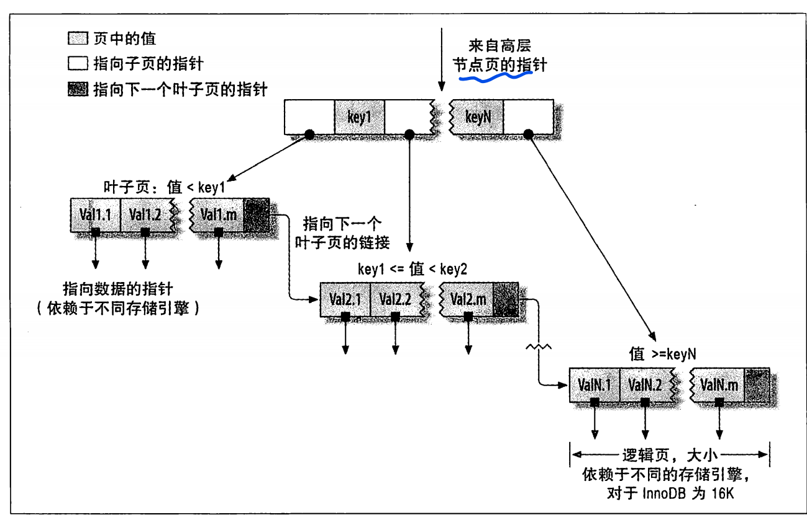
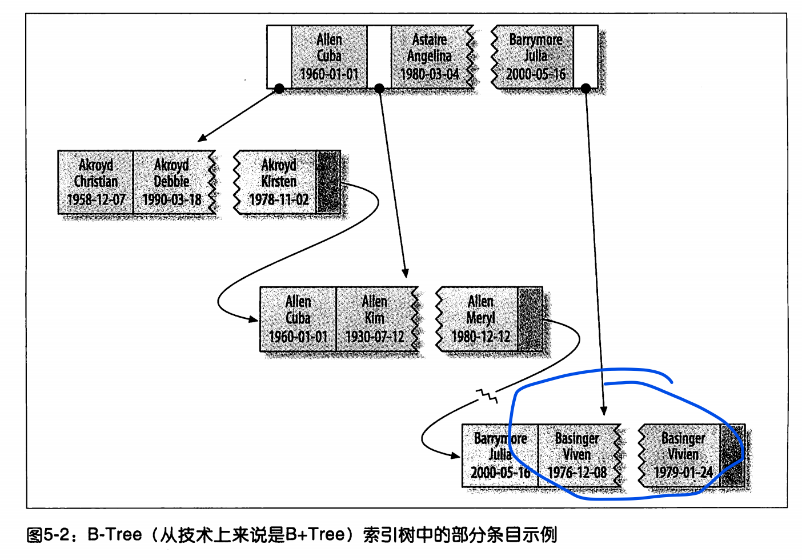
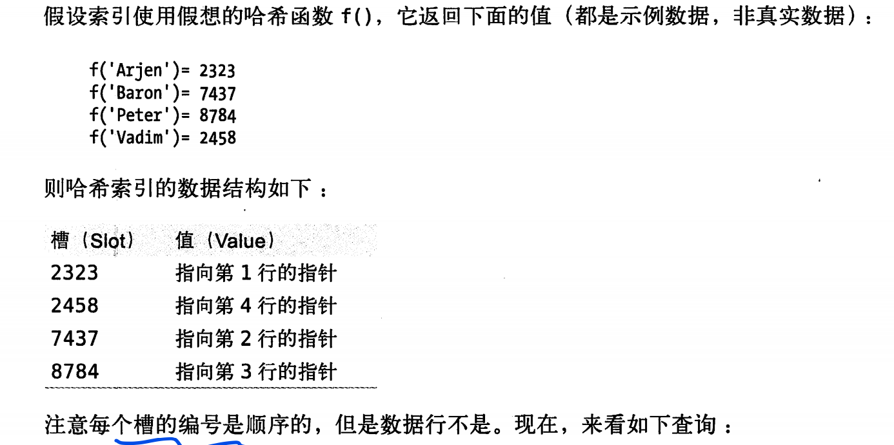
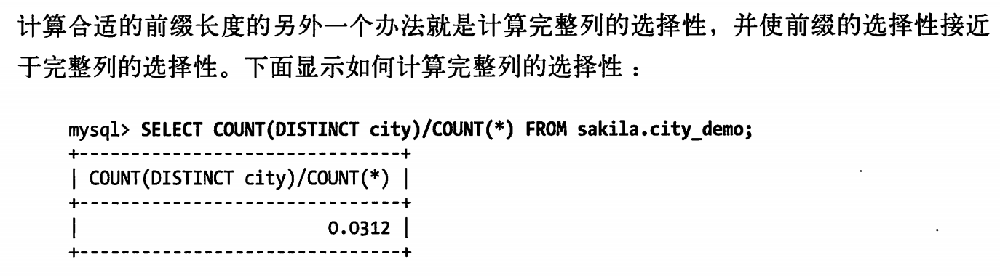
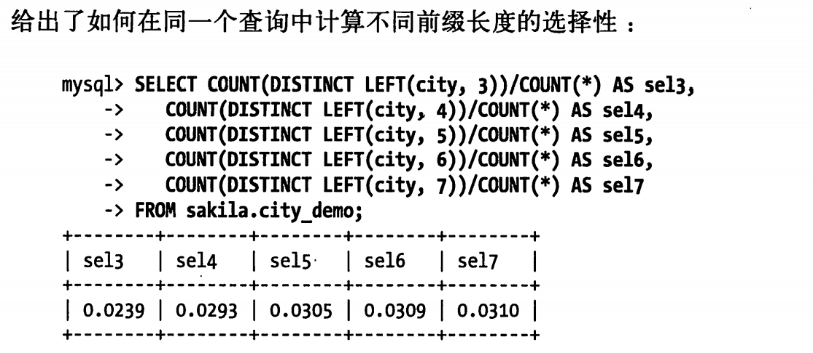

# Mysql

## Sql优化

### 慢查询 慢sql优化

https://www.cnblogs.com/zjfjava/p/12257772.html

1. 开启慢查询日志，设置超过几秒为慢SQL，抓取慢SQL

2. 通过explain对慢SQL分析（重点）

   https://www.cnblogs.com/zjxiang/p/9160564.html	

3. show profile查询SQL在Mysql服务器里的执行细节和生命周期情况（重点）

4. 对数据库服务器的参数调优

#### 重构查询方法

## 引擎

#### 种类

- InnoDB
- MyISAM 
- Memory
- Archive
- BDB
  - 支持事务的有：InnoDB 和BDB

## 索引

### 索引类型：B-Tree 索引、Hash索引、R-Tree索引、全文索引

### 索引结构：B 树、B+树  、 Hash索引、全文索引full - text 

### 建立索引原则

1. 最左前缀匹配原则。mysql会一直向右匹配直到遇到范围查询(>、<、between、like)就停止匹配，比如a = 1 and b = 2 and c > 3 and d = 4 如果建立(a,b,c,d)顺序的索引，d是用不到索引的，如果建立(a,b,d,c)的索引则都可以用到，a,b,d的顺序可以任意调整。
2. 选择区分度高的做为索引
3. 索引列不能参与运算

### B-Tree索引

#### 结构特点

索引结构是一棵查找树。每一个叶节点到根的距离相同。对索引列顺序组织存储，方便范围查询。（某个结点左儿子都是比他小的）

- 如果叶节点储存数据：B+tree
- 如果储存数据地址：B-Tree
- 结合内存段页式存储理解下图：
- 

#### 索引顺序 与 最左前缀匹配

最左前缀匹配：从索引最左边的列开始匹配。 

~~~SQL
CREATE TABLE PEOPLE{
	LAST_NAME VARCHAR(50) NOT NULL,
	FIRST_NAME VARCHAR(50) NOT NULL,
	DOB DATE NOT NULL,
	KEY(LAST_NAME, FIRST_NAME,DOB)
	##索引顺序：LAST_NAME,FIRSTNAME,DOB
	##排序顺序和索引顺序相同。先排LAST_NAME 再排FIRST_NAME,  DOB
	##图中两个满足相同 按照出生日期排序
	##上述规则 叫做最左前缀匹配原则
}
~~~

#### 适用查询类型

B-Tree索引适合全键值、键值范围或键前缀查找。键前缀匹配只适用于最左前缀匹配。	

1. 全值匹配
2. 匹配最左前缀
   - 只使用索引第一列
3. 匹配列前缀
   - 匹配某一列开头部分
4. 匹配范围值
5. 在精准匹配 基础上 范围匹配
   - 如： 精准匹配第一列并范围匹配第二列
6. 只访问索引

#### B-Tree限制

1. 不按照索引最左列开始查找则无法使用索引
2. 不能跳过索引中间列
3. 查询中使用某个列进行范围匹配，则右边所有列都无法使用索引优化查询。

### Hash索引

#### 结构特点

由hash值和行指针组成。hash值按照从小带大排列好。但是hash值对应原来的索引列的值是无序的。所以hash索引不按照索引顺序存储，范围查询困难。

#### 使用查询类型

精准匹配

### 索引优点

1. 减少扫描数据量
2. 避免排序和临时表
3. 随机I/O变为顺序I/O

### 高效索引策略

#### 索引列独立使用

索引列不能是表达式的一部分，不能是函数的参数

#### 前缀索引和索引选择性

- 索引选择性：基数 /  记录总数 。 代表每个索引能决定的数据范围精确程度，基数是不重复的索引值。

- 前缀的长度要足够长以保证较高的选择性。但是不能太长，否则索引空间会很大。

- 计算不同长度前缀的选择性和完整列选择性

  

- 注意：前缀分布可能不均匀，前面几位即使选择性高也可能效果不好。

#### 索引列顺序

将选择性最高的列放在前面通常是很好的（不考虑排序和分组时）。

#### 聚簇索引

在同一结构中保持B-Tree索引和数据行

##### 优点：

1. 相关数据存放在一起，减少I/O次数。
2. 加快数据访问

##### 缺点：

1. 更新聚簇索引代价高
2. 二级索引需要两次索引查找，二级索引空间可能很大。
3. 插入速度依赖于插入顺序。如果插入顺序不按主键顺序，需要OPTIMIZE TABLE整理表
4. 插入行到已满页中时，可能导致“页分裂”问题

#### 覆盖索引

覆盖索引:包含所有需要查询的字段值。

##### 优点：

1. 索引条目少
2. 减少I/O
3. 避免二级索引二次查询

##### 使用索引扫描 排序

##### 索引和锁

InnoDB只有在访问行时才对其加锁，索引能减少访问的行数，从而减少锁的数量。

## 事务

多条SQL语句组成整体，要么做要么不做。

### 事务性质ACID

- Atomic 原子性
- Consistence 一致性
- Isolation 隔离性
- Durability 持久性

### 事务隔离等级

- READ-UNCOMMITED 读未提交
- READ-COMMITED 读已提交
- REPEATABLE-READ 可重复读
- SERIALIZABLE 可串行化

# Redis

## Redis五种数据结构

**string(字符串)**、**list(列表)**、**hash(字典)**、**set(集合)** 和 **zset(有序集合)**

#### String

类似ArrayList

~~~shell
> SET key value ##默认字符串类型
OK
> GET key
"value"
~~~

#### list

类似LinkedList

- `LPUSH` 和 `RPUSH` 分别可以向 list 的左边（头部）和右边（尾部）添加一个新元素；
- `LRANGE` 命令可以从 list 中取出一定范围的元素；
- `LINDEX` 命令可以从 list 中取出指定下表的元素，相当于 Java 链表操作中的 `get(int index)` 操作；

~~~shell
> rpush mylist A
(integer) 1
> rpush mylist B
(integer) 2
> lpush mylist first
(integer) 3
> lrange mylist 0 -1    # -1 表示倒数第一个元素, 这里表示从第一个元素到最后一个元素，即所有
1) "first"
2) "A"
3) "B"
~~~

#### hash

类似HashMap。数组+链表

~~~shell
> HSET books java "think in java"    # 命令行的字符串如果包含空格则需要使用引号包裹
(integer) 1
> HSET books python "python cookbook"
(integer) 1
> HGETALL books    # key 和 value 间隔出现
1) "java"
2) "think in java"
3) "python"
4) "python cookbook"
> HGET books java
"think in java"
> HSET books java "head first java"  
(integer) 0        # 因为是更新操作，所以返回 0
> HMSET books java "effetive  java" python "learning python"    # 批量操作
OK
~~~

#### Set

类似HashSet 。相当于特殊的字典，每个键值对的value都是null

~~~shell
> SADD books java
(integer) 1
> SADD books java    # 重复
(integer) 0
> SADD books python golang
(integer) 2
> SMEMBERS books    # 注意顺序，set 是无序的 
1) "java"
2) "python"
3) "golang"
> SISMEMBER books java    # 查询某个 value 是否存在，相当于 contains
(integer) 1
> SCARD books    # 获取长度
(integer) 3
> SPOP books     # 弹出一个
"java"
~~~

#### Zset（跳表实现）

每个value 都是唯一的，并且每个value都有一个score用于排序

~~~shell
> ZADD books 9.0 "think in java" ##"think in java"  score为9.0 
> ZADD books 8.9 "java concurrency"
> ZADD books 8.6 "java cookbook"

> ZRANGE books 0 -1     # 按 score 排序列出，参数区间为排名范围
1) "java cookbook"
2) "java concurrency"
3) "think in java"

> ZREVRANGE books 0 -1  # 按 score 逆序列出，参数区间为排名范围
1) "think in java"
2) "java concurrency"
3) "java cookbook"

> ZCARD books           # 相当于 count()
(integer) 3

> ZSCORE books "java concurrency"   # 获取指定 value 的 score
"8.9000000000000004"                # 内部 score 使用 double 类型进行存储，所以存在小数点精度问题

> ZRANK books "java concurrency"    # 排名
(integer) 1

> ZRANGEBYSCORE books 0 8.91        # 根据分值区间遍历 zset
1) "java cookbook"
2) "java concurrency"

> ZRANGEBYSCORE books -inf 8.91 withscores  # 根据分值区间 (-∞, 8.91] 遍历 zset，同时返回分值。inf 代表 infinite，无穷大的意思。
1) "java cookbook"
2) "8.5999999999999996"
3) "java concurrency"
4) "8.9000000000000004"

> ZREM books "java concurrency"             # 删除 value
(integer) 1
> ZRANGE books 0 -1
1) "java cookbook"
2) "think in java"
~~~

# 消息队列

消息对列实际上就是进程间通信方式的一种，是生产者消费者模式在分布式场景下的实现。

## 消息队列的作用

消息队列主要由以下作用：解耦，削峰，异步，
