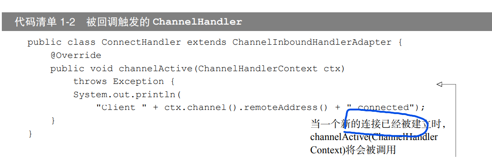
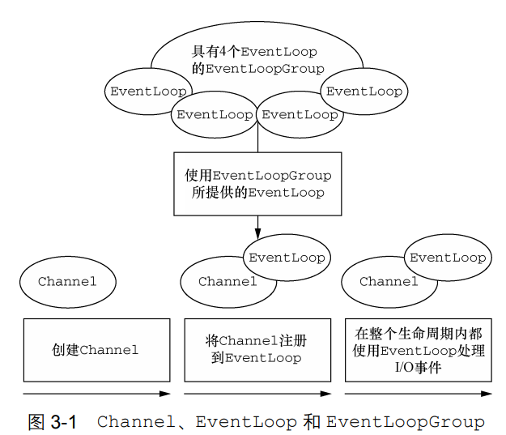

# Netty基础

## 基础

### Java NIO 模型

Netty 是基于Java NIO开发的,NIO的模型如下

- selector是JavaNIO的关键。使用事件通知API确定就绪Socket进行IO操作。

- Selector 可以检查任意读写操作的完成状态，使得单线程可以处理多个连接（类似IO多路复用）

  优点

  - 当没有 I/O 操作需要处理的时候，线程也可以被用于其他任务	
  - 使用较少的线程便可以处理许多连接，因此也减少了内存管理和上下文切换所带来开销；

### New IO 还是 Non-block IO?

> NIO 最开始是新的输入/输出（New Input/Output）的英文缩写，但是，该Java API 已经出现足够长的时间 了，不再是“新的”了，因此，如今大多数的用户认为NIO 代表非阻塞 I/O（Non-blocking I/O），而阻塞I/O（blocking  I/O）是旧的输入/输出（old input/output，OIO）。你也可能遇到它被称为普通I/O（plain I/O）的时候。

也就是说原意是New IO,后来普遍被理解错了。

## 核心组件

- Channel ：代表连接，对应socket

- 回调和Future：两者都可以在操作完成时通知相关方

  - 回调即回调函数。channelHandler 类似为了响应特定事件而执行的回调

  - ChannelFuture是netty自己实现的异步，可以注册多个ChannelFutureListener

  - 可以把 ChannelFutureListener 看作是回调的一个更加精细的版本。 事实上，回调和 Future 是相互补充的机制；它们相互结合，构成了 Netty 本身的关键构件块之一

    

    上图的回调只处理新连接建立这一事件，而channelFutureListener可以注册到自定义的Future，因此更灵活精细

## 总结

1. 
2. 

# Netty 组件

## Channel ,EventLoop,ChannelFuture

- Channel ----Socket
- EventLoop ---- 控制流、多线程处理、并发
- ChannelFuture ---- 异步通知

## 组件关系

- 一个 EventLoopGroup 包含一个或者多个 EventLoop；
-  一个 EventLoop 在它的生命周期内只和一个 Thread 绑定； 
-  所有由 EventLoop 处理的 I/O 事件都将在它专有的 Thread 上被处理； 
- 一个 Channel 在它的生命周期内只注册于一个 EventLoop； 
- 一个 EventLoop 可能会被分配给一个或多个 Channel。

注意，在这种设计中，一个给定 Channel 的 I/O 操作都是由相同的 Thread 执行的，实际 上消除了对于同步的需要。

## ChannelFuture

ChannelFuture接口可以用过addListener注册channelFutureListener。

## Echo服务器搭建----Hello World

主要有

- ChannelHandler 分为：服务端和客户端
- EchoServer

~~~java
@Sharable
public class EchoServerHandler extends ChannelInboundHandlerAdapter {
    //每条传入消息都要调用read
    @Override
    public void channelRead(ChannelHandlerContext ctx, Object msg) throws Exception {

        ByteBuf in = (ByteBuf) msg;

        System.out.println("Server received : " + in.toString(CharsetUtil.UTF_8));
        ctx.write(in);

    }
    //读取最后一条消息后，进行通知
    @Override
    public void channelReadComplete(ChannelHandlerContext ctx) throws Exception {
        ctx.writeAndFlush(Unpooled.EMPTY_BUFFER)
                .addListener(ChannelFutureListener.CLOSE);
    }
    //异常抛出
    //结合PipeLine的结构图，异常如果不处理就会一直传递到尾部的Handler
    @Override
    public void exceptionCaught(ChannelHandlerContext ctx, Throwable cause) throws Exception {
        cause.printStackTrace();
        ctx.close();

    }
}
~~~

