#### Netty基础

## 基础

### Java NIO 模型

Netty 是基于Java NIO开发的,NIO的模型如下


- selector是JavaNIO的关键。使用事件通知API确定就绪Socket进行IO操作。
- Selector 可以检查任意读写操作的完成状态，使得单线程可以处理多个连接（类似IO多路复用）

  优点

  - 当没有 I/O 操作需要处理的时候，线程也可以被用于其他任务
  - 使用较少的线程便可以处理许多连接，因此也减少了内存管理和上下文切换所带来开销；

### New IO 还是 Non-block IO?

> NIO 最开始是新的输入/输出（New Input/Output）的英文缩写，但是，该Java API 已经出现足够长的时间 了，不再是“新的”了，因此，如今大多数的用户认为NIO 代表非阻塞 I/O（Non-blocking I/O），而阻塞I/O（blocking  I/O）是旧的输入/输出（old input/output，OIO）。你也可能遇到它被称为普通I/O（plain I/O）的时候。

也就是说原意是New IO,后来普遍被理解错了。

## IO模型实现

### 多路复用IO -- Reactor模式


#### Reactor包含如下角色：

- Handle 句柄；用来标识socket连接或是打开文件；
- Synchronous Event Demultiplexer：同步事件多路分解器：由操作系统内核实现的一个函数；用于阻塞等待发生在句柄集合上的一个或多个事件；（如select/epoll；）
- Event Handler：事件处理接口
- Concrete Event HandlerA：实现应用程序所提供的特定事件处理逻辑；
- Reactor：反应器，定义一个接口，实现以下功能：
  1）供应用程序注册和删除关注的事件句柄；
  2）运行事件循环；
  3）有就绪事件到来时，分发事件到之前注册的回调函数上处理；

#### 时序图


1. 应用启动，将关注的事件handle注册到Reactor中；
2. 调用Reactor，进入无限事件循环，等待注册的事件到来；
3. 事件到来，select返回，Reactor将事件分发到之前注册的回调函数中处理；

### 异步IO -- Proactor模式

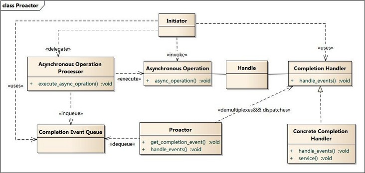

#### Proactor主动器模式包含如下角色

- Handle 句柄；用来标识socket连接或是打开文件；
- Asynchronous Operation Processor：异步操作处理器；负责执行异步操作，一般由操作系统内核实现；
- Asynchronous Operation：异步操作
- Completion Event Queue：完成事件队列；异步操作完成的结果放到队列中等待后续使用
- Proactor：主动器；为应用程序进程提供事件循环；从完成事件队列中取出异步操作的结果，分发调用相应的后续处理逻辑；
- Completion Handler：完成事件接口；一般是由回调函数组成的接口；
- Concrete Completion Handler：完成事件处理逻辑；实现接口定义特定的应用处理逻辑；

#### 时序图

1. 应用程序启动，调用异步操作处理器提供的异步操作接口函数，调用之后应用程序和异步操作处理就独立运行；应用程序可以调用新的异步操作，而其它操作可以并发进行；
2. 应用程序启动Proactor主动器，进行无限的事件循环，等待完成事件到来；
3. 异步操作处理器执行异步操作，完成后将结果放入到完成事件队列；
4. 主动器从完成事件队列中取出结果，分发到相应的完成事件回调函数处理逻辑中；

## 核心组件

- Channel ：代表连接，对应socket
- 回调和Future：两者都可以在操作完成时通知相关方

  - 回调即回调函数。channelHandler 类似为了响应特定事件而执行的回调
  - ChannelFuture是netty自己实现的异步，可以注册多个ChannelFutureListener
  - 可以把 ChannelFutureListener 看作是回调的一个更加精细的版本。 事实上，回调和 Future 是相互补充的机制；它们相互结合，构成了 Netty 本身的关键构件块之一

    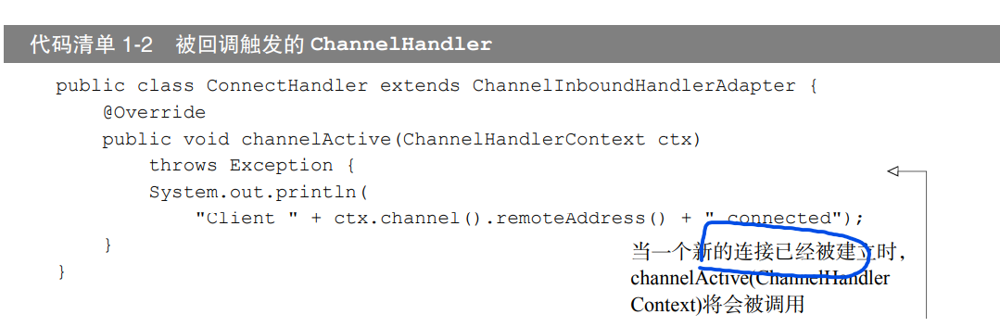

    上图的回调只处理新连接建立这一事件，而channelFutureListener可以注册到自定义的Future，因此更灵活精细

## 总结

# Netty 组件

## Channel ,EventLoop,ChannelFuture

- Channel ----Socket
- EventLoop ---- 控制流、多线程处理、并发
- ChannelFuture ---- 异步通知

## 组件关系

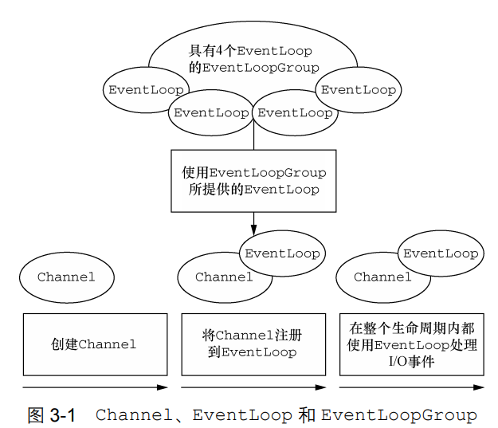

- 一个 EventLoopGroup 包含一个或者多个 EventLoop；
- 一个 EventLoop 在它的生命周期内只和一个 Thread 绑定；
- 所有由 EventLoop 处理的 I/O 事件都将在它专有的 Thread 上被处理；
- 一个 Channel 在它的生命周期内只注册于一个 EventLoop；
- 一个 EventLoop 可能会被分配给一个或多个 Channel。

注意，在这种设计中，一个给定 Channel 的 I/O 操作都是由相同的 Thread 执行的，实际 上消除了对于同步的需要。

## ChannelFuture

ChannelFuture接口可以用过addListener注册channelFutureListener。

## Echo服务器搭建----Hello World

主要有

- ChannelHandler 分为：服务端和客户端
- EchoServer

```java
@Sharable
public class EchoServerHandler extends ChannelInboundHandlerAdapter {
    //每条传入消息都要调用read
    @Override
    public void channelRead(ChannelHandlerContext ctx, Object msg) throws Exception {

        ByteBuf in = (ByteBuf) msg;

        System.out.println("Server received : " + in.toString(CharsetUtil.UTF_8));
        ctx.write(in);

    }
    //读取最后一条消息后，进行通知
    @Override
    public void channelReadComplete(ChannelHandlerContext ctx) throws Exception {
        ctx.writeAndFlush(Unpooled.EMPTY_BUFFER)
                .addListener(ChannelFutureListener.CLOSE);
    }
    //异常抛出
    //结合PipeLine的结构图，异常如果不处理就会一直传递到尾部的Handler
    @Override
    public void exceptionCaught(ChannelHandlerContext ctx, Throwable cause) throws Exception {
        cause.printStackTrace();
        ctx.close();

    }
}
```

# ByteBuf

## ByteBuf 原理

### 底层数据结构

底层是一个维护了两个索引的字节数组。两个分别是读写索引readIndex和writeIndex。两个索引初始位置都为0。

readIndex和writeIndex相同时，到达数据的末尾。如果还有读取数据，会报错IndexOutOfBoundsException

### 使用模式----内存分配方式

1. 堆缓冲区

   数据存储在JVM的堆空间中，也叫做支撑数组。优点：方便管理

   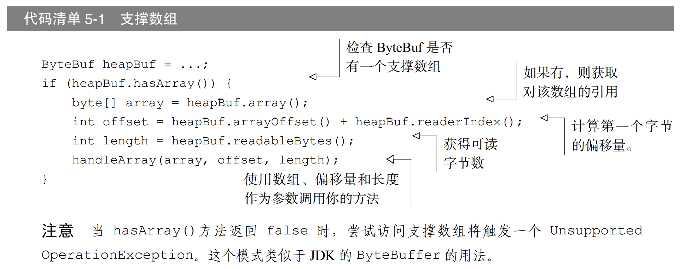
2. 直接缓冲区

   通过本地调用分配内存。避免了每次调用本地 I/O 操作之前（或者之后）将缓冲区的内容复 制到一个中间缓冲区（或者从中间缓冲区把内容复制到缓冲区）。

   缺点：它们的分配和释放都较为昂贵。如果你 正在处理遗留代码，你也可能会遇到另外一个缺点：因为数据不是在堆上，所以你不得不进行一 次复制，
3. 复合缓冲区

   为多个ButeBuf提供一个聚合视图。

   通过CompositeByteBuf实现

   - CompositeByteBuf 中的 ByteBuf 实例可能同时包含直接内存分配和非直接内存分配。 如果其中只有一个实例，那么对 CompositeByteBuf 上的 hasArray()方法的调用将返回该组 件上的 hasArray()方法的值；否则它将返回 false
   - 

## ByteBuf操作

### 索引操作

#### 随机访问

buffer.getByte(i),不会改变readIndex和WriteIndex的值

#### 顺序访问

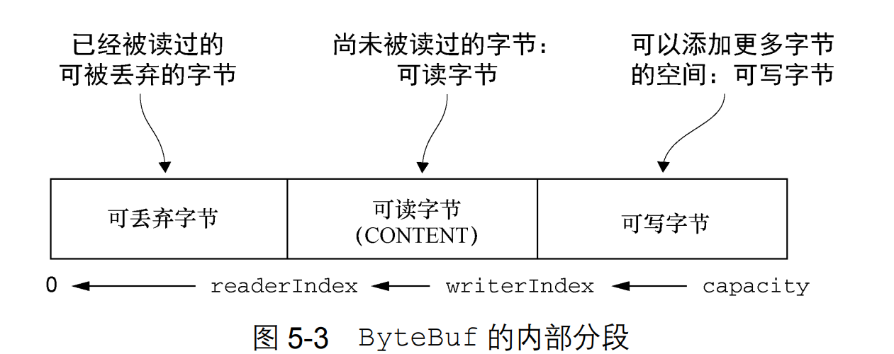

1. buffer.readByte()
2. buffer.writeBuffer(Byte b)
   - 这些操作会移动readIndex和writrIndex

#### 索引管理

可以通过调用 markReaderIndex()、markWriterIndex()、resetWriterIndex() 和 resetReaderIndex()来标记和重置 ByteBuf 的 readerIndex 和 writerIndex。这些和 InputStream 上的调用类似，只是没有 readlimit 参数来指定标记什么时候失效。

也可以通过调用 readerIndex(int)或者 writerIndex(int)来将索引移动到指定位置。试 图将任何一个索引设置到一个无效的位置都将导致一个 IndexOutOfBoundsException。

可以通过调用 clear()方法来将 readerIndex 和 writerIndex 都设置为 0。注意，这 并不会清除内存中的内容。下图展示了它是如何工作的	。

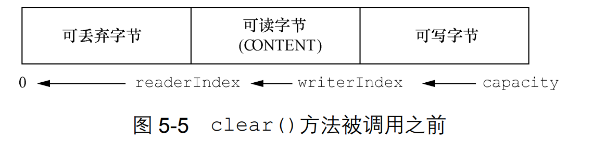

### 读写操作

### 其他操作

## ByteBufHolder

## ByteBuf分配

### ByteBufAllocator 接口

#### 作用

通过ByteBufAllocator实现ByteBuf的池化

可以通过 Channel（每个都可以有一个不同的 ByteBufAllocator 实例）或者绑定到 ChannelHandler 的 ChannelHandlerContext 获取一个到 ByteBufAllocator 的引用

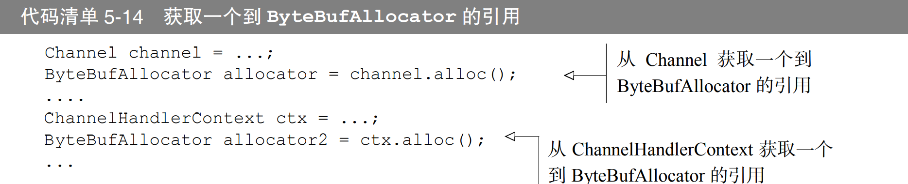

#### 两种实现：PooledByteBufAllocator 和UnpooledByteBufAllocator

1. PooledByteBufAllocator
   - 池化了ByteBuf的实例以提高性能并最大限度地减少内存碎片。此实 现使用jemalloc分配内存
2. UnpooledByteBufAllocator
   - 不池化，调用返回新实例

## 引用计数

与jvm 垃圾标记算法一致，用于释放对象资源，引用计数为0证明资源可以释放。Netty为ByteBuf和ByteBufHolder引入引用计数

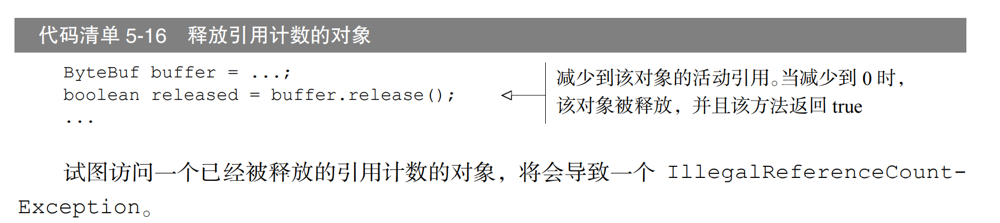

# ChannelHandler 和ChannelPipeline

## channel、channelPipeline 、Context和channelHandler关系

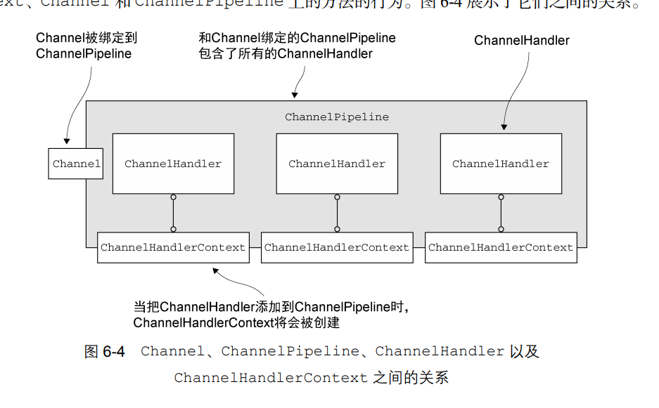

# EventLoop

## EventLoop基本概念

### 什么是EventLoop?

运行任务来处理在连接的生命周期内发生的事件是任何网络框架的基本功能。与之相应的编 程上的构造通常被称为事件循环。概况为 服务器用于处理事件的循环--事件循环

### Java线程模型--Exectors 创建线程池

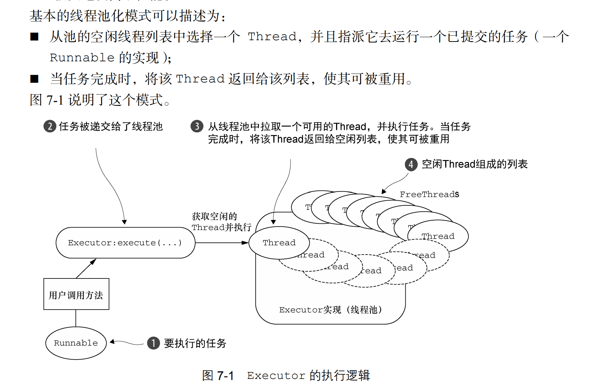

## EventLoop接口

### EventLoop接口 类层次结构

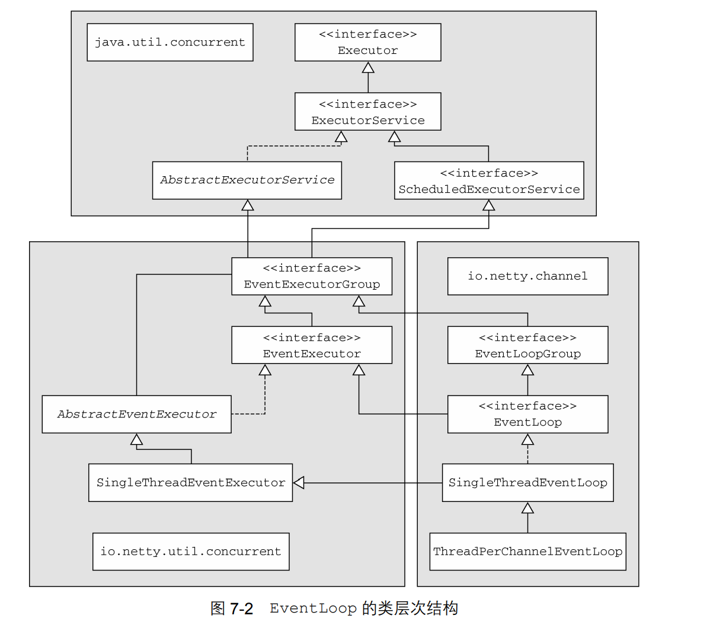

### EventLoop IO操作和事件处理

- Netty4线程模型：在Netty 4 中，所有的I/O操作和事件都由已经被分配给了 EventLoop的那个Thread来处理。
- Netty3线程模型：在以前的版本中所使用的线程模型只保证了入站（之前称为上游）事件会在所谓的 I/O 线程 （对应于 Netty 4 中的 EventLoop）中执行。所有的出站（下游）事件都由调用线程处理，其可 能是 I/O 线程也可能是别的线程。
- Netty4线程模型消除了EventLoop事件处理的线程同步问题。

## 任务调度

### Java 任务调度 - - 定时线程池

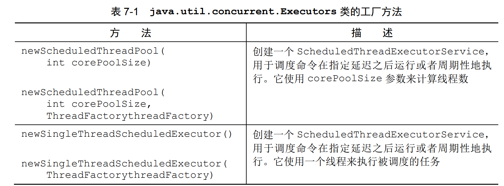

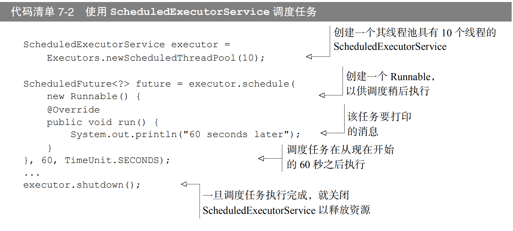

### EventLoop调度任务

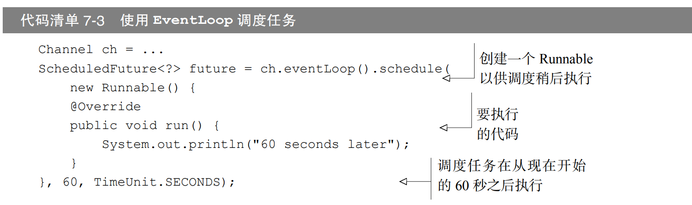

## 线程模型和任务调度实现细节

### 线程管理

- EventLoop与一个Thread绑定，一对一。
- Channel被注册到一个EventLoop, EventLoop可以注册多个Channel
- 一旦一个 Channel 被分配给一个 EventLoop，它将在它的整个生命周期中都使用这个 EventLoop（以及相关联的 Thread）。
- EventLoop负责对应channel生命周期里面的所有事件
- EventLoop有自己独立的任务队列。（类似阻塞队列）
- 执行逻辑图

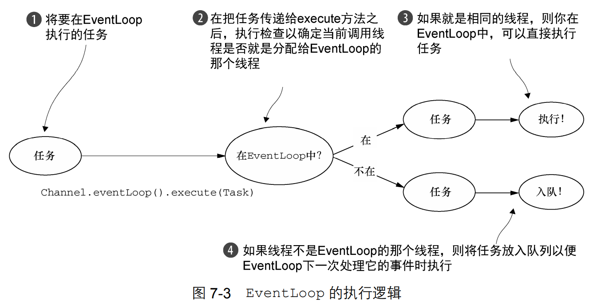

### 任务不要阻塞当前IO线程

“永远不要将一个长时间运行的任务放入到执行队列中，因为它将阻塞需要在同一线程上执行的任何 其他任务。”如果必须要进行阻塞调用或者执行长时间运行的任务，我们建议使用一个专门的 EventExecutor

### EventLoop 创建和分配

1. ### 异步传输实现

   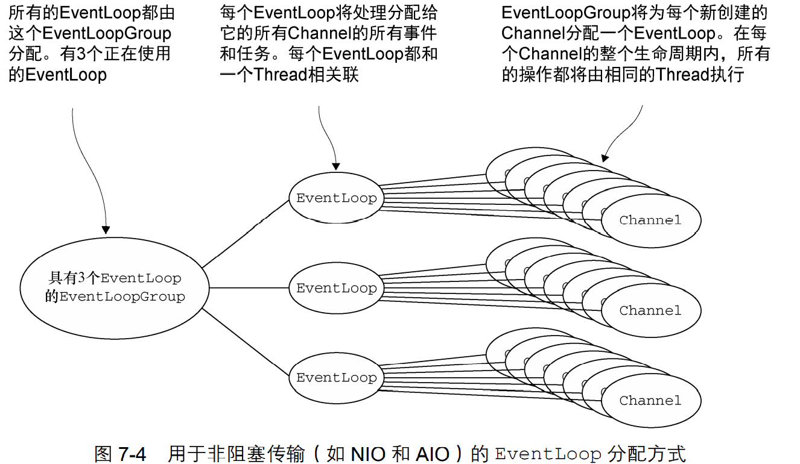

   在创建 EventLoopGroup 时就直接分配了 EventLoop。使用轮询进行分配。

   一旦一个 Channel 被分配给一个 EventLoop，它将在它的整个生命周期中都使用这个 EventLoop（以及相关联的 Thread）。

   同一个EventLoop的Channel共用一个ThreadLocal。因为他们用同一个Thread。
2. ### 阻塞传输实现

   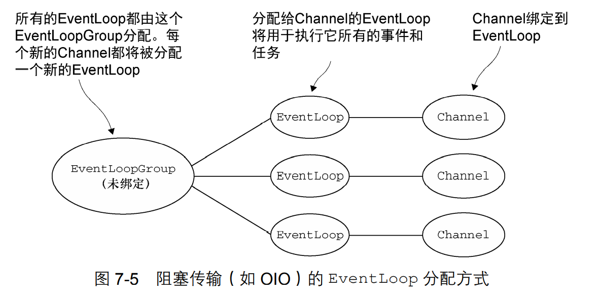

   每个Channel都分配一个新的EventLoop

# 源码

## ByteBuf
