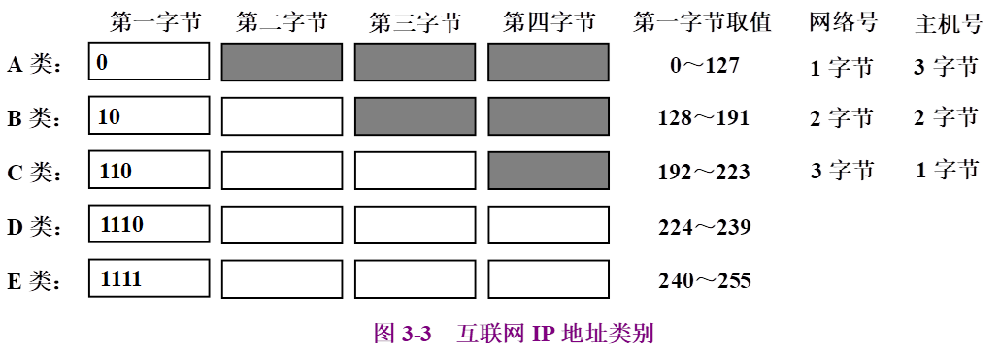
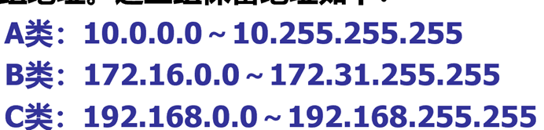
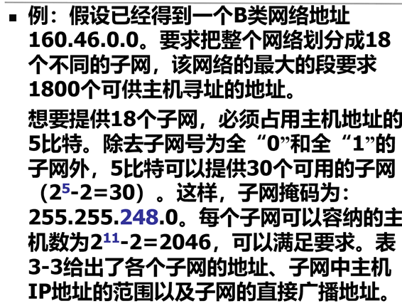
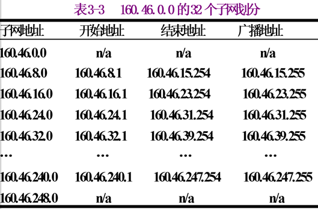
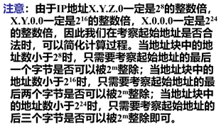
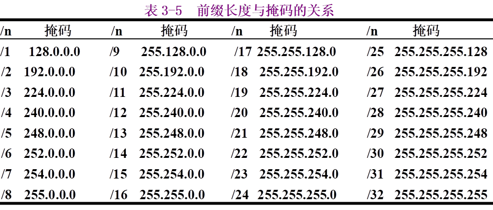
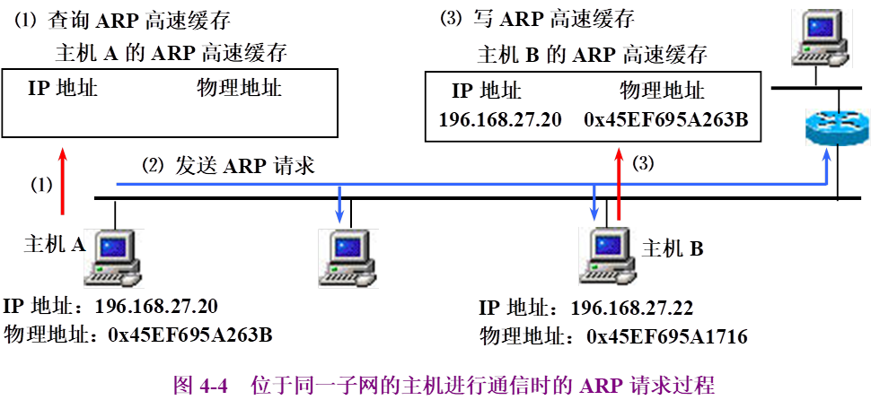
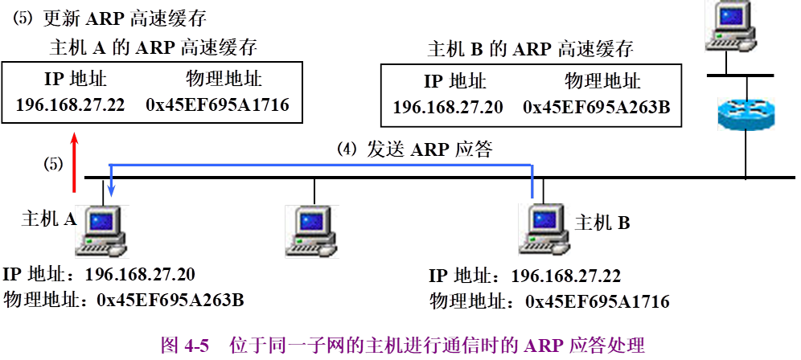
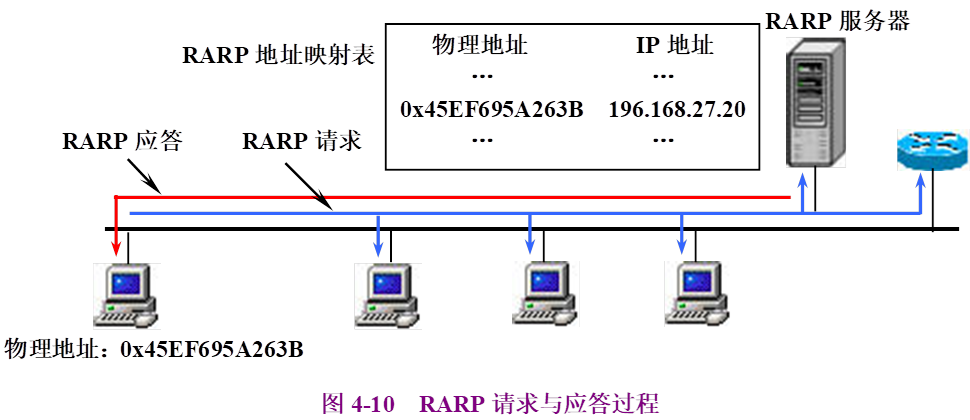
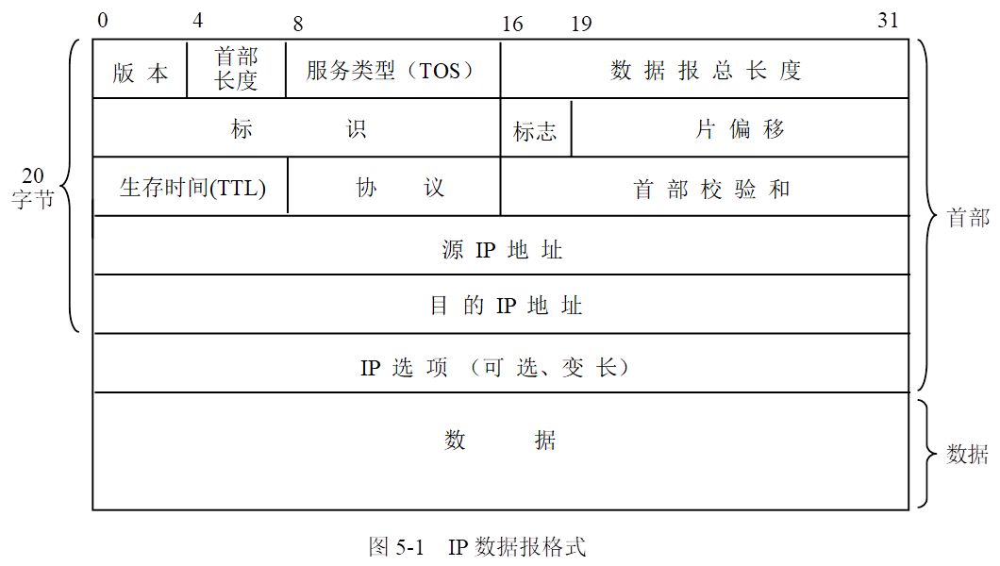

# 第三章 IP地址

## IP地址组成 ：层次型地址，网络号+主机号

## IPv4 

长度：32bit（ IPv6:128bit）

点分十进制表示

 

## 分类IP地址

白色方框是网络号范围，黑色方框是主机号范围。

D类地址是组播地址，对应一组主机，组内的主机

E类地址是保留地址

## 特殊IP地址

### 网络地址

表达式：<网络号，0>

主机号为0

例如

A类网络地址 : 网络号.0.0.0

B类网络地址： 网络号.0.0

C类： 网络号.0

### 直接广播地址

向网络号对应的网络 进行广播。

表达式：<网络号,-1> -1是表示全1

### 有限广播地址

在本网络广播，路由器不会转发这种分组

表达式：<-1，-1>

### 本网络地址

只做源地址

表达式：<0,主机号>

### 环回地址

用于测试本机网络功能

表达式<127.any>习惯上取127.0.0.1，localhost

## 私有网络地址

用于私网，局域网

## 子网 子网掩码

将主机号再进行划分：<网络号，子网号，主机号>

 

子网地址：子网掩码 IP地址 按位与

### 子网划分 例题

 

## 超网

将网络号进行划分，划分一部分位作为主机号。用于合并多个网络块

超网地址：超网掩码 & IP地址

### 例题

192.168.168.0  192.168.169.0  192.168.170.0  

可以合并为超网：192.168.168.0， 超网掩码是 255.255.248.0 即1…1 1…1 11111000 0…0

 

## 无类地址 CIDR

无类别域间路由CIDR

### 地址要求：

\1.   由连续IP地址组成

\2.   所含IP地址数量必须是2^n

\3.   其实地址能被2^n整除

整除计算技巧：

### 无类地址表示：斜线表示法（CIDR表示法）

格式：**W.X.Y.Z/n。斜线前面是IP地址，斜线后面是前缀长度，连续1的位数**

# 第四章 ARP RARP

## 地址解析原理 IP—> MAC地址

ARP请求帧（广播） ARP应答帧（单播）

 

\1.   广播发送ARP请求帧：请求主机IP和MAC，目标主机IP

\2.   收到请求帧的主机会匹配IP地址

a)    若不匹配忽略这个帧

b)    若匹配,单播发送ARP应答帧给请求主机。记录请求主机的IP和MAC映射关系。ARP应答帧：应答主机IP和MAC，请求主机IP和MAC

\3.   请求主机记录目标主机IP和MAC映射关系。

## ARP地址解析例子

### 同一子网

 

### 不同子网 同一子网的基础上进行多次转发 路由表

在上面的基础上，源主机会转发数据给路由器，路由器重复上述过程，发送给下一跳路由器或者目的主机。

## RARP地址解析 获取MACà IP （无盘主机）

RARP请求报文（广播）带有请求主机MAC地址，RARP服务器有MAC->IP映射表，返回RARP应答报文（单播）

# 第五章IP协议

### 5.1 IP数据报格式

**（1）版本(4位) 数据报的IP协议版本**

**（2）首部长度(4位) 数据报首部长度(32位为单位)。** 

**（3）服务类型(8位) 规定对本数据报的处理方式**

**（4）数据报总长度指示整个IP数据报的长度。**

​     **数据长度=数据报总长度－首部长度×4**

**（5）标识(16位) 每个IP数据报分配一个本地惟一的标识符。**

**（6）标志(3位)用于表示该IP数据报是否允许分片和是否是最后的一片。**

**（7）片偏移(13位)表示本片数据在它所属的原始数据报数据区中的偏移量（以8字节为单位）。**

**（8）生存时间TTL(8位) 控制IP数据报在网络中的传输时间。**

**（9）协议(8位)指明被IP数据报封装的协议。**

 

**（10）首部校验和(16位)用于保证首部数据的完整性。**

**（11）源地址表示本IP数据报的最初发送者的IP地址；目的地址一般表示本IP数据报最终接收者的IP地址。**

**（12）IP选项用于控制数据在网络中的传输路径、记录数据报走过的路由器以及获取数据报所途径经过的路由器的时间戳。**

**（13）数据字段用于携带上层数据，长度受数据报总长度限制(≤65535－首部长度×4)。**

 

### 5.2 无连接数据报传输

### 5.3 IP数据选项