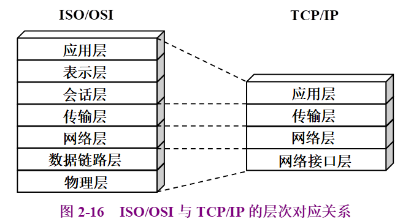
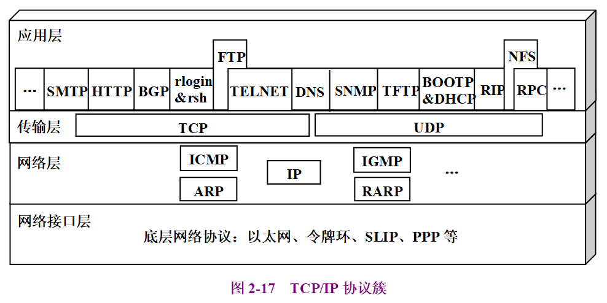
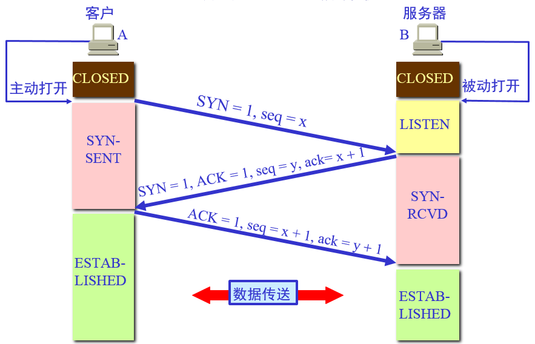
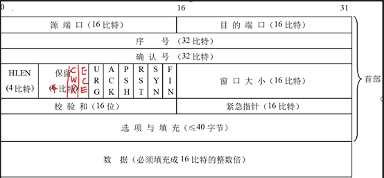
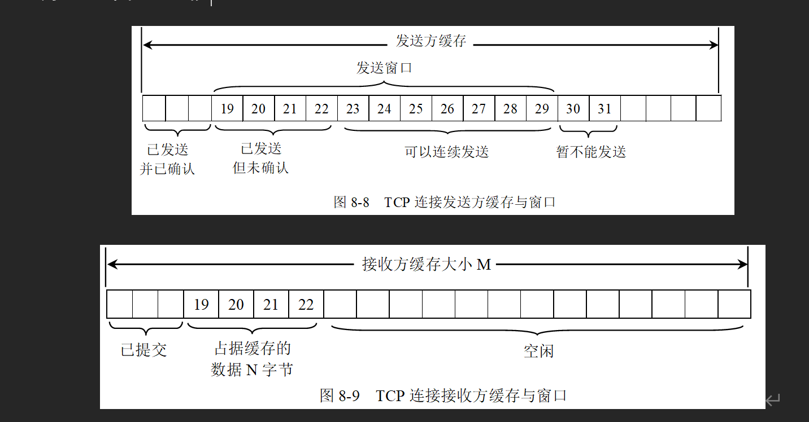
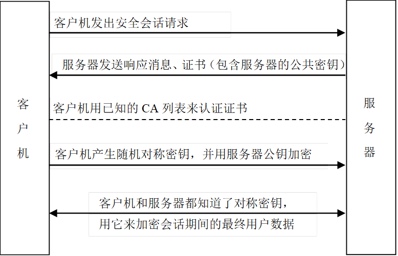
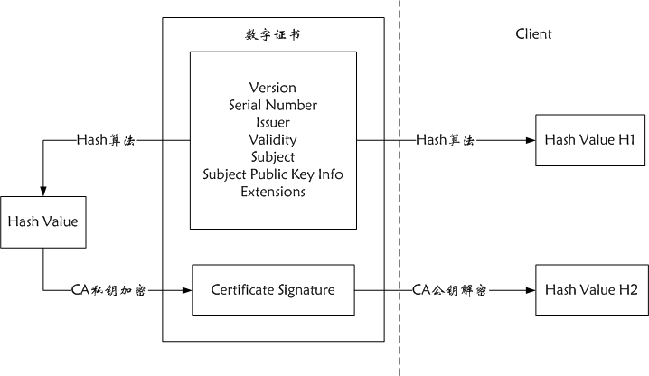

# 网络层次模型

## 层次模型

****

## TCP/IP协议簇

# 运输层

## TCP

### TCP三次握手 四次挥手

#### 状态转换图

### 为什么三次握手

客户端和服务端建立连接之后，如果有一个迟到连接请求报文（之前发送的，在网络中滞留太久了，现在才到），如果只有两次握手那么将会导致连接重新建立，出现错误、导致资源浪费。

### 为什么四次挥手

服务器收到客户的FIN报文只是说明客户不再发送数据，但是服务器可能还要向客户发送数据，所以服务器的FIN报文要留到数据传输完毕才发送，多了一次握手。

### 为什么客户端最后等2MSL TIME_WAIT

https://zhuanlan.zhihu.com/p/40013724TIME_WAIT 客户端最后的等待状态。TIME_WAIT	过多消耗内存和CPU。

**为何一定要等2MSL？**
**如果不等，释放的端口可能会重连刚断开的服务器端口，这样依然存活在网络里的老的TCP报文可能与新TCP连接报文冲突，造成数据冲突，为避免此种情况，需要耐心等待网络老的TCP连接的活跃报文全部死翘翘，2MSL时间可以满足这个需求（尽管非常保守）！**

### TCP长连接

通过保活机制keepAlive实现长连接。服务器设置保活定时器，定时器工作后发送保活探测报文，如果能受到ACK报文，证明对方存活，保持连接，否则断开连接。

### TCP段格式

### TCP可靠性实现：流量控制，拥塞控制，差错控制

#### 流量控制

使用滑动窗口协议。保证发送窗口小于大于接收窗口大小。

​    收到确定后窗口右移

#### 拥塞控制

避免拥塞的关键在于调整发送方发送窗口的大小。

决定发送方窗口大小的因素：

- ​    接收方接收窗口的大小
- ​    拥塞窗口大小

决定拥塞窗口大小的策略：慢开始，拥塞避免，快恢复，快重传

1. 慢开始：每个段的确认增大一个MSS，指数增长

2. 拥塞避免：到达门限值的一半开始 。门限值有初始值并且在传输过程中根据拥塞情况调整。

​    3. 快恢复：三次重复确认或确认超时，说明拥塞，调整窗口和门限值为当前拥塞窗口一半

​    4. 快重传：收到乱序报文段马上发送重复确认

#### 差错控制：检错和纠错

差错有：数据被 破坏、重复、失序、丢失

- 破坏：TCP校验和检测

- 重复：丢弃重复数据段

- 失序：接收方等待确认超时，超时重传。

- 丢失：超时重传

### TCP和UDP对比

#### 区别

连接性、可靠性，面向数据单位：TCP是面向连接的，面向字节流的，可靠的。UDP是无连接，面向报文的，不可靠的

报文首部：TCP报文首部至少为20字节大于UDP报文的8字节

#### 使用场景

TCP：用于对传输效率要求低，准确率要求高的场景。HTTP,FTP,SMTP

UDP：用户对传输效率要求高，准确率要求低的场景，DNS。

### TCP沾包

#### 沾包是什么

- 发送方沾包：Nagle算法导致。多个数据合在一个报文里面发送
- 接收方沾包：缓存中有多个数据。接收方读取缓存时无法分清数据边界，可能读到首尾粘连的包

#### 原因

TCP面向字节流。UDP面向报文不会沾包。

#### 解决

应用层解决:1. 格式化数据 2.数据带上数据长度 

## UDP

# 应用层 

## DNS 

### DNS查询方式

客户端和浏览器，本地DNS之间的查询方式是**递归查询**；

本地DNS服务器与根域及其子域之间的查询方式是**迭代查询**；

## http

### 状态码

#### 1xx消息

表示需要继续处理，属于临时响应

- 100 继续 已接受到请求头，要求客户端发送请求主体
- 101切换协议

#### 2xx成功

- 200 OK  请求成功

#### 3xx 重定向

#### 4xx客户端出错

- 401 请求错
- 403 拒绝执行请求
- 404 资源未找到

#### 5xx服务端出错

- 500 服务器出错

### 长连接实现机制

主要分两类：

- 使用运输层TCP保活机制keepalive实现。见运输层TCP长连接
- 使用应用层实现自定义的心跳机制。不同服务器端框架采取不同机制

### 应用层心跳机制

客户端定时发送心跳包，服务器返回心跳包的响应。如果多次没有收到响应，客户端会断开连接

### Http请求过程

1. 根据域名和 DNS 解析到服务器的IP地址 (DNS + CDN)
2. 通过ARP协议获得IP地址对应的物理机器的MAC地址
3. 浏览器对服务器发起 TCP 3 次握手
4. 建立 TCP 连接后发起 HTTP 请求报文
5. 服务器响应 HTTP 请求，将响应报文返回给浏览器
6. 短连接情况下，请求结束则通过 TCP 四次挥手关闭连接，长连接在没有访问服务器的若干时间后，进行连接的关闭
7. 浏览器得到响应信息中的 HTML 代码， 并请求 HTML 代码中的资源（如js、css、图片等）
8. 浏览器对页面进行渲染并呈现给用户

## https

使用SSL 安全套接字层

### SSL握手：

### 认证过程

### Https 和Http区别

- https是基于ssl的http,http是明文传输，而https是密文传输。
- 因为SSL握手要额外的9个包，https响应比htto慢
- https需要CA证书，需要额外成本。
- https端口443,http端口80