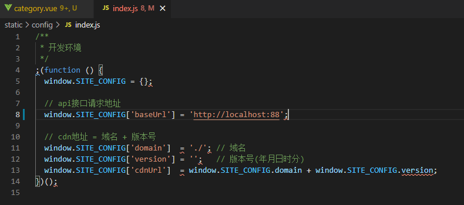
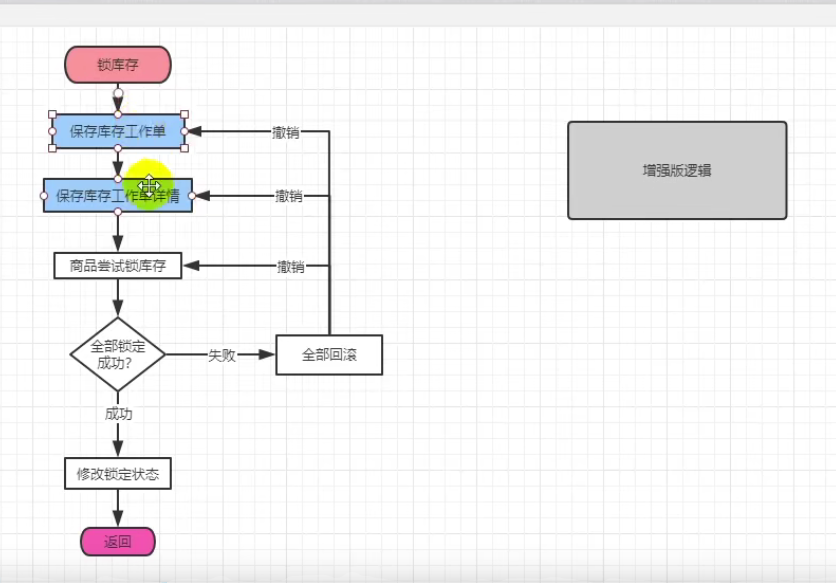
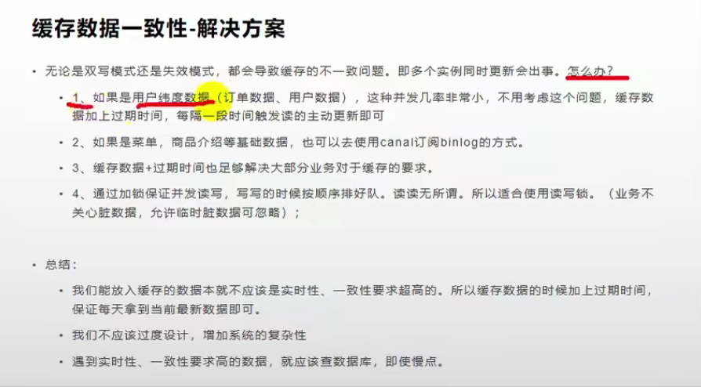
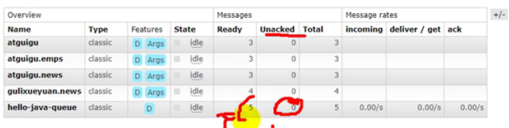

# 谷粒商城

## Bug 汇总

1. nacos注册要注意  要设置两个服务器地址 ：注册服务器 和 配置服务器
   - bootsrap.properties 设置 config.server-addr 配置服务器地址
   - application.yml 中配置注册服务器地址  
   - 两者区别？为什么在这两个文件分别配置？？？
2. 

# 微服务基本概念


## 微服务架构风格

 把一个单独的应用程序开发为一套小服务。基于业务边界进行服务微化拆分。各个服务独立部署运行。

## 微服务优势

- 独立开发
- 独立部署
- 故障隔离：某个服务故障不会影响整体运行。
- 混合技术栈，可以使用不同的语言和技术
- 粒度缩放：各个组件可以按需扩展

## 微服务缺点

- 故障排除难度
- 远程调用导致延迟增加
- 增加配置和其他操作的工作量

## 微服务特点

- 解耦
- 组件化
- 业务能力：每个微服务功能专注单一功能，实现简单
- 自治：开发人员可独立开发，提高效率
- 持续交付
- 敏捷性：支持敏捷开发

## 微服务最佳实践

1. 为每个微服务分开数据存储
2. 将代码保持在类似的成熟度等级上
3. 为每个微服务进行单独的构建
4. 部署到容器中
5. 将服务器视为无状态的

## 分布式

- 集群：一堆集器
- 节点：集群中的一个服务器

## 负载均衡

负载均衡算法:

1. 轮询：在健康池中按顺序选择服务器
2. 最小连接：优先选择连接数最少的服务器
3. 散列：根据Ip选择服务器

## 服务熔断 服务降级

- 服务熔断：中断服务调用链。设置服务超时，当服务失败达到阈值开启断路保护。直接返回默认数据。
- 服务降级：系统处于高峰期时，系统资源紧张，可以让非核心服务降级。
  - 降级：某些服务不处理或者简单处理 返回null、抛异常

### API网关

# Docker

## Docker安装

- 官网找到一下目录，按教程安装


## Docker配置

- 配置mysql端口映射和文件挂载

~~~shell
docker run -p 3306:3306 --name mysql  -v /mydata/mysql/log:/var/log/mysql  -v /mydata/mysql/data:/var/lib/mysql  -v /mydata/mysql/conf:/etc/mysql  -e MYSQL_ROOT_PASSWORD=root  -d mysql:5.7
~~~

- 配置redis时，如果Linux本身就有redis要记得停止redis服务

  ~~~shell
  #下载redis
  docker pull redis
  #配置文件
  mkdir -p /mydata/redis/conf
  touch /mydata/redis/conf/redis.conf
  #启动
  docker run -p 6379:6379 --name redis \
  -v /mydata/redis/data:/data \
  -v /mydata/redis/conf/redis.conf:/etc/redis/redis.conf \
  -d redis redis-server /etc/redis/redis.conf
  #查看容器
  docker ps
  #查看所有容器（包括停止了的）
  docker ps -a
  #使用redis-cli模式 进入redis
  docker exec -it redis redis-cli#最后输入的redis-cli表明进入是使用的命令，redis-cli命令是用于进入cli模式的
  
  ~~~

## Docker 使用 Mysql 、redis


```
# docker 中下载 mysql
docker pull mysql

#启动
docker run --name mysql -p 3306:3306 -e MYSQL_ROOT_PASSWORD=Lzslov123! -d mysql

#进入容器
docker exec -it mysql bash

#登录mysql
mysql -u root -p
ALTER USER 'root'@'localhost' IDENTIFIED BY 'Lzslov123!';

#添加远程登录用户
CREATE USER 'liaozesong'@'%' IDENTIFIED WITH mysql_native_password BY 'Lzslov123!';
GRANT ALL PRIVILEGES ON *.* TO 'liaozesong'@'%';
```

# 创建项目

1. ## 创建多个子项目，分别对应多个微服务

   - 注意java版本，springboot springcloud spring-alibaba版本是否兼容

2. ## 父项目用于聚合子项目

3. ## 创建脚手架工程（人人）

   1. ### 先搭建renren-fast项目

      - docker的数据库

      - vue前端

   2. ### 使用renren-gennerator生成对应微服务代码，在目标项目整合mybatis-plus

      - gennerator使用: 设置apllication.yml中的数据库连接信息url；设置generator.properties中的微服务模块名，表前缀。

   3. ### 创建common子项目，为其他生成的微服务项目提供依赖

      - 导入必要的类和依赖，下图中的类在renren-fast中都可找到

        

      - 依赖

        ~~~xml
        
        <dependencies>
            <dependency>
                <groupId>org.projectlombok</groupId>
                <artifactId>lombok</artifactId>
                <version>1.18.18</version>
            </dependency>
            <!-- https://mvnrepository.com/artifact/org.apache.httpcomponents/httpcore -->
            <dependency>
                <groupId>org.apache.httpcomponents</groupId>
                <artifactId>httpcore</artifactId>
                <version>4.4.14</version>
            </dependency>
            <!--下面这个依赖可以在renren-fast中找到-->
            <dependency>
                <groupId>commons-lang</groupId>
                <artifactId>commons-lang</artifactId>
                <version>2.6</version>
            </dependency>
            <dependency>
                <groupId>com.baomidou</groupId>
                <artifactId>mybatis-plus-boot-starter</artifactId>
                <version>3.4.3</version>
            </dependency>
            <!--        mysql 驱动-->
            <!-- https://mvnrepository.com/artifact/mysql/mysql-connector-java -->
            <dependency>
                <groupId>mysql</groupId>
                <artifactId>mysql-connector-java</artifactId>
                <version>8.0.19</version>
            </dependency>
            <!--servlet 依赖        -->
            <dependency>
                <groupId>javax.servlet</groupId>
                <artifactId>servlet-api</artifactId>
                <version>2.5</version>
                <scope>provided</scope>
            </dependency>
            <dependency>
                <groupId>org.springframework.data</groupId>
                <artifactId>spring-data-redis</artifactId>
                <version>2.2.4.RELEASE</version>
                <scope>compile</scope>
            </dependency>
        </dependencies>
        ~~~

        

   4. ### 导mybatis依赖，跑通生成的微服务子项目

      - 导入common项目，从而导入common已经导入的依赖。

# Spring Cloud alibaba

- ## 特别注意：spring cloud 、springboot 、alibaba 的版本要兼容，否则会出bug

## Common

- 引入 dependenciedManager 管理阿里巴巴相关组件版本
- 引入nacos discovery 依赖

## Nacos 注册和发现    配置

- ## 要注意 注册服务器和 配置服务器地址要分别设置，不能漏掉任何一个，否则服务无法上线

1. ### 下载启动nacos

2. ### 配置应用

   - 导入nacos依赖 （在common 中设置）

   ~~~yml
   <dependency>
        <groupId>com.alibaba.cloud</groupId>
        <artifactId>spring-cloud-starter-alibaba-nacos-discovery</artifactId>
   </dependency>
   ~~~

   - 配置注册服务器nacos server地址,设置服务端口和名字 （在要注册的服务中设置）
   
     ~~~yaml
     cloud:
         nacos:
             discovery:
                 server-addr: 127.0.0.1:8848  #注册服务器地址
     ~~~
   
     
   
   - bootstrap.properties:  配置服务器地址
   
   ~~~properties
   spring.application.name=gulimall-coupon
   spring.cloud.nacos.config.server-addr=127.0.0.1:8848  ##配置服务器地址
   ~~~
   
   - 使用 @EnableDiscoveryClient 注解开启服务注册与发现功能
   
     ```java
     @SpringBootApplication
     @EnableDiscoveryClient
     public class ProviderApplication {
     
         public static void main(String[] args) {
         	SpringApplication.run(ProviderApplication.class, args);
         }
     
         @RestController
         class EchoController {
             @GetMapping(value = "/echo/{string}")
                 public String echo(@PathVariable String string) {
                 return string;
             }
         }
     }
     ```

## Feign 远程调用

1. ###  在使用远程调用的项目中导入依赖  member

   - ## 	下面的操作都在调用远程服务 的项目member 中操作(member 项目调用 coupons)

2. ### 创建feign包，用于放远程调用的接口

   ~~~java
   /**
   创建对应远程服务的接口
   	a. 使用注解@FeignClient，输入应用名作为参数，开启fein功能
   	b. url映射
   */
   @FeignClient("mall-coupon")//指明要 调用的服务名字
   public interface CouponFeignService {
       @RequestMapping("/coupon/coupon/member/coupons")//被调用的服务url 注意:这个接口放在 member 的feign包里
       public R membercoupons();
   }
   ~~~

   

3. ### 开启feign

   ~~~java
   @SpringBootApplication
   @EnableDiscoveryClient//Nacos 注册发现
   @EnableFeignClients(basePackages = "com.mall.member.feign")//开启远程调用功能，设置feign包
   public class MallMemberApplication {
   
       public static void main(String[] args) {
           SpringApplication.run(MallMemberApplication.class, args);
       }
   
   }
   ~~~

   - bug : No Feign Client for loadBalancing defined. Did you forget to include spring-cloud-starter-loadbalancer?

   - 以下解决方案没用，根本解决方法是配置springboot cloud alibaba版本

     - 在要进行远程调用的子项目的 Pom下添加依赖。bug原因是ribbon和spring自带 loadbalancer 冲突

     - 也可以在common的pom下改依赖，一步到位
   
     ~~~xml
     <dependency>
         <groupId>com.alibaba.cloud</groupId>
         <artifactId>spring-cloud-starter-alibaba-nacos-discovery</artifactId>
         <exclusions>
             <exclusion>
                 <groupId> springframework.cloud</groupId>
                 <artifactId>spring-cloud-starter-netflix-ribbon</artifactId>
             </exclusion>
         </exclusions>
     </dependency>
     
     <dependency>
         <groupId>org.springframework.cloud</groupId>
         <artifactId>spring-cloud-loadbalancer</artifactId>
         <version>2.2.4.RELEASE</version>
     </dependency>
     ~~~

## Nacos 配置中心

1. ### 导入nacos-config 依赖 (在common 导入即可)

2. ### 创建bootstrap.properties

   ~~~properties
   spring.application.name=gulimall-coupon
   spring.cloud.nacos.config.server-addr=127.0.0.1:8848
   ~~~

3. ### 在配置中心新建配置,配置名:应用名.properties 如:gulimall-coupon.properties。添加配置。应用名是在bootstap中配置的

   

   

4. ### 动态获取配置

   - ```java
     @RefreshScope//动态获取配置
     
     @Value("${coupon.user.name}")//获取配置
     private String name;
     ```

- 命名空间的使用

  ~~~properties
  ##在bootstrap.properties 中
  spring.cloud.nacos.config.namespace=2bd13948-e715-4470-9596-fecd4cf6727b; ## namespace id ，可在nacos控制面板获得
  ~~~

- 配置集ID （Data ID）文件名

- 配置分组 

- ext-config 读取多个配置

# Spring Gateway

1. ### 使用spring Initializer 创建gateway项目

2. ### 设置nacos配置中心 ，地址、应用名、命名空间

3. ### 配置bootstrap.properties 

   ~~~properties
   spring.cloud.nacos.config.server-addr=127.0.0.1:8848
   spring.application.name=gulimall-gateway
   spring.cloud.nacos.config.namespace=7c6884f9-c17d-4d8b-872d-dd8c2d643aae
   ~~~

4. ### 设置端口 application.properties

   ~~~properties
   spring.cloud.nacos.config.server-addr=127.0.0.1:8848
   spring.application.name=gulimall-gateway
   server.port=88
   ~~~

5. ### 在application.yml中配置 路由规则

   ~~~yaml
   spring: 
     cloud:
       gateway:   
         routes:  
           - id: gg_route
             uri: https://www.google.com
             predicates:
              #请求 带有url 参数 ，并且值等于google 时，使用这个路由规则.？url=google
              #跳转到google
               - Query=url,google 
   ~~~


# 前端 --商品服务

### 三级分类功能 

#### 编写后端服务，用于查询分类树

#### renren fast vue 添加页面


路径product-category 对应vue项目文件位置：


#### 注册 到网关，让网关处理请求

- 首先修改vue项目的默认路径为 网关的路径  用全局搜索查找
- 
- 在nacos中注册renren-fast 用于生成验证码
  - 配置application.yml  添加
    - 
  - 在启动项目  中启动注册发现功能
  - 

#### 配置网关的路由规则  gateway application.yml下

~~~yaml
spring:
  cloud:
    gateway:
      routes:
        - id: admin_route
          url: lb://renren-fast #api 开头的请求路由到 renren-fast 服务
          predicates:
            - Path=/api/** ##api 开头的请求
          filters:
            - RewritePath=/api/?(?<segment>.*),/renren-fast/$\{segment} ##重写路径
            ###前端项目请求带上/api/前缀
            ### localhost:88/api/captcha.jpg  ---->  localhost:8080/renren-fast/captcha.jpg
~~~

#### 跨域 详细情况：https://developer.mozilla.org/zh-CN/docs/Web/HTTP/CORS

- 协议、域名、端口都要一致


- 非简单请求要先发送预检请求


- 如何跨域？
  - niginx 统一域 ：nginx 请求添加预检命令 和 access-controle-allow-methods * 和 Access-Control-Allow-Origin
  - 请求加上access-control 响应头 使用filter 

#### 网关配置跨域filter gateway 里面配置

~~~java
//跨域filter 配置
@Configuration
public class GulimallCorsConfiguration {
    @Bean
    public CorsWebFilter corsWebFilter(){

        UrlBasedCorsConfigurationSource source = new UrlBasedCorsConfigurationSource();
        CorsConfiguration corsConfiguration = new CorsConfiguration();
        //1. 配置跨域
        corsConfiguration.addAllowedHeader("*");
        corsConfiguration.addAllowedMethod("*");
        corsConfiguration.addAllowedOrigin("*");
        corsConfiguration.setAllowCredentials(true);


        source.registerCorsConfiguration("/**",corsConfiguration);
        return new CorsWebFilter(source);
    }
}
~~~


#### 注册product服务

- 在application.yml 中配置 注册中心

  ~~~yaml
  spring:
    cloud:
      nacos:
        discovery:
          server-addr: 127.0.0.1:8848 ##注册中心地址
  ~~~

- 在bootstrap.properties中配置 配置中心

  ~~~yaml
  spring.application.name=gulimall-product ##应用名称
  ##配置中心地址（nacos既能做注册中心也能做配置中）
  spring.cloud.nacos.config.server-addr=127.0.0.1:8848
  ##配置中心的命名空间
  spring.cloud.nacos.config.namespace=b2a2babc-1064-4368-8ba9-012245531791
  ~~~

- 注解 开启服务注册功能

  

#### 前端数据显示


- 注意controller存入数据的键为 page 


#### 三级分类增删

##### 页面


##### 逻辑删除

MP全局配置

~~~yaml
mybatis-plus:
  global-config:
    db-config:
      id-type: auto
      logic-delete-value: 1 ##逻辑已删除值
      logic-not-delete-value: 0 ##逻辑未删除
~~~

在对应实体类字段 加上逻辑删除注解 

~~~java
@TableLogic(value = "1", delval = "0")
private Integer showStatus;
~~~


##### 新增

## SPU 和 SKU

- SPU是类 SKU是对象
- SPU --> iphone x  SKU --> 64gb 黑色 iphone x

# 重点

## 阿里云OSS

1.  用户上传文件到应用服务器，应用服务器上传到阿里云
2. 用户向应用服务器请求签名，使用签名直接上传到阿里云

## JSR303 后端数据校验

1. ###  给bean的属性 分别添加校验注解 javax.validation.constraints 包下的注解

2. ### @valid 标注bean,校验bean中各个字段是否合法

   ~~~java
   public class Bean{
       @NotNull
       String name;
   }
   
   
   public class beanTestcontroller{
       
       @RequestMapping("/save")
       public static void test(@valid @RequestBody Bean bean){
   		
       }
   }
   ~~~

3. ### bindingResult 返回校验结果

4. ### 分组校验

   1. ~~~JAVA
      
      public class Bean{
          @NotNull
          String name;
          //根据 CRUD操作类型  标识校验分组
          @NotNUll(message = "修改ID不能为空", group = {UpdateGroup.class}) //修改分组 的情况下触发
          @NotNUll(message = "添加ID必须为空", group = {AddGroup.class})//添加分组  的情况下触发
          
          private int id;
          @URL(message = "URL格式不正确", group = {UpdateGroup.class, AddGroup.class})
          private int logo;
      }
      
      ~~~

   2. ~~~java
      //在controller 中 使用spring 的 @validated 启动校验 
      // 使用@validated 只有标识了分组的才会起作用
      //此时 name不会进行校验
      public class beanTestcontroller{
          
          @RequestMapping("/save")
          public static void addTest(@validated(AddGroup.class) @RequestBody Bean bean){//name没有标识分组   不校验
      		
          }
              
          @RequestMapping("/all")
          public static void addTest(@validated @RequestBody Bean bean){//validated 没有标识分组，只有没有分组的字段name生效
      		
          }
      }
      ~~~

   3. 

# 订单服务




# ElasticSearch 

## 原理

### 倒排索引 -- 单词文档矩阵


单词文档矩阵描述文档包含哪些单词。搜索引擎的索引就是实现单词 文档矩阵。所以在ES中使用文档表示数据类似Mysql 中的一行记录。索引表示文档的容器，类似Mysql Database。

### ES基本概念

#### 数据

##### Index 索引

名词：相当于Database,用于存储文档

动词：相当于insert 为一个文档创建index

##### Type 

可以理解为Table 已弃用

##### Document

相当于行

#### 结点和集群

##### Cluster 

ES是一个分布式系统，一个集群中有多个结点Node

##### Node

一个结点就是一个ES实例，就是一个Java进程

##### 分片

~~~
一个节点对应一个ES实例；
一个节点可以有多个index（索引）;
一个index可以有多个shard（分片）；
　一个分片是一个lucene index（此处的index是lucene自己的概念，与ES的index不是一回事）；
~~~


## 操作

### 安装和配置

~~~shell
## 下载es 和 kibana可视化
docker pull elasticsearch:7.4.2
docker pull kibana:7.4.2

# 将docker里的目录挂载到linux的/mydata目录中
# 修改/mydata就可以改掉docker里的
mkdir -p /mydata/elasticsearch/config
mkdir -p /mydata/elasticsearch/data

# es可以被远程任何机器访问
echo "http.host: 0.0.0.0" >/mydata/elasticsearch/config/elasticsearch.yml

# 递归更改权限，es需要访问
chmod -R 777 /mydata/elasticsearch/


~~~

### 启动

~~~shell
# 9200是用户交互端口 9300是集群心跳端口
# -e指定是单阶段运行
# -e指定占用的内存大小，生产时可以设置32G
docker run --name elasticsearch -p 9200:9200 -p 9300:9300 \
-e  "discovery.type=single-node" \
-e ES_JAVA_OPTS="-Xms64m -Xmx512m" \
-v /mydata/elasticsearch/config/elasticsearch.yml:/usr/share/elasticsearch/config/elasticsearch.yml \
-v /mydata/elasticsearch/data:/usr/share/elasticsearch/data \
-v  /mydata/elasticsearch/plugins:/usr/share/elasticsearch/plugins \
-d elasticsearch:7.4.2 


# 设置开机启动elasticsearch
docker update elasticsearch --restart=always
~~~

### kibana启动

~~~shell
# kibana指定了了ES交互端口9200  # 5600位kibana主页端口
##注意d
docker run --name kibana -e ELASTICSEARCH_HOSTS=http://192.168.56.10:9200 -p 5601:5601 -d kibana:7.4.2


# 设置开机启动kibana
docker update kibana  --restart=always
~~~

## 检索

### _cat ---- GET请求


### 索引一个文档  （保存）  ----PUT  POST 请求

 相当于Insert

保存一个数据，保存在哪个索引的哪个类型下（哪张数据库哪张表下），保存时用唯一标识指定

~~~json
# # 在customer索引下的external类型下保存1号数据
## index: customer
## type: external
PUT customer/external/1

# POSTMAN输入
http://192.168.56.10:9200/customer/external/1

{
 "name":"John Doe"
}
~~~

#### PUT和POST区别

- POST新增。如果不指定id，会自动生成id。指定id就会修改这个数据，并新增版本号；
  - 可以不指定id，不指定id时永远为创建
  - 指定不存在的id为创建
  - 指定存在的id为更新
- PUT可以新增也可以修改。PUT必须指定id；由于PUT需要指定id，我们一般用来做修改操作，不指定id会报错。
  - 必须指定id
  - 版本号总会增加

### 查询 ---- GET 请求

~~~json
GET /customer/external/1

{
    "_index": "customer", //在哪个索引
    "_type": "external", //在哪个类型
    "_id": "1",//记录id
    "_version": 10, //版本号
    "_seq_no": 18,//并发控制字段，每次更新都会+1，用来做乐观锁
    "_primary_term": 6,//记录主分片序号。同上，主分片重新分配，如重启，就会变化
    "found": true,
    "_source": {
        "name": "John Doe" //内容
    }
}
~~~

#### _Version 和 _seq_no 的区别

- version是计算文档更新次数的序号
  - `version` is a sequential number that counts the number of time a document was updated
- seq_no 是记录索引更新次数的序号
  - `_seq_no` is a sequential number that counts the number of operations that happened on the index

#### 乐观并发控制  version 、seq_no 与 primary_term

与ABA问题类似。旧版本使用version 指定版本号。新版本使用seq_no和primary_term(主分片序号) 指定版本号。

### 更新文档 _update

~~~json
POST customer/external/1/_update
{
    "doc":{
        "name":"222"
    }
}
~~~

- POST 可以带_update，检查内容是否真的更新而改变版本号
- PUT不可以

删除

~~~json
DELETE customer/external/1
DELETE customer
//没有删除类型的操作
~~~

### _bulk 批量操作

~~~json
POST http://192.168.56.10:9200/customer/external/_bulk
//执行多条数据
//两行为一个整体
{"index":{"_id":"1"}}
{"name":"a"}
{"index":{"_id":"2"}}
{"name":"b"}
注意格式json和text均不可，要去kibana里Dev Tools
~~~

~~~json
对于整个索引执行批量操作
POST /_bulk
{"delete":{"_index":"website","_type":"blog","_id":"123"}}
{"create":{"_index":"website","_type":"blog","_id":"123"}}
{"title":"my first blog post"}
{"index":{"_index":"website","_type":"blog"}}
{"title":"my second blog post"}
{"update":{"_index":"website","_type":"blog","_id":"123"}}
{"doc":{"title":"my updated blog post"}}

~~~

## 进阶检索

### 搜索文档

ES支持两种基本方式检索；

- 通过REST request uri 发送搜索参数 （uri +检索参数）；
- 通过REST request body 来发送它们（uri+请求体）；一般用这种，称为DSL；

~~~json
示例  使用时不要加#注释内容
GET bank/_search
{
  "query": {  #  查询的字段
    "match_all": {}
  },
  "from": 0,  # 从第几条文档开始查
  "size": 5,
  "_source":["balance"],
  "sort": [
    {
      "account_number": {  # 返回结果按哪个列排序
        "order": "desc"  # 降序
      }
    }
  ]
}
_source为要返回的字段
~~~

### 全文检索

模糊匹配 match

~~~json
GET bank/_search
{
  "query": {
    "match": {
      "address": "kings"
    }
  }
}
~~~

短语匹配 match_phrase 不拆分匹配

~~~json
GET bank/_search
{
  "query": {
    "match_phrase": {
      "address": "mill road"   #  就是说不要匹配只有mill或只有road的，要匹配mill road一整个子串
    }
  }
}
~~~

多字段匹配 multi_match

~~~json
GET bank/_search
{
  "query": {
    "multi_match": {  # 前面的match仅指定了一个字段。
      "query": "mill",
      "fields": [ # state和address有mill子串  不要求都有
        "state",
        "address"
      ]
    }
  }
}
~~~

# Nginx

## 安装

~~~shell
##获取配置文件
docker run -p80:80 --name nginx -d nginx:1.10   
##复制到容器外
docker container cp nginx:/etc/nginx .
##容器已经没用了 停掉 删除
docker stop nginx 
docker rm nginx 

##整理文件结构
[root@VM-0-10-centos mydata]# mv nginx conf
[root@VM-0-10-centos mydata]# ls
conf  elasticsearch  mysql
[root@VM-0-10-centos mydata]# mkdir nginx
[root@VM-0-10-centos mydata]# ls
conf  elasticsearch  mysql  nginx
[root@VM-0-10-centos mydata]# mv conf nginx/
[root@VM-0-10-centos mydata]# ls
elasticsearch  mysql  nginx
[root@VM-0-10-centos mydata]# cd nginx
[root@VM-0-10-centos nginx]# ls
conf


~~~

## 动静分离

将静态资源放在nginx，静态请求nginx直接返回，动态请求才交给路由

#### 实现


html中对静态资源的请求加上static 前缀


修改nginx 配置文件 在sever块里加上location 为 static 的配置


## 域名和负载均衡

### Nginx反向代理 （类似网关）


目录结构


其中server块的配置单独拆出来做为配置文件.Server 块配置文件位置在http块的include 指定


# 性能优化

## 缓存

请求静态资源消耗时间，对静态资源进行缓存。减少响应时间，提高吞吐量。

其他 ：见缓存和分布式锁部分

## 数据库优化

## 业务优化

减少数据库IO操作，一次性把需要检索的数据读进内存

## 关日志

# 缓存和分布式锁

- 即时性、数据一致性要求不高的
- 访问量大而更新频率不高（读多写少） 

## 本地缓存

使用map缓存。问题：不同项目实例或者部署在不同的服务器上会导致数据不一致 

## 分布式缓存

Redis  使用redisTemplate 调用Redis

- 读取数据库之前检查缓存内有没有要查询的数据
  - 如果没有，查询数据库。将查询到的对象转化为JSON，将JSON存入缓存（JSON 跨语言、跨平台）。将JSON转成对象，然后返回。
  - 如果有，将缓存中的JSON转成对象然后返回。

## 缓存问题

### 缓存穿透（查询一定不存在的数据）

- 问题：利用 一定不存在的数据进行查询进行攻击。
- 解决: 对空结果进行缓存，加入过期时间。

### 缓存雪崩 

- 问题：缓存大面积失效。由于key的过期时间相同
- 解决：在原有的失效时间基础上增加随机值。

### 缓存击穿

- 问题： 热点数据失效后、恰好出现大量查询这个热点数据的请求，数据库会进行大量的 热点数据 的重复查询
- 解决：加锁。同样的查询只进行一次查询。

## 分布式锁

使用redis 中的键值对实现。

~~~shell
SET LOCK 1111 NX ## NX 代表数据库中没有 LOCK 这个key 才设置，这个操作是原子的
##上面的代码可能导致死锁
##应该设置过期时间
SET LOCK 1111 EX 30 NX  ##EX ：设置 30s 的过期时间


~~~


- 加锁阶段注意问题		
  - 获取锁，执行完查询之后要释放锁(删除锁)
  - 上锁时，key-value 的value 要用于区分锁拥有者
  - 获得锁之后要设置锁过期时间、防止因为服务器出错导致无法释放锁从而导致死锁
- 解锁（删除锁）注意问题
  - 检查当前拥有锁的人是不是自己
  - 解锁时，获取当前锁的值（这个值用于指明拥有锁的人）以及向redis服务器传输删除lock指令都涉及网络通信，会有延迟，破坏了原子性
  - 使用脚本解锁，保证删除锁和对比锁拥有人是原子的。类似CAS
- 锁的续期问题
  - 执行业务的时间过长，还没执行完业务，锁已经过期了。
  - 超时时间设置长一点。 

### Redission

分布式锁框架 ---- 底层是Redis

~~~java
// 参数为锁名字
RLock lock = redissonClient.getLock("CatalogJson-Lock");//该锁实现了JUC.locks.lock接口
lock.lock();//阻塞等待,Redisson 的锁有看门狗机制，不用手动设置超时时间
// 解锁放到finally // 如果这里宕机：有看门狗，不用担心
lock.unlock();
//看门狗原理：
//占锁成功之后设置定时任务 每10s对锁进行续期
//锁默认时间为30s

~~~

~~~java
// 加锁以后10秒钟自动解锁，看门狗不续命
// 无需调用unlock方法手动解锁
lock.lock(10, TimeUnit.SECONDS);

// 尝试加锁，最多等待100秒，上锁以后10秒自动解锁
boolean res = lock.tryLock(100, 10, TimeUnit.SECONDS);
if (res) {
   try {
     ...
   } finally {
       lock.unlock();
   }
}
如果传递了锁的超时时间，就执行脚本，进行占锁;
如果没传递锁时间，使用看门狗的时间，占锁。如果返回占锁成功future，调用future.onComplete();
没异常的话调用scheduleExpirationRenewal(threadId);
重新设置过期时间，定时任务;
//看门狗的原理是定时任务：重新给锁设置过期时间，新的过期时间就是看门狗的默认时间;
//锁时间/3是定时任务周期;

~~~

### Redisson 使用

#### Lock 和 TryLock

~~~java
// 加锁以后10秒钟自动解锁，看门狗不续命
// 无需调用unlock方法手动解锁
lock.lock(10, TimeUnit.SECONDS);

// 尝试加锁，最多等待100秒，上锁以后10秒自动解锁
boolean res = lock.tryLock(100, 10, TimeUnit.SECONDS);
if (res) {
   try {
     ...
   } finally {
       lock.unlock();
   }
}
~~~

#### 读写锁

~~~java
RReadWriteLock rwlock = redisson.getReadWriteLock("anyRWLock");
// 最常见的使用方法
rwlock.readLock().lock();
// 或
rwlock.writeLock().lock();
~~~

#### 闭锁

~~~java
RCountDownLatch latch = redisson.getCountDownLatch("anyCountDownLatch");
latch.trySetCount(1);
latch.await();

// 在其他线程或其他JVM里
RCountDownLatch latch = redisson.getCountDownLatch("anyCountDownLatch");
latch.countDown();
~~~

#### 信号量

~~~java
RSemaphore semaphore = redisson.getSemaphore("semaphore");
semaphore.acquire();
//或
semaphore.acquireAsync();
semaphore.acquire(23);
semaphore.tryAcquire();
//或
semaphore.tryAcquireAsync();
semaphore.tryAcquire(23, TimeUnit.SECONDS);
//或
semaphore.tryAcquireAsync(23, TimeUnit.SECONDS);
semaphore.release(10);
semaphore.release();
//或
semaphore.releaseAsync();
~~~


### 缓存一致性问题

1. 双写模式

   

   - 双写模式：写数据库后，写缓存
     - 问题：并发时，2写进入，写完DB后都写缓存。有暂时的脏数据

2. 失效模式


- 脏数据问题
- 解决：缓存设置过期时间，定期更新
- 解决：写数据写时，加分布式的读写锁。

### 解决方案



### Canal 


- Canal 类似Mysql 从数据库。通过监听 biglog 的修改来检查缓存是否失效。

### Spring Cache 


# 消息队列

## 作用

- 异步处理

  

- 解耦

- 流量控制 削峰

  

## 消息队列两个重要的概念

1. 消息代理 Broker：安装了消息中间件的服务器。 接受消息发送者（生产者）的消息，发送到目的地。
2. 目的地，两种：
   1. 队列：点对点
      - 消息生产者发送消息给消息代理，消息代理放到队列中，可以有多个消费者监听队列是否有新消息。
      - 单播：消息只有唯一的发送者和接受者。
   2. 主题：发布订阅模式
      - 多播：发布者发送消息到主题，多个订阅者监听主题。消息到达时订阅者同时收到消息。 

## 消息队列规范

1. JMS

2. AMQP Advanced Message Queuing Protocl

   - ActiedMQ
   - RabbitMQ
   - RocketMQ

   

## RabbitMQ

### 基本概念

- Message

  - 组成：消息头 + 消息体
    - 消息头属性：
      - routing-key 路由键
      - priority 优先级
      - delivery-mode
    - 消息体是生产者自己定义的

- Publisher 消息生产者

- Exchange

  - 交换器，负责将消息路由到服务器中的队列

- Queue 消息队列

- Binding 绑定

- Consumer 消息消费者

- Connection 网络连接 TCP

- Channel 信道 

  - 多路复用连接的独立双向数据流通道。信道是建立在真实的TCP连接内的虚拟连接。 

- Brocker 服务器实体

- Virtual Host 虚拟主机

  

### connection 和 channel 区别

A Connection represents a real TCP connection to the message broker, whereas aChannelis a virtual connection (AMPQ connection) inside it. This way you can use as many (virtual) connections as you want inside your application without overloading the broker with TCP connections.

You can use one Channel for everything. However, if you have multiple threads, it's suggested to use a different Channel for each thread.
There is no direct relation betweenChannelandQueue. AChannelis used to send AMQP commands to the broker. This can be the creation of a queue or similar, but these concepts are not tied together.

connection 是真实的TCP连接，为了减少建立TCP连接（开销大），引入channel 逻辑连接，对TCP连接进行复用。

### 安装

~~~shell
docker run  -d --name rabbitmq -p 5671:5671 -p 5672:5672 -p 4369:4369 -p 25672:25672 -p 15671:15671 -p 15672:15672 rabbitmq:management

~~~


### RabbitMQ运行机制 ---- 消息路由


### Exchange 类型

1. ## Direct  完全匹配，单播

   

2. ## fanout  局域网广播

   

3. ## topic 模式匹配，与Direct 类似

   

4. ## headers 根据发送消息内容中的headers属性进行匹配

### RabbitMQ 消息确认机制 ---- 可靠投递

		

##### 生产者确认

1. P -> B confirmCallback 消息抵达broker确认

   broker 收到消息调用confirmCallback 函数。集群模式下需要所有broker 收到才调用 

   - 开启confirmCallback spring.rabbitmq.publisher-confirm-type: correlated 

2. E -> Q returnCallback 消息抵达queue确认 

   消息投递到queue 失败时调用returnCallback, 

   - 交换机到队列不成功，则丢弃消息（默认）

     交换机到队列不成功，返回给消息生产者，触发returnCallback

     通过returnCallback

     消息从交换器发送到对应队列失败时触发

     两种模式

     //为true,则交换机处理消息到路由失败，则会返回给生产者

     //或者配置文件 spring.rabbitmq.template.mandatory=true template.setMandatory(true); 

     - 第一步 开启returnCallback配置


     #新版 spring.rabbitmq.publisher-returns=true

     - 
       第二步 修改交换机投递到队列失败的策略


     #为true,则交换机处理消息到路由失败，则会返回给生产者 spring.rabbitmq.template.mandatory=true 

   

##### 消费者确认

- 消费者收到消息后发送确认给broker （默认设置，消费者收到消息就确认）

- 设置为手动模式，消费者要收到acked。在处理完消息后手动发送确认，此时消息为unacked状态

- 消息未确认会处于unacked状态，代表正在被消费者处理。

  



- ack
- nack
- reject

##### 生产者确认代码

  ~~~java
  ///////// 生产者确认 confirmCallback
  ///////// 配置： spring.rabbit.publisher-confirm=true
  @Autowired
  private RabbitTemplate rabbitTemplate;
  
  /**
       * 确认模式：
       * 步骤：
       * 1. 确认模式开启：ConnectionFactory中开启publisher-confirms="true"
       * 2. 在rabbitTemplate定义ConfirmCallBack回调函数
       */
  @Test
  public void testConfirm() {
  
      //2. 定义回调
      rabbitTemplate.setConfirmCallback(new RabbitTemplate.ConfirmCallback() {
          /**
               * @param correlationData 相关配置信息
               * @param ack   exchange交换机 是否成功收到了消息。true 成功，false代表失败
               * @param cause 失败原因
               */
          @Override
          public void confirm(CorrelationData correlationData, boolean ack, String cause) {
              if (ack) { //接收成功
                  System.out.println("接收成功消息" + cause);
              } else {  //接收失败。如何失败：交换机等配置错误
                  System.out.println("接收失败消息" + cause);
                  //做一些处理，让消息再次发送。
              }
          }
      });
  
      //3. 发送消息
      rabbitTemplate.convertAndSend("test_exchange_confirm111", "confirm", "message confirm....");
  }
  
  ~~~

~~~java
//////生产者确认 retrunCallback
//////配置： spring.rabbit.publisher-returns=true
	//     spring.rabbit.template.mandatory=true
@Autowired
private RabbitTemplate rabbitTemplate;

/**
     * 回退模式： 当消息发送给Exchange后，Exchange路由到Queue失败是 才会执行 ReturnCallBack
     * 步骤：
     * 1. 开启回退模式:publisher-returns="true"
     * 2. 设置ReturnCallBack
     * 3. 设置Exchange处理消息的模式：
     * 1. 如果消息没有路由到Queue，则丢弃消息（默认）
     * 2. 如果消息没有路由到Queue，返回给消息发送方ReturnCallBack
     */
@Test
public void testReturn() {

    //设置交换机处理失败消息的模式
    rabbitTemplate.setMandatory(true);

    //2.设置ReturnCallBack
    rabbitTemplate.setReturnCallback(new RabbitTemplate.ReturnCallback() {
        /**
             * @param message   消息对象
             * @param replyCode 错误码
             * @param replyText 错误信息
             * @param exchange  交换机
             * @param routingKey 路由键
             */
        @Override
        public void returnedMessage(Message message, int replyCode, String replyText, String exchange, String routingKey) {
            System.out.println("return 执行了....");

            System.out.println(message);
            System.out.println(replyCode);
            System.out.println(replyText);
            System.out.println(exchange);
            System.out.println(routingKey);
            //处理
        }
    });

    //3. 发送消息
    rabbitTemplate.convertAndSend("test_exchange_confirm", "confirm", "message confirm....");
}
~~~

##### 消费者确认代码

~~~java
///配置： spring.rabbitmq.listener.acknowledge-mode = manual 手动确认
///
@RabbitHandler
public void recieveMessage(){
    long deliveryID = message.getPro().getDeliverID();
    //basicack(long deliveryID, boolean multiple)
    channel.basicAck(deliveryID,false);//第二参数multiple 指 是否批量接受。如果为true
    								// deliveryID以及之前的ID的消息都接受
    //basicNack(long deliveryID, boolean muliple, boolean requeue)
    //requeue 指明 是否重新入队
    channel.basicNack();
    //basicReject(long deliveryID, boolean requeue) 类似b
    channel.basicReject();
}
~~~

### RabbitMQ使用

1. 依赖：

2. 属性配置

~~~properties
spring.rabitmq.host  = ..
... port = ...

~~~

3. 开启功能 @EnableRabbit

#### 创建路由和队列以及绑定 -- 使用amqpAdmin

~~~java
public class Main{
    @AutoWired
	AmqpAdmin  amqpAdmin;
    @Test
    public void createExchange（）{
    	
    }
        
}

~~~


- 结合@Bean注解自动创建 


#### 收发消息 -- 使用rabbitTemplate


- 使用@RabbitListener创建监听

  

#### config配置json解析 


#### 监听消息 @RabbitListener或@RabbitHandler + @EnableRabbit

- @RabbitListener: 用在 类或者方法上 
- @RabbitHandler: 用在 方法上 可以接受多种类型结果

##### RabbitListener


##### RabbitHandler


## 定时任务

~~~java
@Slf4j
@Componet 
@EnableSchedule//开启定时功能
@EnableAsync//开启异步任务
pubic class ScheduleTask{
    // cron = "* * * * * * *"
    // 分别代表 秒 分 时 日 月 周 年 
    //spring 不支持年
    // 0/5 代表 每五秒 打印一次。5代表步长
    //使用？防止 日和周冲突，日和周其中一个要使用?
    //设置定时任务
    @Scheduled(cron = "*/5 * * * * ?")
    //异步执行
    
    public void hello(){
        log.info("hello");
        
        
    }
}
~~~

- ## 缺点：消耗系统内存、增加数据库压力，时间误差大

- ## 解决：延时队列（消息TTL + 死信Exchage）

## 延时队列 （实现定时任务）

### TTL Time To Live 

- ### TTL ：消息存活时间

- ### 可以对队列和消息设置TTL 取最小值为实际TTL

### Dead Letter和 DLX 死信路由

#### 消息成为死信原因

1. ### 消息被拒收，并且reject 方法的参数requeue 为false

2. ### TTL到期。

3. ### 队列满。排在前面的消息成为死信。

#### Dead Letter Exchage DLX

- #### 死信会默认发给死信路由。死信路由将死信路由到另外一个队列。

- #### 设置DDL 和DLX即可实现延时队列

# 分布式事务

## CAP定理

**一致性和可用性不能同时满足**

- 一致性 Consisitency

  - 所有数据备份，同一时刻是否有同样的值

- 可用性 Availability

  - 节点故障，集群整体能否响应客户端请求

- 分区容错性 Partriton Tolerance

  - 分布式系统分布在多个子网络，每个子网络叫一个区。服务器可能既有在中国又有在美国的。
  - 分区之间通信出错如何处理。

  

##  CAP原则： CAP三个元素最多只能同时实现两点，不可能三者兼顾。

## RAFT算法

- ### 核心：领导选取 和 日志复制

### 领导选取

结点有三个状态：随从状态，候选人状态和领导状态

- 随从状态：
- 候选人状态：请求其他节点投票，如果获取大多数投票（大于总数一半）则成为领导结点。每个结点只能投一票。
- 领导状态：所有修改都要经过领导结点。领导结点接受客户端修改请求，向随从结点复制日志。

两个重要超时：选举超时（自旋超时），心跳超时。

- 选举超时：超时后成为候选人状态(如果已经是候选状态，则保存候选状态不变)，进行投票请求。
  - 向其他结点发送投票请求
  - 收到投票请求的结点响应，并且重置自旋。一次自旋内只能响应一次，也就是说只能投一票。
  - 收到大多数的结点成为领导结点。
- 心跳超时：超时后发送追加日志，用于实现日志复制。
  - 超时后发送心跳，可以携带追加日志
  - 收到心跳的结点重置自旋时间

### 日志复制

1. ## 客户端发送请求

   

2. ## 领导发送心跳报文带上日志


3. ## 如果大多数节点 都确定了，则领导节点提交日志。并且响应客户端

   

4. ## 通知随从结点提交日志

   

5. ### 随从提交日志


## BASE理论

- ### 基本可用Basically Availible

  - 出现故障时允许损失部分可用性。
    - 响应时间上的损失
    - 功能上的损失：引导消费者到降级页面

- ### 软状态Soft State

  - 允许出现中间状态，数据不同副本允许延时的同步。

- ### 最终一致性 Eventual Consistency

  - 所有数据副本经过一定时间，最终能够达到一致的状态。

## 分布式事务方案

1. ### 2pc模式 两阶段提交 （XA协议）

   - 性能差

     

2. ### 柔性事务 -- TCC事务补偿型方案 Try-Commit-Cancel 

   - 刚性事务：遵循ACID原则 强一致

   - 柔性事务：遵循BASE原则 最终一致

     

3. ### 柔性事务 -- 最大努力通知型方案

   - 使用消息队列，将失败消息定时多次放到队列里，采用订阅发布模式。本业务涉及的其他服务订阅这个队列，其他服务收到失败消息并且处理之后返回响应。

4. ### 柔性事务 -- 可靠消息 +  最终一致性方案 （异步确保）

   - 类似最大努力通知

## Seata分布式事务

### 使用


### Seata原理

- TC 事务协调   维护全局和分支事务的状态，驱动全局事务提交或回滚。

- TM事务管理器   定义全局事务范围：开始全局事务、提交或回滚全局事务。

- RM 资源管理器   管理分支事务处理的资源，与TC交谈以注册分支事务和报告事务的状态，并驱动分支事务提交或回归。

  注意看图中双箭头上文字，全局服务开启全局事务，分支服务注册分支事务并且报告状态，TC负责分支回滚或者全局回滚


### Seata事务模式

AT 、TCC、SAGA和XA模式

1. AT模式 自动模式，需要建立undo_log表


# 秒杀

## 高并发系统设计

### 关注问题


## 幂等性

在编程中.**一个幂等操作的特点是其任意多次执行所产生的影响均与一次执行的影响相同**

实现：分布式锁 + 缓存

