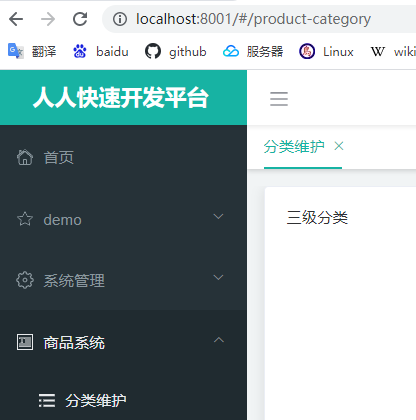

# 谷粒商城

## Bug 汇总

1. nacos注册要注意  要设置两个服务器地址 ：注册服务器 和 配置服务器
   - bootsrap.properties 设置 config.server-addr 配置服务器地址
   - application.yml 中配置注册服务器地址  
   - 两者区别？为什么在这两个文件分别配置？？？
2. 

# Docker

## Docker安装

- 官网找到一下目录，按教程安装


## Docker配置

- 配置mysql端口映射和文件挂载

~~~shell
docker run -p 3306:3306 --name mysql  -v /mydata/mysql/log:/var/log/mysql  -v /mydata/mysql/data:/var/lib/mysql  -v /mydata/mysql/conf:/etc/mysql  -e MYSQL_ROOT_PASSWORD=root  -d mysql:5.7
~~~

- 配置redis时，如果Linux本身就有redis要记得停止redis服务

  ~~~shell
  #下载redis
  docker pull redis
  #配置文件
  mkdir -p /mydata/redis/conf
  touch /mydata/redis/conf/redis.conf
  #启动
  docker run -p 6379:6379 --name redis \
  -v /mydata/redis/data:/data \
  -v /mydata/redis/conf/redis.conf:/etc/redis/redis.conf \
  -d redis redis-server /etc/redis/redis.conf
  #查看容器
  docker ps
  #查看所有容器（包括停止了的）
  docker ps -a
  #使用redis-cli模式 进入redis
  docker exec -it redis redis-cli#最后输入的redis-cli表明进入是使用的命令，redis-cli命令是用于进入cli模式的
  
  ~~~

## Docker 使用


# 创建项目

1. ## 创建多个子项目，分别对应多个微服务

   - 注意java版本，springboot springcloud spring-alibaba版本是否兼容

2. ## 父项目用于聚合子项目

3. ## 创建脚手架工程（人人）

   1. ### 先搭建renren-fast项目

      - docker的数据库

      - vue前端

   2. ### 使用renren-gennerator生成对应微服务代码，在目标项目整合mybatis-plus

      - gennerator使用: 设置apllication.yml中的数据库连接信息url；设置generator.properties中的微服务模块名，表前缀。

   3. ### 创建common子项目，为其他生成的微服务项目提供依赖

      - 导入必要的类和依赖，下图中的类在renren-fast中都可找到

        

      - 依赖

        ~~~xml
        
        <dependencies>
            <dependency>
                <groupId>org.projectlombok</groupId>
                <artifactId>lombok</artifactId>
                <version>1.18.18</version>
            </dependency>
            <!-- https://mvnrepository.com/artifact/org.apache.httpcomponents/httpcore -->
            <dependency>
                <groupId>org.apache.httpcomponents</groupId>
                <artifactId>httpcore</artifactId>
                <version>4.4.14</version>
            </dependency>
            <!--下面这个依赖可以在renren-fast中找到-->
            <dependency>
                <groupId>commons-lang</groupId>
                <artifactId>commons-lang</artifactId>
                <version>2.6</version>
            </dependency>
            <dependency>
                <groupId>com.baomidou</groupId>
                <artifactId>mybatis-plus-boot-starter</artifactId>
                <version>3.4.3</version>
            </dependency>
            <!--        mysql 驱动-->
            <!-- https://mvnrepository.com/artifact/mysql/mysql-connector-java -->
            <dependency>
                <groupId>mysql</groupId>
                <artifactId>mysql-connector-java</artifactId>
                <version>8.0.19</version>
            </dependency>
            <!--servlet 依赖        -->
            <dependency>
                <groupId>javax.servlet</groupId>
                <artifactId>servlet-api</artifactId>
                <version>2.5</version>
                <scope>provided</scope>
            </dependency>
            <dependency>
                <groupId>org.springframework.data</groupId>
                <artifactId>spring-data-redis</artifactId>
                <version>2.2.4.RELEASE</version>
                <scope>compile</scope>
            </dependency>
        </dependencies>
        ~~~

        

   4. ### 导mybatis依赖，跑通生成的微服务子项目

      - 导入common项目，从而导入common已经导入的依赖。

# Spring Cloud alibaba

- ## 特别注意：spring cloud 、springboot 、alibaba 的版本要兼容，否则会出bug

## Common

- 引入 dependenciedManager 管理阿里巴巴相关组件版本
- 引入nacos discovery 依赖

## Nacos 注册和发现    配置

- ## 要注意 注册服务器和 配置服务器地址要分别设置，不能漏掉任何一个，否则服务无法上线

1. ### 下载启动nacos

2. ### 配置应用

   - 导入nacos依赖 （在common 中设置）

   ~~~yml
   <dependency>
        <groupId>com.alibaba.cloud</groupId>
        <artifactId>spring-cloud-starter-alibaba-nacos-discovery</artifactId>
   </dependency>
   ~~~

   - 配置注册服务器nacos server地址,设置服务端口和名字 （在要注册的服务中设置）
   
     ~~~yaml
     cloud:
         nacos:
             discovery:
                 server-addr: 127.0.0.1:8848  #注册服务器地址
     ~~~
   
     
   
   - bootstrap.properties:  配置服务器地址
   
   ~~~properties
   spring.application.name=gulimall-coupon
   spring.cloud.nacos.config.server-addr=127.0.0.1:8848  ##配置服务器地址
   ~~~
   
   - 使用 @EnableDiscoveryClient 注解开启服务注册与发现功能
   
     ```java
     @SpringBootApplication
     @EnableDiscoveryClient
     public class ProviderApplication {
     
         public static void main(String[] args) {
         	SpringApplication.run(ProviderApplication.class, args);
         }
     
         @RestController
         class EchoController {
             @GetMapping(value = "/echo/{string}")
                 public String echo(@PathVariable String string) {
                 return string;
             }
         }
     }
     ```

## Feign 远程调用

1. ###  在使用远程调用的项目中导入依赖  member

   - ## 	下面的操作都在调用远程服务 的项目member 中操作(member 项目调用 coupons)

2. ### 创建feign包，用于放远程调用的接口

   ~~~java
   /**
   创建对应远程服务的接口
   	a. 使用注解@FeignClient，输入应用名作为参数，开启fein功能
   	b. url映射
   */
   @FeignClient("mall-coupon")//指明要 调用的服务名字
   public interface CouponFeignService {
       @RequestMapping("/coupon/coupon/member/coupons")//被调用的服务url 注意:这个接口放在 member 的feign包里
       public R membercoupons();
   }
   ~~~

   

3. ### 开启feign

   ~~~java
   @SpringBootApplication
   @EnableDiscoveryClient//Nacos 注册发现
   @EnableFeignClients(basePackages = "com.mall.member.feign")//开启远程调用功能，设置feign包
   public class MallMemberApplication {
   
       public static void main(String[] args) {
           SpringApplication.run(MallMemberApplication.class, args);
       }
   
   }
   ~~~

   - bug : No Feign Client for loadBalancing defined. Did you forget to include spring-cloud-starter-loadbalancer?

   - 以下解决方案没用，根本解决方法是配置springboot cloud alibaba版本

     - 在要进行远程调用的子项目的 Pom下添加依赖。bug原因是ribbon和spring自带 loadbalancer 冲突

     - 也可以在common的pom下改依赖，一步到位
   
     ~~~xml
     <dependency>
         <groupId>com.alibaba.cloud</groupId>
         <artifactId>spring-cloud-starter-alibaba-nacos-discovery</artifactId>
         <exclusions>
             <exclusion>
                 <groupId> springframework.cloud</groupId>
                 <artifactId>spring-cloud-starter-netflix-ribbon</artifactId>
             </exclusion>
         </exclusions>
     </dependency>
     
     <dependency>
         <groupId>org.springframework.cloud</groupId>
         <artifactId>spring-cloud-loadbalancer</artifactId>
         <version>2.2.4.RELEASE</version>
     </dependency>
     ~~~

## Nacos 配置中心

1. ### 导入nacos-config 依赖 (在common 导入即可)

2. ### 创建bootstrap.properties

   ~~~properties
   spring.application.name=gulimall-coupon
   spring.cloud.nacos.config.server-addr=127.0.0.1:8848
   ~~~

3. ### 在配置中心新建配置,配置名:应用名.properties 如:gulimall-coupon.properties。添加配置。应用名是在bootstap中配置的

   

   

4. ### 动态获取配置

   - ```java
     @RefreshScope//动态获取配置
     
     @Value("${coupon.user.name}")//获取配置
     private String name;
     ```

- 命名空间的使用

  ~~~properties
  ##在bootstrap.properties 中
  spring.cloud.nacos.config.namespace=2bd13948-e715-4470-9596-fecd4cf6727b; ## namespace id ，可在nacos控制面板获得
  ~~~

- 配置集ID （Data ID）文件名

- 配置分组 

- ext-config 读取多个配置

# Spring Gateway

1. ### 使用spring Initializer 创建gateway项目

2. ### 设置nacos配置中心 ，地址、应用名、命名空间

3. ### 配置bootstrap.properties 

   ~~~properties
   spring.cloud.nacos.config.server-addr=127.0.0.1:8848
   spring.application.name=gulimall-gateway
   spring.cloud.nacos.config.namespace=7c6884f9-c17d-4d8b-872d-dd8c2d643aae
   ~~~

4. ### 设置端口 application.properties

   ~~~properties
   spring.cloud.nacos.config.server-addr=127.0.0.1:8848
   spring.application.name=gulimall-gateway
   server.port=88
   ~~~

5. ### 在application.yml中配置 路由规则

   ~~~yaml
   spring: 
     cloud:
       gateway:   
         routes:  
           - id: gg_route
             uri: https://www.google.com
             predicates:
              #请求 带有url 参数 ，并且值等于google 时，使用这个路由规则.？url=google
              #跳转到google
               - Query=url,google 
   ~~~

# 前端

# 商品服务

### 三级分类功能 

#### 编写后端服务，用于查询分类树

#### renren fast vue 添加页面



路径product-category 对应vue项目文件位置：


#### 注册 到网关，让网关处理请求

- 首先修改vue项目的默认路径为 网关的路径  用全局搜索查找
- 
- 在nacos中注册renren-fast 用于生成验证码
  - 配置application.yml  添加
    - 
  - 在启动项目  中启动注册发现功能
  - 

#### 配置网关的路由规则  gateway application.yml下

~~~yaml
spring:
  cloud:
    gateway:
      routes:
        - id: admin_route
          url: lb://renren-fast #api 开头的请求路由到 renren-fast 服务
          predicates:
            - Path=/api/** ##api 开头的请求
          filters:
            - RewritePath=/api/?(?<segment>.*),/renren-fast/$\{segment} ##重写路径
            ###前端项目请求带上/api/前缀
            ### localhost:88/api/captcha.jpg  ---->  localhost:8080/renren-fast/captcha.jpg
~~~

#### 跨域 详细情况：https://developer.mozilla.org/zh-CN/docs/Web/HTTP/CORS

- 协议、域名、端口都要一致


- 非简单请求要先发送预检请求


- 如何跨域？
  - niginx 统一域
  - 请求加上access-control 响应头 使用filter 

#### 网关配置跨域filter gateway 里面配置

~~~java
//跨域filter 配置
@Configuration
public class GulimallCorsConfiguration {
    @Bean
    public CorsWebFilter corsWebFilter(){

        UrlBasedCorsConfigurationSource source = new UrlBasedCorsConfigurationSource();
        CorsConfiguration corsConfiguration = new CorsConfiguration();
        //1. 配置跨域
        corsConfiguration.addAllowedHeader("*");
        corsConfiguration.addAllowedMethod("*");
        corsConfiguration.addAllowedOrigin("*");
        corsConfiguration.setAllowCredentials(true);


        source.registerCorsConfiguration("/**",corsConfiguration);
        return new CorsWebFilter(source);
    }
}
~~~


#### 注册product服务

- 在application.yml 中配置 注册中心

  ~~~yaml
  spring:
    cloud:
      nacos:
        discovery:
          server-addr: 127.0.0.1:8848 ##注册中心地址
  ~~~

- 在bootstrap.properties中配置 配置中心

  ~~~yaml
  spring.application.name=gulimall-product ##应用名称
  ##配置中心地址（nacos既能做注册中心也能做配置中）
  spring.cloud.nacos.config.server-addr=127.0.0.1:8848
  ##配置中心的命名空间
  spring.cloud.nacos.config.namespace=b2a2babc-1064-4368-8ba9-012245531791
  ~~~

- 注解 开启服务注册功能

  

#### 前端数据显示


- 注意controller存入数据的键为 page 


#### 三级分类增删

##### 页面


##### 逻辑删除

MP全局配置

~~~yaml
mybatis-plus:
  global-config:
    db-config:
      id-type: auto
      logic-delete-value: 1 ##逻辑已删除值
      logic-not-delete-value: 0 ##逻辑未删除
~~~

在对应实体类字段 加上逻辑删除注解 

~~~java
@TableLogic(value = "1", delval = "0")
private Integer showStatus;
~~~


##### 新增
