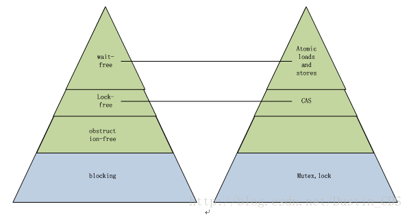
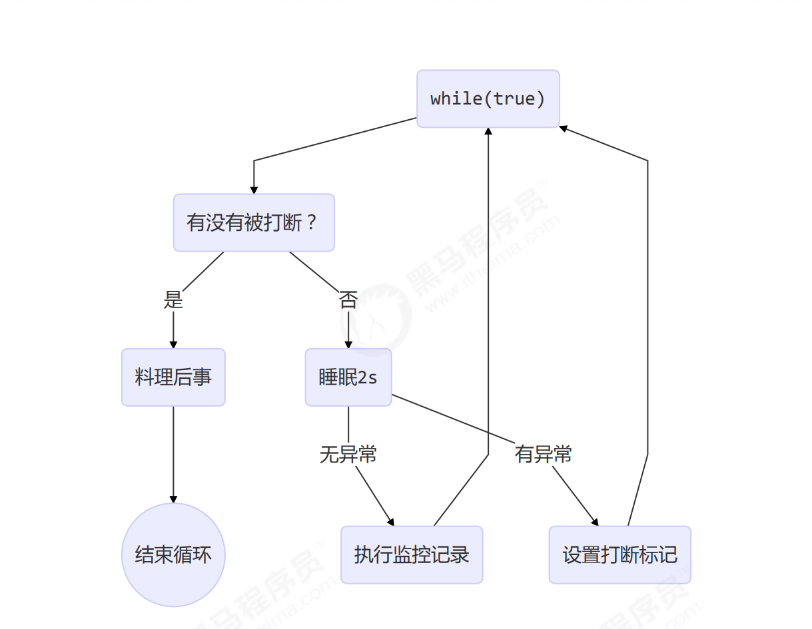
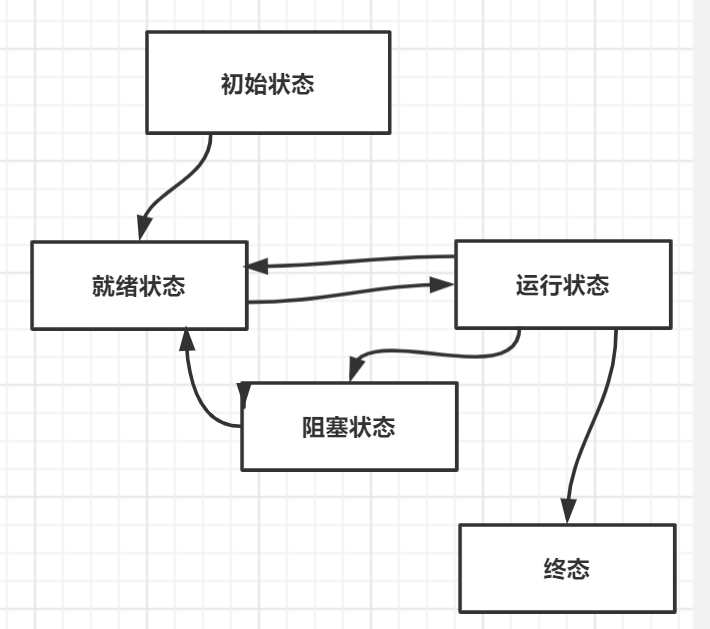
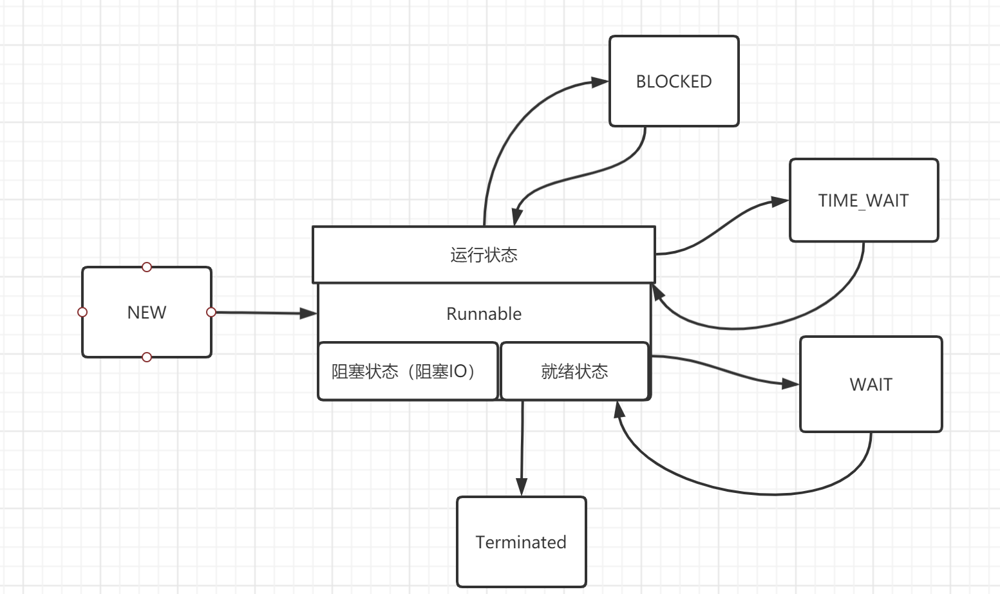
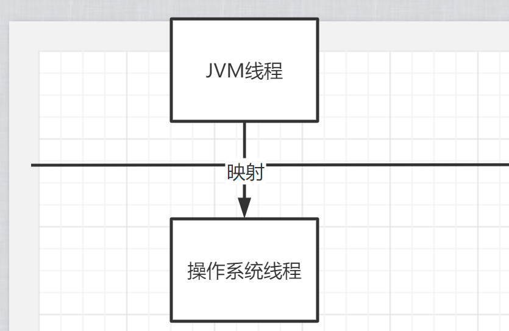

# 基本概念

## 进程、线程是什么？

### 进程

- 程序是指令和数据组成，是静态的，是死的。
- 进程是程序在数据集合上的一次运行活动，是动态的，是活的。进程可以看成是程序的一个实例、实体（Entity）。
  - 有的程序可以启动多个进程（记事本）	，有的只能启动一个进程（网易云）。
- 进程是资源分配和调度的kj基本单位。
- 进程是线程的容器，一个进程内可以有多个线程。

### 线程

- 线程是最小的调度单位。
- 线程是轻量级的进程
- 多个线程共享进程的资源
  - JVM中堆和方法区是线程共享的。
  - 程序计数器PC、虚拟机栈、本地方法栈是线程私有的。
  - 注意：Java虚拟机本身就是一个进程，该进程只支持一个Java程序。（在一个JVM进程中，有且只有一个进程；JVM进程本身）

## 线程和进程的区别 参考汤小丹

从调度性、并发性、系统开销、和拥有资源进行比较

- ### 调度

​	进程作为资源拥有的基本单位，线程作为调度和分派的基本单位。

- ### 拥有资源 

​	进程是拥有资源的基本单位，线程基本上不拥有资源，只有一点必不可少的资源。同一进程中的线程可以共享隶属于进程的资源

- ### 并发性

​	同一个进程或不同的进程里的线程都可以并发执行，线程的引入提高了并发性。

- ### 系统开销

​	线程创建、销毁、上下文切换、线程之间的通信开销都比进程的小。
​	进程通信
​		不同主机的进程通信：使用网络
​		同一主机的进程通信：IPC

## 进程和线程的联系

​	进程可以看做是程序的实体，是程序在数据集合上的一次运行活动。
​	进程是线程的容器，为线程的执行提供的基本的环境，线程可以使用从属进程的资源。
​	在JVM的内存模型中，堆和常量池属于jvm进程的，可以被线程共享。而PC、虚拟栈、本地方法栈这些线程必不可少的资源则是线程私有的。为什么这些资源必不可少？保证并发性

- ### Jvm 是在内存中实现的，线程也是jvm创建的，那么java的线程属用户级线程吗？

​	不是的，java中的线程是混合型的，用户级线程和内核级线程混合。

## 并发Concurrent 和并行 Parallel

​	并发是指一段时间内做多件事，但是同一时刻只能做一件事（单核cpu）
​	并行使指同一时刻做多件事。多核cpu中既有并发也有并行。因为核心数远远比不上线程数。

## 同步sync和异步async

​	同步、异步关注的是方法调用。
​	同步方法调用指调用者必须等待调用方法结果返回之后才能继续进行。
​	异步方法调用中调用者不用等到结果返回就能继续进行。

## 临界区

​	使用到临界资源的代码块

## 阻塞与非阻塞

​	阻塞指的是多个线程之间的影响，当一个线程占用某个临界区资源，那么其他需要这个临界区资源的线程必须在临界区等待。	

## 并发级别

并发等级从低到高：阻塞、无饥饿、无障碍、无锁、无等待

蓝色是阻塞等级、绿色是非阻塞等级、右边为具体实现（图中无 无饥饿）

## 线程安全三大性质

原子性、可见性、有序性

### 原子性：

# Java线程

## 线程创建与运行

1. ### 使用Thread匿名内部类

   ~~~java
   Thread t1 = new Thread(){
       public void run(){
           System.out.println("t1");
       }
   };
   t1.start();//运行线程
   ~~~

   

2. ### 使用Runnable匿名内部类

   ~~~java
   Thread t1 = new Thread(
       new Runnable() {
           @Override
           public void run() {
               //System.out.println("t1");
               log.debug("t1Running");
           }
       }
       ,"t1Name");
   t1.start();
   ~~~

   - ### 使用Lamda简化，实际上和方法2一样。

   ~~~java
   Thread t3 = new Thread(()->log.debug("t3Running"),"t3Name");
   t3.start();
   ~~~

   ### 3.使用FutureTask配合Thread，FutureTask 依赖 Callable（异步调用）

   - FutureTask对Runnable进行了扩展。间接实现Runnable。还继承了Future，Future有get()方法可以返回结果。FutureTask有返回结果

     ~~~java
     FutureTask implements RunnableFuture
     RunnableFuture extends Runnable, Future<V>
     ~~~

   - Callable可以看成进化版的Runnable，Callable里面的Call方法相当于一个有返回值且可以抛出异常的Run方法。

   - Callable  相当于 Runnable 。Thread 相当于  FutureTask 

   ~~~java
   //第三种 FutureTask
   FutureTask<Integer> task = new FutureTask<>(new Callable<Integer>() {
       @Override
       public Integer call() throws Exception {
           log.debug("CallableRunning");
           Thread.sleep(1000);
           return 100;
       }
   });
   Thread t4 = new Thread(task,"t4Name");
   t4.start();
   log.debug("MainRunning");
   log.debug("{}",task.get());//get 方法会使Main线程阻塞，等待结果返回
   ~~~

- ## Start 和 run 的区别

  ​	start方法可以创建线程，而run只是执行线程里的run方法，不会创建一个新的线程。

## Thread与Runnable对比

1. Thread是一个类，Runnable是一个接口而且是一个FunctionalInterface，只有run方法。
2. 使用Thread实现，线程喝任务合并在一起，而Runnable使得任务喝线程分离。
3. Runnable 脱离了Thread ，更灵活

## 线程上下文切换 Thread Context Switch

定义：cpu停止执行当前线程转而执行另外一个线程

## 上下文切换的时机

- 线程的CPU时间片用完
- 垃圾回收（垃圾回收也是一个线程）
- 有更高优先级的线程
- 主动调用sleep wait等方法

## Sleep

~~~java
Thread.sleep(1000);//让当前线程睡眠1000毫秒 = 1 秒
    public static void main(String[] args) throws InterruptedException {
        Thread t1 = new Thread("t1") {

            @Override
            public void run() {
                try {
                    Thread.sleep(2000);//在线程t1调用这个语句，t1睡眠 2 秒
                } catch (InterruptedException e) {
                    e.printStackTrace();
                }

            }
        };
        log.debug(""+t1.getState());
        t1.start();
        log.debug(""+t1.getState());
        Thread.sleep(1000);//main线程睡眠1秒
        //t1.interrupt();//中断t1 
        log.debug(""+t1.getState());

    }
    
~~~

- 使用TimeUnit 提高可读性

  ~~~java
  TimeUnit.SECONDS.sleep(1);
  //相当于  睡眠1 秒 
  Thread.sleep(1000);
  ~~~

  

## Sleep 和 Yield对比		

### Sleep 

- 线程从Running 变为Time Waitting 状态
- 线程可以被中断
- 到达时机会自动变回Runnable

### Yield

- 线程从Running变为Runnable状态
- 让出CPU，让操作系统任务调度器重新调度线程

## Join

用于让本线程等待线程结束，进入阻塞状态，再唤醒本线程

~~~java
static int r = 0;
public static void main(String[] args) throws InterruptedException {
     test1();
}
private static void test1() throws InterruptedException {
     log.debug("开始");
     Thread t1 = new Thread(() -> {
     log.debug("开始");
     sleep(1);
     log.debug("结束");
     r = 10;
     });
     t1.start();
     t1.join();//main线程等待t1结束才继续运行下面的代码
     log.debug("结果为:{}", r);
     log.debug("结束");
}
~~~

- join还可设置时效参数，join(1000)表示最多等待1秒，1秒之后目标线程不管是否结束，本线程仍然继续执行。

## Interrupt

打断被阻塞线程和打断正常线程是不一样的

- ### 打断被阻塞线程（sleep,wait,join）

  - 线程会恢复为runnable状态并且抛出一个中断异常，但是线程的中断标志会复位，最后仍然为IsInterrupt = false

- ### 打断正常线程

  - 线程会继续运行，但是线程的中断标志:IsInterrupt =true 表示线程被其他线程打断了。

## 设计模式 两阶段终止

- ### 实现代码

~~~java
Thread t1;
public  void start(){
    t1 = new Thread(()->{
        while(true){
            Thread curT = Thread.currentThread();
            if(curT.isInterrupted()){
                log.debug("处理后事");
                break;//跳出循环，结束线程
            }
            try {
                Thread.sleep(1000);
                log.debug("工作：进行监控记录");
            } catch (InterruptedException e) {
                e.printStackTrace();
                curT.interrupt();//将中断标志置为真
            }
        }
    },"t1");
    t1.start();
}
public void stop(){
    t1.interrupt();
}
~~~

## 守护线程Daemon

一般情况下，Java进程内全部线程执行结束，java进程才会结束。但是守护线程是个例外，守护线程用于为别的线程服务。如果进程中只存在守护线程，那么这个java进程仍然会结束。

- 垃圾回收线程就是一种守护线程
- Tomcat的Acceptor 和Poller也是守护线程

## 线程状态

### 五种状态----从操作系统的角度来看

### 六种状态----从JVM的角度来看,Java 的层面

https://my.oschina.net/goldenshaw/blog/705397

- JVM的线程是对操作系统线程的封装。JVM将线程映射为操作系统的线程，线程的调度也由操作系统的任务调度器决定。

- JVM线程的状态切换一般只与JVM层面的操作有关。阻塞IO是操作系统层面的操作，所以阻塞IO时，操作系统层的线程属于阻塞状态，而对应的JVM线程仍然是RUNNABLE 状态。

  

# Volatile

## Volatile底层实现

底层使用汇编的Lock指令：Lock做前缀的指令，如 lock addl $0x0, （%esp）。使用CPU缓存一致性协议

### JMM中的工作内存和CPU缓存的关系？

​	JMM中的工作内存其实并不存在，工作内存的底层涵盖了CPU的缓存、寄存器以及其他硬件和编译优化。（Java的拿来主义，JMM中各个线程工作内存并没有具体实现，而是一个抽象概念，具体实现交给硬件）。由此可见，Volatile的一致性是靠Lock指令实现的。

### Lock指令如何保证缓存一致性？

有两步：

- 将当前处理器缓存行写回系统内存。
- 使得其他CPU的对该内存地址的缓存失效。（涉及CPU嗅探机制）

第一步：

- 总线锁：早期的处理器执行Lock前缀指令时，会声言Lock#信号，此时总线会锁住，内存只能被声言了Lock#信号的处理器访问。
- 缓存一致性协议：而现代处理器一般都采用缓存一致性协议，通过锁定缓存来实现缓存一致性。

第二步：处理器嗅探到缓存对应的内存被修改，则使缓存行失效。

### CPU嗅探

处理器的操作会在总线上广播，并且处理器会有嗅探器用于接受其他处理器发出的广播信号。根据接受的信号改变缓存行的姿态

### Intel的缓存一致性协议 --MESI 

缓存具有4种状态：Modified修改 Exclusive独占 Shared共享 Invalid无效。通过嗅探得到的信息，决定状态变化。

嗅探到有第二份缓存要装入另外的处理器时，设置缓存状态为s，当要修改缓存时，锁定缓存：设置缓存状态为M，将缓存写回内存，其他处理器嗅探到之后将对于缓存设置为无效。

详情见：https://cloud.tencent.com/developer/article/1707875

### 总线风暴？

### Volatile 内存屏障

下面是基于保守策略的JMM内存屏障插入策略：

- **在每个volatile写操作的前面插入一个StoreStore屏障**。
- **在每个volatile写操作的后面插入一个StoreLoad屏障**。
- **在每个volatile读操作的后面插入一个LoadLoad屏障**。
- **在每个volatile读操作的后面插入一个LoadStore屏障**。

