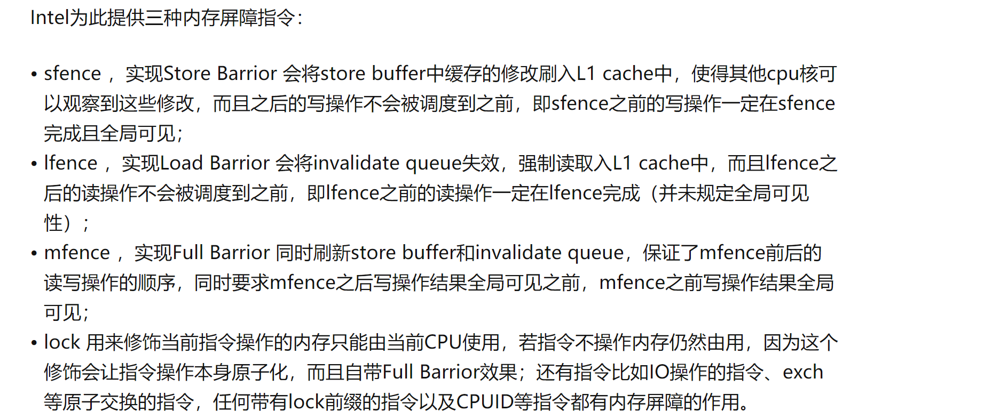
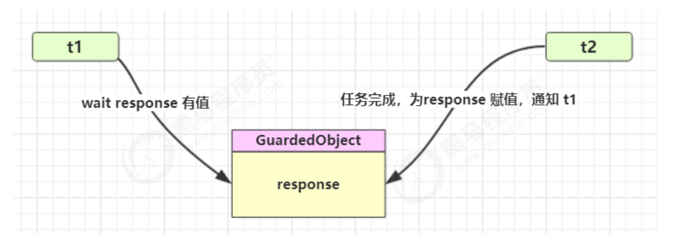
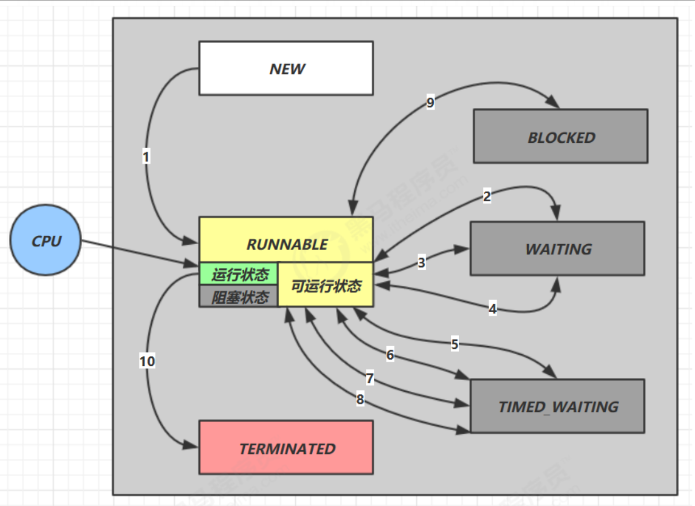

# 基本概念

## 进程、线程是什么？

### 进程

- 程序是指令和数据组成，是静态的，是死的。
- 进程是程序在数据集合上的一次运行活动，是动态的，是活的。进程可以看成是程序的一个实例、实体（Entity）。
  - 有的程序可以启动多个进程（记事本）	，有的只能启动一个进程（网易云）。
- 进程是资源分配和调度的基本单位。
- 进程是线程的容器，一个进程内可以有多个线程。

### 线程

- 线程是最小的调度单位。
- 线程是轻量级的进程
- 多个线程共享进程的资源
  - JVM中堆和方法区是线程共享的。
  - 程序计数器PC、虚拟机栈、本地方法栈是线程私有的。
  - 注意：Java虚拟机本身就是一个进程，该进程只支持一个Java程序。（在一个JVM进程中，有且只有一个进程；JVM进程本身）

## 线程和进程的区别 参考汤小丹

从调度性、并发性、系统开销、和拥有资源进行比较

- ### 调度

​	进程作为资源拥有的基本单位，线程作为调度和分派的基本单位。

- ### 拥有资源 

​	进程是拥有资源的基本单位，线程基本上不拥有资源，只有一点必不可少的资源。同一进程中的线程可以共享隶属于进程的资源

- ### 并发性

​	同一个进程或不同的进程里的线程都可以并发执行，线程的引入提高了并发性。

- ### 系统开销

​	线程创建、销毁、上下文切换、线程之间的通信开销都比进程的小。
​	进程通信
​		不同主机的进程通信：使用网络
​		同一主机的进程通信：IPC

## 进程和线程的联系

​	进程可以看做是程序的实体，是程序在数据集合上的一次运行活动。
​	进程是线程的容器，为线程的执行提供的基本的环境，线程可以使用从属进程的资源。
​	在JVM的内存模型中，堆和常量池属于jvm进程的，可以被线程共享。而PC、虚拟栈、本地方法栈这些线程必不可少的资源则是线程私有的。为什么这些资源必不可少？保证并发性

- ### Jvm 是在内存中实现的，线程也是jvm创建的，那么java的线程属用户级线程吗？

​	不是的，java中的线程是混合型的，用户级线程和内核级线程混合。

## 并发Concurrent 和并行 Parallel

​	并发是指一段时间内做多件事，但是同一时刻只能做一件事（单核cpu）
​	并行使指同一时刻做多件事。多核cpu中既有并发也有并行。因为核心数远远比不上线程数。

## 同步sync和异步async

​	同步、异步关注的是方法调用。
​	同步方法调用指调用者必须等待调用方法结果返回之后才能继续进行。
​	异步方法调用中调用者不用等到结果返回就能继续进行。

## 临界区

### 	对共享资源进行读写操作的代码段

## 阻塞与非阻塞

​	阻塞指的是多个线程之间的影响，当一个线程占用某个临界区资源，那么其他需要这个临界区资源的线程必须在临界区等待。	

## 并发级别

并发等级从低到高：阻塞、无饥饿、无障碍、无锁、无等待

蓝色是阻塞等级、绿色是非阻塞等级、右边为具体实现（图中无 无饥饿）

## 线程安全三大性质

原子性、可见性、有序性

### 原子性：

## 线程同步和线程互斥

# Java线程

## 线程创建与运行

1. ### 使用Thread匿名内部类

   ~~~java
   Thread t1 = new Thread(){
       public void run(){
           System.out.println("t1");
       }
   };
   t1.start();//运行线程
   ~~~

   

2. ### 使用Runnable匿名内部类

   ~~~java
   Thread t1 = new Thread(
       new Runnable() {
           @Override
           public void run() {
               //System.out.println("t1");
               log.debug("t1Running");
           }
       }
       ,"t1Name");
   t1.start();
   ~~~

   - ### 使用Lamda简化，实际上和方法2一样。

   ~~~java
   Thread t3 = new Thread(()->log.debug("t3Running"),"t3Name");
   t3.start();
   ~~~

   ### 3.使用FutureTask配合Thread，FutureTask 依赖 Callable（异步调用）

   - FutureTask对Runnable进行了扩展。间接实现Runnable。还继承了Future，Future有get()方法可以返回结果。FutureTask有返回结果

     ~~~java
     FutureTask implements RunnableFuture
     RunnableFuture extends Runnable, Future<V>
     ~~~

   - Callable可以看成进化版的Runnable，Callable里面的Call方法相当于一个有返回值且可以抛出异常的Run方法。

   - Callable  相当于 Runnable 。Thread 相当于  FutureTask 

   ~~~java
   //第三种 FutureTask
   FutureTask<Integer> task = new FutureTask<>(new Callable<Integer>() {
       @Override
       public Integer call() throws Exception {
           log.debug("CallableRunning");
           Thread.sleep(1000);
           return 100;
       }
   });
   Thread t4 = new Thread(task,"t4Name");
   t4.start();
   log.debug("MainRunning");
   log.debug("{}",task.get());//get 方法会使Main线程阻塞，等待结果返回
   ~~~

- ## Start 和 run 的区别

  ​	start方法可以创建线程，而run只是执行线程里的run方法，不会创建一个新的线程。

## Thread与Runnable对比

1. Thread是一个类，Runnable是一个接口而且是一个FunctionalInterface，只有run方法。
2. 使用Thread实现，线程和任务合并在一起，而Runnable使得任务和线程分离。
3. Runnable 脱离了Thread ，更灵活

## 线程上下文切换 Thread Context Switch

定义：cpu停止执行当前线程转而执行另外一个线程

## 上下文切换的时机

- 线程的CPU时间片用完
- 垃圾回收（垃圾回收也是一个线程）
- 有更高优先级的线程
- 主动调用sleep wait等方法

## Sleep

~~~java
Thread.sleep(1000);//让当前线程睡眠1000毫秒 = 1 秒
    public static void main(String[] args) throws InterruptedException {
        Thread t1 = new Thread("t1") {

            @Override
            public void run() {
                try {
                    Thread.sleep(2000);//在线程t1调用这个语句，t1睡眠 2 秒
                } catch (InterruptedException e) {
                    e.printStackTrace();
                }

            }
        };
        log.debug(""+t1.getState());
        t1.start();
        log.debug(""+t1.getState());
        Thread.sleep(1000);//main线程睡眠1秒
        //t1.interrupt();//中断t1 
        log.debug(""+t1.getState());

    }
    
~~~

- 使用TimeUnit 提高可读性

  ~~~java
  TimeUnit.SECONDS.sleep(1);
  //相当于  睡眠1 秒 
  Thread.sleep(1000);
  ~~~

  

## Sleep 和 Yield对比		

### Sleep 

- 线程从Running 变为Time Waitting 状态
- 线程可以被中断
- 到达时机会自动变回Runnable

### Yield

- 线程从Running变为Runnable状态
- 让出CPU，让操作系统任务调度器重新调度线程

## Join

用于让本线程等待线程结束，进入阻塞状态，再唤醒本线程

~~~java
static int r = 0;
public static void main(String[] args) throws InterruptedException {
     test1();
}
private static void test1() throws InterruptedException {
     log.debug("开始");
     Thread t1 = new Thread(() -> {
     log.debug("开始");
     sleep(1);
     log.debug("结束");
     r = 10;
     });
     t1.start();
     t1.join();//main线程等待t1结束才继续运行下面的代码
     log.debug("结果为:{}", r);
     log.debug("结束");
}
~~~

- join还可设置时效参数，join(1000)表示最多等待1秒，1秒之后目标线程不管是否结束，本线程仍然继续执行。

## Interrupt

打断被阻塞线程和打断正常线程是不一样的

- ### 打断被阻塞线程（sleep,wait,join）

  - 线程会恢复为runnable状态并且抛出一个中断异常，但是线程的中断标志会复位，最后仍然为IsInterrupt = false

- ### 打断正常线程

  - 线程会继续运行，但是线程的中断标志:IsInterrupt =true 表示线程被其他线程打断了。

## 设计模式 两阶段终止

- ### 实现代码

~~~java
Thread t1;
public  void start(){
    t1 = new Thread(()->{
        while(true){
            Thread curT = Thread.currentThread();
            if(curT.isInterrupted()){
                log.debug("处理后事");
                break;//跳出循环，结束线程
            } 
            try {
                Thread.sleep(1000);
                log.debug("工作：进行监控记录");
            } catch (InterruptedException e) {
                //sleep() 被interrupt之后，会置中断标志为假
                e.printStackTrace();
                curT.interrupt();//重新将中断标志置为真
            }
        }
    },"t1");
    t1.start();
}
public void stop(){
    t1.interrupt();
}
~~~

## 守护线程Daemon

一般情况下，Java进程内全部线程执行结束，java进程才会结束。但是守护线程是个例外，守护线程用于为别的线程服务。如果进程中只存在守护线程，那么这个java进程仍然会结束。

- 垃圾回收线程就是一种守护线程
- Tomcat的Acceptor 和Poller也是守护线程

## 线程状态

### 五种状态----从操作系统的角度来看

### 六种状态----从JVM的角度来看,Java 的层面

#### wait 和blocked 区别：

wait无权竞争锁，在等待唤醒 notify()。blocked的线程在等待竞争锁

https://my.oschina.net/goldenshaw/blog/705397

- JVM的线程是对操作系统线程的封装。JVM将线程映射为操作系统的线程，线程的调度也由操作系统的任务调度器决定。

- JVM线程的状态切换一般只与JVM层面的操作有关。阻塞IO是操作系统层面的操作，所以阻塞IO时，操作系统层的线程属于阻塞状态，而对应的JVM线程仍然是RUNNABLE 状态。

  

# Synchronized 入门

## Synchronized用法

~~~java
public class Test(){
    
}
~~~

1. ~~~java
   public class Test(){
       synchronized (this){
       //临界区代码
   	}
       synchronized (Test.class){//锁住了这个class对象，一个类只有一个class对象
   	//临界区代码	
       }
   	//上面两段代码锁住的不是同一个对象
       //第一段代码，锁住的是this，是Test对象。
       //下面的锁住Test.class对象，是类对象,一个类只有一个class对象，用于保持这个类的信息
   }
   
   ~~~

2. ~~~java
   public class Test(){
       public synchronized void test(){
   	//临界区代码
   	}
       //相当于：
       //synchronized (this){
      		//临界区代码
   	//}
       public synchronized static void test(){
           //临界区代码
       }
        //synchronized (Test.class){ 锁住了这个类
      		//临界区代码
   	//}
   }
   ~~~

   

# 线程安全问题

## 不同类型变量的线程安全问题

- ### 成员变量和静态变量

  - 如果没被共享，是线程安全的
  - 如果被共享了
    - 如果只有读操作，是线程安全的
    - 如果有读写操作，不安全

- ### 局部变量

  - 局部变量是安全的
  - 局部变量可能会引用对象，它引用的对象不一定是安全的
    - 如果对象作用域在方法内（局部变量属于的方法），是线程安全的
    - 否则，要考虑线程安全问题

## 局部变量线程安全性

- 局部变量是个基本类型变量，没有引用对象。
  - 线程安全
- 局部变量是个引用
  - 如果引用没有暴露，是安全的
  - 引用暴露，可能不安全

### 局部变量引用暴露例子

~~~java
class ThreadSafe {
    public final void method1(int loopNumber) {
        ArrayList<String> list = new ArrayList<>();//这个List是个局部变量
        for (int i = 0; i < loopNumber; i++) {
            method2(list);
            method3(list);
        }
    }
    private void method2(ArrayList<String> list) {
        list.add("1");
    }
    private void method3(ArrayList<String> list) {
        list.remove(0);
    }
}
class ThreadSafeSubClass extends ThreadSafe{
    @Override
    public void method3(ArrayList<String> list) {
        new Thread(() -> {
            list.remove(0);//这个方法的使得局部变量list暴露给了这个匿名线程	
        }).start();
    }
}

~~~

## 线程安全类

- String 

- Integer 

- StringBuffer 

- Random 

- Vector 

- Hashtable 

- java.util.concurrent  JUC 包下的类

  线程安全是指：

  - 它们的每个方法是原子的

  - 注意:它们方法的组合不说原子的

    ~~~java
    //原子方法的组合不是 原子的
    Hashtable<String,Integer> ht = new Hashtable<>();
    if(ht.get("key") == null){
        ht.put("key",1);	
    }
    ~~~

    

# Volatile

## Volatile原理

Volatile底层原理是内存屏障

- 在volatile 变量写操作后插入写屏障
- 在volatile变量读操作前插入读屏障

### 1. 可见性

- 写屏障前的变量，同步到主内存中 (写屏障用于将变量写进内存
- 读屏障后的变量，读取主内存到工作内存中(读屏障用于工作内存同步，即读主内存中的变量

### 2. 有序性

- 写屏障前的代码不会排到写屏障后
- 读屏障后的代码不会排到读屏障前

## Volatile底层实现

底层使用内存屏障实现。底层使用汇编的Lock指令：Lock做前缀的指令，如 lock addl $0x0, （%esp）。使用CPU缓存一致性协议。Lock指令相当于一个内存屏障。

- ​		Lock指令其实就是个内存屏障指令
  - ​		
- 内存屏障详情：https://monkeysayhi.github.io/2017/12/28/%E4%B8%80%E6%96%87%E8%A7%A3%E5%86%B3%E5%86%85%E5%AD%98%E5%B1%8F%E9%9A%9C/

### JMM中的工作内存和CPU缓存的关系？

​	JMM中的工作内存其实并不存在，工作内存的底层涵盖了CPU的缓存、寄存器以及其他硬件和编译优化。（Java的拿来主义，JMM中各个线程工作内存并没有具体实现，而是一个抽象概念，具体实现交给硬件）。由此可见，Volatile的一致性是靠Lock指令实现的。

### Lock指令如何保证缓存一致性？

有两步：

- 将当前处理器缓存行写回系统内存。
- 使得其他CPU的对该内存地址的缓存失效。（涉及CPU嗅探机制）

第一步：

- 总线锁：早期的处理器执行Lock前缀指令时，会声言Lock#信号，此时总线会锁住，内存只能被声言了Lock#信号的处理器访问。
- 缓存一致性协议：而现代处理器一般都采用缓存一致性协议，通过锁定缓存来实现缓存一致性。

第二步：处理器嗅探到缓存对应的内存被修改，则使缓存行失效。

### CPU嗅探

处理器的操作会在总线上广播，并且处理器会有嗅探器用于接受其他处理器发出的广播信号。根据接受的信号改变缓存行的状态

### Intel的缓存一致性协议 --MESI 

缓存具有4种状态：Modified修改 Exclusive独占 Shared共享 Invalid无效。通过嗅探得到的信息，决定状态变化。

嗅探到有第二份缓存要装入另外的处理器时，设置缓存状态为s，当要修改缓存时，锁定缓存：设置缓存状态为M，将缓存写回内存，其他处理器嗅探到之后将对于缓存设置为无效。

详情见：https://cloud.tencent.com/developer/article/1707875

### 总线风暴？

### 保证指令有序性Volatile 内存屏障

下面是基于保守策略的JMM内存屏障插入策略：

- **在每个volatile写操作的前面插入一个StoreStore屏障**。
- **在每个volatile写操作的后面插入一个StoreLoad屏障**。
- **在每个volatile读操作的后面插入一个LoadLoad屏障**。
- **在每个volatile读操作的后面插入一个LoadStore屏障**。

## DCL 双重校验锁

~~~java
//为了实现单例模式

if(INSTANCE == NULL){
    synchronized()
}
~~~

##  总结 

- 硬件层面的可见性和有序性
  - MESI
  - 内存屏障
- JVM层面的可见性和有序性
  - volatile 变量没有缓存（在jmm模型中）
  - 字节码编译器识别到volatile标记，保证有序性

如果硬件层面保证可见性和有序性（MESI协议保证可见性），JVM的Volatile就是个空标记不会插入内存屏障。否则Volatile 底层使用内存屏障保证volatile变量的可见性和有序性。jvm在写volatile变量之后插入sfence，读volatile变量前插入lfence。

### 插入的sfence、lfence如何做到保证可见性和有序性？：

有序性：

- 告诉编译器不要重排指令，保证指令有序性

可见性

- sfence 将缓存写回内存，lfence 在内存中读取缓存（刷新缓存)。

  

# CAS与原子类

## CAS

- 原子类AtomicInteger 底层使用CAS实现原子操作。关键思想就是不断比较当前的old值和预期old值，如果不一致重新获取值。
- CAS要配合volatile保证获取的当前old值是最新的

### CAS底层原理

CAS底层依赖 **Unsafe类** 直接调用操作系统底层的CAS指令 。

### CAS和Volatile并发效率（无锁）

因为没有上下文切换，在线程数少，多核CPU的情况下，效率比有锁并发 高

### CAS特点

- 乐观锁思想（一直循环，一直尝试） ，Synchronized是悲观锁
- 无锁并发、无阻塞并发

## 原子类

### AtomicInteger使用  略

### AtomicReference使用   略

### AtomicStampedReference        ABA问题   ----用版本号 解决

- ### 具体实现：AtomicStampedReference  使用一个整数类型 记录版本号

- ### 简化版：只关注是否修改过 ---- AtomicMarkableReference   使用一个boolean记录

### Atomic数组

### 原子累加器   LongAdder   优化原子类的 累加操作

## Unsafe

用于操作底层线程和内存的对象。Unsafe类 的对象不能直接创建， 只能通过反射获得。

### Unsafe  CAS有关操作 

# Synchronized 

## 基础知识

对象头组成：Mark Word + Klass Word + （数组长度）

- Mark Word ：用于存储对象和锁有关的信息

- Klass Word : 指针，指向这个对象对应的类

- 数组长度：只有对象数组有的字段

  

Lock Record 锁记录

- 进入Synchronized代码块时，会在栈帧里创建锁记录（注意，此时不是重量级锁，重量级锁使用Monitor）
- Lock Record 组成：Mark Word + Object 指针（对象指针）
  - Mark Word 用于存放对象头里面的Mark Word
  - 对象指针指向对应的锁对象。

对象头格式

锁状态

## 重量级锁

使用Monitor：管程（使用c++实现） 做为锁来锁定对象，每个对象只有一个Monitor。

Monitor组成：EntryList、WaitSet、owner。

- EntryList :等待锁的BLOCKED线程
- WaitSet : 处于wait状态的线程
- owner: 拥有Monitor的线程

加上重量级锁之后，对象头的Mark Word 指向Moniter

Monitor 结构如下 

- 刚开始 Monitor 中 Owner 为 null 
- 当 Thread-2 执行 synchronized(obj) 就会将 Monitor 的所有者 Owner 置为 Thread-2，Monitor中只能有一 个 Owner 
- 在 Thread-2 上锁的过程中，如果 Thread-3，Thread-4，Thread-5 也来执行 synchronized(obj)，就会进入 EntryList BLOCKED 
- Thread-2 执行完同步代码块的内容，然后唤醒 EntryList 中等待的线程来竞争锁，竞争的时是非公平的 
- 图中 WaitSet 中的 Thread-0，Thread-1 是之前获得过锁，但条件不满足进入 WAITING 状态的线程，后面

## 轻量级锁

### 锁头部

见基础知识 Mark Word锁状态 中轻量级锁

### 上锁过程

- JVM会先在当前线程的栈桢中创建用于存储锁记录的空间，并将对象头中的Mark Word复制到锁记录中，官方称为Displaced Mark Word。然后线程尝试使用 CAS将对象头中的Mark Word替换为指向锁记录的指针

  - 替换成功结果：

  

- CAS替换失败

  - 如果锁对象指向本线程，证明这是锁重入。添加Lock Record 作为锁重入计数(这个锁记录的Mark Word 为null)，锁重入示意图：

    

  - 如果指向其他线程，进入锁膨胀

## 锁膨胀	

锁竞争：

Thread01 获取锁失败，进入锁膨胀流程

- 申请Monitor ，将锁对象的Mark Word 替换为Monitor地址
- Thread01 进入Monitor的EntryList 

## 偏向锁

synchronized 轻量级锁 Lock record

synchronized重量级锁 Monitor

- 哪个锁自旋？轻量级锁
- 轻量级锁实现原理：CAS替换Mark Word
- 重量级锁实现原理：Monitorenter monitorexit 字节码指令，操作系统底层实现：Mutex Lock 

轻量级锁CAS操作失败情况：

- 锁属于同一个线程
- 有另外一个线程来竞争锁

# Wait-Notify

## Wait 和 Sleep 区别 

- Wait 是 Object的方法，Sleep是Thread的方法

- wait的使用 要先synchronized获得对象的锁，Sleep不用

- sleep不会释放锁，wait会释放对象的锁

- 进入的状态都是TIME_WAITING

## 使用方法

~~~java
synchronized(lock){
    while(条件不成立){//用while避免虚假唤醒
		lock.wait();
    }
}

//另外一个线程
synchronized(lock){
    lock.notifyAll();
}
~~~

# 同步模式 保护性暂停

join和future的实现采用保护性暂停的同步模式

## 实现

使用一个guardedObject对象用于两个线程的沟通（一个生产，一个消费）

~~~java
class GuardedObject{
    //结果
    private Object response;
    //获取结果
    public Object get(){
        synchronized (this){
            while(response == null){
                try {
                    this.wait();
                } catch (InterruptedException e) {
                    e.printStackTrace();
                }
            }
        }
        return response;
    }
    //存放结果
    public void complete(Object response){
        synchronized (this){
            this.response = response;
            this.notifyAll();
        }
    }
}
~~~

## 有时限等待实现

~~~java
class GuardedObject{
    //结果
    private Object response;
    //获取结果
    public Object get(long timeout){
        synchronized (this){
            long begin = System.currentTimeMillis();
            long passTime = 0;

            while(response == null){
                long waitTime = timeout - passTime;
                try {
                    if(waitTime <= 0)break;
                    this.wait(waitTime);
                } catch (InterruptedException e) {
                    e.printStackTrace();
                }
                passTime = System.currentTimeMillis() - begin;
            }
        }
        return response;
    }
    //存放结果
    public void complete(Object response){
        synchronized (this){
            this.response = response;
            this.notifyAll();
        }
    }
}
~~~

## Join原理

~~~java
 //详细看Thread里面Join方法的实现，和上述有时限等待一致
~~~

## 解耦----Future实现原理

~~~java

public class PauseTest {
    public static void main(String[] args) throws InterruptedException {
        for (int i = 0; i < 3; i++) {
            new People().start();
        }
        Thread.sleep(1000);

        for (Integer id : Mailboxes.getIds()) {
            new Postman(id,"id:"+id).start();
        }
    }
}

@Slf4j(topic = "c.People")
class People extends Thread{
    @Override
    public void run() {
        GuardedObject go = Mailboxes.createObject();
        log.debug("want to get:id {}",go.getId());
        Object mail = go.get(5000);
        log.debug("get:id {}, content:{}",go.getId(),mail);

    }
}
@Slf4j(topic = "c.Postman")
class Postman extends Thread{
    private int id;
    private String mail;
    public Postman(int id, String mail){
        this.id = id;
        this.mail = mail;
    }
    @Override
    public void run() {
        GuardedObject go =  Mailboxes.getGo(id);
        log.debug("set:id {}, content:{}",go.getId(),mail);
        go.complete(mail);
        
    }
}
//future 实现，使用一个 信箱 装载多个 GuaredObject
class Mailboxes{
    private static Map<Integer, GuardedObject> boxes = new Hashtable<>();//线程安全类
    private static int id = 1;
    private static synchronized int generateId(){
        return id++;
    }

    public static GuardedObject getGo(int id) {
        return boxes.remove(id);
    }

    public static GuardedObject createObject(){
        //因为共享变量boxes是使用线程安全类实现的，
        // 所以不用加synchronize
        GuardedObject go = new GuardedObject(generateId());
        boxes.put(go.getId(),go);
        return go;
    }
    public static Set<Integer> getIds(){
        //因为共享变量boxes是使用线程安全类实现的，
        // 所以不用加synchronize
        return boxes.keySet();
    }
}
class GuardedObject {
    //ID用于标识
    private  int id;
    //结果
    private Object response;

    public GuardedObject(int id){
        this.id = id;
    }

    public int getId() {
        return id;
    }
    //获取结果

    public Object get(long timeout){
        synchronized (this){
            long begin = System.currentTimeMillis();
            long passTime = 0;

            while(response == null){
                long waitTime = timeout - passTime;
                try {
                    if(waitTime <= 0)break;
                    this.wait(waitTime);
                } catch (InterruptedException e) {
                    e.printStackTrace();
                }
                passTime = System.currentTimeMillis() - begin;
            }
        }
        return response;
    }
    //存放结果
    public void complete(Object response){
        synchronized (this){
            this.response = response;
            this.notifyAll();
        }
    }
}
~~~

# 异步模式 生产者消费者	

~~~java
package com.consumer;

import lombok.extern.slf4j.Slf4j;

import java.util.LinkedList;

import static jdk.nashorn.internal.runtime.regexp.joni.Config.log;

public class MessageQueueTest {
    public static void main(String[] args) {
        MessageQueue que = new MessageQueue(2);
        for (int i = 0; i < 3; i++)  {
            int id = i;
            new Thread(()->{
                que.put(new Message(id,"内容:"+ id));
            },"生产者"+ i).start();
        }
        new Thread(()->{
            while(true){
                try {
                    Thread.sleep(1000);
                } catch (InterruptedException e) {
                    e.printStackTrace();
                }
                Message message =  que.get();
            }

        },"消费者").start();
    }

}
@Slf4j(topic = "c.MessageQueue")
class MessageQueue{
    private LinkedList<Message> list = new LinkedList<>();
    private int capacity;
    public MessageQueue(int capacity){
        this.capacity = capacity;

    }
    public void put(Message message){
        synchronized (list){
            while(list.size() == capacity){
                try {
                    log.debug("队列满了，");
                    list.wait();
                } catch (InterruptedException e) {
                    e.printStackTrace();
                }
            }

            list.addLast(message);
            log.debug("放置："+message.toString());
            list.notifyAll();
        }
    }
    public Message get(){
        synchronized (list){
            while(list.isEmpty()){
                try {
                    log.debug("队列空了");
                    list.wait();
                } catch (InterruptedException e) {
                    e.printStackTrace();
                }
            }
            Message message = list.removeFirst();
            log.debug("拿取："+message.toString());
            list.notifyAll();
            return message;

        }
    }
}
final class Message{
    private int id;
    private Object value;
    public Message(int id, Object value){
        this.id = id;
        this.value = value;

    }

    @Override
    public String toString() {
        return "Message{" +
                "id=" + id +
                ", value=" + value +
                '}';
    }
}
~~~

# Park & Unpark

## 使用

~~~java
public class ParkTest {
    public static void main(String[] args) throws InterruptedException {
        Thread t1 = new Thread(()->{
            log.debug("start");
            try {
                Thread.sleep(2000);
            } catch (InterruptedException e) {
                e.printStackTrace();
            }
            log.debug("park...");
            LockSupport.park();
        },"t1");
        t1.start();
        Thread.sleep(1000);
        log.debug("unpark");
        LockSupport.unpark(t1);//使用线程变量名 唤醒
    }

}
~~~

- 每个线程都有自己的Parker对象，由三部分组成：_ counter,__ cond ,_mutex 	
- 与wait notify比，park 和unpark 是Locksupport 的方法
  - 不需要synchronized,
  - unpark可以指定唤醒的对象

# 线程状态转换

## 情况1   NEW --> RUNNABLE 

- 调用线程t1.start()方法

## 情况2 RUNNABLE  <--> WAITING

对线程t，调用synchronized(object) 获取对象锁

- t 调用object.wait()  线程状态 runnable --> waiting
- 当其他线程 调用 object.notify() object.notifyAll() 或者t.interrupt()时
  - t 竞争锁成功，t状态： waiting -->  runnable
  - t 竞争锁失败, t状态：waiting --> blocked

## 情况3 RUNNABLE  <--> WAITING

- 当前线程 调用 t1.join() ，状态 runnable --> waiting
- 当前线程被interrupt() 或者 t1结束时 ，当前线程 waiting --> runnable

## 情况4 RUNNABLE <--> WAITING

- t1调用LockSupport.park()时，runnable --> waiting
- LockSupport.unpark(t1)或者 调用t1.interrupt(),t1 状态waiting --> runnable

## 情况5  RUNNABLE <--> TIME_WAITING

- 线程t1调用 obj.wait(long n) ，t1  状态 runnable  --> time_waiting
- t1等待时间足够n 或者调用obj.notify(),obj.notifyAll()，t1.interrupt()时
  - t1 竞争锁成功，t1状态 time_waiting -->runnable
  - t1竞争锁失败，t1 状态time_waiting --> blocked

## 情况6 RUNNABLE <--> TIME_WAITING

- 当前线程调用 t1.join(long n ) 时，当前线程状态：runnable --> time_waiting
- 到时间，或者调用当前线程interrupt() 时，当前线程time_waiting --> runnable 

## 情况7 RUNNABLE <--> TIME_WAITING

- 线程t调用 Thread.sleep(long n )时，状态:RUNNABLE --> TIME_WAITING
- 等待时间够n ，或者调用t.interrupt() ,状态：time_waiting --> runnable
  - 注意 调用sleep方法要求一定要catch 中断异常

## 情况8 RUNNABLE <--> TIME_WAITING

- 当前线程调用 LockSupport.parkNanos(long nanos) 或 LockSupport.parkUntil(long millis) 时，当前线 程从 RUNNABLE --> TIMED_WAITING 
- 调用 LockSupport.unpark(目标线程) 或调用了线程 的 interrupt() ，或是等待超时，会让目标线程从 TIMED_WAITING--> RUNNABLE

## 情况9 RUNNABLE <-->BLOCKED

- 线程t1synchronized 竞争锁失败 RUNNABLE --> BLOCKED
- 当t1竞争锁成功后，BLOCKED -->RUNNABLE

## 情况10 RUNNABLE --> TERMINATED

线程代码运行完毕，加入TERMINATED

# 死锁、活锁和饥饿

### 死锁定义

互相等待不可能发生的状态。经常发生在使用多把锁的场景下。

### 死锁定位工具

Jconsole 、Jps

### 死锁原因

1. 系统资源不足
2. 资源分配不当
3. 进程推进顺序的不合理

### 死锁条件

1. 互斥条件
2. 请求与保持条件
3. 不可剥夺条件
4. 循环等待条件

### 解决死锁方法

预防死锁、避免死锁（银行家算法）、检测死锁、解除死锁

### 死锁预防

顺序加锁，资源一次性分配、可剥夺资源

### 哲学家就餐问题

解决方法：要么拿一对筷子要么不拿。

### 活锁定义

线程都在运行，但是永远无法满足结束条件。

### 饥饿定义

某些低优先级的线程无法获得锁，无法运行

# ReentrantLock

虽然叫做重入锁，但是重入不是它特有的，synchronized也支持重入

与synchronized对比，特有：

1. 可中断（打断）
2. 可以设置超时时间
3. 可以设置为公平锁
4. 支持多个条件变量
   - 资源一次分配，解决死锁问题
   - 一个条件变量对应一个waitset ，Synchronized只有一个waitset

语法，reentrantlock 是个对象。对象级别的锁  synchronized是关键字级别的锁

~~~java
//可以理解为和synchronized一样，不过lock 和 unlock都要 显式的写出来。
//
reentrantLock.lock();//获得锁
					//1. 获得成功继续运行 下面的代码
					//2. 获得失败进入阻塞队列，竞争到锁之后继续运行下面的代码
try{
    //reentrantLock.lock(); 也可以写在try语句块里面，效果是一样的。
	//临界区
}finally{
    //释放锁
    reentrantLock.unlock();
}
~~~

### 可重入

可重入锁：指同一个线程获得了锁对象之后，可以重复获得同一个锁对象。

### 可中断

~~~java
Thread t1 = new Thread(()->{
    try{
        log.debug("尝试获得锁");
        lock.lockInterruptibly();//可打断的lock ，可以catch打断异常
    } catch (InterruptedException e) {
        log.debug("没有获得锁");
        e.printStackTrace();
    }
    try{
        log.debug("获取到了锁");
    }finally {
        lock.unlock();
    }
},"t1");
lock.lock();
t1.start();
Thread.sleep(1000);
t1.interrupt();
~~~

### 锁超时

~~~java
lock.tryLock();//立即返回结果
lock.tryLock(1, TimeUnit.SECONDS);//等待1秒,在一秒内争取获得锁
~~~

### 公平锁

调用ReentrantLock构造函数时设置fair

~~~java
ReentrantLock lock = new ReentrantLock(true);//公平锁
~~~

### 多个条件变量

~~~java
ReentrantLock lock = new ReentrantLock();
Condiction c1 = lock.newCondiction();//每个条件变量对应一个阻塞队列（一个休息室）
Condiction c2 = lock.newCondiction();
c1.await();
c1.awaitUninterruptibly();
c1.awaitNanos(nanos)
c1.signal();
c1.signalAll();
~~~

# 同步模式 顺序控制 略

# Java内存模型   JMM  

## 三个性质：原子性、可见性、有序性

## 可见性

JMM内存分为 工作内存和 主内存

- 主内存可以理解为内存
- 工作内存比较复杂，涵盖了CPU寄存器、缓存、内存。

### 设计模式  两阶段终止

结合volatile和flag变量实现

~~~java
private volatile static boolean stop;//只有一个线程对stop进行写（与犹豫模式starting对比）
private static Thread t1;
public static void main(String[] args) {
    t1 =  new Thread(()->{
        while(true){
            Thread t = Thread.currentThread();
            if(stop){
                log.debug("料理后事");
                break;
            }

            try {
                Thread.sleep(1000);
                log.debug("记录监控记录");
            } catch (InterruptedException e) {
                e.printStackTrace();

            }
        }

    },"t1");
    t1.start();
}
public void stop(){
    stop = true;//设置终止标志
    t1.interrupt();//中断线程睡眠，提前终止线程
}
~~~

### 设计模式 Balking犹豫模式

~~~java
private boolean starting = false;//因为每个线程都要读写strting, 如果只使用volatile 							//是不够的，要使用synhronized 读写
publicc void start(){
    
   	synchronized(starting){
        if(starting){
            return;
        }
        starting = true;//设置开始位为帧真
    }
    Thread thread = new Thread(....)//省略线程具体代码
    monitor.start();
}
~~~

~~~java
private volatile boolean starting = false;
private volatile boolean stop = false;
publi void start(){
    synchronized(starting){
        if(starting){
            return
        }
        starting = true
    }
    //下面是两阶段终止的代码
    
    Thread monitor = new Thread(()->{
        while(true){
            Thread t = Thread.currentThread();
            if(stop){
                log.debug("料理后事");
                starting = false;//这里没有使用同步代码块 (synchronized)
                				//因为由于模式保证只有一个线程会运行，所以此处只有								//一个线程会对变量进行修改,像两阶段终止模式一样
                				//只需要保证可见性即可，所以加上volatile
                break;
            }

            try {
                Thread.sleep(1000);
                log.debug("记录监控记录");
            } catch (InterruptedException e) {
                e.printStackTrace();

            }
        }

    },"t1");
    monitor.start();
    
    
}
~~~

DCL中VOLATILE的使用

~~~java
public class Single5 {
    private Single5(){}
    private static volatile Single5 instance;
    public static Single5 getInstance(){
        if(instance == null){//当instance != null 时，可能还没初始化，结果会出错，
            			//    所以要加上volatile
            synchronized (Single5.class){
                if(instance == null) instance = new Single5();
				//创建  实例的字节码可能出现重排,可能先赋值instance、之后再初始化
                //如果此时切换到别的线程，线程会以为Instance已经初始化了，使用					//instandce会出现问题
            }
        }
        return instance;
    }
}
~~~

## 原子性

一条指令要么做，要么不做。不出现指令交错的情况

## 有序性 

编译时，对指令重排提高执行效率（流水线cpu）

### 保证有序性 ----见 volatile 部分 的笔记 

### As-if-serial语义

对于单线程：指令重排不能改变程序执行结果

### Happens-before 规则

对于多线程：指令重排不能改变程序执行结果

## 单例模式

- 单例模式的实现方式可以分为两大类：懒汉模式和饿汉模式。
  - 饿汉：类加载的时候就创建单例对象
  - 懒汉：类加载的时候不创建单例对象，只有在首次使用该对象时才创建

### 饿汉模式

#### 实现方式一 ---- 静态成员变量

~~~java
public class Single1 {
    private  Single1(){}
    public static Single1 single1 = new Single1();
    public static Single1 getSingle1(){
        return single1;
    }
}
~~~

#### 实现方式二----静态代码块

~~~java
public class Single2 {
    private Single2(){}
    private static Single2 single2;
    static{
        single2 = new Single2();
    }
    public static Single2 getSingle2(){
        return single2;
    }
}
~~~

#### 实现方式三  枚举

~~~java
public enum Single7 {
    INSTANCE;
}
~~~

### 懒汉模式

#### 实现方式一  线程不安全

~~~java
public class Single3 {
    private Single3(){}
    private static Single3 instance;
    public static Single3 getInstance(){
        if(instance == null){
            instance = new Single3();
        }

        return instance;
    }

}
~~~

#### 实现方式二  线程安全

~~~java
public class Single4 {
    private Single4(){}
    private static Single4 instance;
    public static synchronized Single4 getInstance(){
        if(instance == null) instance = new Single4();
        return instance;
    }
}
~~~

#### 实现方式三 线程安全优化 双重校验锁

~~~java
public class Single5 {
    private Single5(){}
    private static volatile Single5 instance;
    public static Single5 getInstance(){
        if(instance == null){//当instance != null 时，可能还没初始化，结果会出错，
            			//    所以要加上volatile
            synchronized (Single5.class){
                if(instance == null) instance = new Single5();

            }
        }
        return instance;
    }
}
~~~

- 为什么要加volatile?

  - ~~~java
    //instance = new SIngle5() 分解为下面这三条代码
    
    memory = alloct();  //:1：分配对象的内存空间
    ctorinstance(memory);  //2： 初始化对象
    instace = memory;  //3:设置instace指向刚分配的内存地址
    
    //其中 指令 2 3 可能重排，实际执行情况如下：
    
    memory = alloct();  //:1：分配对象的内存空间
    instace = memory;  //3:设置instace指向刚分配的内存地址
    ctorinstance(memory);  //2： 初始化对象
    ~~~

  - 当instance != null 时，可能还没初始化，结果会出错，所以要加上volatile

#### 实现方式四  静态内部类

~~~java
public class Single6 {
    private Single6(){}
    //静态内部类  用到才加载，是懒汉式的
    private static class SingleHolder{
        private static final Single6 INSTANCE = new Single6();//final 防止被修改 
    }
    //公共访问方式
    public static Single6 getInstance(){
        return SingleHolder.INSTANCE;
    }
}
~~~

### 破坏单例模式

1. 使用序列化反序列化。文件读写，将对象转换为json等等.. 

   - 解决方法： 添加readResolve(),返回单例对象即可

     ~~~java
     private Object readResolve() {
         return this.INSTANCE;
     }
     ~~~

     

2. 反射

   - ~~~java
     public class Single6 {
         private boolean flag = false;
         private Single6(){
             synchronized(Single6.class){
                 if(flag){
                     throw new RuntimeException("不能创建多个对象");
                 }
                 flag == true;
             } 
         }
         //静态内部类
         private static class SingleHolder{
             private static final Single6 INSTANCE = new Single6();
         }
         //公共访问方式
         public static Single6 getInstance(){
             return SingleHolder.INSTANCE;
         }
     }
     ~~~

# 无锁并发

- ## 无锁并发靠 CAS和Volatile实现

  - CAS封装在AtomicInteger 等原子类中
  - 调用关系： AtomicInteger   ----> Unsafe ---->操作系统底层 cmpxchg

~~~java
class AccountCas implements Account {
    private AtomicInteger balance;
    public AccountCas(Integer balance){
        this.balance = new AtomicInteger(balance);
    }
    @Override
    public Integer getBalance() {
        return balance.get();
    }

    @Override
    public void withdraw(Integer amount) {
        while (true) {
            int prev = balance.get();
            int next = prev - amount;
            if (balance.compareAndSet(prev, next)) {
                break;
            }
        }
    }
}
~~~

### CAS和原子类 相关部分 见CAS与原子类  部分的笔记

# 享元模式    略

# 并发工具

## 线程池

### 自定义线程池实现

#### 阻塞队列 TaskQueue

~~~java
class BlockingQueue<T>{
    //1. 任务队列
    private Deque<T> que = new ArrayDeque<>();
    //2. 锁
    private ReentrantLock lock = new ReentrantLock();
    //3. 队列空 条件变量
    Condition emptyWaitSet = lock.newCondition();
    //4. 队列满 条件变量
    Condition fullWaitSet = lock.newCondition();
    //5. 容量
    private int capacity;

    public BlockingQueue(int capacity) {
        this.capacity = capacity;
    }

    //消费者 和 生产者 拿/放任务的方法
    //生产者放
    public void put(T element){
        lock.lock();
        try{
            while (que.size() == capacity){
                try {
                    fullWaitSet.await();
                } catch (InterruptedException e) {
                    e.printStackTrace();
                }
            }
            que.addFirst(element);
            emptyWaitSet.signal();
        } finally {
            lock.unlock();
        }
    }
    //消费者 带超时阻塞获取
    public T poll(long timeout, TimeUnit unit){
        lock.lock();
        try {
            long nanos = unit.toNanos(timeout);//时间转化为纳秒
            while(que.isEmpty()){
                try {
                    if(nanos<=0){
                        return null;
                    }
                    nanos = emptyWaitSet.awaitNanos(nanos);//返回剩余时间
                } catch (InterruptedException e) {
                    e.printStackTrace();
                }

            }
            T t = que.removeLast();
            fullWaitSet.signal();
            return t;
        } finally {
            lock.unlock();
        }
    }
    //阻塞获取
    public T take(){
        lock.lock();
        try {
            while(que.isEmpty()){

                try {
                    emptyWaitSet.await();
                } catch (InterruptedException e) {
                    e.printStackTrace();
                }
            }
            T t = que.removeLast();
            fullWaitSet.signal();
            return t;
        } finally {
            lock.unlock();
        }

    }
    //获取队列大小
    public int size(){
        lock.lock();
        try{
            return que.size();
        }finally {
            lock.unlock();
        }
    }
}
~~~

#### 线程池 和 Worker线程

~~~java
class ThreadPool{
    private BlockingQueue<Runnable> taskQue;
    private HashSet<Worker> workers= new HashSet<>();
    private int coreSize;
    private long timeout;
    private TimeUnit timeunit;
    public ThreadPool(int coresize, long timeout, TimeUnit timeunit, int capacity){
        this.coreSize = coresize;
        this.timeout = timeout;
        this.timeunit = timeunit;
        this.taskQue = new BlockingQueue<>(capacity);

    }
    public void execute(Runnable task){
        //
        if(workers.size() < coreSize){//任务没有超过核心数，直接交给worker执行
            Worker worker = new Worker(task);
            log.debug("添加任务{}",worker);
            workers.add(worker);
            worker.start();
        }else{//任务超过核心数，放到阻塞队列
            log.debug("任务添加到阻塞队列{}",task);
            taskQue.put(task);
        }
    }
    class Worker extends Thread{
        private Runnable task;
        public Worker(Runnable task){
            this.task = task;
        }

        @Override
        public void run() {
            //执行任务
            //1. 当task不为空，继续执行
            //2. task执行完了，去taskque拿下一个任务
            while(task != null || (task = taskQue.take() )!= null){
                try{
                    log.debug("执行：{}",task);
                    task.run();

                } catch (Exception e){
                    e.printStackTrace();
                }finally {
                    task = null;
                }
            }
            synchronized (workers){//执行完毕证明这个worker线程没有必要存在了  
                                    //注意：这个时候taskpoll里面是没有任务的，所以这个去掉这个  worker线程
                log.debug("worker 移除:{}",this);
                workers.remove(this);
            }
        }
    }
}
~~~

#### 测试代码

~~~java
public class PoolTest<T> {
    public static void main(String[] args) {
        ThreadPool threadPool = new ThreadPool(2,1000,TimeUnit.MILLISECONDS,10);
        for (int i = 0; i < 5; i++) {
            int j = i;
            threadPool.execute(()->{//如果任务过多，这里会阻塞住
                log.debug("任务 {}",j);
            });
        }
    }
}
~~~

- ### 存在问题：当要执行的任务很多，大于阻塞队列容量时，主线程会被阻塞，这时候要考虑拒绝策略，不要让主线程一直死等

#### 拒绝策略

- ### 阻塞队列满时，不是由线程池决定当前任务该怎么办而是由调用者决定该怎么办。

- 队列满时，可以：

  1. 死等
  2. 带超时等待
  3. 调用者放弃任务
  4. 调用者抛出异常
  5. 调用者自己执行任务

### ThreadPoolExecutor

#### 线程池状态

使用一个int型原子变量ctl 记录线程池状态，高三位记录状态，剩下29位记录线程数量

- 相当于一个编码，将状态和数量合成为一个变量，只需要一次CAS操作即可改变两个信息，可以提高性能

