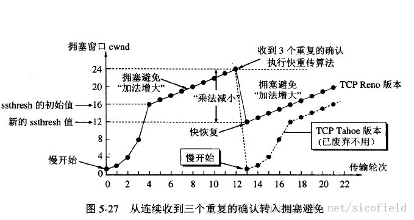
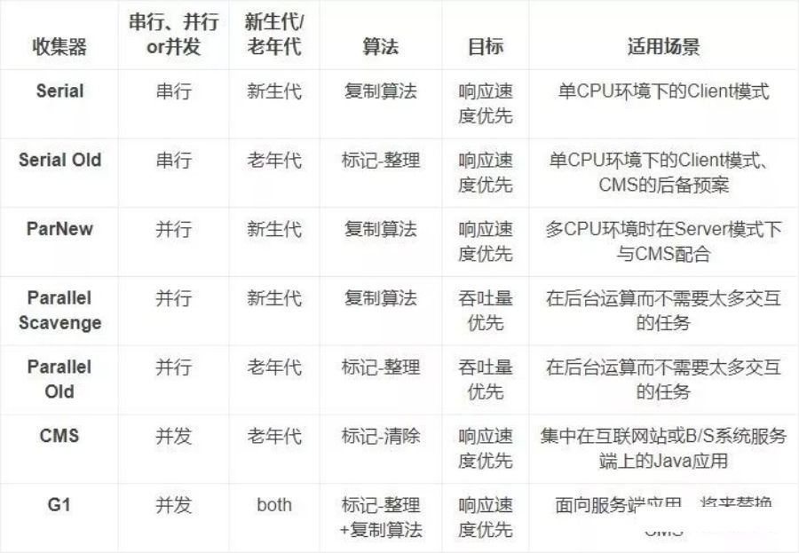

# 计算机网络

## OSI


## TCP实现可靠运输

主要靠滑动窗口协议来实现

1. 数据校验和
2. 确认和重传：接收方收到报文就会确认，发送方发送一段时间后没有收到确认就重传。
3. 数据合理分片和排序：tcp会按MTU合理分片，接收方会缓存未按序到达的数据，重新排序后再交给应用层。
4. 流量控制：当接收方来不及处理发送方的数据，能提示发送方降低发送的速率，防止包丢失。
5. 拥塞控制：当网络拥塞时，减少数据的发送。

## 拥塞控制

- cwnd 拥塞窗口大小 mss最大分段大小 为单位
- ssthreah ： 慢开始门限值
- 一个RTT 往返时间 翻倍
- 慢开始只有在刚开始发送数据报的时候会使用。用于探测网络情况。
- 慢开始为什么指数增长？
  - 因为收到n个确认报文，cwnd就增大n个单位
  - 一开始 发送n个报文，收到n个确认报文之后，增大n个单位，即增大为2n，为之前的两倍。



## TCP握手问题

- ## 三次握手


客户端和服务端建立连接之后，如果有一个迟到连接请求报文（之前发送的，在网络中滞留太久了，现在才到），如果只有两次握手那么将会导致连接重新建立，出现错误、导致资源浪费。

- ## 四次握手


服务器收到客户的FIN报文只是说明客户不再发送数据，但是服务器可能还要向客户发送数据，所以服务器的FIN报文要留到数据传输完毕才发送，多了一次握手。

- ## 客户端最后等2MSL TIME_WAIT

  https://zhuanlan.zhihu.com/p/40013724TIME_WAIT 客户端最后的等待状态。TIME_WAIT	过多消耗内存和CPU。
  
  **为何一定要等2MSL？**
  **如果不等，释放的端口可能会重连刚断开的服务器端口，这样依然存活在网络里的老的TCP报文可能与新TCP连接报文冲突，造成数据冲突，为避免此种情况，需要耐心等待网络老的TCP连接的活跃报文全部死翘翘，2MSL时间可以满足这个需求（尽管非常保守）！**

## 禁用Cookie ,Session 还可以使用吗？

- 可以，除了Cookie 还可以使用URL来传递SessionID
- url 中在问号？后接参数 (get) ：  www.....com ？SessiongID=....

## TCP握手、挥手过程以及状态图

https://blog.csdn.net/qzcsu/article/details/72861891


字段，序号详情见图

### TCP连接过程

服务器建立TCB之后一直处于LISTEN 状态等待客户端连接，客户端建立TCB，发送连接请求报文，并且进入SYN-SENT 状态。服务器收到连接请求报文之后进入SYN-RCVD（同步接收）状态，发送确认报文，确认报文syn =1,ack = 1。客户端收到确认报文之后进入ESTABLISHED（已建立连接）状态，并且发送确认报文。服务器收到确认报文后进入ESTABLISHED状态。

### 细节

- Syn报文消耗一个序号，不可以携带数据。

- ACK报文可以携带数据，并且消耗序号。如果不带数据，不消耗序号。
- Syn =1 Ack = 1 的报文，相当于Syn 报文。不能携带数据，消耗一个序号

### 状态变化

客户端：CLOSED - SYN-SENT - ESTABISHED

服务器端： CLOSED - LISTEN - SYN-RCVD - ESTABLISHED


字段，序号详情见图。

客户端发送链接释放报文进入FIN-WAIT-1状态，停止传输数据。服务器收到连接释放报文后，进入CLOSE-WAIT（等待被动关闭）状态，发送确认报文，并且服务器通知高层应用进程客户端断开连接，进入半关闭状态。客户端收到服务器确认报文后，进入FIN-WAIT-2状态，等待服务器连接释放报文。服务器在数据发送完毕后，向客户端发送链接释放报文进入LAST-ACK状态。客户端收到链接释放报文后进入TIME-WAIT状态，发送确认报文，等待2MSL(最大报文段时间)之后进入closed状态。服务器段收到确认报文之后，进入CLOSED状态。


### 细节

- FIN报文不携带数据也消耗序号
- 服务器比客户端早进入CLOSED状态

### 状态

客户端： Established - FIN-WAIT-1  -  FIN-WAIT-2  - TIME-WAIT - CLOSED

服务器端: ESTABLISHED - CLOSED-WAIT - LAST-ACK - CLOSED 


1.  确保服务器能收到最后一次握手的确认报文	
2.  使本链接持续时间内所产生的所有报文段都从网络中消失

2. 


1. 计网5层模型和7层模型 

2. 应用层协议有什么 

3. 输入网址发送请求到接受响应的过程 

4. 网络拥堵可能有什么原因 

5. TCP拥塞避免[算法]() 

6. 延迟ACK了解么？

7. ipv6和ipv4的区别

8. Http https 区别（腾讯） SSL握手过程

   1、https协议需要到ca申请证书，一般免费证书较少，因而需要一定费用。

    00

   2、http是超文本传输协议，信息是明文传输，https则是具有安全性的ssl加密传输协议。

    

   3、http和https使用的是完全不同的连接方式，用的端口也不一样，前者是80，后者是443。

    

   4、http的连接很简单，是无状态的；HTTPS协议是由SSL+HTTP协议构建的可进行加密传输、身份认证的网络协议，比http协议安全。

   

9. TCP和UDP的区别

10. TCP的可靠传输机制

11. Get和Post 的区别

# 操作系统

## 内核空间、用户空间概念（内核态 用户态）

- ## 内核空间在系统启动过程中加载了操作空间内核（放操作系统代码的内存空间）

- ## 放用户程序的空间

  

## 为什么分成用户态和内核态


内核：操作系统的代码，底层操作

内核态和用户态：内核态可以访问内所有内存以及外围设备，而用户态只能访问部分内存，不难访问外围设备。存放系统底层的操作的内存对用户屏蔽。

内核态和用户态用处：

1. 安全性，内核有的操作很危险
2. 结构，模块化


## 进程概念

 进程实体的组成：**程序段、数据段、程序控制块（PCB）**

线程组成：TCB

## 面题

## 进程和线程区别


**根本区别**：进程是操作系统资源分配的基本单位，而线程是处理器任务调度和执行的基本单位

**资源开销**：

​		进程间切换代价大，线程间切换代价小。每个进程都有独立的代码和数据空间（程序上下文），程序之间的切换会有较大的开销；线程可以看做轻量级的进程，同一类线程共享代码和数据空间，每个线程都有自己独立的运行栈和程序计数器（PC），线程之间切换的开销小。

​		进程拥有资源多，线程拥有资源少

**包含关系**：一个进程内可以有多个线程，进程是运行中的程序，线程是进程的内部的一个执行序列

**影响关系**：一个进程崩溃后，在保护模式下不会对其他进程产生影响，但是一个线程崩溃整个进程都死掉。所以多进程要比多线程健壮。

**内存分配**：同一进程的线程共享本进程的地址空间和资源，而进程之间的地址空间和资源是相互独立的

**执行过程**：每个独立的进程有程序运行的入口、顺序执行序列和程序出口。但是线程不能独立执行，必须依存在应用程序中，由应用程序提供多个线程执行控制，两者均可并发执行

## 协程

https://oldmo860617.medium.com/%E9%80%B2%E7%A8%8B-%E7%B7%9A%E7%A8%8B-%E5%8D%94%E7%A8%8B-%E5%82%BB%E5%82%BB%E5%88%86%E5%BE%97%E6%B8%85%E6%A5%9A-a09b95bd68dd

https://medium.com/@alex_random/%E5%AF%B9%E4%BA%8E%E5%8D%8F%E7%A8%8B-coroutine-%E4%BD%A0%E5%BF%85%E9%A1%BB%E7%9F%A5%E9%81%93%E4%BA%8B%E6%83%85%E9%83%BD%E5%9C%A8%E8%BF%99%E9%87%8C%E4%BA%86-%E5%86%85%E9%99%84%E4%BB%A3%E7%A0%81-125d07739758


## 进程和线程的切换上下文

**进程切换涉及虚拟地址空间的切换而线程不会**，**每个进程都有自己的虚拟地址空间，进程内的所有线程共享进程的虚拟地址空间**。

## 线程的实现方式

- ### 用户级线程

- ### 内核级线程

- ### 混合型线程（用户级映射到内核级）

## 上下文是什么？

**上下文就是内核重新启动一个被抢占的进程所需的状态。**包括一下内容：

- 寄存器
- 程序计数器 PC
- 各种内核数据结构：比如描绘地址空间的页表，包含有关当前进程信息的进程表，以及包含进程已打开文件的信息的文件表。


## 线程之间同步的机制 

​		**互斥锁**
​		**条件变量**
​		**读写锁**
​		**信号量**

## 物理地址、虚拟地址和逻辑地址的区别 

物理地址、虚拟地址、逻辑地址关系

物理地址是指内存上存储单位的实际地址。

虚拟地址的理解要结合虚拟内存，虚拟内存空间。虚拟内存空间可能会大于物理内存实际大小（用到了磁盘充当虚拟内存）。

一般情况下可以把逻辑地址当成虚拟地址

段式、页式逻辑地址：


但是逻辑内存是指程序段内的地址，在多级页表情况下


最后两段： 页帧号+offset 才是 “程序段”内的地址。


## 为什么要分成物理地址和虚拟地址 

​	方便编译器和操作系统安排程序的地址分布。（更好分配碎片空间）

​	由于局部性原理，使用虚拟地址可以节省空间，内存只需要加载程序要用的代码和数据。

​	保证数据的安全和进的隔离，防止进程访问其他进程或者操作系统在内存中的数据。


## 	虚拟内存作用 详细版

​	使用虚拟内存主要是基于以下三个方面考虑，也就是说虚拟内存主要有三个作用：

​	作为缓存工具，提高内存利用率：使用 DRAM 当做部分的虚拟地址空间的缓存（虚拟内存就是存储在磁盘上的 N 个连续字节的数组，数组的部分内容会缓存在 DRAM 中）。扩大了内存空间，当发生缺页异常时，将会把内存和磁盘中的数据进行置换。

​	作为内存管理工具，简化内存管理：每个进程都有统一的线性地址空间（但实际上在物理内存中可能是间隔、支离破碎的），在内存分配中没有太多限制，每个虚拟页都可以被映射到任何的物理页上。这样也带来一个好处，如果两个进程间有共享的数据，那么直接指向同一个物理页即可。

​	作为内存保护工具，隔离地址空间：进程之间不会相互影响；用户程序不能访问内核信息和代码。页表中的每个条目的高位部分是表示权限的位，MMU 可以通过检查这些位来进行权限控制（读、写、执行）。


## 虚拟地址转换为物理地址的过程 （https://blog.csdn.net/qq_41453285/article/details/107827858）

Linux的四级页表


第一步，先将虚拟地址转换为逻辑地址：找到最后一级页表得到 页帧号 + offset 组成逻辑地址
第二步，再将逻辑地址转换为线型地址：	逻辑地址加上基址获得线性地址
第三步，再将线型地址再转换为物理地址：

详细：

第一步，先将虚拟地址转换为逻辑地址：根据程序中的虚拟地址得出其所在的段（页），然后加上段偏移，我们就能得到一个逻辑地址
第二步，再将逻辑地址转换为线型地址：有了逻辑地址之后，我们需要将逻辑地址转换为线型地址（因为线型地址是逻辑地址转换到物理地址的一个中间层），只需要把逻辑地址加上段的基地址就能生成一个线型地址
第三步，再将线型地址再转换为物理地址：
如果启用了分页机制，那么就需要将需要找到段中对应页的地址，然后再找到页内偏移地址，最后得到物理地址
如果没有启用分页机制，那么线型地址直接就是物理地址了


## 页式 段式 段页式存储

页式


页式带快表


段式存储


段页式


## 快表是存储在哪里的

放在联想存储器（缓冲存储器），具有并行查找的功能。

## 进程的调度策略

-  先来先服务调度算法（FCFS）
-  短作业优先调度算法（SJF）
-  高响应比优先调度算法（HRRF）
-  优先级调度算法
-  时间片轮转调度算法
-  多级队列调度算法
-  多级反馈队列调度算法

## 死锁的概念、条件、避免

- ### 死锁的定义：    

  ​    一组进程中，每个进程都无限等待被该组进程中另一进程所占有的且永远无法释放的资源，这种现象称为进程死锁，这一组进程就称为死锁进程。

- ### 死锁条件

  -  互斥条件

  -  请求和保持条件

  -  不剥夺条件

  -  环路等待条件

    

    1.互斥：进程要求对所分配的资源进行互斥性访问。即在一段时间内某资源仅为一个进程所占有，如果此时还有其它进程要求访问该资源，则要求者只能被阻塞，直到该资源的占用进程用毕释放； 
     2.请求和保持：当进程已经占有了至少一个资源，若又提出了新的资源请求，而该资源又被其它进程所占用，则此请求被阻塞，但对它对已获得的资源保持不放；       
    3.不剥夺：进程已获得的资源，在未使用完之前，不能被剥夺，只能由使用者在使用完后释放；
    4.环路等待：在发生死锁时，必然存在一个进程—资源的环形链。即进程集合{P1、P2、…、Pn}中的P1正在等待一个P2占用的资源，P2正在等待一个P3占用的资源，……、Pn正在等待一个P1占用的资源。
            这四个必要条件中只要有一个条件不满足，都不会形成“死锁”。  

- ### 解决死锁的方法

  -  预防死锁

    - 破坏请求和保持条件（必须满足全部需求才拿资源或者没资源的时候才能申请资源）
    - 破坏不可剥夺  可以剥夺资源，或者 在满足不了 进程需要资源时，释放这个进程已有资源资源
    - 破坏循环等待 按序分配资源

  -  避免死锁

    - 银行家算法

      

  -  检测与解除死锁

    - 检测：资源分配图 coffman 算法  （检测时机： 请求资源 定时检测）
    - 解除死锁 ：
      - 撤销进程（一次撤销所有死锁进程，或者一个一个撤销，直到死锁解锁） ；、
      - 抢占资源（破坏不可剥夺条件）


## 进程通信方式

- 管道（相当于文件，放在内存或者磁盘，一边只能读，一边只能写，FIFO）有名管道、匿名管道、无名管道。
- 消息队列（存放在内核空间，可以随机访问）
- 共享内存
- Socket 通信
- 信号量通信（**semaphore**用于同步）
- 信号signal

## 进程同步方式

- 读写锁

- 互斥锁（mutex 只能锁 只有一个）

- 信号量（多个线程访问同一个资源，线程个数有上限）

- 条件变量（避免条件不满足的时候 thread2 一直重复 加锁 判断 解锁）https://www.jianshu.com/p/01ad36b91d39

# Java集合框架


## HashMap为什么改为尾插法？

https://www.cnblogs.com/qmillet/p/13054208.html

1.8之前不管是元素的添加，还是数组扩容，只要涉及到 hash 冲突，就会采用头插法将元素添加到链表中，头插法在多线程的情况下会导致死循环。


## 为什么HashMap初始化大小为16？

2的整数幂 进行异或运算

**总结： 1 减少hash碰撞**

​       **2 提高map查询效率**

​      **3 分配过小防止频繁扩容**

​      **4 分配过大浪费资源**

## 为什么HashMap数组长度为2的n次方？

https://zhuanlan.zhihu.com/p/91636401

为了**加快哈希计算**以及**减少哈希冲突**


## concurrentHashmap

https://segmentfault.com/a/1190000021237438

1.7 segment + entry数组 有很多段segment 分段锁

1.8 使用CAS + synchronized 保证并发安全

# Java 并发

- 

  ```cpp
  //thread1 :
  while(true)
  {
      pthread_mutex_lock(&mutex);
      iCount++;
      pthread_mutex_unlock(&mutex);
  
      pthread_mutex_lock(&mutex);
      if(iCount >= 100)
      {
          pthread_cond_signal(&cond);
      }
      pthread_mutex_unlock(&mutex);
  }
  
  //thread2:
  while(1)
  {
      pthread_mutex_lock(&mutex);
      while(iCount < 100)
      {
          pthread_cond_wait(&cond, &mutex);
      }
      printf("iCount >= 100\r\n");
      iCount = 0;
      pthread_mutex_unlock(&mutex);
  }
  ```

  ## GC roots

  局部变量表

  方法区：静态类属性(static)

  方法区：常量引用(static final)

  本地方法栈引用（native)


## Java并发博客

https://www.cnblogs.com/paddix/p/5374810.html

## AQS

https://zhuanlan.zhihu.com/p/86072774

ReentrantLock 底层是基于AQS实现的

## Synchronized 

使用Monitor 对象内部锁实现。


## Volatile

https://www.cnblogs.com/dolphin0520/p/3920373.html

Volatile修饰变量：

- 保证可见性（将新值更新到主内存中，对其他线程可见）

- 禁止指令重排序

- 无法保证原子性（自增操作 ++）

  禁止重排例子:

  ~~~java
  
  //x、y为非volatile变量
  //flag为volatile变量
   
  x = 2;        //语句1
  y = 0;        //语句2
  flag = true;  //语句3
  x = 4;         //语句4
  y = -1;       //语句5
  //由于flag变量为volatile变量，那么在进行指令重排序的过程的时候，不会将语句3放到语句1、语句2前面，也不会讲语句3放到语句4、语句5后面。但是要注意语句1和语句2的顺序、语句4和语句5的顺序是不作任何保证的。 　　
  ~~~

Volatile 底层实现： 使用内存屏障

内存屏障功能：

- 　　禁止指令重排序
- 　　写入内存，并且使其他线程的缓存失效

使用volatile的条件

- 对变量的写操作不依赖于当前值。 x++; x = x*2;

- 该变量没有包含在具有其他变量的不变式中。(下面的程序包含了一个不变式子，lower 和 upper要满足：lower < upper ，但是两个线程可以 同时执行到更新语句)

  ~~~java
  @NotThreadSafe
  public class NumberRange {
  private int lower, upper;
  public int getLower() {
  return lower;
  } 
  
  public int getUpper() {
  return upper;
  }
  //设初始： lower = 1 upper = 5
  public void setLower(int value) {
      		//假设两个线程都通过了判断语句（还没来得及执行更新语句）
             if (value > upper) //lower 此时 为 1
               	throw new IllegalArgumentException(...);
      		//---------------
              lower = value;//更新语句 假设 value = 4
          }
  
  public void setUpper(int value) {
     		 //假设两个线程都通过了判断语句（还没来得及执行更新语句）
              if (value < lower)//upper 此时 为 1
                  throw new IllegalArgumentException(...);
      		//--------
              upper = value;//更新语句 upper = 3 
      		//--最后使得 lower = 4 upper = 3 破坏了不变式：lower < upper 也就是说不变式失效了
          }
  
  }
  ~~~

## Volatile 和Synchronized 区别

https://juejin.cn/post/6844903925783642125

sync:阻塞和性能问题，保证原子性，有序性，一致性

volatile：内存屏障带来的禁止指令重排,不能保证原子性


## Java锁的种类? 

https://tech.meituan.com/2018/11/15/java-lock.html


- 乐观锁/悲观锁

- 公平锁/非公平锁

- 可重入锁

- 互斥锁/读写锁（独享锁/共享锁）

- 偏向锁/轻量级锁/重量级锁

- 自旋锁/适应性自旋锁（循环等待）

- 分段锁（ConcurrentMap）

  synchronized 、ReentrantLock、ReentrantReadWriteLock ：重量级锁悲观锁重入锁

  ReetrantLock 独享锁

  ReentrantReadWriteLock 共享锁

- ## 乐观锁/悲观锁

  悲观锁是指认为一定会有别的线程修改数据，每次获取数据的都要加锁。

  乐观锁不加锁，只在更改数据的时候判断数据是否被更改（自旋CAS算法）

  - ### 	CAS操作（循环判断A是否符合条件：自旋）

    ~~~java
    // ------------------------- OpenJDK 8 -------------------------
    // Unsafe.java
    public final int getAndAddInt(Object o, long offset, int delta) {
       int v;
       do {
           v = getIntVolatile(o, offset);
       } while (!compareAndSwapInt(o, offset, v, v + delta));
       return v;
    }
    ~~~

    需要读写的内存值 sjkaiV。
    进行比较的值 A。
    要写入的新值 B。

    ​	只有当当前值为旧值A时才对值进行修改。

  - ### CAS缺点

    - ABA问题 （加入版本号）
    - 循环时间长开销大
    - 只能保证一个共享变量的原子操作

- ## 自旋锁/自适应自旋锁

  自旋锁：循环等待一定次数。自适应自旋锁：等待次数的上限会改变。

  

- ## 偏向锁/轻量级锁/重量级锁

  偏向锁：某个线程一直访问某个同步代码段，那么线程会自动获得锁。

  轻量级锁：偏向锁被其他线程访问时，偏向锁变为轻量级锁，其他线程会自旋获取锁。

  重量级锁：自旋次数过多，或者又有第三个线程访问，轻量级锁就会变为重量级锁，等待锁的会进入阻塞态（不再自旋）

- ## 公平锁/非公平锁

  公平锁有个等待队列，先进的线程先获取锁。

- ## 可重入锁/非可重入锁

  可重入锁即递归锁，获取了锁的线程可以递归获取锁。

- ## 独享锁/共享锁

  独享锁只能被一个线程拥有，共享锁能被多个线程拥有

## sleep/wait/yield/join区别

- ## sleep 和 wait:

1. sleep方法是定义在Thread上 wait方法是定义在Object上
2. sleep不会释放锁 wait会释放锁 两者都会释放CPU资源
3. sleep可以使用在任何代码块 wait必须在同步方法或同步代码块执行
4. 与wait配套使用的方法 notify() notifyAll()

- yield ：又运行态变为就绪状态，CPU重新调度（不释放锁，释放CPU）
- join:  等待某个线程结束（调用 t.join 等t 结束）

扩展：https://www.jianshu.com/p/66a24839c19b

# JavaWeb

## 浏览器解析HTML 

1. 解析ＨＴＭＬ构建ＤＯＭ树
2. 渲染树构建
3. 渲染树布局
4. 绘制渲染树

## 请求转发（forward）和重定向(redirect)的区别？


- 转发是服务端行为，重定向是客户端行为
- 请求转发不改变URL，重定向会改变
- 请求转发可以共享数据，重定向不可
- 转发效率高

## 分布式Session 如何实现

- Redis 存储
- 使用Cookie 存储Session （不安全）
- 直接复制到其他服务器（Tomcat 自带）
- 会话保持（sticky session ）

## Session 和Cookie 的区别?

- **安全性：** Session 比 Cookie 安全，Session 是存储在服务器端的，Cookie 是存储在客户端的。
- **存取值的类型不同**：Cookie 只支持存字符串数据，想要设置其他类型的数据，需要将其转换成字符串，Session 可以存任意数据类型。
- **有效期不同：** Cookie 可设置为长时间保持，比如我们经常使用的默认登录功能，Session 一般失效时间较短，客户端关闭（默认情况下）或者 Session 超时都会失效。
- **存储大小不同：** 单个 Cookie 保存的数据不能超过 4K，Session 可存储数据远高于 Cookie，但是当访问量过多，会占用过多的服务器资源。

# JVM

## 修饰符访问范围

| 访问范围         | private  | friendly(默认) | protected | public |
| ---------------- | -------- | -------------- | --------- | ------ |
| 同一个类         | 可访问   | 可访问         | 可访问    | 可访问 |
| 同一包中的其他类 | 不可访问 | 可访问         | 可访问    | 可访问 |
| 不同包中的子类   | 不可访问 | 不可访问       | 可访问    | 可访问 |
| 不同包中的非子类 | 不可访问 | 不可访问       | 不可访问  | 可访问 |

## 内存区域

## GC收集器

https://cloud.tencent.com/developer/article/1592943




## GC 停顿 Stop-The-World

为了保证引用更新的正确性，Java将暂停所有其他的线程，这种情况被称为“Stop-The-World”

## Minor GC 、Major GC、Full GC 

- ### minor  gc: 年轻代GC

- ### major gc :老年代GC

- ### Full GC ：包括老年和年轻代

## 触发GC 的时机

1. 堆即将满
2. System.gc()；调用系统函数触发

## 新生代对象晋升到老年代情况

1. Eden区满
2. 对象体积太大
3. 长期存活的对象将进入老年代
4. 动态对象年龄判定（https://www.jianshu.com/p/da04c8270762）

# JAVA

## 泛型原理

其实就是一个『语法糖』，本质上就是编译器为了提供更好的可读性而提供的一种小「手段」，虚拟机层面是不存在所谓『泛型』的概念的。

- ### 类型擦除

~~~java
public class Caculate<T> {

    private T num;//编译后T 替换为 Object
}

public class Caculate<T extends String> {//编译后 T替换为 String

    private T num;//编译后 T替换为 String
}

//编译器会检测每次get返回值，并且将Object 强转为Integer
ArrayList<Integer> list = new ArrayList();
list.add(10);
Integer num = list.get(0);

//这是 ArrayList 内部的一个方法
public E get(int index) {
    .....
}


~~~


## 接口和抽象类区别

接口中的变量会被隐式地指定为public static final变量（并且只能是public static final变量，用private修饰会报编译错误），而方法会被隐式地指定为public abstract方法且只能是public abstract方法。

- ### 　　抽象类可以提供成员方法的实现细节，而接口中只能存在public abstract 方法；

- ### 　　抽象类中的成员变量可以是各种类型的，而接口中的成员变量只能是public static final类型的；

- ### 　　接口中不能含有静态代码块以及静态方法，而抽象类可以有静态代码块和静态方法；接口不能有构造器（因为不是类）

- ### 　　一个类只能继承一个抽象类，而一个类却可以实现多个接口。

## Java数据类型

java 只有两种数据类型：基本数据类型和引用类型（其实还有null 类型,null类型可以转换为任意引用类型 详细见 https://blog.csdn.net/w605283073/article/details/72896651）

- 基本数据类型有：int.double..
- 引用数据类型：类、接口、数组

（对象分配在堆中，局部变量（引用，基本数据类型）放在栈上。）

## 四种引用

生命力优先级从高到低：强引用，软引用，弱引用，虚引用。

1. 强引用NormalReferemce

   宁愿OOM也不会回收，除非引用置为null

   ~~~java
   Object o = new Object() ;
   ~~~

2. 软引用 SoftReference

   GC时如果内存不足，垃圾回收器就会回收软引用。引用队列用于存放被回收对象的引用

   ~~~java
   Object obj = new Object();
   ReferenceQueue queue = new ReferenceQueue();
   SoftReference softObj = new SoftReference(obj,queue);
   obj = null； //去除强引用
   ~~~

3. 弱引用 WeakReference

   GC时一定会被回收。可以配合引用队列使用

   ~~~java
    Object obj = new Object();
    WeakReference<Object> weakObj = new WeakReference<Object>(obj);
    obj = null； //去除强引用
   ~~~

4. 虚引用 PhantomReference

   任何时候都可能被回收，无法通过虚引用获取对象的任何属性或者方法。相当于一个没功能的引用。必须配合引用队列使用，对应的某个对象被回收之后，虚引用进入引用队列。利用这一点，我们可以通过判断这个队列有没有这个虚引用来判断对应的对象是否被回收了。

   ~~~java
   Object obj = new Object();
   ReferenceQueue queue = new ReferenceQueue();
   PhantomReference<Object> phantomObj = new PhantomReference<Object>(obj , queue);
   obj = null； //去除强引用
   ~~~

   

## 内存泄漏

https://www.jianshu.com/p/54b5da7c6816

内存泄漏的对象包含：1. 不可达的对象（这部分垃圾回收器会自动回收）。2. 对象可达，但是不可用。


- ## 内存泄漏根本原因：长生命周期的对象持有短生命周期对象的引用

例子：

~~~java
Static Vector v = new Vector(10);

for (int i = 0; i < 100; i++) {
    Object o = new Object();
    v.add(o);
    o = null;
}
~~~


## 内存分配策略

## Comparator 和Comparable 区别

1. comparator 是外部比较器，comparable 是内部比较器。
2. comparator 是一种专用比较器，体现了策略模式。


## == 与 equals()区别

1. equals 是方法 == 是操作符

2. 对于基本类型 == 比较的是值，对于引用比较的就是引用存放的地址（对象的地址）

3. equals比较对象是否相等，equals()存在于Object 中，基本类型没有equals方法

   

## hashCode()

默认的hashCode 返回对象的地址。但是hashCode 实际上和地址没啥关系，可以自定义一个hashCode。

## 为什么重写equals()一定要重写hashCode()?

~~~java
 /**
     * Returns a hash code value for the object. This method is
     * supported for the benefit of hash tables such as those provided by
     * {@link java.util.HashMap}.
     * .........
     * <li>If two objects are equal according to the {@code equals(Object)}
     *     method, then calling the {@code hashCode} method on each of
     *     the two objects must produce the same integer result.
     ....... 
  **/
~~~


保存一致性。Object 源码中提到：“hashCode（） 用于HashMap的使用，为了方便用户使用，要尽量保存hashCode和Equals()的一致性。”也就是说相同的对象的hashCode 要保证相同。不同对象的hashCode 可能相同，这个时候要用equals()来判断是否真的相同。（实际上也不是硬性要求，两个方法不一起重写也可以，但是这是个很糟糕的编程习惯）。这里的“相同的对象”指的是调用Equals（）方法返回true 的两个对象。（equals() 和hashCode（）保持一致）。hashCode()不重写时，返回的是对象地址，因此两个对象永远不会相同。

## POJO和JavaBean 区别

https://www.jianshu.com/p/224489dfdec8

两者都是一种类的规范。Pojo比javabean更简洁。

- ## pojo要求：

1. ### private 的属性

2. ### 属性对应getter setter

3. ### 没有实现任何接口，没有任何继承，没有被其他框架侵入的java对象

- ## JavaBean要求：

1. ### 所有属性为private。

2. ### 这个类的属性使用getter和setter来访问，其他方法遵从标准命名规范。

3. ### 这个类必须有一个公共的缺省构造函数。即是提供无参数的构造器。

4. ### 这个类应是可序列化的。实现serializable接口。

- ## 区别

  POJO其实是比javabean更纯净的简单类或接口。POJO严格地遵守简单对象的概念，而一些JavaBean中往往会封装一些简单逻辑。

  POJO主要用于数据的临时传递，它只能装载数据， 作为数据存储的载体，而不具有业务逻辑处理的能力。

  Javabean虽然数据的获取与POJO一样，但是javabean当中可以有其它的方法。

## 同步、异步、阻塞、非阻塞

同步与异步：

- 同步和异步关注的是**消息通信机制**
- 同步指在调用后等待调用结果
- 异步指在调用后，这个调用直接返回。

阻塞与非阻塞：

- 阻塞和非阻塞关注的是**程序在等待调用结果（消息，返回值）时的状态.**
- 阻塞是指得到调用结果前，线程挂起，非阻塞的线程，等待是不会挂起。


## java IO 流 种类


- ## BIO

  BIO：Block IO 同步阻塞式 IO，就是我们平常使用的传统 IO，它的特点是模式简单使用方便，并发处理能力低。
  
- ## NIO

  NIO：Non IO 同步非阻塞 IO，是传统 IO 的升级，客户端和服务器端通过 Channel（通道）通讯，实现了多路复用。
  
- ## AIO

  AIO：Asynchronous IO 是 NIO 的升级，也叫 NIO2，实现了异步非堵塞 IO ，异步 IO 的操作基于事件和回调机制。

# 大数据

https://blog.csdn.net/v_july_v/article/details/7382693

# Mysql--DB

## 事务ACID

- ### Atomic 原子性

- ### Consistent一致性

- ### Isolation 隔离性

- ### Durablity 持久性

## 三大范式

- ### 第一范式：每一列都不可再分

- ### 第二范式：每一个表都只描述一个事情（非码属性完全依赖于任何一个候选码）

  - 

- ### 第三范式：每一列与数据与主键直接相关，不能存在间接相关。


## 三大范式规范性和性能问题

关联查询的表不得超过三张表

- 考虑商业化的需求（成本和用户体验），数据库的性能更加重要。
- 在规范性和性能之间找平衡点
- 故意增加冗余字段，使得多表查询变为单表查询，提高性能
- 增加计算列（count(..)计算某一列总和）

## 索引

https://blog.csdn.net/zgrgfr/article/details/74455547

- ## 索引是一种用于快速查询、检索数据的数据结构（一般用B树，B+树，Hash实现。）

- 优点：加快查询

- 缺点：冗余空间，创建和维护索引需要耗费时间

## B树 和 B + 树 比较

- ### B 树的所有节点既存放 键(key) 也存放 数据(data);而 B+树只有叶子节点存放 key 和 data，其他内节点只存放 key。

- ### B 树的叶子节点都是独立的;B+树的叶子节点有一条引用链指向与它相邻的叶子节点。

- ### B 树的检索的过程相当于对范围内的每个节点的关键字做二分查找，可能还没有到达叶子节点，检索就结束了。而 B+树的检索效率就很稳定了，任何查找都是从根节点到叶子节点的过程，叶子节点的顺序检索很明显。

## Hash 索引 与B + 树 比较

- ### Hash 定位快

- ### Hash 冲突

- ### Hash 没有维护区间信息，不支持顺序和范围查询。

## 聚簇索引和非聚簇索引

- ### 区别：

  - ### 聚簇索引 ：索引结构和数据一起存放。

  - ### 非聚簇索引：索引结构和数据分开放，相当于索引文件和数据文件两个分离的文件。

  


## 数据库引擎（INNODB ,MYISAM） 区别

Myisam 不支持事务以及行级锁，奔溃后无法恢复。

1. ### 行级锁：InnoDB支持，Myisnam不支持（Myisam为表级锁）

2. ### 事务：InnoDB支持，Myisnam不支持

3. ### 外键：InnoDB支持，Myisnam不支持

4. ### 奔溃后恢复：InnoDB支持，Myisnam不支持

5. ### MVCC：InnoDB支持，Myisnam不支持

6. ### 全文索引：Myisam支持，InnoDB 5.6 之前 不支持(全文索引：即关键词搜索，在所有列中搜索某个关键词)


## 四个事务隔离级别

- 读取未提交
- 读取已提交
- 可重复读
- 可串行化

| 隔离级别         | 脏读 | 不可重复读 | 幻影读 |
| ---------------- | ---- | ---------- | ------ |
| READ-UNCOMMITTED | √    | √          | √      |
| READ-COMMITTED   | ×    | √          | √      |
| REPEATABLE-READ  | ×    | ×          | √      |
| SERIALIZABLE     | ×    | ×          | ×      |

## 驱动表和匹配表概念

- ### 驱动表也叫外表，匹配表也叫内表。使用Join 进行表匹配时，使用外表的值寻找 内表中匹配的记录

- ### 图中r 为外表 s为匹配表。外表一般数据较少，内表一般有索引。

- 

## Mysql Join 原理

https://www.jianshu.com/p/6086365a73bd?utm_source=tuicool&utm_medium=referral

嵌套循环连接，分三类

- 简单嵌套循环

  

- 索引嵌套循环（回表查询即是二次查询，先查到主键的值，再到主键索引查询数据）

  

  

- 缓冲块嵌套循环连接 优点：缓存块里的 记录可以批量比较。减少了内表比较次数。

  

  

## InnoDB底层原理

## 索引优化

# REDIS


## 概述

**Redis**是一个高性能的key-value数据库

## 特点

- Redis支持**数据的持久化**，可以将内存中的数据保存在磁盘中，重启的时候可以再次加载进行使用。
- Redis不仅仅支持简单的key-value类型的数据，同时还提供**list，set，zset，hash等数据结构的存储**
- Redis支持**数据的备份**，即master-slave模式的数据备份

## 缓存穿透

穿透形象一点就是：请求过来了 转了一圈 一无所获 就像穿过透明地带一样。key对应的数据在数据源并不存在，每次针对此key的请求从缓存获取不到，请求都会到数据源，从而可能压垮数据源。比如用一个不存在的用户id获取用户信息，不论缓存还是数据库都没有，若黑客利用此漏洞进行攻击可能压垮数据库。

## 穿透解决方案

a.把不存在的key写一下null，这样再来就相当于命中了，其实这种方法局限性很大，今天是5斤龙虾，明天改成6斤的螃蟹，缓存系统和数据库中存储大量无用key本身是无意义的，所以一般不建议。
 b.（布隆过滤器）另外一种思路，转换为查找问题，类似于在海量数据中查找某个key是否存在，考虑空间复杂度和时间复杂度，一般选用布隆过滤器来实现。

布隆过滤器 https://juejin.cn/post/6844904007790673933

## 缓存击穿

缓存击穿跟缓存雪崩有点类似，缓存雪崩是大规模的key失效，而缓存击穿是某个热点的key失效，大并发集中对其进行请求，就会造成大量请求读缓存没读到数据，从而导致高并发访问数据库，引起数据库压力剧增。这种现象就叫做缓存击穿。（像是小规模的雪崩。）

## 击穿解决方案

1. 在缓存失效后，通过互斥锁或者队列来控制读数据写缓存的线程数量，比如某个key只允许一个线程查询数据和写缓存，其他线程等待。这种方式会阻塞其他的线程，此时系统的吞吐量会下降
2. 热点数据缓存永远不过期。（访问量特别大的数据就是热点数据，“热门商品”的数据）

永不过期实际包含两层意思：

- 物理不过期，针对热点key不设置过期时间
- 逻辑过期，把过期时间存在key对应的value里，如果发现要过期了，通过一个后台的异步线程进行缓存的构建

## 缓存雪崩

当缓存服务器重启或者大量缓存集中在某一个时间段失效，这样在失效的时候，也会给后端系统(比如DB)带来很大压力。

## 雪崩解决方案

事前：

1.  均匀过期：设置不同的过期时间，让缓存失效的时间尽量均匀，避免相同的过期时间导致缓存雪崩，造成大量数据库的访问。
2.  分级缓存：第一级缓存失效的基础上，访问二级缓存，每一级缓存的失效时间都不同。
3.   热点数据缓存永远不过期。
4. 保证Redis缓存的高可用，防止Redis宕机导致缓存雪崩的问题。可以使用 主从+ 哨兵，Redis集群来避免 Redis 全盘崩溃的情况。

事中：

1.  互斥锁：在缓存失效后，通过互斥锁或者队列来控制读数据写缓存的线程数量，比如某个key只允许一个线程查询数据和写缓存，其他线程等待。这种方式会阻塞其他的线程，此时系统的吞吐量会下降
2.  使用熔断机制，限流降级。当流量达到一定的阈值，直接返回“系统拥挤”之类的提示，防止过多的请求打在数据库上将数据库击垮，至少能保证一部分用户是可以正常使用，其他用户多刷新几次也能得到结果。

事后：

- 开启Redis持久化机制，尽快恢复缓存数据，一旦重启，就能从磁盘上自动加载数据恢复内存中的数据。

  ## 

## 总结

https://blog.csdn.net/a745233700/article/details/88088669 https://segmentfault.com/a/1190000022029639

一般避免以上情况发生我们从三个时间段去分析下：

- 事前：**Redis** 高可用，主从+哨兵，**Redis cluster**，避免全盘崩溃。
- 事中：本地 **ehcache** 缓存 + **Hystrix** 限流+降级，避免 **MySQL** 被打死。
- 事后：**Redis** 持久化 **RDB**+**AOF**，一旦重启，自动从磁盘上加载数据，快速恢复缓存数据。

# SSM

## 代理模式

## AOP

- ### 面向切面编程。横切面是指那些通用功能，与业务逻辑无关的部分、如日志、缓存。

## Aop实现原理

1. ### JDK (默认使用)

2. ### cglib  

## Spring 事务

- ### 声明式事务

## SpringMVC

# 设计模式(单例模式待补全)

## 工厂模式

## 代理模式

## 单例模式

1. ## 饿汉模式

   ~~~java
   public class Hungry{
       private Hungry(){
   	}
       private final static hugry = new Hungry();
       public Hungry getInstance(){
           return hungry;
       }
   }
   ~~~

   

2. ## 懒汉模式

   ~~~java
   //下面这种形式在多线程情况下会出问题
   public class Lazy{
       private Lazy(){
           
       }
       private static lazy;
       public static Lazy getInstance(){
           if(lazy == null){
               lazy = new Lazy();
           }
           return lazy;
       }
   }
   //解决同步问题
   //1.双重检查锁模式  （DCL模式DoubleCheckLock）
   public class Lazy{
           private Lazy(){
           
       }
       private static lazy;
       public static Lazy getInstance(){
           if(lazy == null){
               synchronized(Lazy.class){
                   if(lazy == null){
                       lazy = new Lazy();//不是原子性操作，可能会出问题
                   }
   			}
               
           }
           return lazy;
       }
   }
   //2. DCL模式改进 DCL + Volatile
   public class Lazy{
           private Lazy(){
           
       }
       private volatile static lazy;
       public static Lazy getInstance(){
           if(lazy == null){
               synchronized(Lazy.class){
                   if(lazy == null){
                       lazy = new Lazy();//不是原子性操作，可能会出问题
                   }
   			}
               
           }
           return lazy;
       }
   }
   ~~~

   

3. ## Holder模式（静态内部类）

## ORM 

https://www.jianshu.com/p/ec971e77dd3c

### 是什么

ORM，即Object-Relational Mapping（对象关系映射），它的作用是在关系型数据库和业务实体对象之间作一个映射，这样，我们在具体的操作业务对象的时候，就不需要再去和复杂的SQL语句打交道，只需简单的操作对象的属性和方法。

### 为什么会出现ORM？： 解决不匹配问题

面向对象是从软件工程基本原则(如耦合、聚合、封装)的基础上发展起来的，而关系数据库则是从数学理论发展而来的. 两者之间是不匹配的.而ORM作为项目中间件形式实现数据在不同场景下数据关系映射. 对象关系映射（Object Relational Mapping，简称ORM）<u>是一种为了解决面向对象与关系数据库存在的互不匹配的现象的技术</u>.ORM就是这样而来的.

### 优点：

- 第一：隐藏了数据访问细节，“封闭”的通用数据库交互，ORM的核心。
- 第二：ORM使我们构造固化数据结构变得简单易行。

### 缺点：

牺牲性能（解决办法：LazyLoad,Cache ）

## 控制反转IoC

https://www.jianshu.com/p/07af9dbbbc4b Ioc 与依赖注入DI的关系

